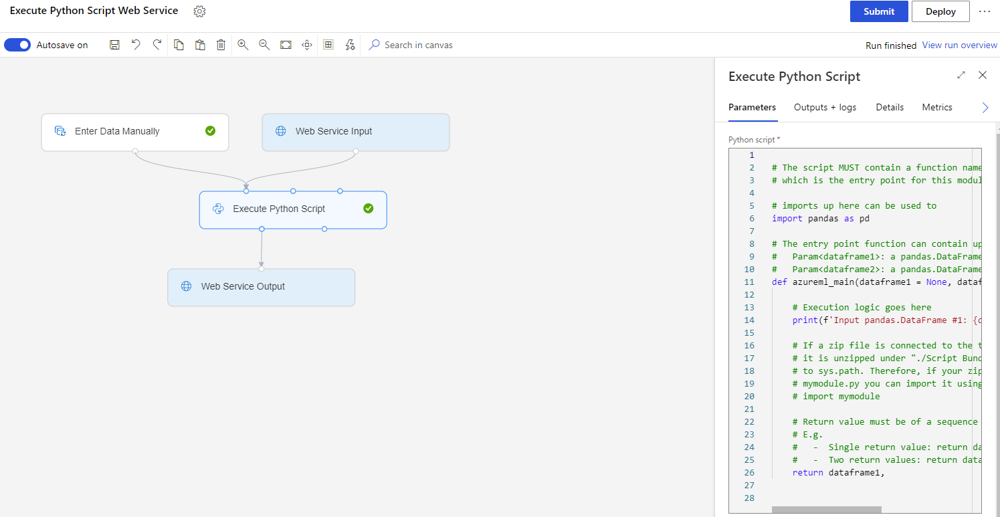

# Web Service Input and Web Service Output modules

This article describes the Web Service Input and Web Service Output modules in Azure Machine Learning designer.

The Web Service Input module can only connect to an input port with the type **DataFrameDirectory**. The Web Service Output module can only be connected from an output port with the type **DataFrameDirectory**. You can find the two modules in the module tree, under the **Web Service** category. 

The Web Service Input module indicates where user data enters the pipeline. The Web Service Output module indicates where user data is returned in a real-time inference pipeline.

## How to use Web Service Input and Output

When you [create a real-time inference pipeline](https://docs.microsoft.com/azure/machine-learning/tutorial-designer-automobile-price-deploy#create-a-real-time-inference-pipeline) from your training pipeline, the Web Service Input and Web Service Output modules will be automatically added to show where user data enters the pipeline and where data is returned. 

> [!NOTE]
> Automatically generating a real-time inference pipeline is a rule-based, best-effort process. There's no guarantee of correctness. 

You can manually add or remove the Web Service Input and Web Service Output modules to satisfy your requirements. Make sure that your real-time inference pipeline has at least one Web Service Input module and one Web Service Output module. If you have multiple Web Service Input or Web Service Output modules, make sure they have unique names. You can enter the name in the right panel of the module.

You can also manually create a real-time inference pipeline by adding Web Service Input and Web Service Output modules to your unsubmitted pipeline.

> [!NOTE]
> The pipeline type will be determined the first time you submit it. Be sure to add Web Service Input and Web Service Output modules before you submit for the first time.

The following example shows how to manually create real-time inference pipeline from the Execute Python Script module. 

   
After you submit the pipeline and the run finishes successfully, you can deploy the real-time endpoint.
   
> [!NOTE]
>  In the preceding example, **Enter Data Manually** provides the data schema for web service input and is necessary for deploying the real-time endpoint. Generally, you should always connect a module or dataset to the port where **Web Service Input** is connected to provide the data schema.
   
## Next steps
Learn more about [deploying the real-time endpoint](https://docs.microsoft.com/azure/machine-learning/tutorial-designer-automobile-price-deploy#deploy-the-real-time-endpoint).

See the [set of modules available](module-reference.md) to Azure Machine Learning.