# Get started with Azure Machine Learning Studio (classic) in R

**APPLIES TO:**  Machine Learning Studio (classic)   [Azure Machine Learning](../compare-azure-ml-to-studio-classic.md)


<!-- Stephen F Elston, Ph.D. -->
In this tutorial, you learn how to use Azure Machine Learning Studio (classic) to create, test, and execute R code. In the end, you'll have a complete forecasting solution.

> [!div class="checklist"]
> * Create code for data cleaning and transformation.
> * Analyze the correlations between several of the variables in our dataset.
> * Create a seasonal time series forecasting model for milk production.


Machine Learning Studio (classic) contains many powerful machine learning and data manipulation modules. With the R programming language, this combination provides the scalability and ease of deployment of Machine Learning Studio (classic) with the flexibility and deep analytics of R.

Forecasting is a widely employed and useful analytical method. Common uses range from predicting sales of seasonal items and determining optimal inventory levels to predicting macroeconomic variables. Forecasting is typically done with time series models. Time series data is data in which the values have a time index. The time index can be regular, for example, every month or every minute. The time index can also be irregular. A time series model is based on time series data. The R programming language contains a flexible framework and extensive analytics for time series data.

## Get the data

In this tutorial, you use California dairy production and pricing data, which includes monthly information on the production of several dairy products and the price of milk fat, which is a benchmark commodity.

The data used in this article, along with R scripts, can be downloaded from [MachineLearningSamples-Notebooks/studio-samples](https://github.com/Azure-Samples/MachineLearningSamples-Notebooks/tree/master/studio-samples). Data in the file `cadairydata.csv` was originally synthesized from information available from the University of Wisconsin [dairy markets site](https://dairymarkets.com).

## <a id="mlstudio"></a>Interact with R language in Machine Learning Studio (classic)

This section takes you through some basics of interacting with the R programming language in the Machine Learning Studio (classic) environment. The R language provides a powerful tool to create customized analytics and data manipulation modules within the Machine Learning Studio (classic) environment.

We'll use RStudio to develop, test, and debug R code on a small scale. This code is then cut and pasted into an [Execute R Script][execute-r-script] module ready to run in Machine Learning Studio (classic).

### The Execute R Script module

Within Machine Learning Studio (classic), R scripts are run within the [Execute R Script][execute-r-script] module. An example of the [Execute R Script][execute-r-script] module in Machine Learning Studio (classic) is shown here.

 

The preceding image shows some of the key parts of the Machine Learning Studio (classic) environment for working with the [Execute R Script][execute-r-script] module:

* The modules in the experiment are shown in the center pane.
* The upper part of the right pane contains a window you can use to view and edit your R scripts.
* The lower part of the right pane shows some properties of the [Execute R Script][execute-r-script]. You can view the error and output logs by selecting the appropriate areas of this pane.

We'll discuss the [Execute R Script][execute-r-script] in greater detail in the rest of this article.

When you work with complex R functions, we recommend that you edit, test, and debug in RStudio. As with any software development, extend your code incrementally and test it on small, simple test cases. Then cut and paste your functions into the R script window of the [Execute R Script][execute-r-script] module. This approach allows you to harness both the RStudio integrated development environment (IDE) and the power of Machine Learning Studio (classic).

#### Execute R code

Any R code in the [Execute R Script][execute-r-script] module will execute when you run the experiment by selecting the **Run** button. When execution has completed, a check mark appears on the [Execute R Script][execute-r-script] icon.

#### Defensive R coding for Machine Learning Studio (classic)

If you're developing R code for, say, a web service by using Machine Learning Studio (classic), you should definitely plan how your code will deal with an unexpected data input and exceptions. To maintain clarity, we haven't included much in the way of checking or exception handling in most of the code examples shown. As we proceed, we'll give you several examples of functions by using R's exception handling capability.

If you need a more complete treatment of R exception handling, read the applicable sections of the book by Wickham listed in [Further reading](#appendixb).

#### Debug and test R in Machine Learning Studio (classic)

Test and debug your R code on a small scale in RStudio. There are also cases where you'll need to track down R code problems in the [Execute R Script][execute-r-script] itself. In addition, it's good practice to check your results in Machine Learning Studio (classic).

Output from the execution of your R code and on the Machine Learning Studio (classic) platform is found primarily in output.log. Some additional information is in error.log.

If an error occurs in Machine Learning Studio (classic) while you run your R code, your first course of action should be to look at error.log. This file can contain useful error messages to help you understand and correct your error. To view error.log, select **View error log** on the properties pane for the [Execute R Script][execute-r-script] that contains the error.

For example, we ran the following R code, with an undefined variable y, in an [Execute R Script][execute-r-script] module.

```r
x <- 1.0
z <- x + y
```

This code fails to execute, which results in an error condition. Selecting **View error log** on the properties pane produces the following display.

  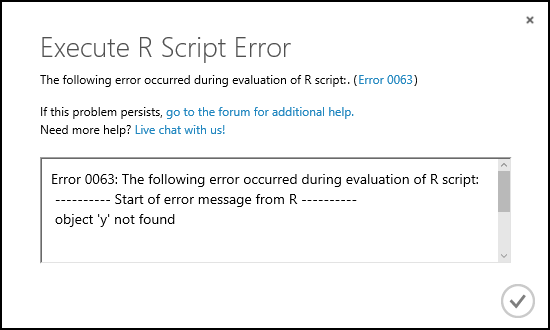

It looks like we need to look in output.log to see the R error message. Select the [Execute R Script][execute-r-script] module, and then select the **View output.log** item on the properties pane to the right. A new browser window opens, and the following error message appears.

```output
[Critical]     Error: Error 0063: The following error occurred during evaluation of R script:
---------- Start of error message from R ----------
object 'y' not found


object 'y' not found
----------- End of error message from R -----------
```

This error message contains no surprises and clearly identifies the problem.

To inspect the value of any object in R, you can print these values to the output.log file. The rules for examining object values are essentially the same as in an interactive R session. For example, if you enter a variable name on a line, the value of the object will be printed to the output.log file.

#### Packages in Machine Learning Studio (classic)

Machine Learning Studio (classic) comes with more than 350 preinstalled R language packages. You can use the following code in the [Execute R Script][execute-r-script] module to retrieve a list of the preinstalled packages.

```r
data.set <- data.frame(installed.packages())
maml.mapOutputPort("data.set")
```

If you don't understand the last line of this code at the moment, read on. In the rest of this article, we'll extensively discuss using R in the Machine Learning Studio (classic) environment.

### Introduction to RStudio

RStudio is a widely used IDE for R. We'll use RStudio to edit, test, and debug some of the R code used in this guide. After the R code is tested and ready, you can cut and paste from the RStudio editor into a Machine Learning Studio (classic) [Execute R Script][execute-r-script] module.

If you don't have the R programming language installed on your desktop machine, do that now. Free downloads of open-source R language are available at the [Comprehensive R Archive Network (CRAN)](https://www.r-project.org/). Downloads are available for Windows, Mac OS, and Linux/UNIX. Choose a nearby mirror, and follow the download directions. In addition, CRAN contains many useful analytics and data manipulation packages.

If you're new to RStudio, you should download and install the desktop version. You can find the RStudio downloads for Windows, Mac OS, and Linux/UNIX at [RStudio](http://www.rstudio.com/products/RStudio/). Follow the directions provided to install RStudio on your desktop machine.

A tutorial introduction to RStudio is available at [Using the RStudio IDE](https://support.rstudio.com/hc/sections/200107586-Using-RStudio).

For more information on using RStudio, see the [Guide to RStudio documentation](#appendixa).

## <a id="scriptmodule"></a>Get data in and out of the Execute R Script module

In this section, we'll discuss how you get data into and out of the [Execute R Script][execute-r-script] module. We'll also review how to handle various data types read into and out of the [Execute R Script][execute-r-script] module.

The complete code for this section is in [MachineLearningSamples-Notebooks/studio-samples](https://github.com/Azure-Samples/MachineLearningSamples-Notebooks/tree/master/studio-samples).

### Load and check data

#### <a id="loading"></a>Load the dataset

We'll start by loading the **csdairydata.csv** file into Machine Learning Studio (classic).

1. Start your Machine Learning Studio (classic) environment.
1. Select **+ NEW** in the lower left of the screen, and select **Dataset**.
1. Select **From Local File**, and then select **Browse** to select the file.
1. Make sure you selected **Generic CSV file with header (.csv)** as the type for the dataset.
1. Select the check mark.
1. After the dataset has been uploaded, you should see the new dataset when you select the **Datasets** tab.

#### Create an experiment

Now that we have some data in Machine Learning Studio (classic), we need to create an experiment to do the analysis.  

1. Select **+ NEW** in the lower left of the screen, and select **Experiment** > **Blank Experiment**.
1. Name your experiment by selecting and modifying the **Experiment created on** title at the top of the page. For example, change it to **CA Dairy Analysis**.
1. On the left of the experiment page, select **Saved Datasets** > **My Datasets**. You should see the **cadairydata.csv** file that you uploaded earlier.
1. Drag **csdairydata.csv dataset** onto the experiment.
1. In the **Search experiment items** box at the top of the left pane, enter [Execute R Script][execute-r-script]. The module appears in the search list.
1. Drag the [Execute R Script][execute-r-script] module onto your pallet.
1. Connect the output of **csdairydata.csv dataset** to the leftmost input (**Dataset1**) of the [Execute R Script][execute-r-script].
1. Select **Save**.

At this point, your experiment should look something like this example.

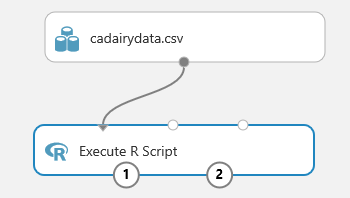


#### Check on the data

Let's have a look at the data we've loaded into our experiment. In the experiment, select the output of the **cadairydata.csv dataset**, and select **Visualize**. You should see something like this summary.

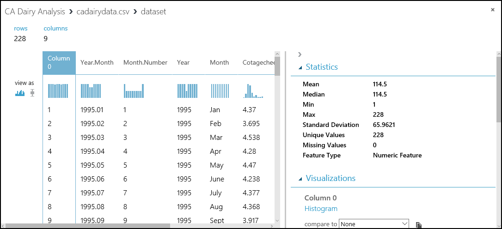

This view shows a lot of useful information. We can see the first several rows of the dataset. If we select a column, the **Statistics** section shows more information about the column. For example, the **Feature Type** row shows what data types Machine Learning Studio (classic) assigned to the column. Check this view before you start to do any serious work.

### First R script

Let's create a simple first R script to experiment within Machine Learning Studio (classic). We created and tested the following script in RStudio.

```r
## Only one of the following two lines should be used
## If running in Machine Learning Studio (classic), use the first line with maml.mapInputPort()
## If in RStudio, use the second line with read.csv()
cadairydata <- maml.mapInputPort(1)
# cadairydata  <- read.csv("cadairydata.csv", header = TRUE, stringsAsFactors = FALSE)
str(cadairydata)
pairs(~ Cotagecheese.Prod + Icecream.Prod + Milk.Prod + N.CA.Fat.Price, data = cadairydata)
## The following line should be executed only when running in
## Azure Machine Learning Studio (classic)
maml.mapOutputPort('cadairydata')
```

Now we need to transfer this script to Machine Learning Studio (classic). You can cut and paste, but in this case, transfer the R script via a zip file.

### Data input to the Execute R Script module

Let's have a look at the inputs to the [Execute R Script][execute-r-script] module. In this example, we'll read the California dairy data into the [Execute R Script][execute-r-script] module.

There are three possible inputs for the [Execute R Script][execute-r-script] module. You can use any one or all of these inputs, depending on your application. You can also use an R script that takes no input at all.

Let's look at each of these inputs, going from left to right. You can see the names of each of the inputs by placing your cursor over the input and reading the tooltip.

#### Script bundle

The Script Bundle input allows you to pass the contents of a zip file into the [Execute R Script][execute-r-script] module. You can use one of the following commands to read the contents of the zip file into your R code.

```r
source("src/yourfile.R") # Reads a zipped R script
load("src/yourData.rdata") # Reads a zipped R data file
```

> [!NOTE]
> Machine Learning Studio (classic) treats files in the zip file as if they're in the src/ directory, so you need to prefix your file names with this directory name. For example, if the zip file contains the files `yourfile.R` and `yourData.rdata` in the root of the zip file, you address these files as `src/yourfile.R` and `src/yourData.rdata` when you use `source` and `load`.

We already discussed loading datasets in [Load the dataset](#loading). After you've created and tested the R script shown in the previous section, do the following steps.

1. Save the R script into a .R file. We call the script file **simpleplot.R**. Here's what's in the file:

   ```r
   ## Only one of the following two lines should be used
   ## If running in Machine Learning Studio (classic), use the first line with maml.mapInputPort()
   ## If in RStudio, use the second line with read.csv()
   cadairydata <- maml.mapInputPort(1)
   # cadairydata  <- read.csv("cadairydata.csv", header = TRUE, stringsAsFactors = FALSE)
   str(cadairydata)
   pairs(~ Cotagecheese.Prod + Icecream.Prod + Milk.Prod + N.CA.Fat.Price, data = cadairydata)
   ## The following line should be executed only when running in
   ## Azure Machine Learning Studio (classic)
   maml.mapOutputPort('cadairydata')
   ```

1. Create a zip file, and copy your script into this zip file. In Windows, you can right-click the file and select **Send to** > **Compressed folder**. This action creates a new zip file that contains the **simpleplot.R** file.

1. Add your file to the **datasets** in Machine Learning Studio (classic), and specify the type as **zip**. You should now see the zip file in your datasets.

1. Drag the zip file from **datasets** onto the **ML Studio (classic) canvas**.

1. Connect the output of the **zip data** icon to the **Script Bundle** input of the [Execute R Script][execute-r-script] module.

1. Enter the `source()` function with your zip file name into the code window for the [Execute R Script][execute-r-script] module. In this case, we entered `source("src/simpleplot.R")`.

1. Select **Save**.

After these steps are finished, the [Execute R Script][execute-r-script] module executes the R script in the zip file when the experiment is run. At this point, your experiment should look something like this example.

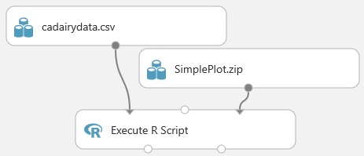

#### Dataset1

You can pass a rectangular table of data to your R code by using the Dataset1 input. In our simple script, the `maml.mapInputPort(1)` function reads the data from port 1. This data is then assigned to a dataframe variable name in your code. In our simple script, the first line of code performs the assignment.

```r
cadairydata <- maml.mapInputPort(1)
```

Execute your experiment by selecting the **Run** button. When the execution finishes, select the [Execute R Script][execute-r-script] module, and then select **View output log** on the properties pane. A new page should appear in your browser showing the contents of the output.log file. When you scroll down, you should see something like the following output.

```output
[ModuleOutput] InputDataStructure
[ModuleOutput]
[ModuleOutput] {
[ModuleOutput]  "InputName":Dataset1
[ModuleOutput]  "Rows":228
[ModuleOutput]  "Cols":9
[ModuleOutput]  "ColumnTypes":System.Int32,3,System.Double,5,System.String,1
[ModuleOutput] }
```

Farther down the page is more detailed information on the columns, which will look something like the following output.

```output
[ModuleOutput] [1] "Loading variable port1..."
[ModuleOutput]
[ModuleOutput] 'data.frame':    228 obs. of  9 variables:
[ModuleOutput]
[ModuleOutput]  $ Column 0         : int  1 2 3 4 5 6 7 8 9 10 ...
[ModuleOutput]
[ModuleOutput]  $ Year.Month       : num  1995 1995 1995 1995 1995 ...
[ModuleOutput]
[ModuleOutput]  $ Month.Number     : int  1 2 3 4 5 6 7 8 9 10 ...
[ModuleOutput]
[ModuleOutput]  $ Year             : int  1995 1995 1995 1995 1995 1995 1995 1995 1995 1995 ...
[ModuleOutput]
[ModuleOutput]  $ Month            : chr  "Jan" "Feb" "Mar" "Apr" ...
[ModuleOutput]
[ModuleOutput]  $ Cotagecheese.Prod: num  4.37 3.69 4.54 4.28 4.47 ...
[ModuleOutput]
[ModuleOutput]  $ Icecream.Prod    : num  51.6 56.1 68.5 65.7 73.7 ...
[ModuleOutput]
[ModuleOutput]  $ Milk.Prod        : num  2.11 1.93 2.16 2.13 2.23 ...
[ModuleOutput]
[ModuleOutput]  $ N.CA.Fat.Price   : num  0.98 0.892 0.892 0.897 0.897 ...
```

These results are mostly as expected, with 228 observations and 9 columns in the dataframe. We can see the column names, the R data type, and a sample of each column.

> [!NOTE]
> This same printed output is conveniently available from the R Device output of the [Execute R Script][execute-r-script] module. We'll discuss the outputs of the [Execute R Script][execute-r-script] module in the next section.  

#### Dataset2

The behavior of the Dataset2 input is identical to that of Dataset1. Using this input, you can pass a second rectangular table of data into your R code. The function `maml.mapInputPort(2)`, with the argument 2, is used to pass this data.  

### Execute R Script outputs

#### Output a dataframe

You can output the contents of an R dataframe as a rectangular table through the Result Dataset1 port by using the `maml.mapOutputPort()` function. In our simple R script, this action is performed by the following line.

```r
maml.mapOutputPort('cadairydata')
```

After you run the experiment, select the Result Dataset1 output port, and then select **Visualize**. You should see something like this example.

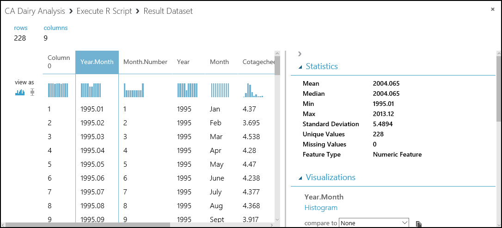

This output looks identical to the input, exactly as we expected.

### R Device output

The Device output of the [Execute R Script][execute-r-script] module contains messages and graphics output. Both standard output and standard error messages from R are sent to the R Device output port.

To view the R Device output, select the port, and then select **Visualize**. We see the standard output and standard error from the R script here.

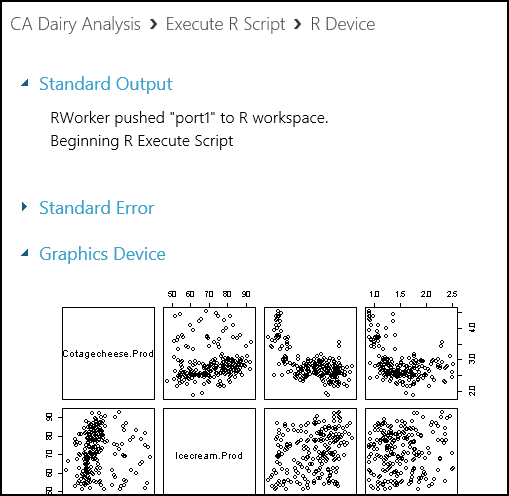

Scrolling down, we see the graphics output from our R script.

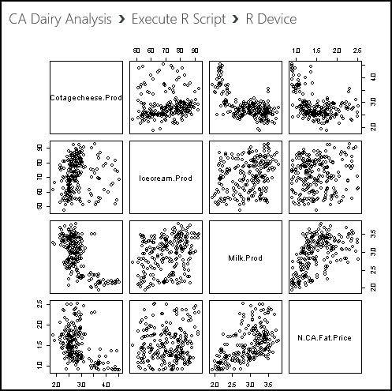

## <a id="filtering"></a>Data filtering and transformation

In this section, we'll perform some basic data filtering and transformation operations on the California dairy data. By the end of this section, we'll have data in a format suitable for building an analytic model.

More specifically, in this section we'll perform several common data cleaning and transformation tasks: type transformation, filtering on dataframes, adding new computed columns, and value transformations. This background should help you deal with the many variations encountered in real-world problems.

The complete R code for this section is available in [MachineLearningSamples-Notebooks/studio-samples](https://github.com/Azure-Samples/MachineLearningSamples-Notebooks/tree/master/studio-samples).

### Type transformations

Now that we can read the California dairy data into the R code in the [Execute R Script][execute-r-script] module, we need to ensure that the data in the columns has the intended type and format.

R is a dynamically typed language, which means that data types are coerced from one to another as required. The atomic data types in R include numeric, logical, and character. The factor type is used to compactly store categorical data. For more information on data types, see the references in [Further reading](#appendixb).

When tabular data is read into R from an external source, it's always a good idea to check the resulting types in the columns. You might want a column of type character, but in many cases the column will show up as factor or vice versa. In other cases, a column you think should be numeric is represented by character data, for example, "1.23" rather than 1.23 as a floating point number.

Fortunately, it's easy to convert one type to another, as long as mapping is possible. For example, you can't convert "Nevada" into a numeric value, but you can convert it to a factor (categorical variable). As another example, you can convert a numeric 1 into a character "1" or a factor.

The syntax for any of these conversions is simple: `as.datatype()`. These type conversion functions include the following functions:

* `as.numeric()`
* `as.character()`
* `as.logical()`
* `as.factor()`

Looking at the data types of the columns we input in the previous section, all columns are of type numeric. The exception is the column labeled "Month," which is of type character. Let's convert this type to a factor, and test the results.

We've deleted the line that created the scatter plot matrix and added a line to convert the Month column to a factor. In this experiment, we'll cut and paste the R code into the code window of the [Execute R Script][execute-r-script] module. You could also update the zip file and upload it to Machine Learning Studio (classic), but this option takes several steps.

```r
## Only one of the following two lines should be used
## If running in Machine Learning Studio (classic), use the first line with maml.mapInputPort()
## If in RStudio, use the second line with read.csv()
cadairydata <- maml.mapInputPort(1)
# cadairydata  <- read.csv("cadairydata.csv", header = TRUE, stringsAsFactors = FALSE)
## Ensure the coding is consistent and convert column to a factor
cadairydata$Month <- as.factor(cadairydata$Month)
str(cadairydata) # Check the result
## The following line should be executed only when running in
## Azure Machine Learning Studio (classic)
maml.mapOutputPort('cadairydata')
```

Let's execute this code and look at the output log for the R script. The relevant data from the log is shown here.

```output
[ModuleOutput] [1] "Loading variable port1..."
[ModuleOutput] 
[ModuleOutput] 'data.frame':    228 obs. of  9 variables:
[ModuleOutput] 
[ModuleOutput]  $ Column 0         : int  1 2 3 4 5 6 7 8 9 10 ...
[ModuleOutput] 
[ModuleOutput]  $ Year.Month       : num  1995 1995 1995 1995 1995 ...
[ModuleOutput] 
[ModuleOutput]  $ Month.Number     : int  1 2 3 4 5 6 7 8 9 10 ...
[ModuleOutput] 
[ModuleOutput]  $ Year             : int  1995 1995 1995 1995 1995 1995 1995 1995 1995 1995 ...
[ModuleOutput] 
[ModuleOutput]  $ Month            : Factor w/ 14 levels "Apr","April",..: 6 5 9 1 11 8 7 3 14 13 ...
[ModuleOutput] 
[ModuleOutput]  $ Cotagecheese.Prod: num  4.37 3.69 4.54 4.28 4.47 ...
[ModuleOutput] 
[ModuleOutput]  $ Icecream.Prod    : num  51.6 56.1 68.5 65.7 73.7 ...
[ModuleOutput] 
[ModuleOutput]  $ Milk.Prod        : num  2.11 1.93 2.16 2.13 2.23 ...
[ModuleOutput] 
[ModuleOutput]  $ N.CA.Fat.Price   : num  0.98 0.892 0.892 0.897 0.897 ...
[ModuleOutput] 
[ModuleOutput] [1] "Saving variable  cadairydata  ..."
[ModuleOutput] 
[ModuleOutput] [1] "Saving the following item(s):  .maml.oport1"
```

The type for Month should now say **Factor w/ 14 levels**. This type is a problem because there are only 12 months in the year. You can also check to see that the type in **Visualize** of the Result Dataset port is **Categorical**.

The problem is that the Month column hasn't been coded systematically. In some cases, a month is called April, and in others it's abbreviated as Apr. We can solve this problem by trimming the string to three characters. The line of code now looks like the following example.

```r
## Ensure the coding is consistent and convert column to a factor
cadairydata$Month <- as.factor(substr(cadairydata$Month, 1, 3))
```

Rerun the experiment, and view the output log. The expected results are shown here.

```output
[ModuleOutput] [1] "Loading variable port1..."
[ModuleOutput] 
[ModuleOutput] 'data.frame':    228 obs. of  9 variables:
[ModuleOutput] 
[ModuleOutput]  $ Column 0         : int  1 2 3 4 5 6 7 8 9 10 ...
[ModuleOutput] 
[ModuleOutput]  $ Year.Month       : num  1995 1995 1995 1995 1995 ...
[ModuleOutput] 
[ModuleOutput]  $ Month.Number     : int  1 2 3 4 5 6 7 8 9 10 ...
[ModuleOutput] 
[ModuleOutput]  $ Year             : int  1995 1995 1995 1995 1995 1995 1995 1995 1995 1995 ...
[ModuleOutput] 
[ModuleOutput]  $ Month            : Factor w/ 12 levels "Apr","Aug","Dec",..: 5 4 8 1 9 7 6 2 12 11 ...
[ModuleOutput] 
[ModuleOutput]  $ Cotagecheese.Prod: num  4.37 3.69 4.54 4.28 4.47 ...
[ModuleOutput] 
[ModuleOutput]  $ Icecream.Prod    : num  51.6 56.1 68.5 65.7 73.7 ...
[ModuleOutput] 
[ModuleOutput]  $ Milk.Prod        : num  2.11 1.93 2.16 2.13 2.23 ...
[ModuleOutput] 
[ModuleOutput]  $ N.CA.Fat.Price   : num  0.98 0.892 0.892 0.897 0.897 ...
[ModuleOutput] 
[ModuleOutput] [1] "Saving variable  cadairydata  ..."
[ModuleOutput] 
[ModuleOutput] [1] "Saving the following item(s):  .maml.oport1"
```


Our factor variable now has the desired 12 levels.

### Basic dataframe filtering

R dataframes support powerful filtering capabilities. Datasets can be subsetted by using logical filters on either rows or columns. In many cases, complex filter criteria will be required. For extensive examples of filtering dataframes, see the references in [Further reading](#appendixb).

There's one bit of filtering we should do on our dataset. If you look at the columns in the cadairydata dataframe, you'll see two unnecessary columns. The first column holds a row number, which isn't very useful. The second column, Year.Month, contains redundant information. We can easily exclude these columns by using the following R code.

> [!NOTE]
> From now on in this section, we'll show you the additional code we're adding in the [Execute R Script][execute-r-script] module. We'll add each new line *before* the `str()` function. We use this function to verify the results in Machine Learning Studio (classic).

We add the following line to the R code in the [Execute R Script][execute-r-script] module.

```r
# Remove two columns we do not need
cadairydata <- cadairydata[, c(-1, -2)]
```

Run this code in your experiment, and check the result from the output log. These results are shown here.

```output
[ModuleOutput] [1] "Loading variable port1..."
[ModuleOutput] 
[ModuleOutput] 'data.frame':    228 obs. of  7 variables:
[ModuleOutput] 
[ModuleOutput]  $ Month.Number     : int  1 2 3 4 5 6 7 8 9 10 ...
[ModuleOutput] 
[ModuleOutput]  $ Year             : int  1995 1995 1995 1995 1995 1995 1995 1995 1995 1995 ...
[ModuleOutput] 
[ModuleOutput]  $ Month            : Factor w/ 12 levels "Apr","Aug","Dec",..: 5 4 8 1 9 7 6 2 12 11 ...
[ModuleOutput] 
[ModuleOutput]  $ Cotagecheese.Prod: num  4.37 3.69 4.54 4.28 4.47 ...
[ModuleOutput] 
[ModuleOutput]  $ Icecream.Prod    : num  51.6 56.1 68.5 65.7 73.7 ...
[ModuleOutput] 
[ModuleOutput]  $ Milk.Prod        : num  2.11 1.93 2.16 2.13 2.23 ...
[ModuleOutput] 
[ModuleOutput]  $ N.CA.Fat.Price   : num  0.98 0.892 0.892 0.897 0.897 ...
[ModuleOutput] 
[ModuleOutput] [1] "Saving variable  cadairydata  ..."
[ModuleOutput] 
[ModuleOutput] [1] "Saving the following item(s):  .maml.oport1"
```

We now get the expected results.

### Add a new column

To create time series models, it will be convenient to have a column that contains the months since the start of the time series. We'll create the new column Month.Count.

To help organize the code, we'll create our first simple function, `num.month()`. We'll then apply this function to create a new column in the dataframe. The new code is as follows:

```r
## Create a new column with the month count
## Function to find the number of months from the first
## month of the time series
num.month <- function(Year, Month) {
  ## Find the starting year
  min.year  <- min(Year)

  ## Compute the number of months from the start of the time series
  12 * (Year - min.year) + Month - 1
}

## Compute the new column for the dataframe
cadairydata$Month.Count <- num.month(cadairydata$Year, cadairydata$Month.Number)
```

Now run the updated experiment, and use the output log to view the results. These results are shown here.

```output
[ModuleOutput] [1] "Loading variable port1..."
[ModuleOutput] 
[ModuleOutput] 'data.frame':    228 obs. of  8 variables:
[ModuleOutput] 
[ModuleOutput]  $ Month.Number     : int  1 2 3 4 5 6 7 8 9 10 ...
[ModuleOutput] 
[ModuleOutput]  $ Year             : int  1995 1995 1995 1995 1995 1995 1995 1995 1995 1995 ...
[ModuleOutput] 
[ModuleOutput]  $ Month            : Factor w/ 12 levels "Apr","Aug","Dec",..: 5 4 8 1 9 7 6 2 12 11 ...
[ModuleOutput] 
[ModuleOutput]  $ Cotagecheese.Prod: num  4.37 3.69 4.54 4.28 4.47 ...
[ModuleOutput] 
[ModuleOutput]  $ Icecream.Prod    : num  51.6 56.1 68.5 65.7 73.7 ...
[ModuleOutput] 
[ModuleOutput]  $ Milk.Prod        : num  2.11 1.93 2.16 2.13 2.23 ...
[ModuleOutput] 
[ModuleOutput]  $ N.CA.Fat.Price   : num  0.98 0.892 0.892 0.897 0.897 ...
[ModuleOutput] 
[ModuleOutput]  $ Month.Count      : num  0 1 2 3 4 5 6 7 8 9 ...
[ModuleOutput] 
[ModuleOutput] [1] "Saving variable  cadairydata  ..."
[ModuleOutput] 
[ModuleOutput] [1] "Saving the following item(s):  .maml.oport1"
```


It looks like everything is working. We have the new column with the expected values in our dataframe.

### Value transformations

In this section, we'll perform some simple transformations on the values in some of the columns of the dataframe. The R language supports nearly arbitrary value transformations. For more examples, see the references in [Further reading](#appendixb).

If you look at the values in the summaries of the dataframe, you should see something odd here. Is more ice cream than milk produced in California? No, of course not. The problem is that the units are different. The price is in units of U.S. pounds, milk is in units of 1 million U.S. pounds, ice cream is in units of 1,000 U.S. gallons, and cottage cheese is in units of 1,000 U.S. pounds. Assuming ice cream weighs about 6.5 pounds per gallon, we can easily do the multiplication to convert these values so that they're all in equal units of 1,000 pounds.

For our forecasting model, we use a multiplicative model for trend and seasonal adjustment of this data. A log transformation allows us to use a linear model, which simplifies this process. We can apply the log transformation in the same function where the multiplier is applied.

In the following code, we define a new function, `log.transform()`, and apply it to the rows that contain the numerical values. The R `Map()` function is used to apply the `log.transform()` function to the selected columns of the dataframe. The `Map()` function is similar to `apply()`, but it allows for more than one list of arguments to the function. Note that a list of multipliers supplies the second argument to the `log.transform()` function. The `na.omit()` function is used as a bit of cleanup to ensure we don't have missing or undefined values in the dataframe.

```r
log.transform <- function(invec, multiplier = 1) {
  ## Function for the transformation, which is the log
  ## of the input value times a multiplier

  warningmessages <- c("ERROR: Non-numeric argument encountered in function log.transform",
                       "ERROR: Arguments to function log.transform must be greate than zero",
                       "ERROR: Aggurment multiplier to funcition log.transform must be a scaler",
                       "ERROR: Invalid time seies value encountered in function log.transform"
                       )

  ## Check the input arguments
  if(!is.numeric(invec) | !is.numeric(multiplier)) {warning(warningmessages[1]); return(NA)}  
  if(any(invec < 0.0) | any(multiplier < 0.0)) {warning(warningmessages[2]); return(NA)}
  if(length(multiplier) != 1) {{warning(warningmessages[3]); return(NA)}}

  ## Wrap the multiplication in tryCatch
  ## If there is an exception, print the warning message to
  ## standard error and return NA
  tryCatch(log(multiplier * invec),
           error = function(e){warning(warningmessages[4]); NA})
}


## Apply the transformation function to the 4 columns
## of the dataframe with production data
multipliers  <- list(1.0, 6.5, 1000.0, 1000.0)
cadairydata[, 4:7] <- Map(log.transform, cadairydata[, 4:7], multipliers)

## Get rid of any rows with NA values
cadairydata <- na.omit(cadairydata)  
```

There's quite a bit happening in the `log.transform()` function. Most of this code is checking for potential problems with the arguments or dealing with exceptions, which can still arise during the computations. Only a few lines of this code do the computations.

The goal of defensive programming is to prevent the failure of a single function that prevents processing from continuing. An abrupt failure of a long-running analysis can be frustrating for users. To avoid this situation, default return values must be chosen that will limit damage to downstream processing. A message is also produced to alert users that something has gone wrong.

If you aren't used to defensive programming in R, all this code might be overwhelming. Let's walk through the major steps:

1. A vector of four messages is defined. These messages are used to communicate information about some of the possible errors and exceptions that can occur with this code.
1. We return a value of NA for each case. There are many other possibilities that might have fewer side effects. We could return a vector of zeroes or the original input vector, for example.
1. Checks are run on the arguments to the function. In each case, if an error is detected, a default value is returned and a message is produced by the `warning()` function. We're using `warning()` rather than `stop()` because the latter will terminate execution, which is what we're trying to avoid. This code is written in a procedural style, because in this case a functional approach seemed complex and obscure.
1. The log computations are wrapped in `tryCatch()` so that exceptions won't cause an abrupt halt to processing. Without `tryCatch()`, most errors raised by R functions result in a stop signal, which does just that.

Execute this R code in your experiment and have a look at the printed output in the output.log file. You'll now see the transformed values of the four columns in the log, as shown here.

```output
[ModuleOutput] [1] "Loading variable port1..."
[ModuleOutput] 
[ModuleOutput] 'data.frame':    228 obs. of  8 variables:
[ModuleOutput] 
[ModuleOutput]  $ Month.Number     : int  1 2 3 4 5 6 7 8 9 10 ...
[ModuleOutput] 
[ModuleOutput]  $ Year             : int  1995 1995 1995 1995 1995 1995 1995 1995 1995 1995 ...
[ModuleOutput] 
[ModuleOutput]  $ Month            : Factor w/ 12 levels "Apr","Aug","Dec",..: 5 4 8 1 9 7 6 2 12 11 ...
[ModuleOutput] 
[ModuleOutput]  $ Cotagecheese.Prod: num  1.47 1.31 1.51 1.45 1.5 ...
[ModuleOutput] 
[ModuleOutput]  $ Icecream.Prod    : num  5.82 5.9 6.1 6.06 6.17 ...
[ModuleOutput] 
[ModuleOutput]  $ Milk.Prod        : num  7.66 7.57 7.68 7.66 7.71 ...
[ModuleOutput] 
[ModuleOutput]  $ N.CA.Fat.Price   : num  6.89 6.79 6.79 6.8 6.8 ...
[ModuleOutput] 
[ModuleOutput]  $ Month.Count      : num  0 1 2 3 4 5 6 7 8 9 ...
[ModuleOutput] 
[ModuleOutput] [1] "Saving variable  cadairydata  ..."
[ModuleOutput] 
[ModuleOutput] [1] "Saving the following item(s):  .maml.oport1"
```

We see the values have been transformed. Milk production now greatly exceeds all other dairy product production, recalling that we're now looking at a log scale.

At this point, our data is cleaned up and we're ready for some modeling. If you look at the visualization summary for the Result Dataset output of our [Execute R Script][execute-r-script] module, you'll see the Month column is Categorical with 12 unique values, which is just as we wanted.

## <a id="timeseries"></a>Time series objects and correlation analysis

In this section, we'll explore a few basic R time series objects and analyze the correlations between some of the variables. Our goal is to output a dataframe that contains the pairwise correlation information at several lags.

The complete R code for this section is in [MachineLearningSamples-Notebooks/studio-samples](https://github.com/Azure-Samples/MachineLearningSamples-Notebooks/tree/master/studio-samples).

### Time series objects in R

As already mentioned, time series are a series of data values indexed by time. R time series objects are used to create and manage the time index. There are several advantages to using time series objects. Time series objects free you from the many details of managing the time series index values that are encapsulated in the object. In addition, time series objects allow you to use the many time series methods for plotting, printing, modeling, and so on.

The POSIXct time series class is commonly used and is relatively simple. This time series class measures time from the start of the epoch, January 1, 1970. We'll use POSIXct time series objects in this example. Other widely used R time series object classes include zoo and xts (extensible time series).

### Time series object example

Let's get started with our example. Drag a new [Execute R Script][execute-r-script] module into your experiment. Connect the Result Dataset1 output port of the existing [Execute R Script][execute-r-script] module to the Dataset1 input port of the new [Execute R Script][execute-r-script] module.

As we did for the first examples, we'll progress through the example. At some points, we'll show only the incremental additional lines of R code at each step.

#### Read the dataframe

As a first step, let's read in a dataframe and make sure we get the expected results. The following code should do the job.

```r
# Comment the following if using RStudio
cadairydata <- maml.mapInputPort(1)
str(cadairydata) # Check the results
```

Now, run the experiment. The log of the new Execute R Script shape should look like this example.

```output
[ModuleOutput] [1] "Loading variable port1..."
[ModuleOutput] 
[ModuleOutput] 'data.frame':    228 obs. of  8 variables:
[ModuleOutput] 
[ModuleOutput]  $ Month.Number     : int  1 2 3 4 5 6 7 8 9 10 ...
[ModuleOutput] 
[ModuleOutput]  $ Year             : int  1995 1995 1995 1995 1995 1995 1995 1995 1995 1995 ...
[ModuleOutput] 
[ModuleOutput]  $ Month            : Factor w/ 12 levels "Apr","Aug","Dec",..: 5 4 8 1 9 7 6 2 12 11 ...
[ModuleOutput] 
[ModuleOutput]  $ Cotagecheese.Prod: num  1.47 1.31 1.51 1.45 1.5 ...
[ModuleOutput] 
[ModuleOutput]  $ Icecream.Prod    : num  5.82 5.9 6.1 6.06 6.17 ...
[ModuleOutput] 
[ModuleOutput]  $ Milk.Prod        : num  7.66 7.57 7.68 7.66 7.71 ...
[ModuleOutput] 
[ModuleOutput]  $ N.CA.Fat.Price   : num  6.89 6.79 6.79 6.8 6.8 ...
[ModuleOutput] 
[ModuleOutput]  $ Month.Count      : num  0 1 2 3 4 5 6 7 8 9 ...
```

This data is of the expected types and format. Now the Month column is of type factor and has the expected number of levels.

#### Create a time series object

We need to add a time series object to our dataframe. Replace the current code with the following code, which adds a new column of class POSIXct.

```r
# Comment the following if using RStudio
cadairydata <- maml.mapInputPort(1)

## Create a new column as a POSIXct object
Sys.setenv(TZ = "PST8PDT")
cadairydata$Time <- as.POSIXct(strptime(paste(as.character(cadairydata$Year), "-", as.character(cadairydata$Month.Number), "-01 00:00:00", sep = ""), "%Y-%m-%d %H:%M:%S"))

str(cadairydata) # Check the results
```

Now, check the log. It should look like this example.

```output
[ModuleOutput] [1] "Loading variable port1..."
[ModuleOutput] 
[ModuleOutput] 'data.frame':    228 obs. of  9 variables:
[ModuleOutput] 
[ModuleOutput]  $ Month.Number     : int  1 2 3 4 5 6 7 8 9 10 ...
[ModuleOutput] 
[ModuleOutput]  $ Year             : int  1995 1995 1995 1995 1995 1995 1995 1995 1995 1995 ...
[ModuleOutput] 
[ModuleOutput]  $ Month            : Factor w/ 12 levels "Apr","Aug","Dec",..: 5 4 8 1 9 7 6 2 12 11 ...
[ModuleOutput] 
[ModuleOutput]  $ Cotagecheese.Prod: num  1.47 1.31 1.51 1.45 1.5 ...
[ModuleOutput] 
[ModuleOutput]  $ Icecream.Prod    : num  5.82 5.9 6.1 6.06 6.17 ...
[ModuleOutput] 
[ModuleOutput]  $ Milk.Prod        : num  7.66 7.57 7.68 7.66 7.71 ...
[ModuleOutput] 
[ModuleOutput]  $ N.CA.Fat.Price   : num  6.89 6.79 6.79 6.8 6.8 ...
[ModuleOutput] 
[ModuleOutput]  $ Month.Count      : num  0 1 2 3 4 5 6 7 8 9 ...
[ModuleOutput] 
[ModuleOutput]  $ Time             : POSIXct, format: "1995-01-01" "1995-02-01" ...
```

We can see from the summary that the new column is in fact of class POSIXct.

### Explore and transform the data

Let's explore some of the variables in this dataset. A scatter plot matrix is a good way to produce a quick look. We'll replace the `str()` function in the previous R code with the following line.

```r
pairs(~ Cotagecheese.Prod + Icecream.Prod + Milk.Prod + N.CA.Fat.Price, data = cadairydata, main = "Pairwise Scatterplots of dairy time series")
```

Run this code, and see what happens. The plot produced at the R Device port should look like this example.


There's some odd-looking structure in the relationships between these variables. Perhaps this structure arises from trends in the data and from the fact that we haven't standardized the variables.

### Correlation analysis

To perform correlation analysis, we need to both de-trend and standardize the variables. We could simply use the R `scale()` function, which both centers and scales variables. This function might well run faster. But let's look at an example of defensive programming in R.

The `ts.detrend()` following function performs both of these operations. The following two lines of code de-trend the data and then standardize the values.

```r
ts.detrend <- function(ts, Time, min.length = 3){
  ## Function to de-trend and standardize a time series

  ## Define some messages if they are NULL  
  messages <- c('ERROR: ts.detrend requires arguments ts and Time to have the same length',
                'ERROR: ts.detrend requires argument ts to be of type numeric',
                paste('WARNING: ts.detrend has encountered a time series with length less than', as.character(min.length)),
                'ERROR: ts.detrend has encountered a Time argument not of class POSIXct',
                'ERROR: Detrend regression has failed in ts.detrend',
                'ERROR: Exception occurred in ts.detrend while standardizing time series in function ts.detrend'
  )
  # Create a vector of zeros to return as a default in some cases
  zerovec  <- rep(length(ts), 0.0)

  # The input arguments are not of the same length, return ts and quit
  if(length(Time) != length(ts)) {warning(messages[1]); return(ts)}

  # If the ts is not numeric, just return a zero vector and quit
  if(!is.numeric(ts)) {warning(messages[2]); return(zerovec)}

  # If the ts is too short, just return it and quit
  if((ts.length <- length(ts)) < min.length) {warning(messages[3]); return(ts)}

  ## Check that the Time variable is of class POSIXct
  if(class(cadairydata$Time)[[1]] != "POSIXct") {warning(messages[4]); return(ts)}

  ## De-trend the time series by using a linear model
  ts.frame  <- data.frame(ts = ts, Time = Time)
  tryCatch({ts <- ts - fitted(lm(ts ~ Time, data = ts.frame))},
           error = function(e){warning(messages[5]); zerovec})

  tryCatch( {stdev <- sqrt(sum((ts - mean(ts))^2))/(ts.length - 1)
             ts <- ts/stdev},
            error = function(e){warning(messages[6]); zerovec})

  ts
}  
## Apply the detrend.ts function to the variables of interest
df.detrend <- data.frame(lapply(cadairydata[, 4:7], ts.detrend, cadairydata$Time))

## Plot the results to look at the relationships
pairs(~ Cotagecheese.Prod + Icecream.Prod + Milk.Prod + N.CA.Fat.Price, data = df.detrend, main = "Pairwise Scatterplots of detrended standardized time series")
```

There's quite a bit happening in the `ts.detrend()` function. Most of this code is checking for potential problems with the arguments or dealing with exceptions, which can still arise during the computations. Only a few lines of this code actually do the computations.

We've already discussed an example of defensive programming in Value transformations. Both computation blocks are wrapped in `tryCatch()`. For some errors, it makes sense to return the original input vector. In other cases, we return a vector of zeros.

Note that the linear regression used for de-trending is a time series regression. The predictor variable is a time series object.

After `ts.detrend()` is defined, we apply it to the variables of interest in our dataframe. We must coerce the resulting list created by `lapply()` to data in the dataframe by using `as.data.frame()`. Because of defensive aspects of `ts.detrend()`, failure to process one of the variables won't prevent correct processing of the others.

The final line of code creates a pairwise scatter plot. After running the R code, the results of the scatter plot are shown here.

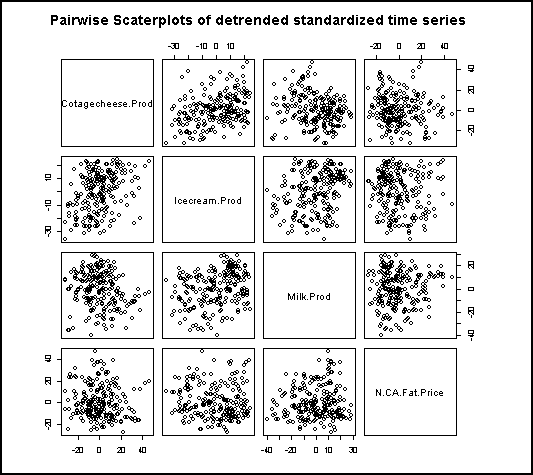

You can compare these results to those shown in the preceding example. With the trend removed and the variables standardized, we see a lot less structure in the relationships between these variables.

The code to compute the correlations as R ccf objects is as follows.

```r
## A function to compute pairwise correlations from a
## list of time series value vectors
pair.cor <- function(pair.ind, ts.list, lag.max = 1, plot = FALSE){
  ccf(ts.list[[pair.ind[1]]], ts.list[[pair.ind[2]]], lag.max = lag.max, plot = plot)
}

## A list of the pairwise indices
corpairs <- list(c(1,2), c(1,3), c(1,4), c(2,3), c(2,4), c(3,4))

## Compute the list of ccf objects
cadairycorrelations <- lapply(corpairs, pair.cor, df.detrend)  

cadairycorrelations
```

Running this code produces the log shown here.

```output
[ModuleOutput] Loading objects:
[ModuleOutput]   port1
[ModuleOutput] [1] "Loading variable port1..."
[ModuleOutput] [[1]]
[ModuleOutput] 
[ModuleOutput] 
[ModuleOutput] Autocorrelations of series 'X', by lag
[ModuleOutput] 
[ModuleOutput] 
[ModuleOutput]    -1     0     1 
[ModuleOutput] 0.148 0.358 0.317 
[ModuleOutput] 
[ModuleOutput] 
[ModuleOutput] [[2]]
[ModuleOutput] 
[ModuleOutput] 
[ModuleOutput] Autocorrelations of series 'X', by lag
[ModuleOutput] 
[ModuleOutput] 
[ModuleOutput]     -1      0      1 
[ModuleOutput] -0.395 -0.186 -0.238 
[ModuleOutput] 
[ModuleOutput] 
[ModuleOutput] [[3]]
[ModuleOutput] 
[ModuleOutput] 
[ModuleOutput] Autocorrelations of series 'X', by lag
[ModuleOutput] 
[ModuleOutput] 
[ModuleOutput]     -1      0      1 
[ModuleOutput] -0.059 -0.089 -0.127 
[ModuleOutput] 
[ModuleOutput] 
[ModuleOutput] [[4]]
[ModuleOutput] 
[ModuleOutput] 
[ModuleOutput] Autocorrelations of series 'X', by lag
[ModuleOutput] 
[ModuleOutput] 
[ModuleOutput]    -1     0     1 
[ModuleOutput] 0.140 0.294 0.293 
[ModuleOutput] 
[ModuleOutput] 
[ModuleOutput] [[5]]
[ModuleOutput] 
[ModuleOutput] 
[ModuleOutput] Autocorrelations of series 'X', by lag
[ModuleOutput] 
[ModuleOutput] 
[ModuleOutput]     -1      0      1 
[ModuleOutput] -0.002 -0.074 -0.124 
```

There's a correlation value for each lag. None of these correlation values is large enough to be significant. We can conclude that we can model each variable independently.

### Output a dataframe
We've computed the pairwise correlations as a list of R ccf objects. This presents a bit of a problem as the Result Dataset output port really requires a dataframe. Further, the ccf object is itself a list, and we want only the values in the first element of this list, the correlations at the various lags.

The following code extracts the lag values from the list of ccf objects, which are themselves lists.

```r
df.correlations <- data.frame(do.call(rbind, lapply(cadairycorrelations, '[[', 1)))

c.names <- c("correlation pair", "-1 lag", "0 lag", "+1 lag")
r.names  <- c("Corr Cot Cheese - Ice Cream",
              "Corr Cot Cheese - Milk Prod",
              "Corr Cot Cheese - Fat Price",
              "Corr Ice Cream - Mik Prod",
              "Corr Ice Cream - Fat Price",
              "Corr Milk Prod - Fat Price")

## Build a dataframe with the row names column and the
## correlation dataframe and assign the column names
outframe <- cbind(r.names, df.correlations)
colnames(outframe) <- c.names
outframe


## WARNING!
## The following line works only in Azure Machine Learning Studio (classic)
## When running in RStudio, this code will result in an error
#maml.mapOutputPort('outframe')
```

The first line of code is a bit tricky, and some explanation might help you understand it. Working from the inside out, we have:

1. The **[[** operator with the argument **1** selects the vector of correlations at the lags from the first element of the ccf object list.
1. The `do.call()` function applies the `rbind()` function over the elements of the list returns by `lapply()`.
1. The `data.frame()` function coerces the result produced by `do.call()` to a dataframe.

Note that the row names are in a column of the dataframe. Doing so preserves the row names when they're output from the [Execute R Script][execute-r-script].

Running the code produces the output shown here when we select **Visualize** to view the output at the Result Dataset port. The row names are in the first column, as intended.

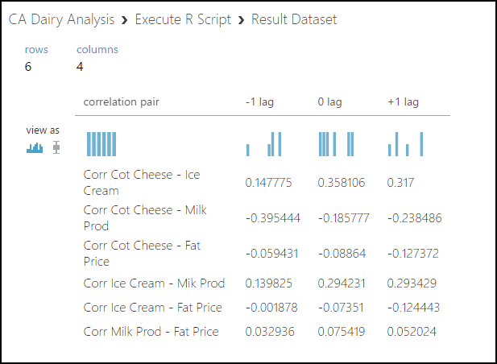

## <a id="seasonalforecasting"></a>Time series example: Seasonal forecasting

Our data is now in a form suitable for analysis, and we've determined there are no significant correlations between the variables. Let's move on and create a time series forecasting model. Using this model, we'll forecast California milk production for the 12 months of 2013.

Our forecasting model will have two components, a trend component and a seasonal component. The complete forecast is the product of these two components. This type of model is known as a multiplicative model. The alternative is an additive model. We've already applied a log transformation to the variables of interest, which makes this analysis tractable.

The complete R code for this section is in [MachineLearningSamples-Notebooks/studio-samples](https://github.com/Azure-Samples/MachineLearningSamples-Notebooks/tree/master/studio-samples).

### Create the dataframe for analysis

Start by adding a new [Execute R Script][execute-r-script] module to your experiment. Connect the Result Dataset output of the existing [Execute R Script][execute-r-script] module to the **Dataset1** input of the new module. The result should look something like this example.

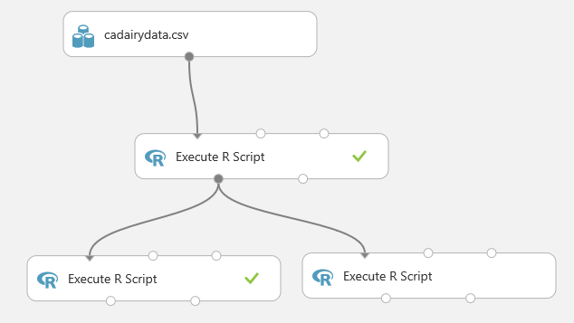

As with the correlation analysis we just completed, we need to add a column with a POSIXct time series object. The following code will add the column.

```r
# If running in Machine Learning Studio (classic), uncomment the first line with maml.mapInputPort()
cadairydata <- maml.mapInputPort(1)

## Create a new column as a POSIXct object
Sys.setenv(TZ = "PST8PDT")
cadairydata$Time <- as.POSIXct(strptime(paste(as.character(cadairydata$Year), "-", as.character(cadairydata$Month.Number), "-01 00:00:00", sep = ""), "%Y-%m-%d %H:%M:%S"))

str(cadairydata)
```

Run this code, and look at the log. The result should look like this example.

```output
[ModuleOutput] [1] "Loading variable port1..."
[ModuleOutput] 
[ModuleOutput] 'data.frame':    228 obs. of  9 variables:
[ModuleOutput] 
[ModuleOutput]  $ Month.Number     : int  1 2 3 4 5 6 7 8 9 10 ...
[ModuleOutput] 
[ModuleOutput]  $ Year             : int  1995 1995 1995 1995 1995 1995 1995 1995 1995 1995 ...
[ModuleOutput] 
[ModuleOutput]  $ Month            : Factor w/ 12 levels "Apr","Aug","Dec",..: 5 4 8 1 9 7 6 2 12 11 ...
[ModuleOutput] 
[ModuleOutput]  $ Cotagecheese.Prod: num  1.47 1.31 1.51 1.45 1.5 ...
[ModuleOutput] 
[ModuleOutput]  $ Icecream.Prod    : num  5.82 5.9 6.1 6.06 6.17 ...
[ModuleOutput] 
[ModuleOutput]  $ Milk.Prod        : num  7.66 7.57 7.68 7.66 7.71 ...
[ModuleOutput] 
[ModuleOutput]  $ N.CA.Fat.Price   : num  6.89 6.79 6.79 6.8 6.8 ...
[ModuleOutput] 
[ModuleOutput]  $ Month.Count      : num  0 1 2 3 4 5 6 7 8 9 ...
[ModuleOutput] 
[ModuleOutput]  $ Time             : POSIXct, format: "1995-01-01" "1995-02-01" ...
```

With this result, we're ready to start our analysis.

### Create a training dataset

With the dataframe constructed, we need to create a training dataset. This data will include all of the observations except the last 12, of the year 2013, which is our test dataset. The following code subsets the dataframe and creates plots of the dairy production and price variables. We then create plots of the four production and price variables. An anonymous function is used to define some augments for plot, and then iterate over the list of the other two arguments with `Map()`. If you're thinking that a for loop would have worked fine here, you're correct. But, since R is a functional language, we're looking at a functional approach.

```r
cadairytrain <- cadairydata[1:216, ]

Ylabs  <- list("Log CA Cotage Cheese Production, 1000s lb",
               "Log CA Ice Cream Production, 1000s lb",
               "Log CA Milk Production 1000s lb",
               "Log North CA Milk Milk Fat Price per 1000 lb")

Map(function(y, Ylabs){plot(cadairytrain$Time, y, xlab = "Time", ylab = Ylabs, type = "l")}, cadairytrain[, 4:7], Ylabs)
```

Running the code produces the series of time series plots from the R Device output shown here. The time axis is in units of dates, which is a nice benefit of the time series plot method.

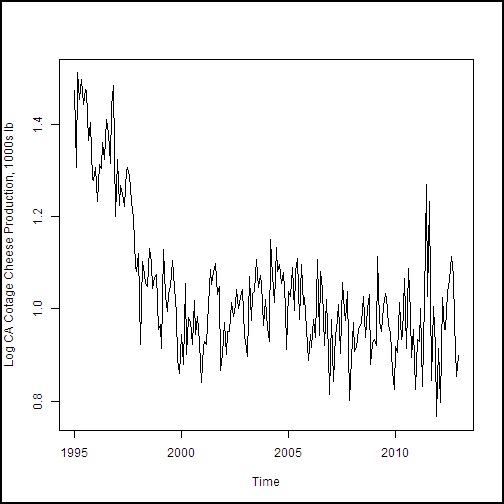

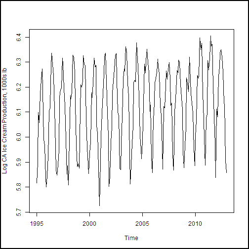

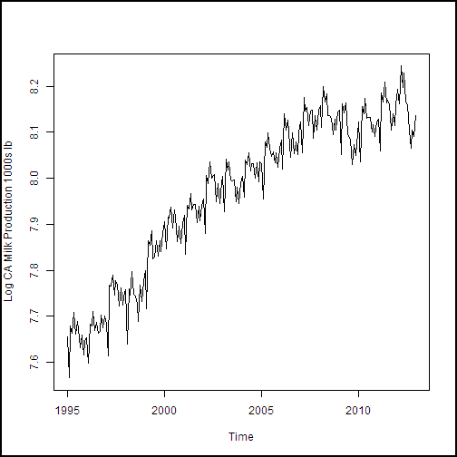.


### A trend model

Now that we've created a time series object and had a look at the data, let's start to construct a trend model for the California milk production data. We can use a time series regression. It's clear from the plot that we'll need more than a slope and intercept to accurately model the observed trend in the training data.

Given the small scale of the data, we'll build the model for trend in RStudio and then cut and paste the resulting model into Machine Learning Studio (classic). RStudio provides an interactive environment for this type of interactive analysis.

As a first attempt, we'll try a polynomial regression with powers up to three. There's a real danger of over-fitting these kinds of models. It's best to avoid high-order terms. The `I()` function inhibits interpretation of the contents (interprets the contents as is) and allows you to write a literally interpreted function in a regression equation.

```r
milk.lm <- lm(Milk.Prod ~ Time + I(Month.Count^2) + I(Month.Count^3), data = cadairytrain)
summary(milk.lm)
```

This function generates the following output.

```output
##
## Call:
## lm(formula = Milk.Prod ~ Time + I(Month.Count^2) + I(Month.Count^3),
##     data = cadairytrain)
##
## Residuals:
##      Min       1Q   Median       3Q      Max
## -0.12667 -0.02730  0.00236  0.02943  0.10586
##
## Coefficients:
##                   Estimate Std. Error t value Pr(>|t|)
## (Intercept)       6.33e+00   1.45e-01   43.60   <2e-16 ***
## Time              1.63e-09   1.72e-10    9.47   <2e-16 ***
## I(Month.Count^2) -1.71e-06   4.89e-06   -0.35    0.726
## I(Month.Count^3) -3.24e-08   1.49e-08   -2.17    0.031 *  
## ---
## Signif. codes:  0 '***' 0.001 '**' 0.01 '*' 0.05 '.' 0.1 ' ' 1
##
## Residual standard error: 0.0418 on 212 degrees of freedom
## Multiple R-squared:  0.941,    Adjusted R-squared:  0.94
## F-statistic: 1.12e+03 on 3 and 212 DF,  p-value: <2e-16
```

From P values (`Pr(>|t|)`) in this output, we can see that the squared term might not be significant. We'll use the `update()` function to modify this model by dropping the squared term.

```r
milk.lm <- update(milk.lm, . ~ . - I(Month.Count^2))
summary(milk.lm)
```

This function generates the following output.

```output
##
## Call:
## lm(formula = Milk.Prod ~ Time + I(Month.Count^3), data = cadairytrain)
##
## Residuals:
##      Min       1Q   Median       3Q      Max
## -0.12597 -0.02659  0.00185  0.02963  0.10696
##
## Coefficients:
##                   Estimate Std. Error t value Pr(>|t|)
## (Intercept)       6.38e+00   4.07e-02   156.6   <2e-16 ***
## Time              1.57e-09   4.32e-11    36.3   <2e-16 ***
## I(Month.Count^3) -3.76e-08   2.50e-09   -15.1   <2e-16 ***
## ---
## Signif. codes:  0 '***' 0.001 '**' 0.01 '*' 0.05 '.' 0.1 ' ' 1
##
## Residual standard error: 0.0417 on 213 degrees of freedom
## Multiple R-squared:  0.941,  Adjusted R-squared:  0.94
## F-statistic: 1.69e+03 on 2 and 213 DF,  p-value: <2e-16
```

This output looks better. All of the terms are significant. The 2e-16 value is a default value and shouldn't be taken too seriously.  

As a sanity test, let's make a time series plot of the California dairy production data with the trend curve shown. We've added the following code in the Machine Learning Studio (classic) [Execute R Script][execute-r-script] model (not RStudio) to create the model and make a plot. The result is shown in the following example.

```r
milk.lm <- lm(Milk.Prod ~ Time + I(Month.Count^3), data = cadairytrain)

plot(cadairytrain$Time, cadairytrain$Milk.Prod, xlab = "Time", ylab = "Log CA Milk Production 1000s lb", type = "l")
lines(cadairytrain$Time, predict(milk.lm, cadairytrain), lty = 2, col = 2)
```


It looks like the trend model fits the data fairly well. Further, there doesn't seem to be evidence of over-fitting, such as odd wiggles in the model curve.

### Seasonal model

With a trend model in hand, we need to push on and include the seasonal effects. We'll use the month of the year as a dummy variable in the linear model to capture the month-by-month effect. When you introduce factor variables into a model, the intercept must not be computed. If you don't do this, the formula is over-specified, and R will drop one of the desired factors but keep the intercept term.

Because we have a satisfactory trend model, we can use the `update()` function to add the new terms to the existing model. The -1 in the update formula drops the intercept term. Continuing in RStudio for the moment:

```r
milk.lm2 <- update(milk.lm, . ~ . + Month - 1)
summary(milk.lm2)
```

This function generates the following output.

```output
##
## Call:
## lm(formula = Milk.Prod ~ Time + I(Month.Count^3) + Month - 1,
##     data = cadairytrain)
##
## Residuals:
##      Min       1Q   Median       3Q      Max
## -0.06879 -0.01693  0.00346  0.01543  0.08726
##
## Coefficients:
##                   Estimate Std. Error t value Pr(>|t|)
## Time              1.57e-09   2.72e-11    57.7   <2e-16 ***
## I(Month.Count^3) -3.74e-08   1.57e-09   -23.8   <2e-16 ***
## MonthApr          6.40e+00   2.63e-02   243.3   <2e-16 ***
## MonthAug          6.38e+00   2.63e-02   242.2   <2e-16 ***
## MonthDec          6.38e+00   2.64e-02   241.9   <2e-16 ***
## MonthFeb          6.31e+00   2.63e-02   240.1   <2e-16 ***
## MonthJan          6.39e+00   2.63e-02   243.1   <2e-16 ***
## MonthJul          6.39e+00   2.63e-02   242.6   <2e-16 ***
## MonthJun          6.38e+00   2.63e-02   242.4   <2e-16 ***
## MonthMar          6.42e+00   2.63e-02   244.2   <2e-16 ***
## MonthMay          6.43e+00   2.63e-02   244.3   <2e-16 ***
## MonthNov          6.34e+00   2.63e-02   240.6   <2e-16 ***
## MonthOct          6.37e+00   2.63e-02   241.8   <2e-16 ***
## MonthSep          6.34e+00   2.63e-02   240.6   <2e-16 ***
## ---
## Signif. codes:  0 '***' 0.001 '**' 0.01 '*' 0.05 '.' 0.1 ' ' 1
##
## Residual standard error: 0.0263 on 202 degrees of freedom
## Multiple R-squared:     1,    Adjusted R-squared:     1
## F-statistic: 1.42e+06 on 14 and 202 DF,  p-value: <2e-16
```

We see that the model no longer has an intercept term and has 12 significant month factors. This result is exactly what we wanted to see.

Let's make another time series plot of the California dairy production data to see how well the seasonal model is working. We've added the following code in the Machine Learning Studio (classic) [Execute R Script][execute-r-script] to create the model and make a plot.

```r
milk.lm2 <- lm(Milk.Prod ~ Time + I(Month.Count^3) + Month - 1, data = cadairytrain)

plot(cadairytrain$Time, cadairytrain$Milk.Prod, xlab = "Time", ylab = "Log CA Milk Production 1000s lb", type = "l")
lines(cadairytrain$Time, predict(milk.lm2, cadairytrain), lty = 2, col = 2)
```

Running this code in Machine Learning Studio (classic) produces the plot shown here.


The fit to the data shown in this example is rather encouraging. Both the trend and the seasonal effect (monthly variation) look reasonable.

As another check on our model, let's have a look at the residuals. The following code computes the predicted values from our two models, computes the residuals for the seasonal model, and then plots these residuals for the training data.

```r
## Compute predictions from our models
predict1  <- predict(milk.lm, cadairydata)
predict2  <- predict(milk.lm2, cadairydata)

## Compute and plot the residuals
residuals <- cadairydata$Milk.Prod - predict2
plot(cadairytrain$Time, residuals[1:216], xlab = "Time", ylab ="Residuals of Seasonal Model")
```

The residual plot is shown here.

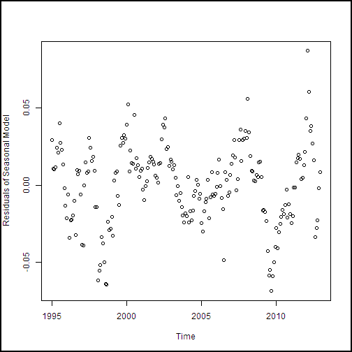

These residuals look reasonable. There's no particular structure, except the effect of the 2008-2009 recession, which our model doesn't account for particularly well.

The plot shown in this example is useful for detecting any time-dependent patterns in the residuals. The explicit approach of computing and plotting the residuals we used places the residuals in time order on the plot. If we had plotted `milk.lm$residuals`, the plot wouldn't have been in time order.

You can also use `plot.lm()` to produce a series of diagnostic plots.

```r
## Show the diagnostic plots for the model
plot(milk.lm2, ask = FALSE)
```

This code produces a series of diagnostic plots shown in the following examples.

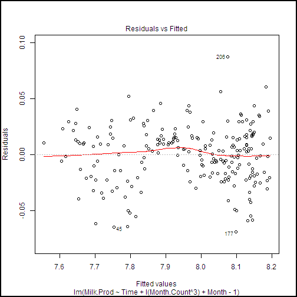

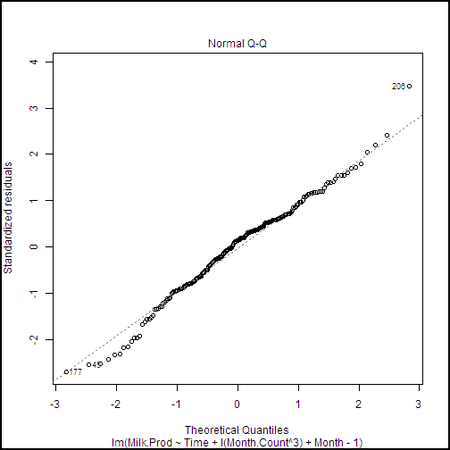

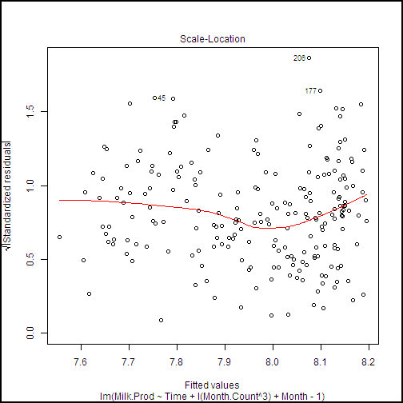


There are a few highly influential points identified in these plots, but nothing to cause great concern. Further, we can see from the Normal Q-Q plot that the residuals are close to normally distributed, which is an important assumption for linear models.

### Forecasting and model evaluation

There's just one more thing to do to complete our example. We need to compute forecasts and measure the error against the actual data. Our forecast will be for the 12 months of 2013. We can compute an error measure for this forecast to the actual data that isn't part of our training dataset. Additionally, we can compare performance on the 18 years of training data to the 12 months of test data.

A number of metrics are used to measure the performance of time series models. In our case, we'll use the root mean square (RMS) error. The following function computes the RMS error between two series.

```r
RMS.error <- function(series1, series2, is.log = TRUE, min.length = 2){
  ## Function to compute the RMS error or difference between two
  ## series or vectors

  messages <- c("ERROR: Input arguments to function RMS.error of wrong type encountered",
                "ERROR: Input vector to function RMS.error is too short",
                "ERROR: Input vectors to function RMS.error must be of same length",
                "WARNING: Funtion rms.error has received invald input time series.")

  ## Check the arguments
  if(!is.numeric(series1) | !is.numeric(series2) | !is.logical(is.log) | !is.numeric(min.length)) {
    warning(messages[1])
    return(NA)}

  if(length(series1) < min.length) {
    warning(messages[2])
    return(NA)}

  if((length(series1) != length(series2))) {
       warning(messages[3])
    return(NA)}

  ## If is.log is TRUE exponentiate the values, else just copy
  if(is.log) {
    tryCatch( {
      temp1 <- exp(series1)
      temp2 <- exp(series2) },
      error = function(e){warning(messages[4]); NA}
    )
  } else {
    temp1 <- series1
    temp2 <- series2
  }

 ## Compute predictions from our models
predict1  <- predict(milk.lm, cadairydata)
predict2  <- predict(milk.lm2, cadairydata)

## Compute the RMS error in a dataframe
  tryCatch( {
    sqrt(sum((temp1 - temp2)^2) / length(temp1))},
    error = function(e){warning(messages[4]); NA})
}
```

As with the `log.transform()` function we discussed in the "Value transformations" section, there's quite a lot of error checking and exception recovery code in this function. The principles employed are the same. The work is done in two places wrapped in `tryCatch()`. First, the time series are exponentiated, since we've been working with the logs of the values. Second, the actual RMS error is computed.

Equipped with a function to measure the RMS error, let's build and output a dataframe that contains the RMS errors. We'll include terms for the trend model alone and the complete model with seasonal factors. The following code does the job by using the two linear models we've constructed.

```r
## Compute the RMS error in a dataframe
## Include the row names in the first column so they will
## appear in the output of the Execute R Script
RMS.df  <-  data.frame(
rowNames = c("Trend Model", "Seasonal Model"),
  Traing = c(
  RMS.error(predict1[1:216], cadairydata$Milk.Prod[1:216]),
  RMS.error(predict2[1:216], cadairydata$Milk.Prod[1:216])),
  Forecast = c(
    RMS.error(predict1[217:228], cadairydata$Milk.Prod[217:228]),
    RMS.error(predict2[217:228], cadairydata$Milk.Prod[217:228]))
)
RMS.df

## The following line should be executed only when running in
## Azure Machine Learning Studio (classic)
maml.mapOutputPort('RMS.df')
```

Running this code produces the output shown here at the Result Dataset output port.

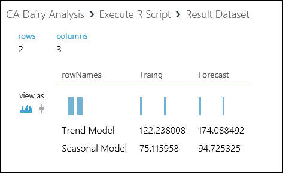

From these results, we see that adding the seasonal factors to the model reduces the RMS error significantly. Not too surprisingly, the RMS error for the training data is a bit less than for the forecast.

## <a id="appendixa"></a>Guide to RStudio documentation

RStudio is well documented. Here are some links to the key sections of the RStudio documentation to get you started.

* **Create projects**: You can organize and manage your R code into projects by using RStudio. For more information, see [Using Projects](https://support.rstudio.com/hc/articles/200526207-Using-Projects). Follow these directions and create a project for the R code examples in this article.
* **Edit and execute R code**: RStudio provides an integrated environment for editing and executing R code. For more information, see [Editing and Executing Code](https://support.rstudio.com/hc/articles/200484448-Editing-and-Executing-Code).
* **Debug**: RStudio includes powerful debugging capabilities. For more information about these features, see [Debugging with RStudio](https://support.rstudio.com/hc/articles/200713843-Debugging-with-RStudio). For information about breakpoint troubleshooting features, see [Breakpoint Troubleshooting](https://support.rstudio.com/hc/articles/200534337-Breakpoint-Troubleshooting).

## <a id="appendixb"></a>Further reading

This R programming tutorial covers the basics of what you need to use the R language with Machine Learning Studio (classic). If you aren't familiar with R, two introductions are available on CRAN:

* [R for Beginners](https://cran.r-project.org/doc/contrib/Paradis-rdebuts_en.pdf) by Emmanuel Paradis is a good place to start.
* [An Introduction to R](https://cran.r-project.org/doc/manuals/R-intro.html) by W. N. Venables et al. goes into more depth.

There are many books on R that can help you get started:

* **Art of R Programming: A Tour of Statistical Software Design** by Norman Matloff is an excellent introduction to programming in R.
* **R Cookbook** by Paul Teetor provides a problem-and-solution approach to using R.
* **R in Action** by Robert Kabacoff is another useful introductory book. The companion [Quick R website](https://www.statmethods.net/) is a useful resource.
* **The R Inferno** by Patrick Burns is a surprisingly humorous book that deals with a number of tricky and difficult topics that can be encountered when you program in R. The book is available for free at [The R Inferno](https://www.burns-stat.com/documents/books/the-r-inferno/).
* **Advanced R** by Hadley Wickham provides a deep dive into advanced topics in R. The online version of this book is available for free at [Advanced R](http://adv-r.had.co.nz/).
* **Introductory Time Series with R** by Paul Cowpertwait and Andrew Metcalfe provides an introduction to using R for time series analysis. Many more theoretical texts provide R examples.

Here are some great internet resources:

* [CRAN Task View: Time Series Analysis](https://cran.r-project.org/web/views/TimeSeries.html) has a catalog of R time series packages. For information on specific time series object packages, see the documentation for that package.
* [Introduction to R](https://www.datacamp.com/courses/introduction-to-r) is a free interactive course from DataCamp that teaches R in the comfort of your browser with video lessons and coding exercises. There are interactive tutorials on the latest R techniques and packages.
* [Learn R Programming, The Definitive Guide](https://www.datamentor.io/r-programming/) from DataMentor.
* [R CODER](https://r-coder.com/) has detailed R tutorials and a free R course for beginners.
* [R Tutorial](https://www.cyclismo.org/tutorial/R/) by Kelly Black from Clarkson University is a quick tutorial.
* [Top R language resources to improve your data skills](https://www.computerworld.com/article/2497464/business-intelligence-60-r-resources-to-improve-your-data-skills.html) lists more than 60 R resources.

<!-- Module References -->
[execute-r-script]: /azure/machine-learning/studio-module-reference/execute-r-script
