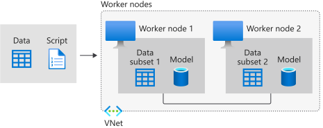

# Distributed training with Azure Machine Learning

In this article, you learn about distributed training and how Azure Machine Learning supports it for deep learning models. 

In distributed training the workload to train a model is split up and shared among multiple mini processors, called worker nodes. These worker nodes work in parallel to speed up model training. Distributed training can be used for traditional ML models, but is better suited for compute and time intensive tasks, like [deep learning](concept-deep-learning-vs-machine-learning.md) for training deep neural networks. 

## Deep learning and distributed training 

There are two main types of distributed training: [data parallelism](#data-parallelism) and [model parallelism](#model-parallelism). For distributed training on deep learning models, the [Azure Machine Learning SDK in Python](/python/api/overview/azure/ml/intro) supports integrations with popular frameworks, PyTorch and TensorFlow. Both frameworks employ data parallelism for distributed training, and can leverage [horovod](https://horovod.readthedocs.io/en/latest/summary_include.html) for optimizing compute speeds. 

* [Distributed training with PyTorch](how-to-train-pytorch.md#distributed-training)

* [Distributed training with TensorFlow](how-to-train-tensorflow.md#distributed-training)

For ML models that don't require distributed training, see [train models with Azure Machine Learning](concept-train-machine-learning-model.md#python-sdk) for the different ways to train models using the Python SDK.

## Data parallelism

Data parallelism is the easiest to implement of the two distributed training approaches, and is sufficient for most use cases.

In this approach, the data is divided into partitions, where the number of partitions is equal to the total number of available nodes, in the compute cluster. The model is copied in each of these worker nodes, and each worker operates on its own subset of the data. Keep in mind that each node has to have the capacity to support the model that's being trained, that is the model has to entirely fit on each node. The following diagram provides a visual demonstration of this approach.

Each node independently computes the errors between its predictions for its training samples and the labeled outputs. In turn, each node updates its model based on the errors and must communicate all of its changes to the other nodes to update their corresponding models. This means that the worker nodes need to synchronize the model parameters, or gradients, at the end of the batch computation to ensure they are training a consistent model. 

## Model parallelism

In model parallelism, also known as network parallelism, the model is segmented into different parts that can run concurrently in different nodes, and each one will run on the same data. The scalability of this method depends on the degree of task parallelization of the algorithm, and it is more complex to implement than data parallelism. 

In model parallelism, worker nodes only need to synchronize the shared parameters, usually once for each forward or backward-propagation step. Also, larger models aren't a concern since each node operates on a subsection of the model on the same training data.

## Next steps

* Learn how to [use compute targets for model training](how-to-set-up-training-targets.md) with the Python SDK.
* For a technical example, see the [reference architecture  scenario](/azure/architecture/reference-architectures/ai/training-deep-learning).
* [Train ML models with TensorFlow](how-to-train-tensorflow.md).
* [Train ML models with PyTorch](how-to-train-pytorch.md).