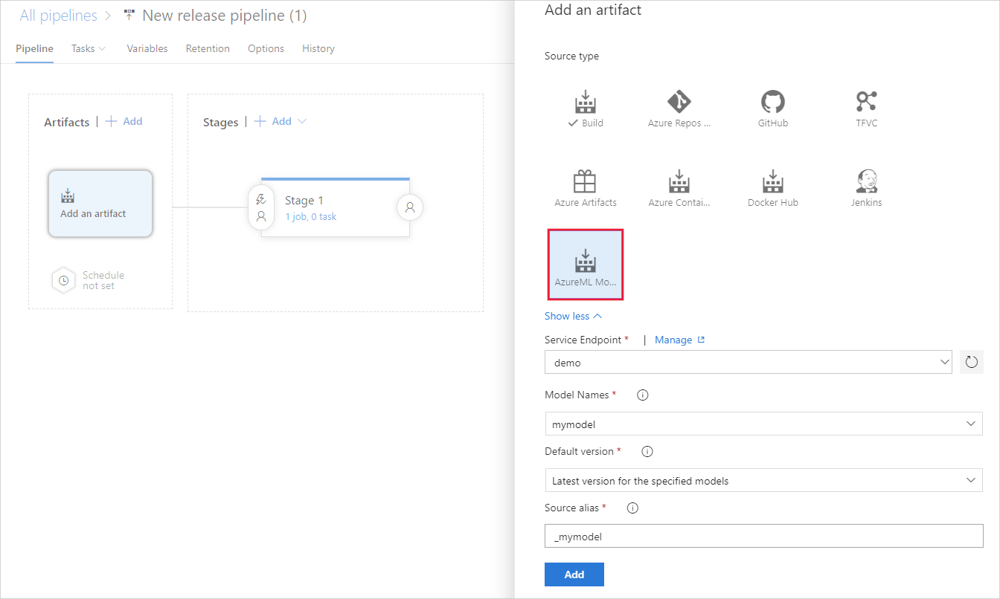

# Continuously deploy models

This article shows how to use continuous deployment in Azure DevOps to automatically check for new versions of registered models and push those new models into production.

## Prerequisites

This article assumes you have already registered a model in your Azure Machine Learning workspace. See [this tutorial](how-to-train-scikit-learn.md) for an example of training and registering a scikit-learn model.

## Continuously deploy models

You can continuously deploy models by using the Machine Learning extension for [Azure DevOps](https://azure.microsoft.com/services/devops/). You can use the Machine Learning extension for Azure DevOps to trigger a deployment pipeline when a new machine learning model is registered in an Azure Machine Learning workspace.

1. Sign up for [Azure Pipelines](https://docs.microsoft.com/azure/devops/pipelines/get-started/pipelines-sign-up?view=azure-devops), which makes continuous integration and delivery of your application to any platform or cloud possible. (Note that Azure Pipelines isn't the same as [Machine Learning pipelines](concept-ml-pipelines.md#compare).)

1. [Create an Azure DevOps project.](https://docs.microsoft.com/azure/devops/organizations/projects/create-project?view=azure-devops)

1. Install the [Machine Learning extension for Azure Pipelines](https://marketplace.visualstudio.com/items?itemName=ms-air-aiagility.vss-services-azureml&targetId=6756afbe-7032-4a36-9cb6-2771710cadc2&utm_source=vstsproduct&utm_medium=ExtHubManageList).

1. Use service connections to set up a service principal connection to your Azure Machine Learning workspace so you can access your artifacts. Go to project settings, select **Service connections**, and then select **Azure Resource Manager**:

    

1. In the **Scope level** list, select **AzureMLWorkspace**, and then enter the rest of the values:

    

1. To continuously deploy your machine learning model by using Azure Pipelines, under pipelines, select **release**. Add a new artifact, and then select the **AzureML Model** artifact and the service connection that you created earlier. Select the model and version to trigger a deployment:

    

1. Enable the model trigger on your model artifact. When you turn on the trigger, every time the specified version (that is, the newest version) of that model is registered in your workspace, an Azure DevOps release pipeline is triggered.

    

## Next steps

Check out the below projects on GitHub for more examples of continuous deployment for ML models.

* [Microsoft/MLOps](https://github.com/Microsoft/MLOps)
* [Microsoft/MLOpsPython](https://github.com/microsoft/MLOpsPython)