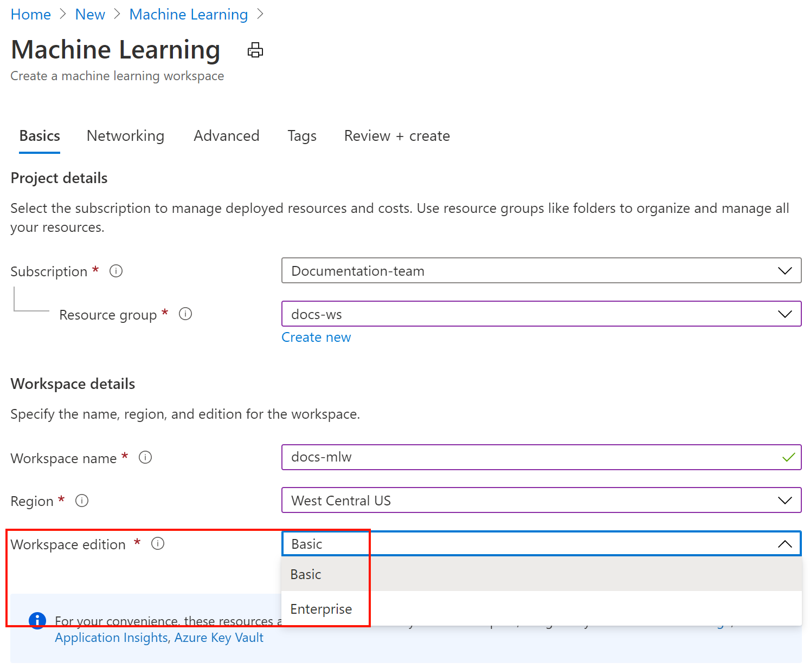
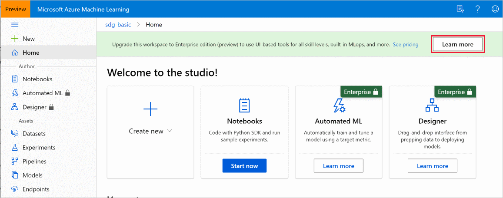

# Create and manage Azure Machine Learning workspaces in the Azure portal
[!INCLUDE [applies-to-skus](../../includes/aml-applies-to-basic-enterprise-sku.md)]

In this article, you'll create, view, and delete [**Azure Machine Learning workspaces**](concept-workspace.md) in the Azure portal for [Azure Machine Learning](overview-what-is-azure-ml.md).  The portal is the easiest way to get started with workspaces but as your needs change or requirements for automation increase you can also create and delete workspaces [using the CLI](reference-azure-machine-learning-cli.md), [with Python code](https://docs.microsoft.com/python/api/overview/azure/ml/intro?view=azure-ml-py) or [via the VS Code extension](how-to-vscode-tools.md#get-started-with-azure-machine-learning-for-visual-studio-code).

## Create a workspace

To create a workspace, you need an Azure subscription. If you don’t have an Azure subscription, create a free account before you begin. Try the [free or paid version of Azure Machine Learning](https://aka.ms/AMLFree) today.

1. Sign in to the [Azure portal](https://portal.azure.com/) by using the credentials for your Azure subscription. 

1. In the upper-left corner of Azure portal, select **+ Create a resource**.

      

1. Use the search bar to find **Machine Learning**.

1. Select **Machine Learning**.

1. In the **Machine Learning** pane, select **Create** to begin.

1. Provide the following information to configure your new workspace:

   Field|Description 
   ---|---
   Workspace name |Enter a unique name that identifies your workspace. In this example, we use **docs-ws**. Names must be unique across the resource group. Use a name that's easy to recall and to differentiate from workspaces created by others.  
   Subscription |Select the Azure subscription that you want to use.
   Resource group | Use an existing resource group in your subscription or enter a name to create a new resource group. A resource group holds related resources for an Azure solution. In this example, we use **docs-aml**. 
   Location | Select the location closest to your users and the data resources to create your workspace.
   Workspace edition | Select **Basic** or **Enterprise**.  This workspace edition determines the features to which you’ll have access and pricing. Learn more about [Basic and Enterprise edition offerings](overview-what-is-azure-ml.md#sku). 

    

1. After you are finished configuring the workspace, select **Create**. 

   > [!Warning] 
   > It can take several minutes to create your workspace in the cloud.

   When the process is finished, a deployment success message appears. 
 
 1. To view the new workspace, select **Go to resource**.

### Download a configuration file

1. If you will be creating a [compute instance](tutorial-1st-experiment-sdk-setup.md#azure), skip this step.

1. If you plan to use code on your local environment that references this workspace, select  **Download config.json** from the **Overview** section of the workspace.  

   
   
   Place the file into  the directory structure with your Python scripts or Jupyter Notebooks. It can be in the same directory, a subdirectory named *.azureml*, or in a parent directory. When you create a compute instance, this file is added to the correct directory on the VM for you.

## Upgrade to Enterprise edition

You can upgrade your workspace from Basic edition to Enterprise edition to take advantage of the enhanced features such as low-code experiences and enhanced security features.

1. Sign in to [Azure Machine Learning studio](https://ml.azure.com).

1. Select the workspace that you wish to upgrade.

1. Select **Learn more**  at the top right of the page.

   

1. Select **Upgrade** in the window that appears.

> [!IMPORTANT]
> You cannot downgrade an Enterprise edition workspace to a Basic edition workspace. 

## Find a workspace

1. In the top search field, type **Machine Learning**.  

1. Select **Machine Learning**.

   

1. Look through the list of workspaces found. You can filter based on subscription, resource groups, and locations.  

1. Select a workspace to display its properties.

## Delete a workspace

Use the Delete button at the top of the workspace you wish to delete.

  

## Clean up resources

[!INCLUDE [aml-delete-resource-group](../../includes/aml-delete-resource-group.md)]

## Next steps

Follow the full-length tutorial to learn how to use a workspace to build, train, and deploy models with Azure Machine Learning.

> [!div class="nextstepaction"]
> [Tutorial: Train models](tutorial-train-models-with-aml.md)
