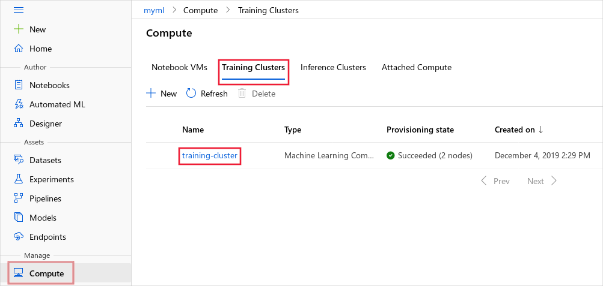
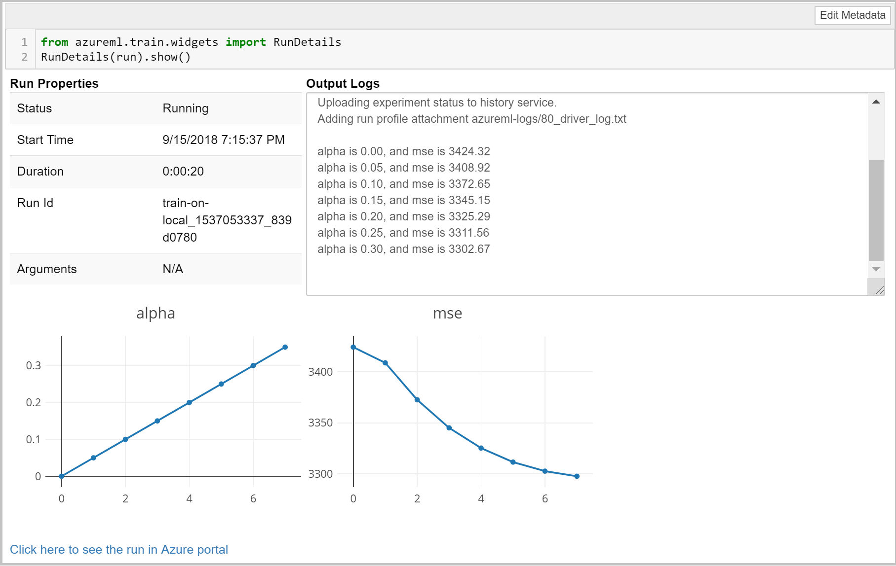
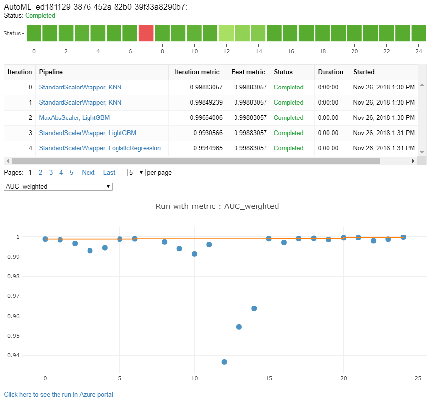

# Monitor and view ML run logs and metrics


In this article, you learn how to monitor Azure Machine Learning runs and view their logs. Before you can view logs, you have to enable them first. For more information, see [Enable logging in Azure ML training runs](how-to-track-experiments.md).

Logs can help you diagnose errors and warnings, or track performance metrics like parameters and model accuracy. In this article, you learn how to view logs using the following methods:

> [!div class="checklist"]
> * Monitor runs in the studio
> * Monitor runs using the Jupyter Notebook widget
> * Monitor automated machine learning runs
> * View output logs upon completion
> * View output logs in the studio

For general information on how to manage your experiments, see [Start, monitor, and cancel training runs](how-to-manage-runs.md).

## Monitor runs in the studio

To monitor runs for a specific compute target from your browser, use the following steps:

1. In the [Azure Machine Learning studio](https://ml.azure.com/), select your workspace, and then select __Compute__ from the left side of the page.

1. Select __Training Clusters__ to display a list of compute targets used for training. Then select the cluster.

    

1. Select __Runs__. The list of runs that use this cluster is displayed. To view details for a specific run, use the link in the __Run__ column. To view details for the experiment, use the link in the __Experiment__ column.

    
    
    > [!TIP]
    > Since training compute targets are a shared resource, they can have multiple runs queued or active at a given time.
    > 
    > A run can contain child runs, so one training job can result in multiple entries.

Once a run completes, it is no longer displayed on this page. To view information on completed runs, visit the __Experiments__ section of the studio and select the experiment and run. For more information, see the section [View metrics for completed runs](#view-the-experiment-in-the-web-portal).

## Monitor runs using the Jupyter notebook widget

When you use the **ScriptRunConfig** method to submit runs, you can watch the progress of the run using the [Jupyter widget](https://docs.microsoft.com/python/api/azureml-widgets/azureml.widgets?view=azure-ml-py&preserve-view=true). Like the run submission, the widget is asynchronous and provides live updates every 10-15 seconds until the job completes.

View the Jupyter widget while waiting for the run to complete.
    
```python
from azureml.widgets import RunDetails
RunDetails(run).show()
```



You can also get a link to the same display in your workspace.

```python
print(run.get_portal_url())
```

## Monitor automated machine learning runs

For automated machine learning runs, to access the charts from a previous run, replace `<<experiment_name>>` with the appropriate experiment name:

```python
from azureml.widgets import RunDetails
from azureml.core.run import Run

experiment = Experiment (workspace, <<experiment_name>>)
run_id = 'autoML_my_runID' #replace with run_ID
run = Run(experiment, run_id)
RunDetails(run).show()
```



## Show output upon completion

When you use **ScriptRunConfig**, you can use ```run.wait_for_completion(show_output = True)``` to show when the model training is complete. The ```show_output``` flag gives you verbose output. For more information, see the ScriptRunConfig section of [How to enable logging](how-to-track-experiments.md#scriptrun-logs).

<a id="queryrunmetrics"></a>
## Query run metrics

You can view the metrics of a trained model using ```run.get_metrics()```. For example, you could use this with the example above to determine the best model by looking for the model with the lowest mean square error (mse) value.

<a name="view-the-experiment-in-the-web-portal"></a>
## View run records in the studio

You can browse completed run records, including logged metrics, in the [Azure Machine Learning studio](https://ml.azure.com).

Navigate to the **Experiments** tab and select your experiment. On the experiment run dashboard, you can see tracked metrics and logs for each run. 

Drill down to a specific run to view its outputs or logs, or download the snapshot of the experiment so you can share the experiment folder with others.

You can also edit the run list table to select multiple runs and display either the last, minimum, or maximum logged value for your runs. Customize your charts to compare the logged metrics values and aggregates across multiple runs.


### Format charts in the studio

Use the following methods in the logging APIs to influence the studio visualizes your metrics.

|Logged Value|Example code| Format in portal|
|----|----|----|
|Log an array of numeric values| `run.log_list(name='Fibonacci', value=[0, 1, 1, 2, 3, 5, 8, 13, 21, 34, 55, 89])`|single-variable line chart|
|Log a single numeric value with the same metric name repeatedly used (like from within a for loop)| `for i in tqdm(range(-10, 10)):    run.log(name='Sigmoid', value=1 / (1 + np.exp(-i))) angle = i / 2.0`| Single-variable line chart|
|Log a row with 2 numerical columns repeatedly|`run.log_row(name='Cosine Wave', angle=angle, cos=np.cos(angle))   sines['angle'].append(angle)      sines['sine'].append(np.sin(angle))`|Two-variable line chart|
|Log table with 2 numerical columns|`run.log_table(name='Sine Wave', value=sines)`|Two-variable line chart|


## Next steps

Try these next steps to learn how to use Azure Machine Learning:

* Learn how to [track experiments and enable logs in the Azure Machine Learning designer](how-to-track-designer-experiments.md).

* See an example of how to register the best model and deploy it in the tutorial, [Train an image classification model with Azure Machine Learning](tutorial-train-models-with-aml.md).

