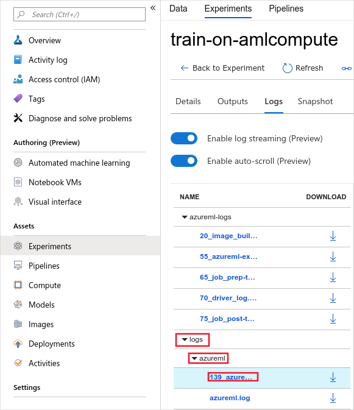

# Git integration for Azure Machine Learning

[Git](https://git-scm.com/) is a popular version control system that allows you to share and collaborate your projects. When submitting a training job to Azure Machine Learning, if the training files are stored in a local git repository then information about the repo is tracked as part of the training process.

Since Azure Machine Learning tracks information from a local git repo, it isn't tied to any specific central repository. Your repository can be cloned from GitHub, GitLab, Bitbucket, Azure DevOps, or any other git-compatible service.

## How does git integration work?

When you submit a training run from the Python SDK or Machine Learning CLI, the files needed to train the model are uploaded to your workspace. If the `git` command is available on your development environment, the upload process uses it to check if the files are stored in a git repository. If so, then information from your git repository is also uploaded as part of the training run. This information is stored in the following properties for the training run:

| Property | Git command used to get the value | Description |
| ----- | ----- | ----- |
| `azureml.git.repository_uri` | `git ls-remote --get-url` | The URI that your repository was cloned from. |
| `mlflow.source.git.repoURL` | `git ls-remote --get-url` | The URI that your repository was cloned from. |
| `azureml.git.branch` | `git symbolic-ref --short HEAD` | The active branch when the run was submitted. |
| `mlflow.source.git.branch` | `git symbolic-ref --short HEAD` | The active branch when the run was submitted. |
| `azureml.git.commit` | `git rev-parse HEAD` | The commit hash of the code that was submitted for the run. |
| `mlflow.source.git.commit` | `git rev-parse HEAD` | The commit hash of the code that was submitted for the run. |
| `azureml.git.dirty` | `git status --porcelain .` | `True`, if the branch/commit is dirty; otherwise, `false`. |

This information is sent for runs that use an estimator, machine learning pipeline, or script run.

If your training files are not located in a git repository on your development environment, or the `git` command is not available, then no git-related information is tracked.

## View the logged information

The git information is stored in the properties for a training run. You can view this information using the Azure portal, Python SDK, and CLI. 

### Azure portal

1. From the [Azure portal](https://portal.azure.com), select your workspace.
1. Select __Experiments__, and then select one of your experiments.
1. Select one of the runs from the __RUN NUMBER__ column.
1. Select __Logs__, and then expand the __logs__ and __azureml__ entries. Select the link that begins with __###\_azure__.

    

The logged information contains text similar to the following JSON:

```json
"properties": {
    "_azureml.ComputeTargetType": "batchai",
    "ContentSnapshotId": "5ca66406-cbac-4d7d-bc95-f5a51dd3e57e",
    "azureml.git.repository_uri": "git@github.com:azure/machinelearningnotebooks",
    "mlflow.source.git.repoURL": "git@github.com:azure/machinelearningnotebooks",
    "azureml.git.branch": "master",
    "mlflow.source.git.branch": "master",
    "azureml.git.commit": "4d2b93784676893f8e346d5f0b9fb894a9cf0742",
    "mlflow.source.git.commit": "4d2b93784676893f8e346d5f0b9fb894a9cf0742",
    "azureml.git.dirty": "True",
    "AzureML.DerivedImageName": "azureml/azureml_9d3568242c6bfef9631879915768deaf",
    "ProcessInfoFile": "azureml-logs/process_info.json",
    "ProcessStatusFile": "azureml-logs/process_status.json"
}
```

### Python SDK

After submitting a training run, a [Run](https://docs.microsoft.com/python/api/azureml-core/azureml.core.run%28class%29?view=azure-ml-py) object is returned. The `properties` attribute of this object contains the logged git information. For example, the following code retrieves the commit hash:

```python
run.properties['azureml.git.commit']
```

### CLI

The `az ml run` CLI command can be used to retrieve the properties from a run. For example, the following command returns the properties for the last run in the experiment named `train-on-amlcompute`:

```azurecli-interactive
az ml run list -e train-on-amlcompute --last 1 -w myworkspace -g myresourcegroup --query '[].properties'
```

For more information, see the [az ml run](https://docs.microsoft.com/cli/azure/ext/azure-cli-ml/ml/run?view=azure-cli-latest) reference documentation.

## Next steps

* [Set up and use compute targets for model training](how-to-set-up-training-targets.md)