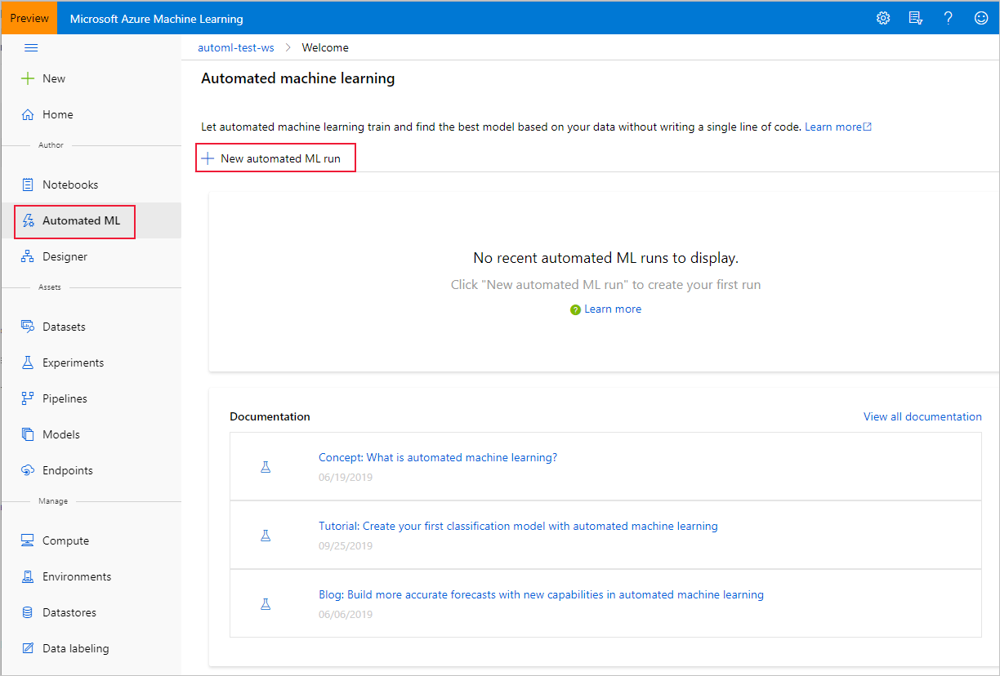
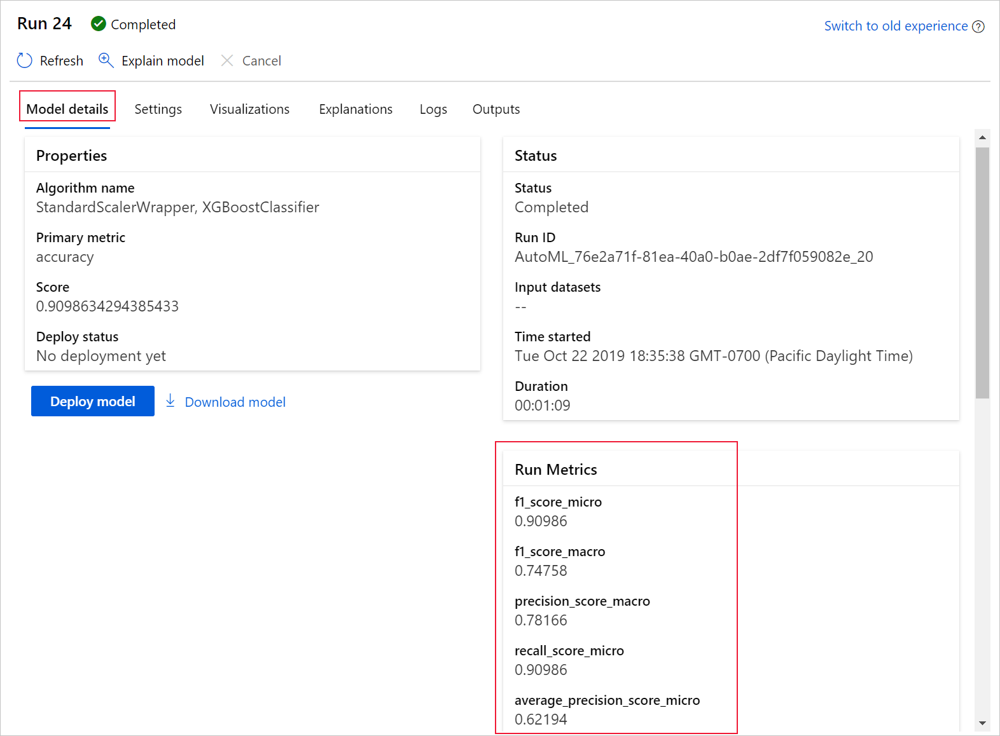
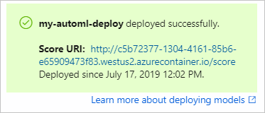

# Create, explore and deploy automated machine learning experiments with Azure Machine Learning's workspace landing page (preview)

 In this article, you learn how to create, explore, and deploy automated machine learning experiments in the Azure Machine Learning's workspace landing page without a single line of code. Automated machine learning automates the process of selecting the best algorithm to use for your specific data, so you can generate a machine learning model quickly. [Learn more about automated machine learning](concept-automated-ml.md).

 If you prefer a more code-based experience, you can also [configure your automated machine learning experiments in Python](how-to-configure-auto-train.md) with the [Azure Machine Learning SDK](https://docs.microsoft.com/python/api/overview/azure/ml/intro?view=azure-ml-py).

## Prerequisites

* An Azure subscription. If you don’t have an Azure subscription, create a free account before you begin. Try the [free or paid version of Azure Machine Learning](https://aka.ms/AMLFree) today.

* An Azure Machine Learning workspace. See [Create an Azure Machine Learning workspace](how-to-manage-workspace.md).

## Get started

1. Sign in to [the workspace landing page](https://ml.azure.com/workspaceportal/). 

1. Select your subscription and workspace. 

1. Navigate to the left pane. Select **Automated ML** under the **Author** section.

 If this is your first time doing any experiments, you'll see the **Get started** screen. 

Otherwise, you'll see your **Automated machine learning** dashboard with an overview of all of your automated machine learning experiments, including those created with the SDK. Here you can filter and explore your runs by date, experiment name, and run status.

## Create and run experiment

1. Select **Create Experiment** and populate the form.

1. Enter a unique experiment name.

1. Select a compute for the data profiling and training job. A list of your existing computes is available in the dropdown. To create a new compute, follow the instructions in step 4.

1. Select **Create a new compute** to configure your compute context for this experiment.

    Field|Description
    ---|---
    Compute name| Enter a unique name that identifies your compute context.
    Virtual machine size| Select the virtual machine size for your compute.
    Min / Max nodes (in Advanced Settings)| To profile data, you must specify 1 or more nodes. Enter the maximum number of nodes for your compute. The default is 6 nodes for an AML Compute.
    
    Select **Create**. Creation of a new compute can take a few minutes.

    >[!NOTE]
    > Your compute name will indicate if the compute you select/create is *profiling enabled*. (See the section [data profiling](#profile) for more details).

1. Select a dataset from your storage container, or create one by uploading a file from your local computer to the container. Public preview only supports local file uploads and Azure blob storage accounts.

    >[!Important]
    > Requirements for training data:
    >* Data must be in tabular form.
    >* The value you want to predict (target column) must be present in the data.

    1. To create a new dataset from a file on your local compute, select **Browse** and then select the file. 

    1. Give your dataset a unique name and provide an optional description. 

    1. Select **Next** to upload it to the default storage container that's automatically created with your workspace or choose a storage container that you want to use for the experiment. 

    1. Review the **Settings and preview** form for accuracy. The form is intelligently populated based on the file type. 

        Field| Description
        ----|----
        File format| Defines the layout and type of data stored in a file.
        Delimiter| One or more characters for specifying the boundary between separate, independent regions in plain text or other data streams.
        Encoding| Identifies what bit to character schema table to use to read your dataset.
        Column headers| Indicates how the headers of the dataset, if any, will be treated.
        Skip rows | Indicates how many, if any, rows are skipped in the dataset.
    
        Select **Next**.

    1. The **Schema** form is intelligently populated based on the selections in the **Settings and preview** form. Here configure the data type for each column, review the column names, and select which columns to **Not include** for your experiment. 
            
        Select **Next.**

1. Select the training job type: classification, regression, or forecasting.

1. Select target column; this is the column that you would like to do predictions on.

1. For forecasting:
    1. Select time column: This column contains the time data to be used.

    1. Select forecast horizon: Indicate how many time units (minutes/hours/days/weeks/months/years) will the model be able to predict to the future. The further the model is required to predict into the future, the less accurate it will become. [Learn more about forecasting and forecast horizon](how-to-auto-train-forecast.md).

1. (Optional) Advanced settings: additional settings you can use to better control the training job. Otherwise, defaults are applied based on experiment selection and data. 

    Advanced settings|Description
    ------|------
    Primary metric| Main metric used for scoring your model. [Learn more about model metrics](how-to-configure-auto-train.md#explore-model-metrics).
    Exit criteria| When any of these criteria are met, the training job is stopped.   *Training job time (minutes)*: How long to allow the training job to run.    *Max number of iterations*: Maximum number of pipelines (iterations) to test in the training job. The job will not run more than the specified number of iterations.   *Metric score threshold*:  Minimum metric score for all pipelines. This ensures that if you have a defined target metric you want to reach, you do not spend more time on the training job than necessary.
    Preprocessing| Select to enable or disable the preprocessing done by automated machine learning. Preprocessing includes automatic data cleansing, preparing, and transformation to generate synthetic features. [Learn more about preprocessing](#preprocess).
    Validation| Select one of the cross validation options to use in the training job. [Learn more about cross validation](how-to-configure-auto-train.md).
    Concurrency| Select the multi-core limits you would like to use when using multi-core compute.
    Blocked algorithm| Select algorithms you want to exclude from the training job.

## Data profiling & summary stats

You can get a vast variety of summary statistics across your data set to verify whether your data set is ML-ready. For non-numeric columns, they include only basic statistics like min, max, and error count. For numeric columns, you can also review their statistical moments and estimated quantiles. Specifically, our data profile includes:

>[!NOTE]
> Blank entries appear for features with irrelevant types.

Statistic|Description
------|------
Feature| Name of the column that is being summarized.
Profile| In-line visualization based on the type inferred. For example, strings, booleans, and dates will have value counts, while decimals (numerics) have approximated histograms. This allows you to gain a quick understanding of the distribution of the data.
Type distribution| In-line value count of types within a column. Nulls are their own type, so this visualization is useful for detecting odd or missing values.
Type|Inferred type of the column. Possible values include: strings, booleans, dates, and decimals.
Min| Minimum value of the column. Blank entries appear for features whose type does not have an inherent ordering (e.g. booleans).
Max| Maximum value of the column. 
Count| Total number of missing and non-missing entries in the column.
Not missing count| Number of entries in the column that are not missing. Empty strings and errors are treated as values, so they will not contribute to the "not missing count."
Quantiles| Approximated values at each quantile to provide a sense of the distribution of the data.
Mean| Arithmetic mean or average of the column.
Standard deviation| Measure of the amount of dispersion or variation of this column's data.
Variance| Measure of how far spread out this column's data is from its average value. 
Skewness| Measure of how different this column's data is from a normal distribution.
Kurtosis| Measure of how heavily tailed this column's data is compared to a normal distribution.

## Advanced preprocessing options

When configuring your experiments, you can enable the advanced setting `Preprocess`. Doing so means that the following data preprocessing and featurization steps are performed automatically.

|Preprocessing&nbsp;steps| Description |
| ------------- | ------------- |
|Drop high cardinality or no variance features|Drop these from training and validation sets, including features with all values missing, same value across all rows or with extremely high cardinality (for example, hashes, IDs, or GUIDs).|
|Impute missing values|For numerical features, impute with average of values in the column.  For categorical features, impute with most frequent value.|
|Generate additional features|For DateTime features: Year, Month, Day, Day of week, Day of year, Quarter, Week of the year, Hour, Minute, Second.  For Text features: Term frequency based on unigrams, bi-grams, and tri-character-grams.|
|Transform and encode |Numeric features with few unique values are transformed into categorical features.  One-hot encoding is performed for low cardinality categorical; for high cardinality, one-hot-hash encoding.|
|Word embeddings|Text featurizer that converts vectors of text tokens into sentence vectors using a pre-trained model. Each word’s embedding vector in a document is aggregated together to produce a document feature vector.|
|Target encodings|For categorical features, maps each category with averaged target value for regression problems, and to the class probability for each class for classification problems. Frequency-based weighting and k-fold cross validation is applied to reduce over fitting of the mapping and noise caused by sparse data categories.|
|Text target encoding|For text input, a stacked linear model with bag-of-words is used to generate the probability of each class.|
|Weight of Evidence (WoE)|Calculates WoE as a measure of correlation of categorical columns to the target column. It is calculated as the log of the ratio of in-class vs out-of-class probabilities. This step outputs one numerical feature column per class and removes the need to explicitly impute missing values and outlier treatment.|
|Cluster Distance|Trains a k-means clustering model on all numerical columns.  Outputs k new features, one new numerical feature per cluster, containing the distance of each sample to the centroid of each cluster.|

## Run experiment and view results

Select **Start** to run your experiment. The experiment preparing process takes a couple of minutes.

### View experiment details

Once the experiment preparation phase is done, you'll see the Run Detail screen begin to populate. This screen gives you a full list of the models created. By default, the model that scores the highest based on the chosen metric is at the top of the list. As the training job tries out more models, they are added to the iteration list and chart. Use the iteration chart to get a quick comparison of the metrics for the models produced so far.

Training jobs can take a while for each pipeline to finish running.

### View training run details

Drill down on any of the output models to see training run details, like performance metrics and distribution charts. [Learn more about charts](how-to-understand-automated-ml.md).

## Deploy your model

Once you have the best model at hand, it is time to deploy it as a web service to predict on new data.

Automated ML helps you with deploying the model without writing code:

1. You have a couple options for deployment. 

    + Option 1: To deploy the best model (according to the metric criteria you defined), select Deploy Best Model from the Run Detail page.

    + Option 2: To deploy a specific model iteration from this experiment, drill down on the model to open its run detail page and select Deploy Model.

1. Populate the **Deploy Model** pane.

    Field| Value
    ----|----
    Deployment name| Enter a unique name for your deployment.
    Deployment description| Enter a description to better identify what this deployment is for.
    Scoring script| Autogenerate or upload your own scoring file. [Learn more about scoring script](how-to-deploy-and-where.md#script)
    Environment script| Autogenerate or upload your own environment file.
    >[!Important]
    > File names must be under 32 characters and must begin and end with alphanumerics. May include dashes, underscores, dots, and alphanumerics between. Spaces are not allowed.

1. Select **Deploy**. Deployment can take about 20 minutes to complete.

    The following message appears when deployment successfully completes.

     

Now you have an operational web service to generate predictions! You can test the predictions by querying the service from [Power BI’s built in Azure Machine Learning support](how-to-consume-web-service.md#consume-the-service-from-power-bi).

## Next steps

* Try the end to end [tutorial for creating your first automated ML experiment with Azure Machine Learning](tutorial-first-experiment-automated-ml.md). 
* [Learn more about automated machine learning](concept-automated-ml.md) and Azure Machine Learning.
* [Understand automated machine learning results](how-to-understand-automated-ml.md).
* [Learn how to consume a web service](https://docs.microsoft.com/azure/machine-learning/service/how-to-consume-web-service).
