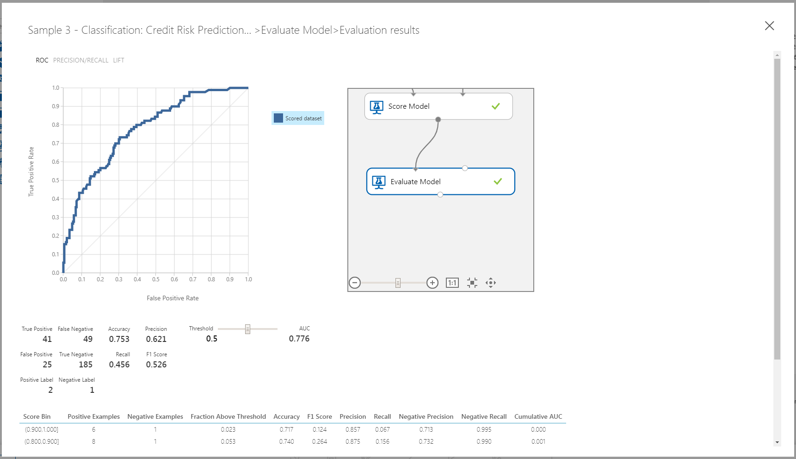

# Sample 3 - Classification: Predict credit risk

Learn how to build a machine learning classifier without writing a single line of code using the visual interface. This sample trains a **two-class boosted decision tree** to predict credit risk (high or low) based on credit application information such as credit history, age, and number of credit cards.

Because we're trying to answer the question "Which one?" this is called a classification problem. However, you can apply the same fundamental process to tackle any type of machine learning problem whether it be regression, classification, clustering, and so on.

Here's the completed graph for this experiment:

## Prerequisites

[!INCLUDE [aml-ui-prereq](../../../includes/aml-ui-prereq.md)]

4. Select the **Open** button for the Sample 3 experiment:

    

## Related sample

[Sample 4 - Classification: Credit Risk Prediction (Cost Sensitive)](ui-sample-classification-predict-credit-risk-cost-sensitive.md)
provides an advanced experiment that solves the same problem as this experiment. It shows how to perform _cost sensitive_ classification by using an **Execute Python Script** module and compare the performance of two binary classification algorithms. Refer to it if you want to learn more about how to build classification experiments.

## Data

We use the German Credit Card dataset from the UC Irvine repository.
The dataset contains 1,000 samples with 20 features and 1 label. Each sample represents a person. The features include numerical and categorical features. See the [UCI website](https://archive.ics.uci.edu/ml/datasets/Statlog+%28German+Credit+Data%29) for the meaning of the categorical features. The last column is the label, which denotes the credit risk and has only two possible values: high credit risk = 2, and low credit risk = 1.

## Experiment summary

We follow these steps to create the experiment:

1. Drag the German Credit Card UCI Data dataset module into the experiment's canvas.
1. Add an **Edit Metadata** module so we can add meaningful names for each column.
1. Add a **Split Data** module to create the training and test sets. Set the fraction of rows in the first output dataset to 0.7. This setting specifies that 70% of the data will be output to the left port of the module and the rest to the right port. We use the left dataset for training and the right one for testing.
1. Add a **Two-Class Boosted Decision Tree** module to initialize a boosted decision tree classifier.
1. Add a **Train Model** module. Connect the classifier from the previous step to the left input port of the **Train Model**. Add the training set (the left output port of the **Split Data**) to the right input port of the **Train Model**. The **Train Model** will train the classifier.
1. Add a **Score Model** module and connect the **Train Model** module to it. Then add the test set (the right port of the **Split Data**) to the **Score Model**. The **Score Model** will make the predictions. You can select its output port to see the predictions and the positive class probabilities.
1. Add an **Evaluate Model** module and connect the scored dataset to its left input port. To see the evaluation results, select the output port of the **Evaluate Model** module and select **Visualize**.

Here's the complete experiment graph:

## Results

In the evaluation results, you can see that the AUC of the model is 0.776. At threshold 0.5, the precision is 0.621, the recall is 0.456, and the F1 score is 0.526.

## Clean up resources

[!INCLUDE [aml-ui-cleanup](../../../includes/aml-ui-cleanup.md)]

## Next steps

Explore the other samples available for the visual interface:

- [Sample 1 - Regression: Predict an automobile's price](ui-sample-regression-predict-automobile-price-basic.md)
- [Sample 2 - Regression: Compare algorithms for automobile price prediction](ui-sample-regression-predict-automobile-price-compare-algorithms.md)
- [Sample 4 - Classification: Predict credit risk (cost sensitive)](ui-sample-classification-predict-credit-risk-cost-sensitive.md)
- [Sample 5 - Classification: Predict churn](ui-sample-classification-predict-churn.md)