# Tutorial: Deploy a machine learning model with the visual interface

In this tutorial, you take an extended look at developing a predictive solution in the Azure Machine Learning service visual interface. This tutorial is **part two of a two-part tutorial series**. In [part one of the tutorial](ui-tutorial-automobile-price-train-score.md), you trained, scored, and evaluated a model to predict car prices. In this part of the tutorial, you:

> [!div class="checklist"]
> * Prepare a model for deployment
> * Deploy a web service
> * Test a web service
> * Manage a web service
> * Consume the web service

## Prerequisites

Complete [part one of the tutorial](ui-tutorial-automobile-price-train-score.md).

## Prepare for deployment

To give others a chance to use the predictive model developed in this tutorial, you can deploy it as an Azure web service.

So far, you've been experimenting with training your model. Now, it's time to generate new predictions based on user input.

Preparation for deployment is a two-step process:  

1. Convert the *training experiment* that you've created into a *predictive experiment*
1. Deploy the predictive experiment as a web service

You may want to make a copy of the experiment first by selecting **Save As** at the bottom of the experiment canvas.

### Convert the training experiment to a predictive experiment

To get this model ready for deployment, convert this training experiment to a predictive experiment. This typically involves three steps:

1. Save the model you've trained and replace your training modules
1. Trim the experiment to remove modules that were only needed for training
1. Define where the web service will accept input data and where it generates the output

You could do these steps manually or you could select **Set Up Web Service** at the bottom of the experiment canvas to have them done automatically.

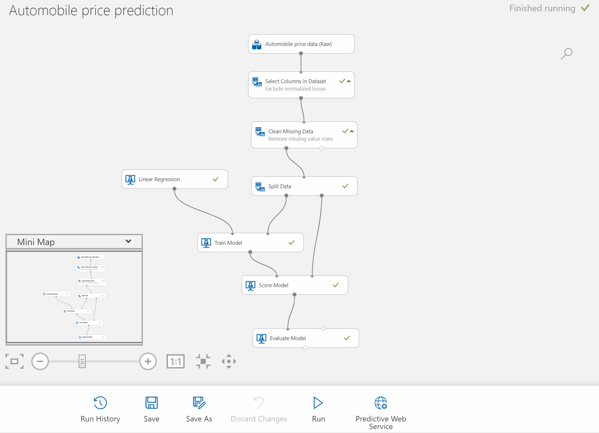

When you select **Set Up Web Service**, several things happen:

* The trained model is converted to a single **Trained Model** module. It's stored in the module palette to the left of the experiment canvas. You can find it under **Trained Models**.
* Modules that were used for training are removed; specifically:
  * Train Model
  * Split Data
  * Evaluate Model
* The saved trained model is added back into the experiment
* **Web service input** and **Web service output** modules are added. These modules identify where the user's data will enter the model, and where data is returned.

You can see that the experiment is saved in two parts under the new tabs at the top of the experiment canvas. The original training experiment is under the tab **Training experiment**, and the newly created predictive experiment is under **Predictive experiment**. The predictive experiment is the one you'll deploy as a web service.

Your experiment should now look like this:  

Run the experiment one last time (select **Run**). Choose the compute target you want the experiment to run on in the popup dialog. To verify the model is still working, select the output of the Score Model module and select **View Results**. You can see the original data is displayed, along with the predicted price ("Scored Labels").

## Deploy the web service

To deploy a New web service derived from your experiment:

1. Select **Deploy Web Service** below the canvas.
1. Select the **Compute Target** that you'd like to run your web service.

    Currently, the visual interface only supports deployment to Azure Kubernetes Service (AKS) compute targets. You can choose from available AKS compute targets in your machine learning service workspace or configure a new AKS environment using the steps in the dialogue that appears.

    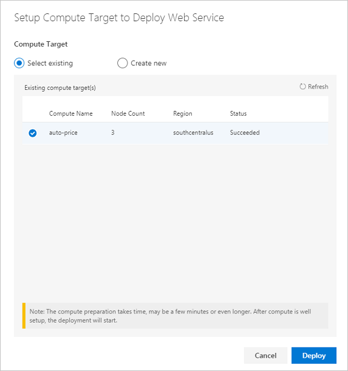

1. Select **Deploy Web Service**. You'll see the following notification when deployment completes. Deployment may take a few minutes.

    

## Test the web service

User input data enters your deployed model through the **Web service input** module. The input is then scored in the  **Score Model** module. The way you've set up the predictive experiment, the model expects data in the same format as the original automobile price dataset. Finally, the results are returned to the user through the **Web service output** module.

You can test a web service in the web service tab in the visual interface.

1. Go to the web service section. You'll see the web service you deployed with the name **Tutorial - Predict Automobile Price[Predictive Exp]**.

     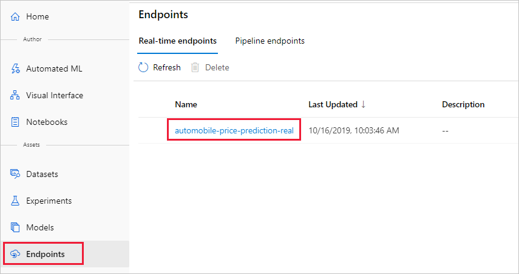

1. Select the web service name to view additional details.

     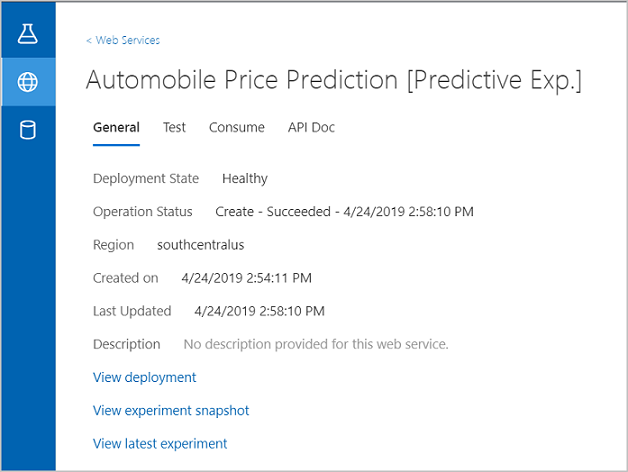

1. Select **Test**.

    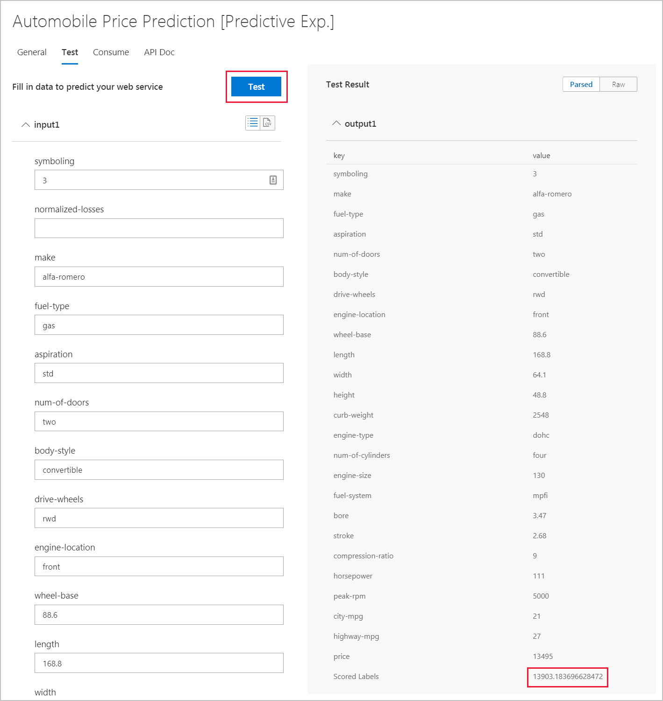

1. Input testing data or use the autofilled sample data and select **Test** at the bottom. The test request is submitted to the web service and the results are shown on page. Although a price value is generated for the input data, it is not used to generate the prediction value.

## Manage the web service

Once you've deployed your web service, you can manage it from the **Web Services** tab in the visual interface.

You can delete a web service by selecting **Delete** in the web service detail page.

   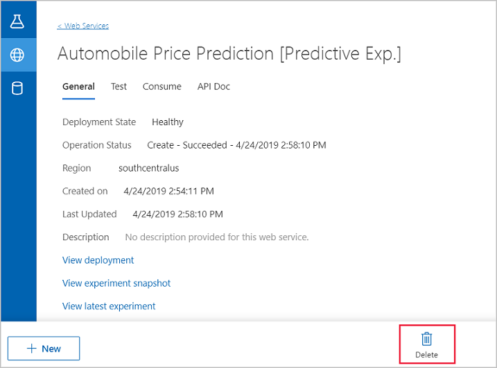

## Consume the web service

In the previous steps of this tutorial, you deployed an automobile prediction model as an Azure web service. Now users can send data to it and receive results via REST API.

**Request/Response** - The user sends one or more rows of automobile data to the service by using an HTTP protocol. The service responds with one or more sets of results.

You can find sample REST calls in the **Consume** tab of the web service details page.

   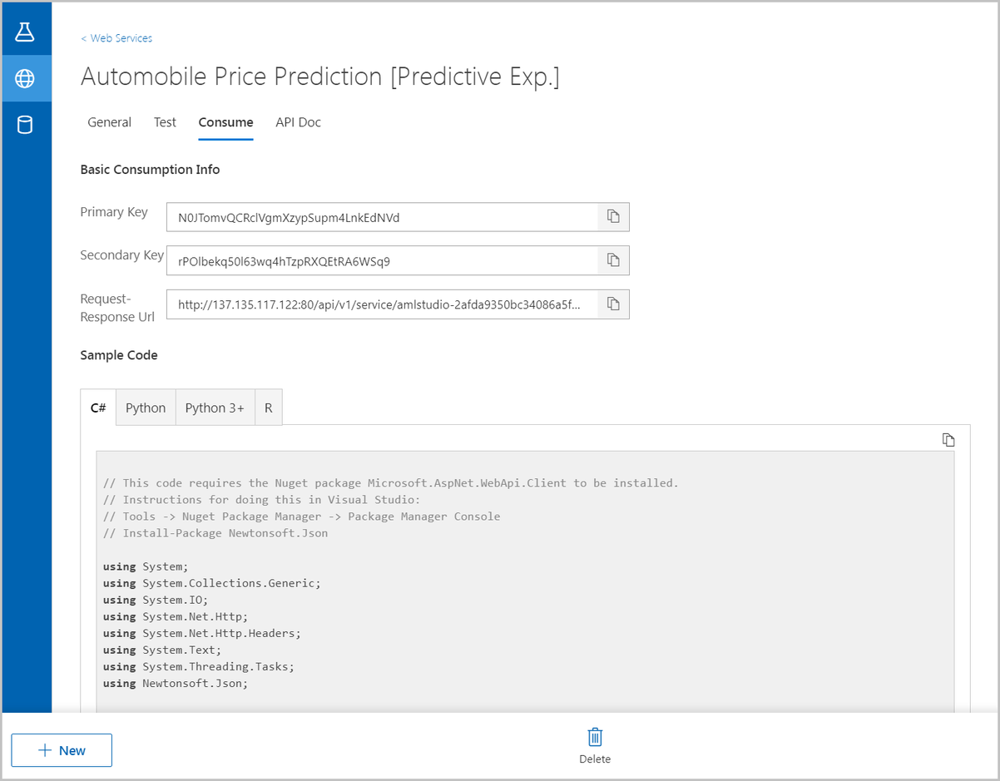

Navigate to the **API Doc** tab, to find more API details.

  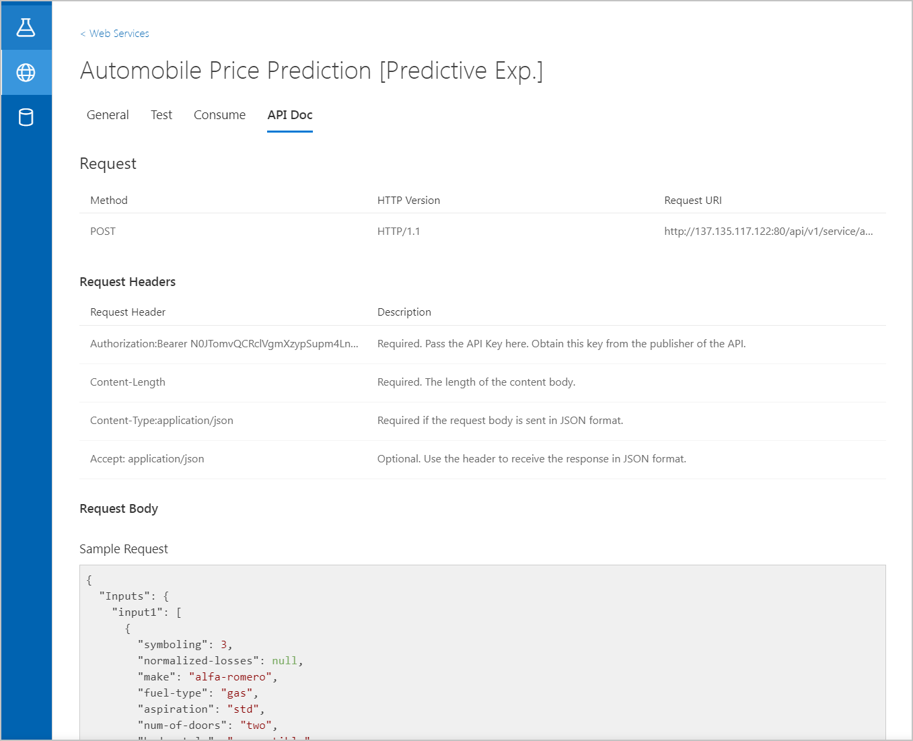

## Manage models and deployments in Azure Machine Learning service workspace

The models and web service deployments you create in the visual interface can be managed from the Azure Machine Learning service workspace.

1. Open your workspace in the [Azure portal](https://portal.azure.com/).  

1. In your workspace, select **Models**. Then select the experiment you created.

    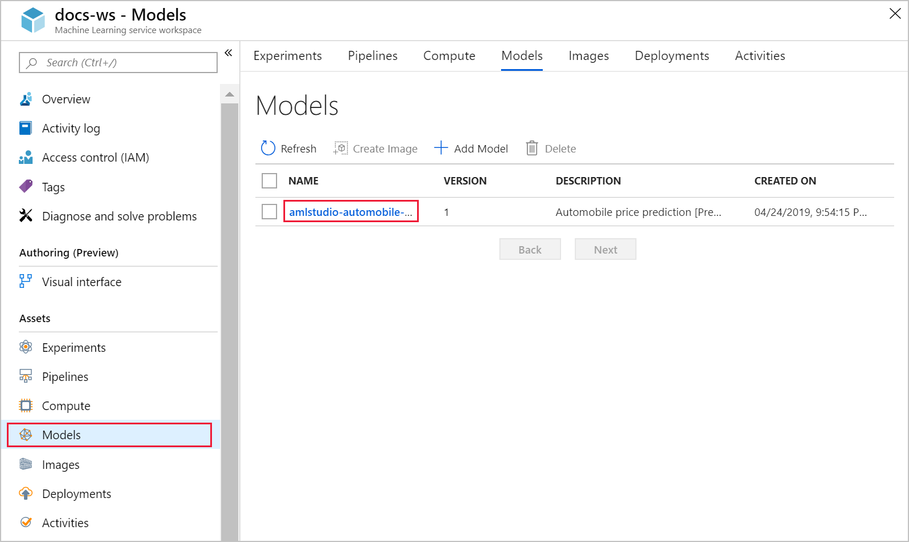

    On this page, you'll see additional details about the model.

    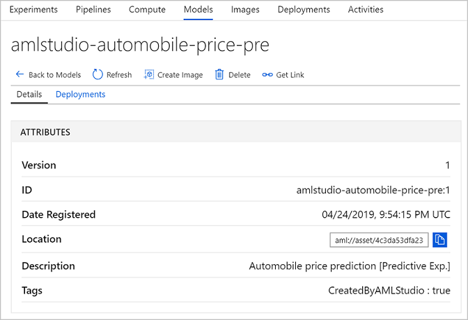

1. Select **Deployments**, it will list any web services that use the model. Select the web service name, it will go to web service detail page. In this page, you can get more detailed information of the web service.

    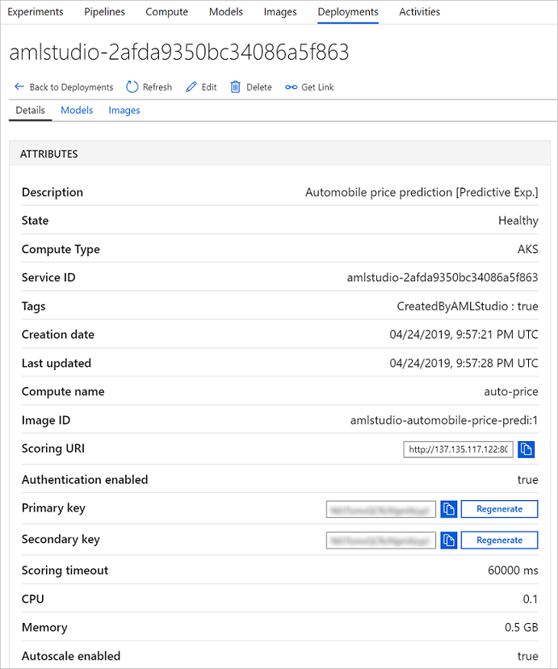

## Clean up resources

[!INCLUDE [aml-ui-cleanup](../../../includes/aml-ui-cleanup.md)]

## Next steps

In this tutorial, you learned the key steps in creating, deploying, and consuming a machine learning model in the visual interface. To learn more about how you can use the visual interface to solve other types of problems, check out the sample experiments.

> [!div class="nextstepaction"]
> [Credit risk classification sample](ui-sample-classification-predict-credit-risk-cost-sensitive.md)
