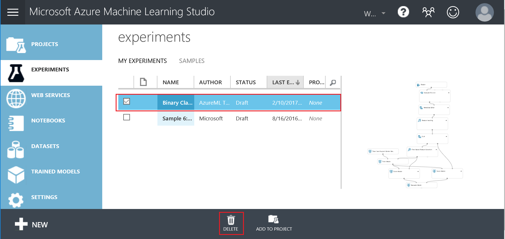
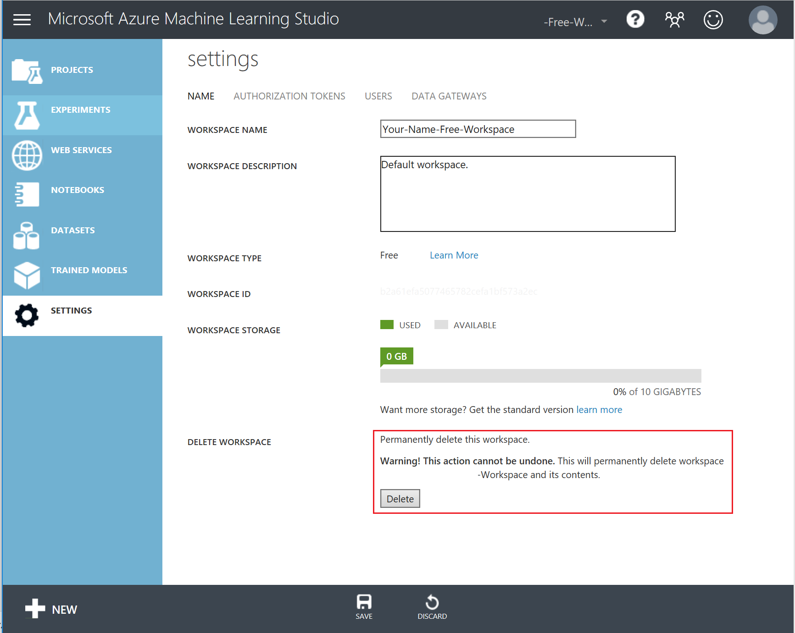

# Export and delete in-product user data from Azure Machine Learning Studio (classic)

[!INCLUDE [Notebook deprecation notice](../../../includes/aml-studio-notebook-notice.md)]

You can delete or export in-product data stored by Azure Machine Learning Studio (classic) by using the Azure portal, the Studio (classic) interface, PowerShell, and authenticated REST APIs. This article tells you how. 

Telemetry data can be accessed through the Azure Privacy portal. 

[!INCLUDE [GDPR-related guidance](../../../includes/gdpr-dsr-and-stp-note.md)]

[!INCLUDE [GDPR-related guidance](../../../includes/gdpr-intro-sentence.md)]

## What kinds of user data does Studio (classic) collect?

For this service, user data consists of information about users authorized to access workspaces and telemetry records of user interactions with the service.

There are two kinds of user data in Machine Learning Studio (classic):
- **Personal account data:** Account IDs and email addresses associated with an account.
- **Customer data:** Data you uploaded to analyze.

## Studio (classic) account types and how data is stored

There are three kinds of accounts in Machine Learning Studio (classic). The kind of account you have determines how your data is stored and how you can delete or export it.

- A **guest workspace** is a free, anonymous account. You sign up without providing credentials, such as an email address or password.
    -  Data is purged after the guest workspace expires.
    - Guest users can export customer data through the UI, REST APIs, or PowerShell package.
- A **free workspace** is a free account you sign in to with Microsoft account credentials - an email address and password.
    - You can export and delete personal and customer data, which are subject to data subject rights (DSR) requests.
    - You can export customer data through the UI, REST APIs, or PowerShell package.
    - For free workspaces not using Azure AD accounts, telemetry can be exported using the Privacy Portal.
    - When you delete the workspace, you delete all personal customer data.
- A **standard workspace** is a paid account you access with sign-in credentials.
    - You can export and delete personal and customer data, which are subject to DSR requests.
    - You can access data through the Azure Privacy portal
    - You can export personal and customer data through the UI, REST APIs, or PowerShell package
    - You can delete your data in the Azure portal.

## Delete workspace data in Studio (classic) 

### Delete individual assets

Users can delete assets in a workspace by selecting them, and then selecting the delete button.

### Delete an entire workspace

Users can also delete their entire workspace:
- Paid workspace: Delete through the Azure portal.
- Free workspace: Use the delete button in the **Settings** pane.

 
## Export Studio (classic) data with PowerShell
Use PowerShell to export all your information to a portable format from Azure Machine Learning Studio (classic) using commands. For information, see the [PowerShell module for Azure Machine Learning Studio (classic)](powershell-module.md) article.

## Next steps

For documentation covering web services and commitment plan billing, see [Azure Machine Learning Studio (classic) REST API reference](https://docs.microsoft.com/rest/api/machinelearning/). 
