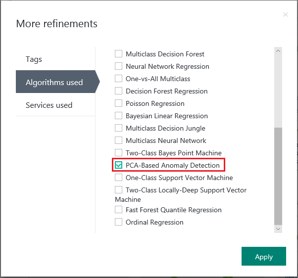
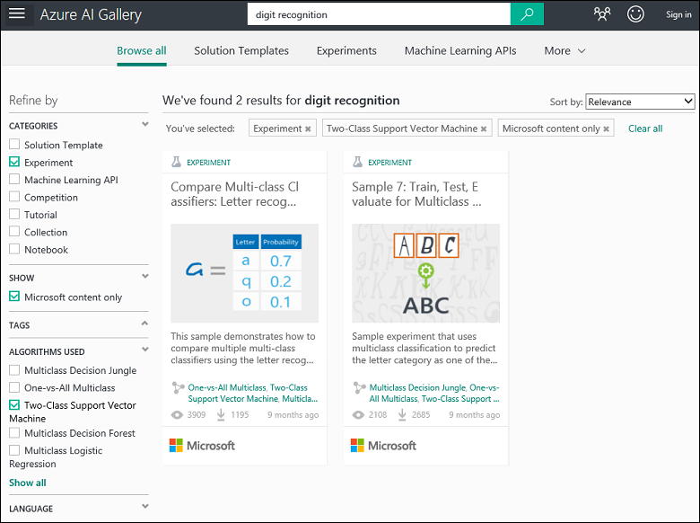

# Create Azure Machine Learning Studio (classic) experiments from working examples in Azure AI Gallery

**APPLIES TO:**  Machine Learning Studio (classic)   [Azure Machine Learning](../compare-azure-ml-to-studio-classic.md)

[!INCLUDE [Notebook deprecation notice](../../../includes/aml-studio-notebook-notice.md)]

Learn how to start with example experiments from [Azure AI Gallery](https://gallery.azure.ai/) instead of creating machine learning experiments from scratch. You can use the examples to build your own machine learning solution.

The gallery has example experiments by the Microsoft Azure Machine Learning Studio (classic) team as well as examples shared by the Machine Learning community. You also can ask questions or post comments about experiments.

To see how to use the gallery, watch the 3-minute video [Copy other people's work to do data science](data-science-for-beginners-copy-other-peoples-work-to-do-data-science.md) from the series [Data Science for Beginners](data-science-for-beginners-the-5-questions-data-science-answers.md).

## Find an experiment to copy in Azure AI Gallery
To see what experiments are available, go to the [Gallery](https://gallery.azure.ai/) and click **Experiments** at the top of the page.

### Find the newest or most popular experiments
On this page, you can see **Recently added** experiments, or scroll down to look at **What's popular** or the latest **Popular Microsoft experiments**.

### Look for an experiment that meets specific requirements
To browse all experiments:

1. Click **Browse all** at the top of the page.
2. On the left-hand side, under **Refine by** in the **Categories** section, select **Experiment** to see all the experiments in the Gallery.
3. You can find experiments that meet your requirements a couple different ways:
   * **Select filters on the left.** For example, to browse experiments that use a PCA-based anomaly detection algorithm: Under **Categories** click **Experiment**. Then, under **Algorithms Used**, click **Show all** and in the dialog box choose **PCA-Based Anomaly Detection**. You may have to scroll to see it.  
     
   * **Use the search box.** For example, to find experiments contributed by Microsoft related to digit recognition that use a two-class support vector machine algorithm, enter "digit recognition" in the search box. Then, select the filters **Experiment**, **Microsoft content only**, and **Two-Class Support Vector Machine**:  
     
4. Click an experiment to learn more about it.
5. To run and/or modify the experiment, click **Open in Studio** on the experiment's page.   

    

## Create a new experiment using an example as a template
You also can create a new experiment in Machine Learning Studio (classic) using a Gallery example as a template.

1. Sign in with your Microsoft account credentials to the [Studio](https://studio.azureml.net), and then click **New** to create an experiment.
2. Browse through the example content and click one.

A new experiment is created in your Machine Learning Studio (classic) workspace using the example experiment as a template.

## Next steps
* [Import data from various sources](import-data.md)
* [Deploy a Machine Learning web service](deploy-a-machine-learning-web-service.md)
