# Collaborative coding with Git

This article describes how to use Git as the collaborative code development framework for data science projects. The article covers how to link code in Azure Repos to [agile development](agile-development.md) work items in Azure Boards, how to do code reviews, and how to create and merge pull requests for changes.

## <a name='Linkaworkitemwithagitbranch-1'></a>Link a work item to an Azure Repos branch 

Azure DevOps provides a convenient way to connect an Azure Boards User Story or Task work item with an Azure Repos Git repository branch. You can link your User Story or Task directly to the code associated with it. 

To connect a work item to a new branch, select the **Actions** ellipsis (**...**) next to the work item, and on the context menu, scroll to and select **New branch**.  

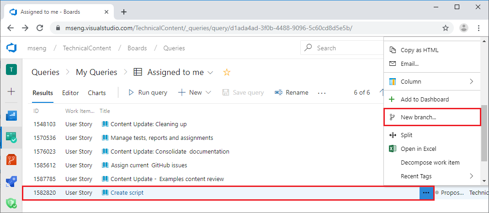

In the **Create a branch** dialog, provide the new branch name and the base Azure Repos Git repository and branch. The base repository must be in the same Azure DevOps project as the work item. The base branch can be the master branch or another existing branch. Select **Create branch**. 

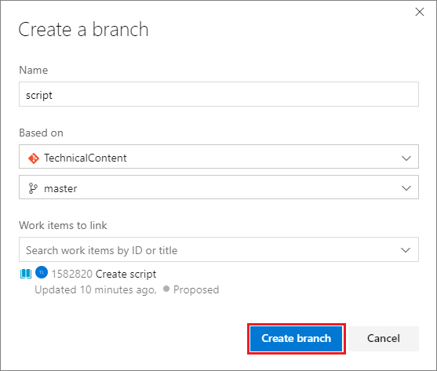

You can also create a new branch using the following Git bash command in Windows or Linux:

```bash
git checkout -b <new branch name> <base branch name>

```
If you don't specify a \<base branch name>, the new branch is based on `master`. 

To switch to your working branch, run the following command: 

```bash
git checkout <working branch name>
```

After you switch to the working branch, you can start developing code or documentation artifacts to complete the work item. Running `git checkout master` switches you back to the `master` branch.

It's a good practice to create a Git branch for each User Story work item. Then, for each Task work item, you can create a branch based on the User Story branch. Organize the branches in a hierarchy that corresponds to the User Story-Task relationship when you have multiple people working on different User Stories for the same project, or on different Tasks for the same User Story. You can minimize conflicts by having each team member work on a different branch, or on different code or other artifacts when sharing a branch. 

The following diagram shows the recommended branching strategy for TDSP. You might not need as many branches as shown here, especially when only one or two people work on a project, or only one person works on all Tasks of a User Story. But separating the development branch from the master branch is always a good practice, and can help prevent the release branch from being interrupted by development activities. For a complete description of the Git branch model, see [A Successful Git Branching Model](https://nvie.com/posts/a-successful-git-branching-model/).

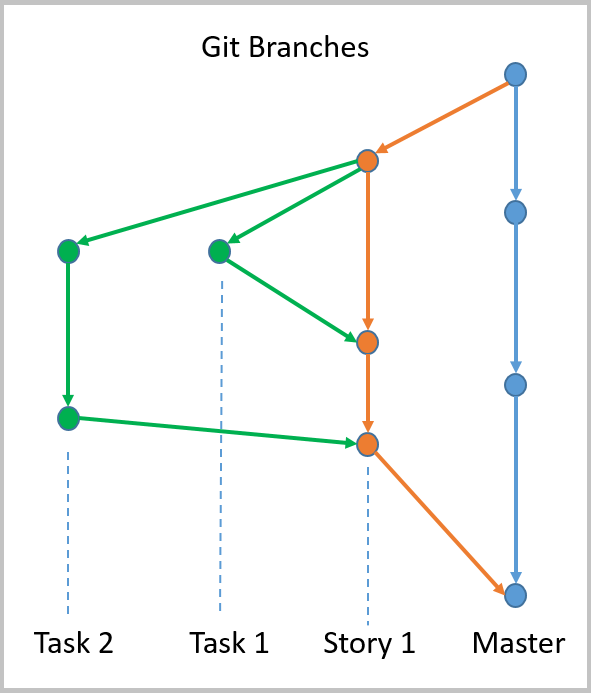

You can also link a work item to an existing branch. On the **Detail** page of a work item, select **Add link**. Then select an existing branch to link the work item to, and select **OK**. 

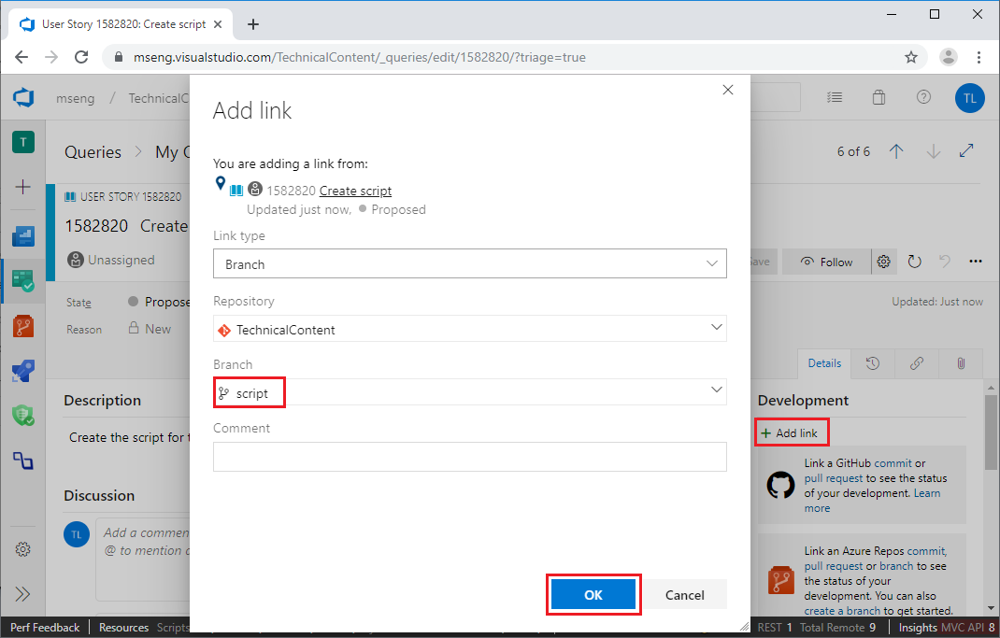

## <a name='WorkonaBranchandCommittheChanges-2'></a>Work on the branch and commit changes 

After you make a change for your work item, such as adding an R script file to your local machine's `script` branch, you can commit the change from your local branch to the upstream working branch by using the following Git bash commands:

```bash
git status
git add .
git commit -m "added an R script file"
git push origin script
```

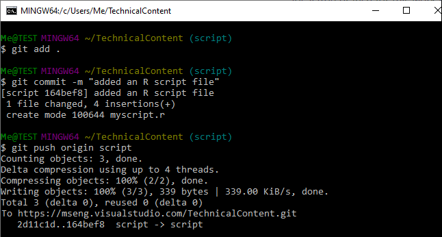

## <a name='CreateapullrequestonVSTS-3'></a>Create a pull request

After one or more commits and pushes, when you're ready to merge your current working branch into its base branch, you can create and submit a *pull request* in Azure Repos. 

From the main page of your Azure DevOps project, point to **Repos** > **Pull requests** in the left navigation. Then select either of the **New pull request** buttons, or the **Create a pull request** link.

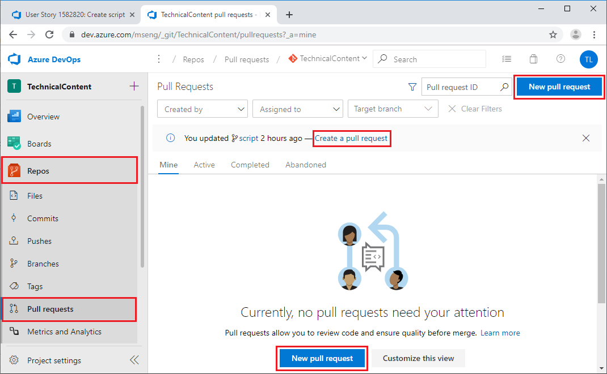

On the **New Pull Request** screen, if necessary, navigate to the Git repository and branch you want to merge your changes into. Add or change any other information you want. Under **Reviewers**, add the names of the reviewers, and then select **Create**. 

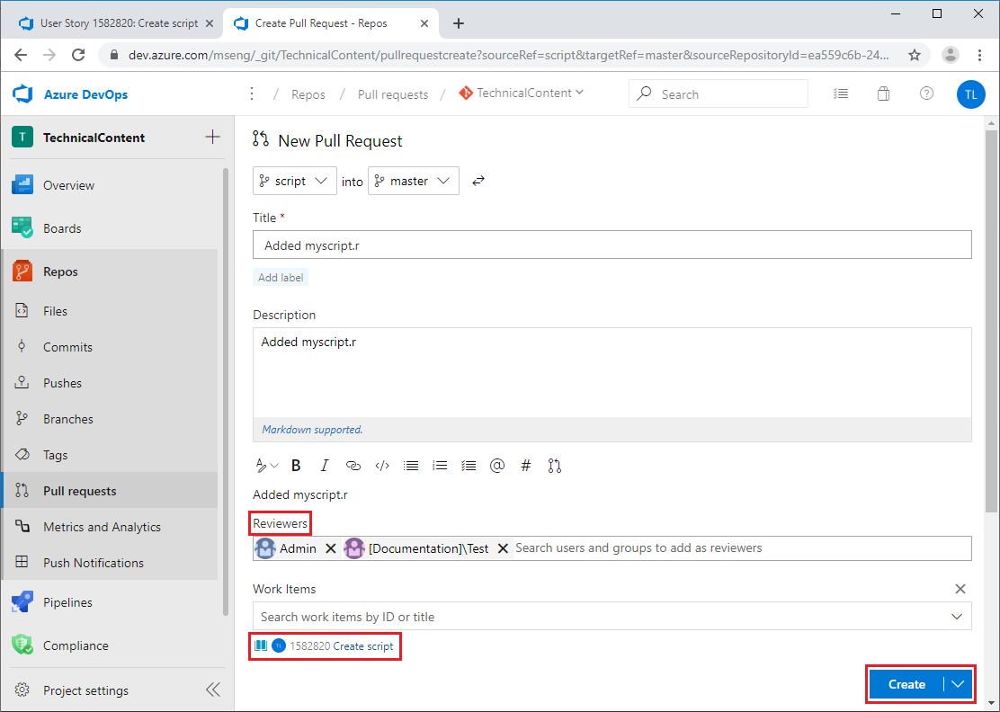

## <a name='ReviewandMerge-4'></a>Review and merge

Once you create the pull request, your reviewers get an email notification to review the pull request. The reviewers test whether the changes work, and check the changes with the requester if possible. The reviewers can make comments, request changes, and approve or reject the pull request based on their assessment. 

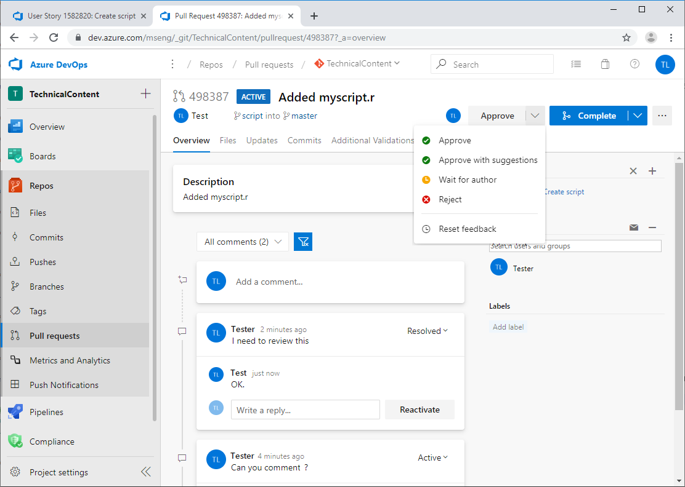

After the reviewers approve the changes, you or someone else with merge permissions can merge the working branch to its base branch. Select **Complete**, and then select **Complete merge** in the **Complete pull request** dialog. You can choose to delete the working branch after it has merged. 

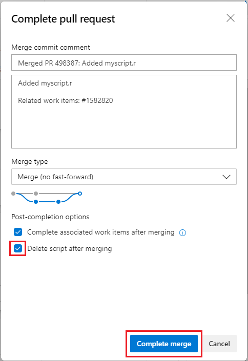

Confirm that the request is marked as **COMPLETED**. 


When you go back to **Repos** in the left navigation, you can see that you've been switched to the master branch since the `script` branch was deleted.

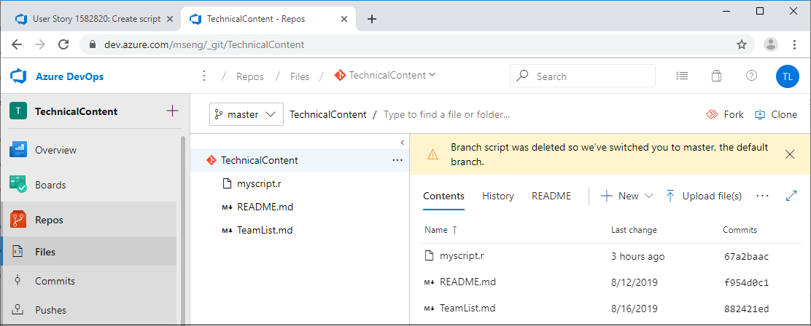

You can also use the following Git bash commands to merge the `script` working branch to its base branch and delete the working branch after merging:

```bash
git checkout master
git merge script
git branch -d script
```

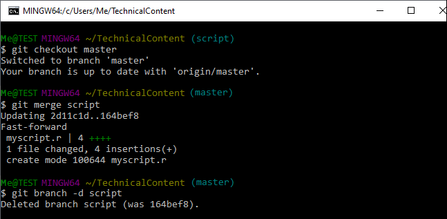

## Next steps

[Execute data science tasks](execute-data-science-tasks.md) shows how to use utilities to complete several common data science tasks, such as interactive data exploration, data analysis, reporting, and model creation.

[Example walkthroughs](walkthroughs.md) lists walkthroughs of specific scenarios, with links and thumbnail descriptions. The linked scenarios illustrate how to combine cloud and on-premises tools and services into workflows or pipelines to create intelligent applications. 

