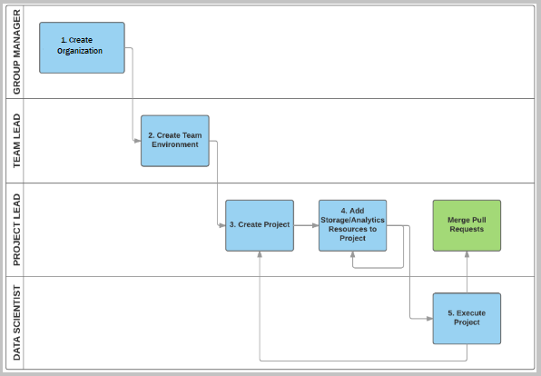
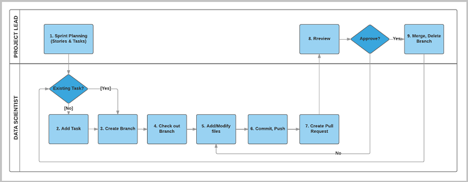

# Team Data Science Process roles and tasks

The Team Data Science Process (TDSP) is a framework developed by Microsoft that provides a structured methodology to efficiently build predictive analytics solutions and intelligent applications. This article outlines the key personnel roles and associated tasks for a data science team standardizing on this process.

This introductory article links to tutorials on how to set up the TDSP environment. The tutorials provide detailed guidance for using Azure DevOps Projects, Azure Repos repositories, and Azure Boards.  The motivating goal is moving from concept through modeling and into deployment.

The tutorials use Azure DevOps because that is how to implement TDSP at Microsoft. Azure DevOps facilitates collaboration by integrating role-based security, work item management and tracking, and code hosting, sharing, and source control. The tutorials also use an Azure [Data Science Virtual Machine](https://aka.ms/dsvm) (DSVM) as the analytics desktop, which has several popular data science tools pre-configured and integrated with Microsoft software and Azure services. 

You can use the tutorials to implement TDSP using other code-hosting, agile planning, and development tools and environments, but some features may not be available.

## Structure of data science groups and teams

Data science functions in enterprises are often organized in the following hierarchy:

- Data science group
  - Data science team/s within the group

In such a structure, there are group leads and team leads. Typically, a data science project is done by a data science team. Data science teams have project leads for project management and governance tasks, and individual data scientists and engineers to perform the data science and data engineering parts of the project. The initial project setup and governance is done by the group, team, or project leads.

## Definition and tasks for the four TDSP roles
With the assumption that the data science unit consists of teams within a group, there are four distinct roles for TDSP personnel:

1. **Group Manager**: Manages the entire data science unit in an enterprise. A data science unit might have multiple teams, each of which is working on multiple data science projects in distinct business verticals. A Group Manager might delegate their tasks to a surrogate, but the tasks associated with the role do not change.
   
2. **Team Lead**: Manages a team in the data science unit of an enterprise. A team consists of multiple data scientists. For a small data science unit, the Group Manager and the Team Lead might be the same person.
   
3. **Project Lead**: Manages the daily activities of individual data scientists on a specific data science project.
   
4. **Project Individual Contributors**: Data Scientists, Business Analysts, Data Engineers, Architects, and others who execute a data science project.

> [!NOTE]
> Depending on the structure and size of an enterprise, a single person may play more than one role, or more than one person may fill a role.

### Tasks to be completed by the four roles

The following diagram shows the top-level tasks for each Team Data Science Process role. This schema and the following, more detailed outline of tasks for each TDSP role can help you choose the tutorial you need based on your responsibilities.

## Group Manager tasks

The Group Manager or a designated TDSP system administrator completes the following tasks to adopt the TDSP:

- Creates an Azure DevOps **organization** and a group project within the organization. 
- Creates a **project template repository** in the Azure DevOps group project, and seeds it from the project template repository developed by the Microsoft TDSP team. The Microsoft TDSP project template repository provides:
  - A **standardized directory structure**, including directories for data, code, and documents.
  - A set of **standardized document templates** to guide an efficient data science process.
- Creates a **utility repository**, and seeds it from the utility repository developed by the Microsoft TDSP team. The TDSP utility repository from Microsoft provides a set of useful utilities to make the work of a data scientist more efficient. The Microsoft utility repository includes utilities for interactive data exploration, analysis, reporting, and baseline modeling and reporting.
- Sets up the **security control policy** for the organization account.

For detailed instructions, see [Group Manager tasks for a data science team](group-manager-tasks.md).

## Team Lead tasks

The Team Lead or a designated project administrator completes the following tasks to adopt the TDSP:

- Creates a team **project** in the group's Azure DevOps organization.
- Creates the **project template repository** in the project, and seeds it from the group project template repository set up by the Group Manager or delegate.
- Creates the **team utility repository**, seeds it from the group utility repository, and adds team-specific utilities to the repository.
- Optionally creates [Azure file storage](https://azure.microsoft.com/services/storage/files/) to store useful data assets for the team. Other team members can mount this shared cloud file store on their analytics desktops.
- Optionally mounts the Azure file storage on the team's **DSVM** and adds team data assets to it.
- Sets up **security control** by adding team members and configuring their permissions.

For detailed instructions, see [Team Lead tasks for a data science team](team-lead-tasks.md).

## Project Lead tasks

The Project Lead completes the following tasks to adopt the TDSP:

- Creates a **project repository** in the team project, and seeds it from the project template repository.
- Optionally creates **Azure file storage** to store the project's data assets.
- Optionally mounts the Azure file storage to the **DSVM** and adds project data assets to it.
- Sets up **security control** by adding project members and configuring their permissions.

For detailed instructions, see [Project Lead tasks for a data science team](project-lead-tasks.md).

## Project Individual Contributor tasks

The Project Individual Contributor, usually a Data Scientist, conducts the following tasks using the TDSP:

- Clones the **project repository** set up by the project lead.
- Optionally mounts the shared team and project **Azure file storage** on their **Data Science Virtual Machine** (DSVM).
- Executes the project.

For detailed instructions for onboarding onto a project, see [Project Individual Contributor tasks for a data science team](project-ic-tasks.md).

## Data science project execution workflow

By following the relevant tutorials, data scientists, project leads, and team leads can create work items to track all tasks and stages for project from beginning to end. Using Azure Repos promotes collaboration among data scientists and ensures that the artifacts generated during project execution are version controlled and shared by all project members. Azure DevOps lets you link your Azure Boards work items with your Azure Repos repository branches and easily track what has been done for a work item.

The following figure outlines the TDSP workflow for project execution:

The workflow steps can be grouped into three activities:

- Project Leads conduct sprint planning
- Data Scientists develop artifacts on `git` branches to address work items
- Project Leads or other team members do code reviews and merge working branches to the master branch

For detailed instructions on project execution workflow, see [Agile development of data science projects](agile-development.md).

## TDSP project template repository

Use the Microsoft TDSP team's [project template repository](https://github.com/Azure/Azure-TDSP-ProjectTemplate) to support efficient project execution and collaboration. The repository gives you a standardized directory structure and document templates you can use for your own TDSP projects.

## Next steps

Explore more detailed descriptions of the roles and tasks defined by the Team Data Science Process:

- [Group Manager tasks for a data science team](group-manager-tasks.md)
- [Team Lead tasks for a data science team](team-lead-tasks.md)
- [Project Lead tasks for a data science team](project-lead-tasks.md)
- [Project Individual Contributor tasks for a data science team](project-ic-tasks.md)
