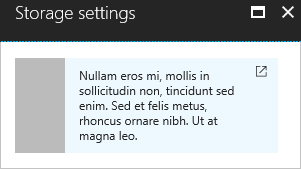

# Microsoft.Common.InfoBox UI element
A control that adds an information box. The box contains important text or warnings that help users understand the values they're providing. It can also link to a URI for more information.

## UI sample



## Schema
```json
{
  "name": "text1",
  "type": "Microsoft.Common.InfoBox",
  "visible": true,
  "options": {
    "icon": "None",
    "text": "Nullam eros mi, mollis in sollicitudin non, tincidunt sed enim. Sed et felis metus, rhoncus ornare nibh. Ut at magna leo.",
    "uri": "https://www.microsoft.com"
  }
}
```

## Remarks

* For `icon`, use **None**, **Info**, **Warning**, or **Error**.
* The `uri` property is optional.

## Sample output

```json
"Nullam eros mi, mollis in sollicitudin non, tincidunt sed enim. Sed et felis metus, rhoncus ornare nibh. Ut at magna leo."
```

## Next steps
* For an introduction to creating UI definitions, see [Getting started with CreateUiDefinition](create-uidefinition-overview.md).
* For a description of common properties in UI elements, see [CreateUiDefinition elements](create-uidefinition-elements.md).
