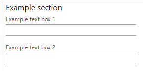

# Microsoft.Common.Section UI element

A control that groups one or more elements under a heading.

## UI sample



## Schema

```json
{
  "name": "section1",
  "type": "Microsoft.Common.Section",
  "label": "Example section",
  "elements": [
    {
      "name": "text1",
      "type": "Microsoft.Common.TextBox",
      "label": "Example text box 1"
    },
    {
      "name": "text2",
      "type": "Microsoft.Common.TextBox",
      "label": "Example text box 2"
    }
  ],
  "visible": true
}
```

## Remarks

- `elements` must have at least one element, and can have all element types except `Microsoft.Common.Section`.
- This element doesn't support the `toolTip` property.

## Sample output
To access the output values of elements in `elements`, use the [basics()](create-uidefinition-functions.md#basics) or [steps()](create-uidefinition-functions.md#steps) functions and dot notation:

```json
steps('configuration').section1.text1
```

Elements of type `Microsoft.Common.Section` have no output values themselves.

## Next steps

* For an introduction to creating UI definitions, see [Getting started with CreateUiDefinition](create-uidefinition-overview.md).
* For a description of common properties in UI elements, see [CreateUiDefinition elements](create-uidefinition-elements.md).
