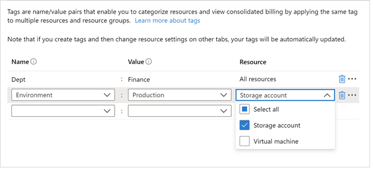

# Microsoft.Common.TagsByResource UI element

A control for associating [tags](../azure-resource-manager/resource-group-using-tags.md) with the resources in a deployment.

## UI sample



## Schema

```json
{
  "name": "element1",
  "type": "Microsoft.Common.TagsByResource",
  "resources": [
    "Microsoft.Storage/storageAccounts",
    "Microsoft.Compute/virtualMachines"
  ]
}
```

## Sample output

```json
{
  "Microsoft.Storage/storageAccounts": {
    "Dept": "Finance",
    "Environment": "Production"
  },
  "Microsoft.Compute/virtualMachines": {
    "Dept": "Finance"
  }
}
```

## Remarks

- At least one item in the `resources` array must be specified.
- Each element in `resources` must be a fully qualified resource type. These elements appear in the **Resource** dropdown, and are taggable by the user.
- The output of the control is formatted for easy assignment of tag values in an Azure Resource Manager template. To receive the control's output in a template, include a parameter in your template as shown in the following example:

  ```json
  "parameters": {
    "tagsByResource": { "type": "object", "defaultValue": {} }
  }
  ```

  For each resource that can be tagged, assign the tags property to the parameter value for that resource type:

  ```json
  {
    "name": "saName1",
    "type": "Microsoft.Storage/storageAccounts",
    "tags": "[ if(contains(parameters('tagsByResource'), 'Microsoft.Storage/storageAccounts'), parameters('tagsByResource')['Microsoft.Storage/storageAccounts'], json('{}')) ]",
    ...
  ```

- Use the [if](../azure-resource-manager/templates/template-functions-logical.md#if) function when accessing the tagsByResource parameter. It enables you to assign an empty object when no tags are assigned to the given resource type.

## Next steps

- For an introduction to creating UI definitions, see [Getting started with CreateUiDefinition](create-uidefinition-overview.md).
- For a description of common properties in UI elements, see [CreateUiDefinition elements](create-uidefinition-elements.md).
