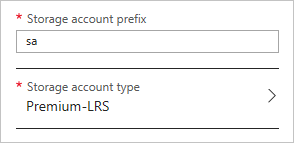

# Microsoft.Storage.MultiStorageAccountCombo UI element
A group of controls for creating several storage accounts with names that start with a common prefix.

## UI sample


## Schema
```json
{
  "name": "element1",
  "type": "Microsoft.Storage.MultiStorageAccountCombo",
  "label": {
    "prefix": "Storage account prefix",
    "type": "Storage account type"
  },
  "toolTip": {
    "prefix": "",
    "type": ""
  },
  "defaultValue": {
    "prefix": "sa",
    "type": "Premium_LRS"
  },
  "constraints": {
    "allowedTypes": [],
    "excludedTypes": []
  },
  "count": 2,
  "visible": true
}
```

## Remarks
- The value for `defaultValue.prefix` is concatenated with one or more integers to generate the sequence of storage account names. For example, if `defaultValue.prefix` is **sa** and `count` is **2**, then storage account names **sa1** and **sa2** are generated. Generated storage account names are validated for uniqueness automatically.
- The storage account names are generated lexicographically based on `count`. For example, if `count` is 10, then the storage account names end with two-digit integers (01, 02, 03).
- The default value for `defaultValue.prefix` is **null**, and for `defaultValue.type` is **Premium_LRS**.
- Any type not specified in `constraints.allowedTypes` is hidden, and any type not specified in `constraints.excludedTypes` is shown. `constraints.allowedTypes` and `constraints.excludedTypes` are both optional, but can't be used simultaneously.
- In addition to generating storage account names, `count` is used to set the appropriate multiplier for the element. It supports a static value, like **2**, or a dynamic value from another element, like `[steps('step1').storageAccountCount]`. The default value is **1**.

## Sample output

```json
{
  "prefix": "sa",
  "count": 2,
  "resourceGroup": "rg01",
  "type": "Premium_LRS"
}
```

## Next steps
* For an introduction to creating UI definitions, see [Getting started with CreateUiDefinition](create-uidefinition-overview.md).
* For a description of common properties in UI elements, see [CreateUiDefinition elements](create-uidefinition-elements.md).
