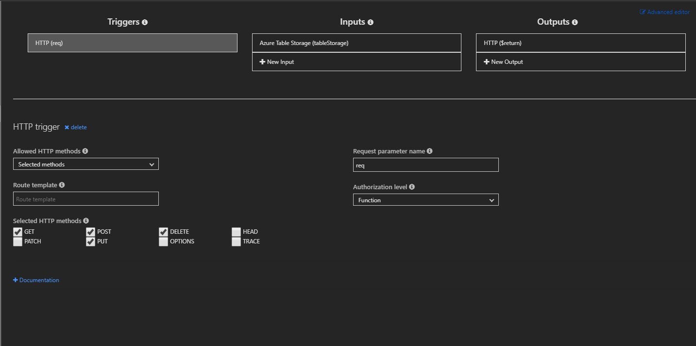

# Setup Azure Functions for Azure Custom Providers

Custom providers allow you to customize workflows on Azure. A custom provider is a contract between Azure and an `endpoint`. This tutorial will go through the process of setting up an Azure Function to work as a custom provider `endpoint`.

This tutorial is broken into the following steps:

- Creating the Azure Function
- Install Azure Table bindings
- Update RESTful HTTP methods
- Add Azure Resource Manager NuGet packages

This tutorial will build on the following tutorials:

- [Creating your first Azure Function through the Azure portal](../azure-functions/functions-create-first-azure-function.md)

## Creating the Azure Function

> [!NOTE]
> In this tutorial, we will be creating a simple service endpoint using an Azure Function, but a custom provider can use any public accessible `endpoint`. Azure Logic Apps, Azure API Management, and Azure Web Apps are some great alternatives.

To start this tutorial, you should follow the tutorial, [creating your first Azure Function in the Azure portal](../azure-functions/functions-create-first-azure-function.md). The tutorial will create a .NET core webhook function that can be modified in the Azure portal.

## Install Azure Table bindings

This section will go through quick steps for installing the Azure Table storage bindings.

1. Navigate to the `Integrate` tab for the HttpTrigger.
2. Click on the `+ New Input`.
3. Select `Azure Table Storage`.
4. Install the `Microsoft.Azure.WebJobs.Extensions.Storage` if it is not already installed.
5. Update the `Table parameter name` to "tableStorage" and the `Table name` to "myCustomResources".
6. Save the updated input parameter.


## Update RESTful HTTP methods

This section will go through quick steps for setting up the Azure Function to include the custom provider RESTful request methods.

1. Navigate to the `Integrate` tab for the HttpTrigger.
2. Update the `Selected HTTP methods` to: GET, POST, DELETE, and PUT.



## Modifying the csproj

> [!NOTE]
> If the csproj is missing from the directory, it can be added manually or it will appear once the `Microsoft.Azure.WebJobs.Extensions.Storage` extension is installed on the function.

Next, we will update the csproj file to include helpful NuGet libraries that will make it easier to parse incoming requests from custom providers. Follow the steps at [add extensions from the portal](../azure-functions/install-update-binding-extensions-manual.md) and update the csproj to include the following package references:

```xml
<PackageReference Include="Microsoft.Azure.WebJobs.Extensions.Storage" Version="3.0.4" />
<PackageReference Include="Microsoft.Azure.Management.ResourceManager.Fluent" Version="1.22.2" />
<PackageReference Include="Microsoft.Azure.WebJobs.Script.ExtensionsMetadataGenerator" Version="1.1.*" />
```

Sample csproj file:

```xml
<Project Sdk="Microsoft.NET.Sdk">
  <PropertyGroup>
    <TargetFramework>netstandard2.0</TargetFramework>
    <WarningsAsErrors />
  </PropertyGroup>
  <ItemGroup>
    <PackageReference Include="Microsoft.Azure.WebJobs.Extensions.Storage" Version="3.0.4" />
    <PackageReference Include="Microsoft.Azure.Management.ResourceManager.Fluent" Version="1.22.2" />
    <PackageReference Include="Microsoft.Azure.WebJobs.Script.ExtensionsMetadataGenerator" Version="1.1.*" />
  </ItemGroup>
</Project>
```

## Next steps

In this article, we setup an Azure Function to work as a Azure Custom Provider `endpoint`. Go to the next article to learn how to author a RESTful custom provider `endpoint`.

- [Tutorial: Authoring a RESTful custom provider endpoint](./tutorial-custom-providers-function-authoring.md)
