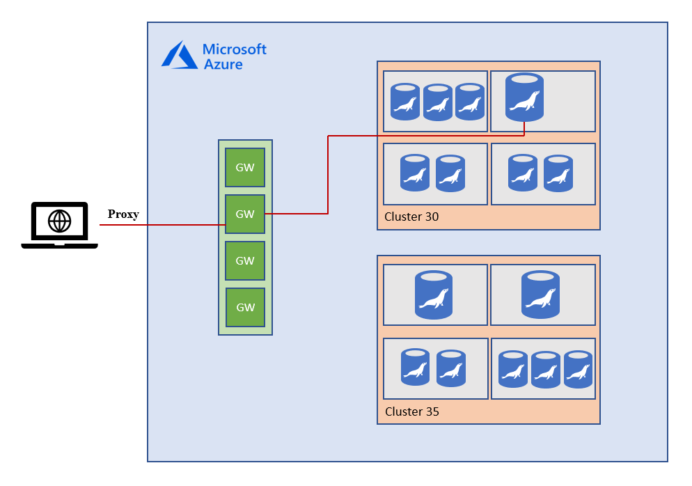

# Connectivity architecture in Azure Database for MariaDB
This article explains the Azure Database for MariaDB connectivity architecture as well as how the traffic is directed to your Azure Database for MariaDB instance from clients both within and outside Azure.

## Connectivity architecture

Connection to your Azure Database for MariaDB is established through a gateway that is responsible for routing incoming connections to the physical location of your server in our clusters. The following diagram illustrates the traffic flow.

As client connect to the database, they get a connection string which connects to the gateway. This gateway has a public IP address that listens to port 3306. Inside the database cluster, traffic is forwarded to appropriate Azure Database for MariaDB. Therefore, in order to connect to your server, such as from corporate networks, it is necessary to open up the client side firewall to allow outbound traffic to be able to reach our gateways. Below you can find a complete list of the IP addresses used by our gateways per region.

## Azure Database for MariaDB gateway IP addresses

The following table lists the primary and secondary IPs of the Azure Database for MariaDB gateway for all data regions. The primary IP address is the current IP address of the gateway and the second IP address is a failover IP address in case of failure of the primary. As mentioned, customers should allow outbound to both the IP addresses. The second IP address does not listen in on any services until it is activated by Azure Database for MariaDB to accept connections.

| **Region Name** | **Gateway IP Addresses** |
|:----------------|:-------------|
| Australia Central| 20.36.105.0	 |
| Australia Central2	 | 20.36.113.0	 |
| Australia East | 13.75.149.87, 40.79.161.1	 |
| Australia South East |191.239.192.109, 13.73.109.251	 |
| Brazil South | 104.41.11.5, 191.233.201.8, 191.233.200.16	 |
| Canada Central |40.85.224.249	 |
| Canada East | 40.86.226.166	 |
| Central US | 23.99.160.139, 13.67.215.62, 52.182.136.37, 52.182.136.38 	 |
| China East | 139.219.130.35	 |
| China East 2 | 40.73.82.1	 |
| China North | 139.219.15.17	 |
| China North 2 | 40.73.50.0	 |
| East Asia | 191.234.2.139, 52.175.33.150, 13.75.33.20, 13.75.33.21	 |
| East US | 40.121.158.30, 191.238.6.43, 40.71.8.203, 40.71.83.113	 |
| East US 2 |40.79.84.180, 191.239.224.107, 52.177.185.181, 40.70.144.38, 52.167.105.38  |
| France Central | 40.79.137.0, 40.79.129.1	 |
| France South | 40.79.177.0	 |
| Germany Central | 51.4.144.100	 |
| Germany North East | 51.5.144.179	 |
| India Central | 104.211.96.159	 |
| India South | 104.211.224.146	 |
| India West | 104.211.160.80	 |
| Japan East | 13.78.61.196, 191.237.240.43	 |
| Japan West | 104.214.148.156, 191.238.68.11, 40.74.96.6, 40.74.96.7	 |
| Korea Central | 52.231.32.42	 |
| Korea South | 52.231.200.86	 |
| North Central US | 23.96.178.199, 23.98.55.75, 52.162.104.35, 52.162.104.36	 |
| North Europe | 40.113.93.91, 191.235.193.75, 52.138.224.6, 52.138.224.7	 |
| South Africa North  | 102.133.152.0	 |
| South Africa West	| 102.133.24.0	 |
| South Central US |13.66.62.124, 23.98.162.75, 104.214.16.39, 20.45.120.0	 |
| South East Asia | 104.43.15.0, 23.100.117.95, 40.78.233.2, 23.98.80.12	 |
| UAE Central | 20.37.72.64	 |
| UAE North | 65.52.248.0	 |
| UK South | 51.140.184.11	 |
| UK West | 51.141.8.11	 |
| West Central US | 13.78.145.25	 |
| West Europe | 40.68.37.158, 191.237.232.75, 13.69.105.208, 104.40.169.187	 |
| West US | 104.42.238.205, 23.99.34.75, 13.86.216.212, 13.86.217.212 |
| West US 2 | 13.66.226.202	 |
||||

## Connection redirection

Azure Database for MariaDB supports an additional connection policy, **redirection**, that helps to reduce network latency between client applications and MariaDB servers. With this feature, after the initial TCP session is established to the Azure Database for MariaDB server, the server returns the backend address of the node hosting the MariaDB server to the client. Thereafter, all subsequent packets flow directly to the server, bypassing the gateway. As packets flow directly to the server, latency and throughput have improved performance.

This feature is supported in Azure Database for MariaDB servers with engine versions 10.2 and 10.3.

Support for redirection is available in the PHP [mysqlnd_azure](https://github.com/microsoft/mysqlnd_azure) extension, developed by Microsoft, and is available on [PECL](https://pecl.php.net/package/mysqlnd_azure). See the [configuring redirection](./howto-redirection.md) article for more information on how to use redirection in your applications.

> [!IMPORTANT]
> Support for redirection in the PHP [mysqlnd_azure](https://github.com/microsoft/mysqlnd_azure) extension is currently in preview.

## Next steps

* [Create and manage Azure Database for MariaDB firewall rules using the Azure portal](./howto-manage-firewall-portal.md)
* [Create and manage Azure Database for MariaDB firewall rules using Azure CLI](./howto-manage-firewall-cli.md)