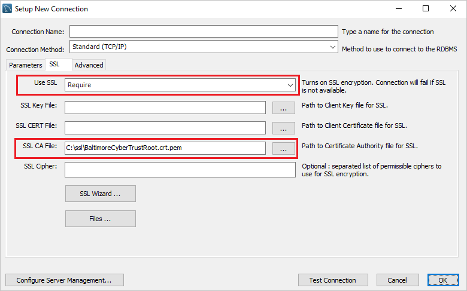
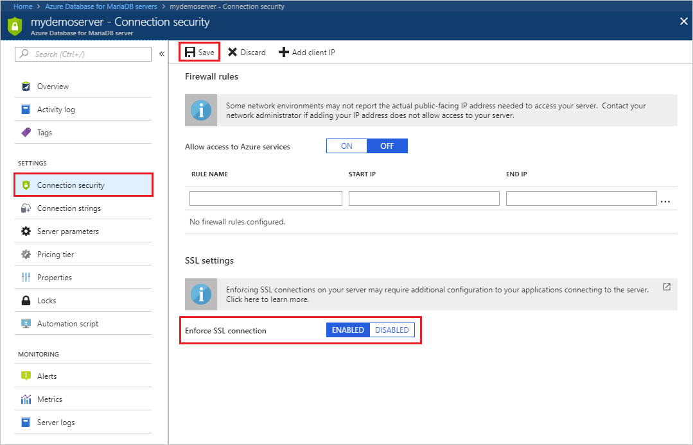

# Configure SSL connectivity in your application to securely connect to Azure Database for MariaDB
Azure Database for MariaDB supports connecting your Azure Database for MariaDB server to client applications using Secure Sockets Layer (SSL). Enforcing SSL connections between your database server and your client applications helps protect against "man in the middle" attacks by encrypting the data stream between the server and your application.

## Obtain SSL certificate
Download the certificate needed to communicate over SSL with your Azure Database for MariaDB server from [https://www.digicert.com/CACerts/BaltimoreCyberTrustRoot.crt.pem](https://www.digicert.com/CACerts/BaltimoreCyberTrustRoot.crt.pem) and save the certificate file to your local drive (this tutorial uses c:\ssl for example).
**For Microsoft Internet Explorer and Microsoft Edge:** After the download has completed, rename the certificate to BaltimoreCyberTrustRoot.crt.pem.

## Bind SSL

### Connecting to server using MySQL Workbench over SSL
Configure MySQL Workbench to connect securely over SSL. 

1. From the Setup New Connection dialogue, navigate to the **SSL** tab. 

1. Update the **Use SSL** field to "Require".

1. In the **SSL CA File:** field, enter the file location of the **BaltimoreCyberTrustRoot.crt.pem**. 
    
    

For existing connections, you can bind SSL by right-clicking on the connection icon and choose edit. Then navigate to the **SSL** tab and bind the cert file.

### Connecting to server using the MySQL CLI over SSL
Another way to bind the SSL certificate is to use the MySQL command-line interface by executing the following commands. 

```bash
mysql.exe -h mydemoserver.mariadb.database.azure.com -u Username@mydemoserver -p --ssl-mode=REQUIRED --ssl-ca=c:\ssl\BaltimoreCyberTrustRoot.crt.pem
```

> [!NOTE]
> When using the MySQL command-line interface on Windows, you may receive an error `SSL connection error: Certificate signature check failed`. If this occurs, replace the `--ssl-mode=REQUIRED --ssl-ca={filepath}` parameters with `--ssl`.

## Enforcing SSL connections in Azure 
### Using the Azure portal
Using the Azure portal, visit your Azure Database for MariaDB server, and then click **Connection security**. Use the toggle button to enable or disable the **Enforce SSL connection** setting, and then click **Save**. Microsoft recommends to always enable the **Enforce SSL connection** setting for enhanced security.


### Using Azure CLI
You can enable or disable the **ssl-enforcement** parameter by using Enabled or Disabled values respectively in Azure CLI.
```azurecli-interactive
az mariadb server update --resource-group myresource --name mydemoserver --ssl-enforcement Enabled
```

## Verify the SSL connection
Execute the mysql **status** command to verify that you have connected to your MariaDB server using SSL:
```sql
status
```
Confirm the connection is encrypted by reviewing the output, which should show:  **SSL: Cipher in use is AES256-SHA** 

## Sample code
To establish a secure connection to Azure Database for MariaDB over SSL from your application, refer to the following code samples:

### PHP
```php
$conn = mysqli_init();
mysqli_ssl_set($conn,NULL,NULL, "/var/www/html/BaltimoreCyberTrustRoot.crt.pem", NULL, NULL) ; 
mysqli_real_connect($conn, 'mydemoserver.mariadb.database.azure.com', 'myadmin@mydemoserver', 'yourpassword', 'quickstartdb', 3306, MYSQLI_CLIENT_SSL, MYSQLI_CLIENT_SSL_DONT_VERIFY_SERVER_CERT);
if (mysqli_connect_errno($conn)) {
die('Failed to connect to MySQL: '.mysqli_connect_error());
}
```
### Python (MySQLConnector Python)
```python
try:
    conn = mysql.connector.connect(user='myadmin@mydemoserver',
                                   password='yourpassword',
                                   database='quickstartdb',
                                   host='mydemoserver.mariadb.database.azure.com',
                                   ssl_ca='/var/www/html/BaltimoreCyberTrustRoot.crt.pem')
except mysql.connector.Error as err:
    print(err)
```
### Python (PyMySQL)
```python
conn = pymysql.connect(user='myadmin@mydemoserver',
                       password='yourpassword',
                       database='quickstartdb',
                       host='mydemoserver.mariadb.database.azure.com',
                       ssl={'ssl': {'ca': '/var/www/html/BaltimoreCyberTrustRoot.crt.pem'}})
```
### Ruby
```ruby
client = Mysql2::Client.new(
        :host     => 'mydemoserver.mariadb.database.azure.com', 
        :username => 'myadmin@mydemoserver',      
        :password => 'yourpassword',    
        :database => 'quickstartdb',
        :ssl_ca => '/var/www/html/BaltimoreCyberTrustRoot.crt.pem'
    )
```
### Golang
```go
rootCertPool := x509.NewCertPool()
pem, _ := ioutil.ReadFile("/var/www/html/BaltimoreCyberTrustRoot.crt.pem")
if ok := rootCertPool.AppendCertsFromPEM(pem); !ok {
    log.Fatal("Failed to append PEM.")
}
mysql.RegisterTLSConfig("custom", &tls.Config{RootCAs: rootCertPool})
var connectionString string
connectionString = fmt.Sprintf("%s:%s@tcp(%s:3306)/%s?allowNativePasswords=true&tls=custom",'myadmin@mydemoserver' , 'yourpassword', 'mydemoserver.mariadb.database.azure.com', 'quickstartdb')	
db, _ := sql.Open("mysql", connectionString)
```
### Java (JDBC)
```java
# generate truststore and keystore in code
String importCert = " -import "+
    " -alias mysqlServerCACert "+
    " -file " + ssl_ca +
    " -keystore truststore "+
    " -trustcacerts " + 
    " -storepass password -noprompt ";
String genKey = " -genkey -keyalg rsa " +
    " -alias mysqlClientCertificate -keystore keystore " +
    " -storepass password123 -keypass password " + 
    " -dname CN=MS ";
sun.security.tools.keytool.Main.main(importCert.trim().split("\\s+"));
sun.security.tools.keytool.Main.main(genKey.trim().split("\\s+"));

# use the generated keystore and truststore 
System.setProperty("javax.net.ssl.keyStore","path_to_keystore_file");
System.setProperty("javax.net.ssl.keyStorePassword","password");
System.setProperty("javax.net.ssl.trustStore","path_to_truststore_file");
System.setProperty("javax.net.ssl.trustStorePassword","password");

url = String.format("jdbc:mysql://%s/%s?serverTimezone=UTC&useSSL=true", 'mydemoserver.mariadb.database.azure.com', 'quickstartdb');
properties.setProperty("user", 'myadmin@mydemoserver');
properties.setProperty("password", 'yourpassword');
conn = DriverManager.getConnection(url, properties);
```
### Java (MariaDB)
```java
# generate truststore and keystore in code
String importCert = " -import "+
    " -alias mysqlServerCACert "+
    " -file " + ssl_ca +
    " -keystore truststore "+
    " -trustcacerts " + 
    " -storepass password -noprompt ";
String genKey = " -genkey -keyalg rsa " +
    " -alias mysqlClientCertificate -keystore keystore " +
    " -storepass password123 -keypass password " + 
    " -dname CN=MS ";
sun.security.tools.keytool.Main.main(importCert.trim().split("\\s+"));
sun.security.tools.keytool.Main.main(genKey.trim().split("\\s+"));

# use the generated keystore and truststore 
System.setProperty("javax.net.ssl.keyStore","path_to_keystore_file");
System.setProperty("javax.net.ssl.keyStorePassword","password");
System.setProperty("javax.net.ssl.trustStore","path_to_truststore_file");
System.setProperty("javax.net.ssl.trustStorePassword","password");

url = String.format("jdbc:mariadb://%s/%s?useSSL=true&trustServerCertificate=true", 'mydemoserver.mariadb.database.azure.com', 'quickstartdb');
properties.setProperty("user", 'myadmin@mydemoserver');
properties.setProperty("password", 'yourpassword');
conn = DriverManager.getConnection(url, properties);
```

### .NET (MySqlConnector)
```csharp
var builder = new MySqlConnectionStringBuilder
{
    Server = "mydemoserver.mysql.database.azure.com",
    UserID = "myadmin@mydemoserver",
    Password = "yourpassword",
    Database = "quickstartdb",
    SslMode = MySqlSslMode.VerifyCA,
    CACertificateFile = "BaltimoreCyberTrustRoot.crt.pem",
};
using (var connection = new MySqlConnection(builder.ConnectionString))
{
    connection.Open();
}
```

<!-- 
## Next steps
Review various application connectivity options following [Connection libraries for Azure Database for MariaDB](concepts-connection-libraries.md)
-->
