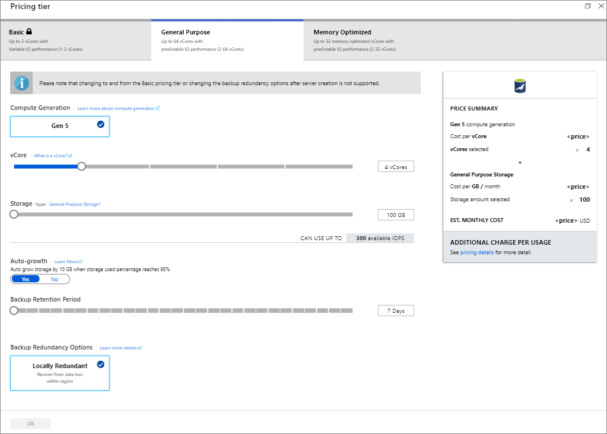
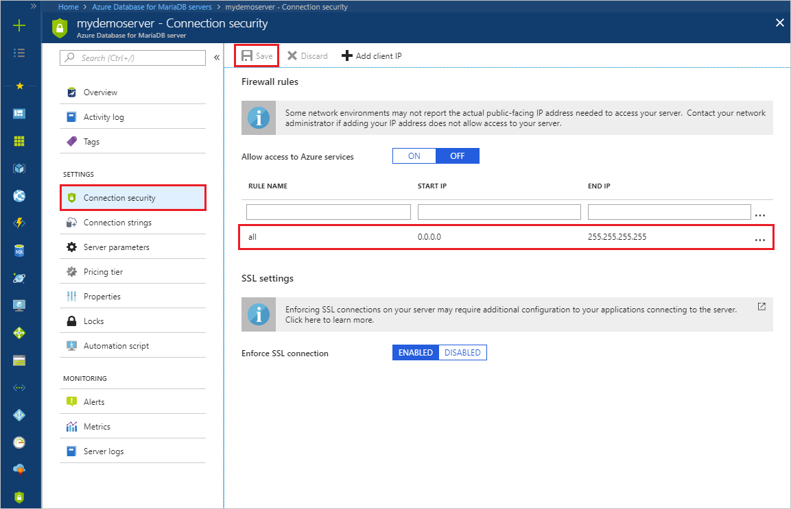
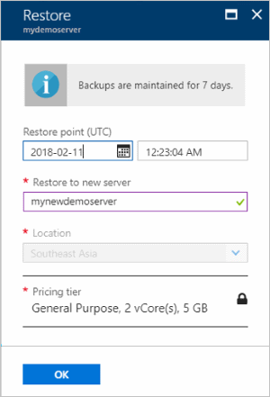

# Tutorial: Design an Azure Database for MariaDB database by using the Azure portal

Azure Database for MariaDB is a managed service you can use to run, manage, and scale highly available MySQL databases in the cloud. By using the Azure portal, you can easily manage your server and design a database.

In this tutorial, you use the Azure portal to learn how to:

> [!div class="checklist"]
> * Create an Azure Database for MariaDB
> * Configure the server firewall
> * Use the mysql command-line tool to create a database
> * Load sample data
> * Query data
> * Update data
> * Restore data

If you don't have an Azure subscription, create a [free Azure account](https://azure.microsoft.com/free/) before you begin.

## Sign in to the Azure portal

In your browser, go to the [Azure portal](https://portal.azure.com/). Enter your credentials to sign in to the portal. The default view is your service dashboard.

## Create an Azure Database for MariaDB server

You create an Azure Database for MariaDB server with a defined set of [compute and storage resources](concepts-pricing-tiers.md). The server is created in an [Azure resource group](../azure-resource-manager/management/overview.md).

1. Select the **Create a resource** button (+) in the upper left corner of the portal.

2. Select **Databases** > **Azure Database for MariaDB**. You can also type **MariaDB** in the search box to find the service.

   

3. Select the **Azure Database for MariaDB** tile. Enter or select the required information.

   

    Setting | Suggested value | Field description
    ---|---|---
    Server name | *a unique server name* | Choose a unique name that identifies your Azure Database for MariaDB server. For example, **mydemoserver**. The domain name *.mariadb.database.azure.com* is appended to the server name you enter. The server name can contain only lowercase letters, numbers, and the hyphen (-) character. It must contain between 3 and 63 characters.
    Subscription | *your subscription* | Select the Azure subscription that you want to use for your server. If you have multiple subscriptions, choose the subscription in which you are billed for the resource.
    Resource group | **myresourcegroup** | Enter a new resource group name or select an existing resource group.
    Select source | **Blank** | Select **Blank** to create a new server. (If you're creating a server from a geo-backup of an existing Azure Database for MariaDB server, select **Backup**).
    Server admin login | **myadmin** | A sign-in account to use when you connect to the server. The admin sign-in name can't be **azure_superuser**, **admin**, **administrator**, **root**, **guest**, or **public**.
    Password | *your choice* | Enter a new password for the server admin account. It must contain between 8 and 128 characters. Your password must contain characters from three of the following categories: English uppercase letters, English lowercase letters, numbers (0-9), and non-alphanumeric characters (!, $, #, %, and so on).
    Confirm password | *your choice*| Confirm the admin account password.
    Location | *the region closest to your users*| Select the location that is closest to your users or to your other Azure applications.
    Version | *the latest version*| The latest version (unless you have specific requirements for using a different version).
    Pricing tier | See description. | The compute, storage, and backup configurations for your new server. Select **Pricing tier** > **General Purpose**. Keep the default values for the following settings:<br><ul><li>**Compute Generation** (Gen 5)</li><li>**vCore** (4 vCores)</li><li>**Storage** (100 GB)</li><li>**Backup Retention Period** (7 days)</li></ul><br>To enable your server backups in geo-redundant storage, for **Backup Redundancy Options**, select **Geographically Redundant**. <br><br>To save this pricing tier selection, select **OK**. The next screenshot captures these selections.
    
   

   > [!TIP]
   > With **auto-growth** enabled your server increases storage when you are approaching the allocated limit, without impacting your workload.

4. Click **Review + create**. You can click on the **Notifications** button on the toolbar to monitor the deployment process. Deployment can take up to 20 minutes.

## Configure the firewall

An Azure Database for MariaDB is protected by a firewall. By default, all connections to the server and to databases inside the server are rejected. Before you connect to Azure Database for MariaDB for the first time, configure the firewall to add the client computer's public network IP address (or the IP address range).

1. Select your newly created server, and then select **Connection security**.

   
2. You can select **Add My IP** or configure firewall rules here. Remember to select **Save** after you create the rules.

You can now connect to the server by using the mysql command-line tool or MySQL Workbench.

> [!TIP]
> The Azure Database for MariaDB server communicates over port 3306. If you try to connect from inside a corporate network, outbound traffic over port 3306 might not be allowed by your network's firewall. In this case, to connect to the Azure Database for MariaDB server, your IT department must open port 3306.

## Get connection information

Get values for **Server name** (fully qualified) and **Server admin login name** for your Azure Database for MariaDB server from the Azure portal. You use the fully qualified server name to connect to your server by using the mysql command-line tool.

1. In the [Azure portal](https://portal.azure.com/), in the left menu, select **All resources**. Enter the server name and search for your Azure Database for MariaDB server. Select the server name to view the server details.

2. On the **Overview** page, make a note of the values for **Server name** and **Server admin login name**. You can also select the **copy** button next to each field to copy the value to the clipboard.

   

In our example, the server name is **mydemoserver.mariadb.database.azure.com** and the server admin login name is **myadmin\@mydemoserver**.

## Connect to the server by using mysql

Use the [mysql command-line tool](https://dev.mysql.com/doc/refman/5.7/en/mysql.html) to establish a connection to your Azure Database for MariaDB server. You can run the mysql command-line tool from Azure Cloud Shell in the browser or from your computer by using the mysql tools installed locally. To open Azure Cloud Shell, select the **Try It** button on a code block in this article or go to the Azure portal and click the **>_** icon in the top right toolbar.

Enter the command to connect:

```bash
mysql -h mydemoserver.mariadb.database.azure.com -u myadmin@mydemoserver -p
```

## Create a blank database

When you're connected to the server, create a blank database to work with:

```sql
CREATE DATABASE mysampledb;
```

At the prompt, run the following command to switch the connection to your newly created database:

```sql
USE mysampledb;
```

## Create tables in the database

Now that you know how to connect to the Azure Database for MariaDB database, you can complete some basic tasks.

First, create a table and load it with some data. Let's create a table that stores inventory information:

```sql
CREATE TABLE inventory (
    id serial PRIMARY KEY, 
    name VARCHAR(50), 
    quantity INTEGER
);
```

## Load data in the tables

Now that you have a table, insert some data in the table. In the open Command Prompt window, run the following query to insert some rows of data:

```sql
INSERT INTO inventory (id, name, quantity) VALUES (1, 'banana', 150); 
INSERT INTO inventory (id, name, quantity) VALUES (2, 'orange', 154);
```

## Query and update the data in the tables

Run the following query to retrieve information from the database table:

```sql
SELECT * FROM inventory;
```

You can also update the data in the tables:

```sql
UPDATE inventory SET quantity = 200 WHERE name = 'banana';
```

The row is updated when you retrieve data:

```sql
SELECT * FROM inventory;
```

## Restore a database to a previous point in time

Imagine that you accidentally deleted an important database table and can't recover the data easily. In Azure Database for MariaDB, you can restore the server to a point in time by creating a copy of the databases on your new server. You can use this new server to recover your deleted data. The following steps restore the sample server to a point in time before the table was added:

1. In the Azure portal, locate your Azure Database for MariaDB. On the **Overview** page, select **Restore**.

   

2. On the **Restore** page, enter or select the following information:

   
   
   - **Restore point**: Select a point in time that you want to restore to, in the timeframe listed. Make sure you convert your local time zone to UTC.
   - **Restore to new server**: Enter a new server name to restore to.
   - **Location**: The region is same as the source server and can't be changed.
   - **Pricing tier**: The pricing tier is the same as the source server and can't be changed.
   
3. Select **OK** to restore the server to a point in time [restore to a point in time](./howto-restore-server-portal.md) before the table was deleted. Restoring a server creates a new copy of the server at the point in time that you selected. 

## Next steps
In this tutorial, you use the Azure portal to learned how to:

> [!div class="checklist"]
> * Create an Azure Database for MariaDB
> * Configure the server firewall
> * Use mysql command-line tool to create a database
> * Load sample data
> * Query data
> * Update data
> * Restore data

> [!div class="nextstepaction"]
> [How to connect applications to Azure Database for MariaDB](howto-connection-string.md)
