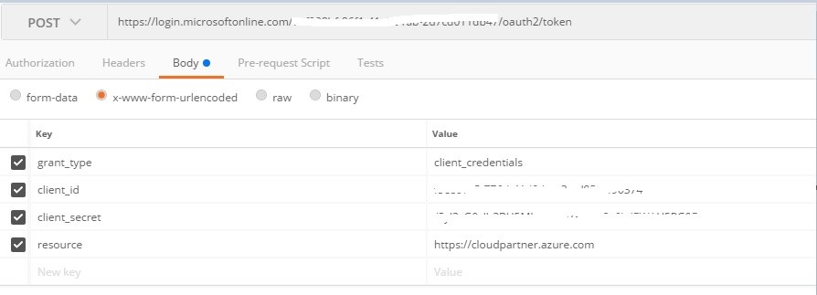
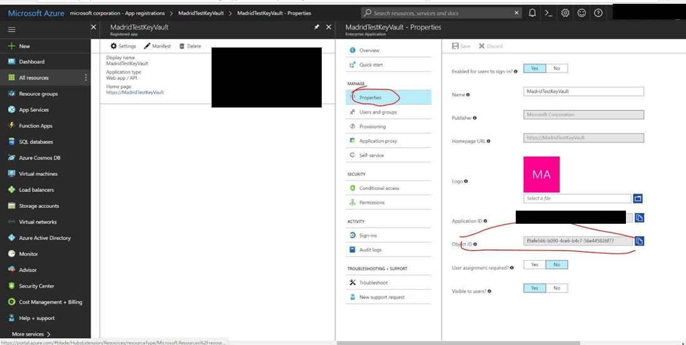

# Troubleshooting common authentication errors

This article provides assistance with common authentication errors when using the Cloud Partner Portal APIs.

## Unauthorized error

If you consistently get `401 unauthorized` errors, verify that you have a valid access token.  If you have not already done so, create a basic Azure Active Directory (Azure AD) application and a service principal as described in [Use portal to create an Azure Active Directory application and service principal that can access resources](https://docs.microsoft.com/azure/azure-resource-manager/resource-group-create-service-principal-portal). Then, use the application or a simple HTTP POST request to verify your access.  You will include the Tenant ID, Application ID, Object ID, and the secret key to obtain the access token as shown in the following image:

## Forbidden error

If you get a `403 forbidden` error, make sure that the correct service
principal has been added to your publisher account in the Cloud Partner Portal.
Follow the steps in the [Prerequisites](./cloud-partner-portal-api-prerequisites.md) page to
add your service principal to the portal.

If the correct service principal has been added, then verify
all the other information. Pay close attention to the Object ID entered
on the portal. There are two Object IDs in the Azure Active Directory
app registration page, and you must use the local Object ID. You can
find the correct value by going to the **App registrations** page for your app and
clicking on the app name under **Managed application in local directory**. 
This takes you to the local properties for the app, where
you can find the correct Object ID in the **Properties** page, as shown
in the following figure. Also, ensure that you use the correct
publisher ID when you add the service principal and make the API call.

