# Configure lead management for Dynamics CRM online

This article describes how to set up Dynamics CRM Online to process sales leads.

## Prerequisites

The following user permissions are need for completing the steps in this article:
- You need to be an admin on your Dynamics CRM Online instance to install a solution.
- You need to be a tenant admin to create a new service account for lead service.

Install the solution
--------------------

1.  Download the [Microsoft Marketplace Lead Writer solution](https://mpsapiprodwus.blob.core.windows.net/documentation/MicrosoftMarketplacesLeadIntegrationSolution_1_0_0_0_target_CRM_6.1_managed.zip) and save it locally.

2.  Open Dynamics CRM Online and go to Settings.
    >[!NOTE]
    >If you don't see the options in the next screen capture, then you don't have the permissions you need.
 
       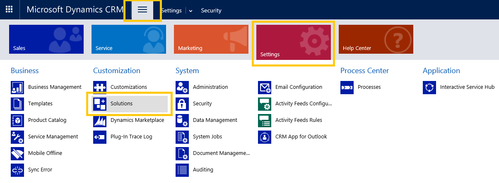

3.  Select **Import**, and then select the solution that you downloaded in step 1.
 
    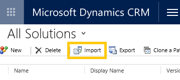

4.  Finish installing the solution.

## Configure user permissions

To write leads into your Dynamics CRM instance you have to share a service account with us and configure permissions for the account.

Use the following steps to create the service account and assign permissions. You can use **Azure Active Directory** or **Office 365**.

### Azure Active Directory

We recommend this option because you get the added benefit of never needing to update your username/password in order to keep getting leads. To use the Azure Active Directory option you provide the App Id, Application Key, and Directory Id from your Active Directory application.

Use the following steps to configure Azure Active Directory for Dynamics CRM.

1.  Sign in to [Azure portal](https://portal.azure.com/) and then select the Azure Active Directory service.

2.  Select **Properties** and then copy the **Directory Id**. This is your tenant account identification that you need use in the Cloud Partner Portal.

    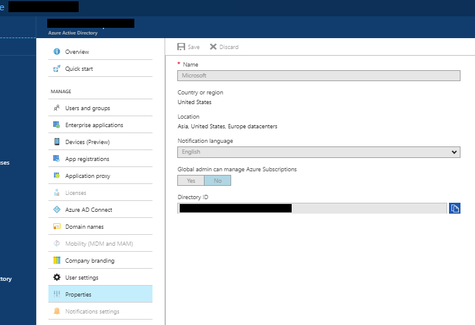

3.  Select **App registrations**, and then select **New application     registration**.
4.  Enter the application name.
5.  For Type, select **Web app / API**.
6.  Provide a URL. This field isn't needed for leads, but is required to create an application.
7. Select **Create**.
8.  Now that your application is registered, select **Properties** and then select **copy the Application Id**. You'll use this connection information in the Cloud Partner Portal.
9.  In Properties, set the application as Multi-tenanted and then select **Save**.

10. Select **Keys** and create a new key with the Duration set to *Never expires*. Select **Save** to create the key. 
11. On the Keys menu, select **Copy the key value.** Save a copy of this value because you'll need it for the Cloud Partner Portal.
    
    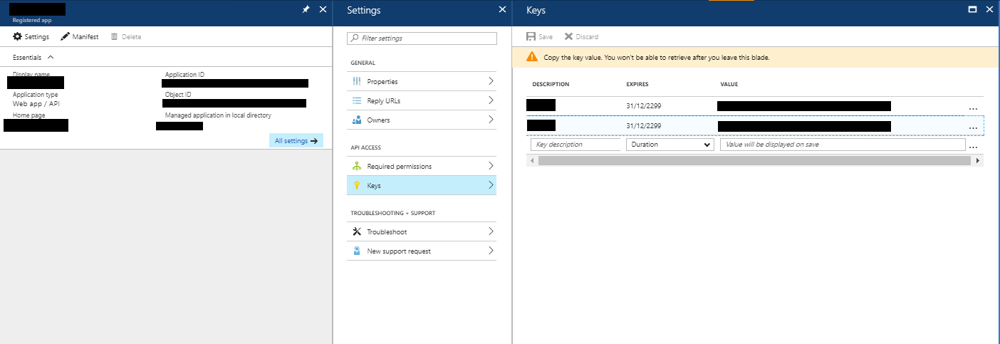
    
12. Select **Required permissions** and then select **Add**. 
13. Select **Dynamics CRM Online** as the new API, and check the permission for *Access CRM Online as organization users*.

14. On Dynamics CRM, go to Users and select the "Enabled
    Users" dropdown to switch over to **Application Users**.
    
    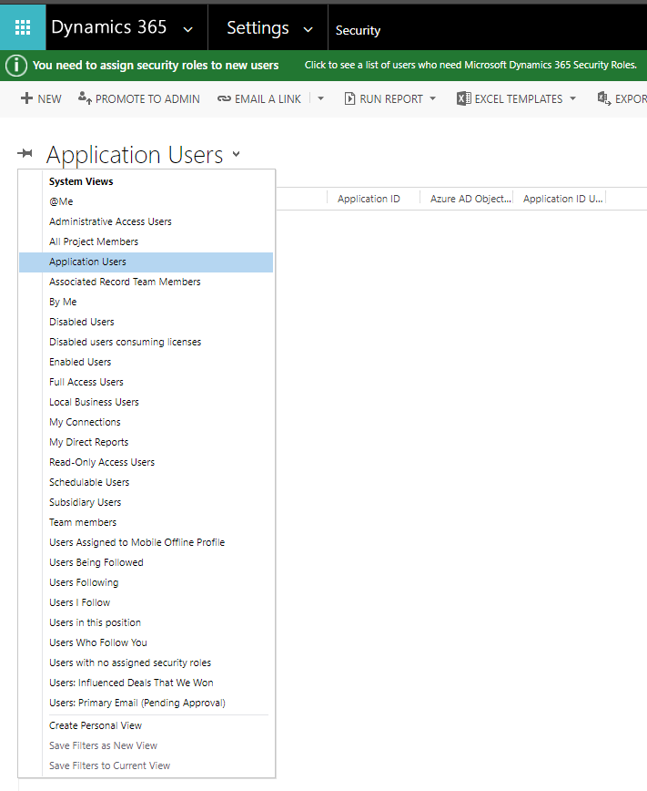

15. Select **New** to create a new user. Select the **USER: APPLICATION USER** dropdown.
    
    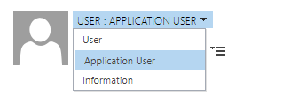

16. In **New User**, provide the name and email that you want to use with this connection. Paste in the **Application Id** for the app you created in the Azure portal.

     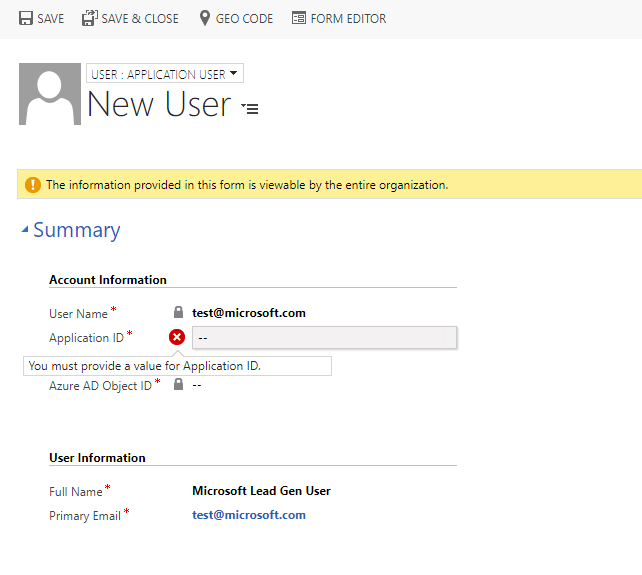

17. Go to "Security settings" in this article to finish configuring the connection for this user.

### Office 365

If you don't want to use Azure Active Directory, you can register a new user on the *Microsoft 365 admin center*. You'll be required to update your username/password every 90 days to continue getting leads.

Use the following steps to configure Office 365 for Dynamics CRM.

1. Sign in to the [Microsoft 365 admin center](https://admin.microsoft.com).

2. Select the **Admin** tile.

    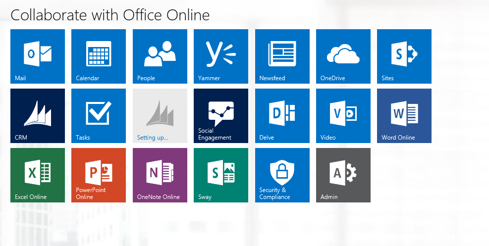

3. Select **Add a user**.

    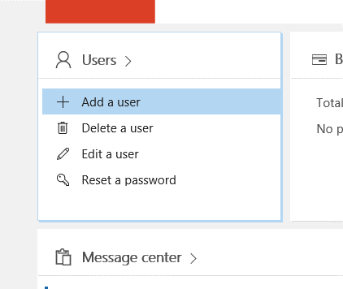

4. Create a new user for the lead writer service. Configure the following settings:

    -   Provide a password and uncheck the "Make this user change their password when they first sign in" option.
    -   Select "User (no administrator access)" as the role for the user.
    -   Select the product license shown in the next screen capture. You'll be charged for the license you choose. The solution will also work with Dynamics CRM Online Basic license.
    
    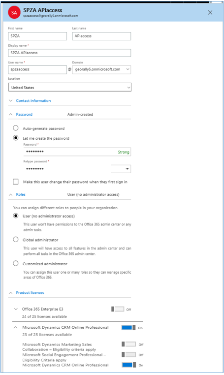

## Security settings

The final step is to enable the User you created to write the leads.

1.  Sign in to Dynamics CRM online.
2.  On **Settings**, select **Security**.
    
    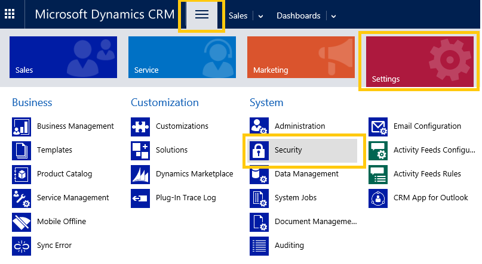

3.  Select the user that you created in **User permissions**, and then select **Manage User Roles**. Check **Microsoft Marketplace Lead Writer** to assign the role.

    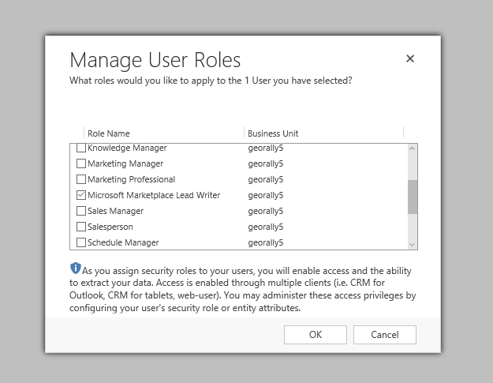\

    >[!NOTE]
    >This role is created by the solution that you imported and only has permissions to write the leads and to track the solution version to ensure compatibility.

4.  In Security, select **Security Roles** and find the role for
    Microsoft Marketplace Lead Writer.
    
    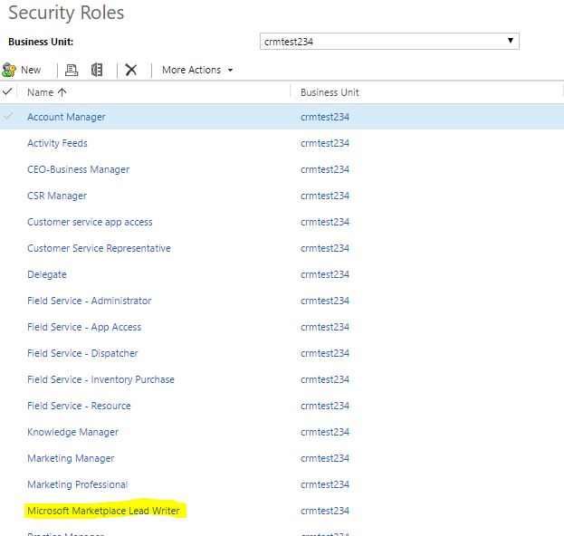\

5. Select the **Core Records** tab. Enable Create/Read/Write for the User Entity UI.

    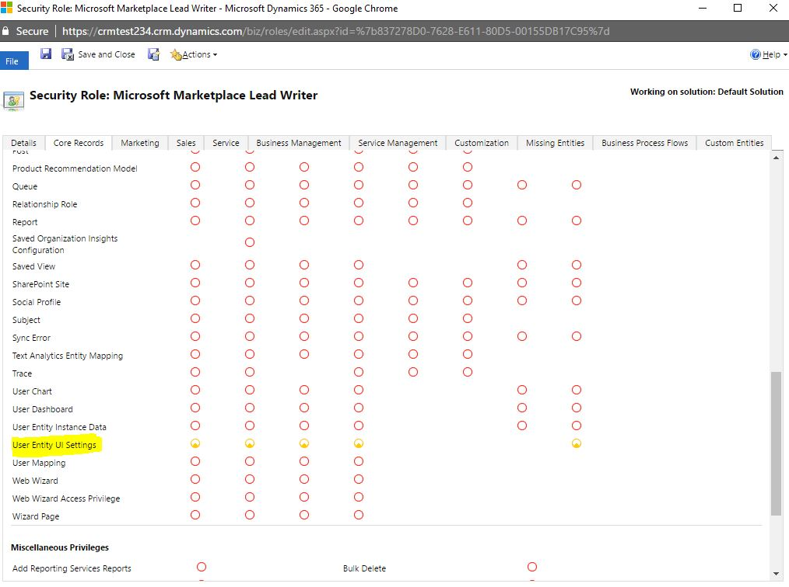\

## Wrap up

Finish configuring Dynamics CRM for lead management by adding the generated account information to the Cloud Partner Portal. For example:

-   **Azure Active Directory** - **Application Id** (example:
    *23456052-aaaa-bbbb-8662-1234df56788f*), **Directory Id** (example:
    *12345678-8af1-4asf-1234-12234d01db47*), and **Application Key**
    (example: *1234ABCDEDFRZ/G/FdY0aUABCEDcqhbLn/ST122345nBc=*).
-   **Office 365** - **Url** (example:
    **`https://contoso.crm4.dynamics.com`**), **User Name** (example:
    **`contoso\@contoso.onmicrosoft.com`**), and **Password** (example:
    *P\@ssw0rd*).
