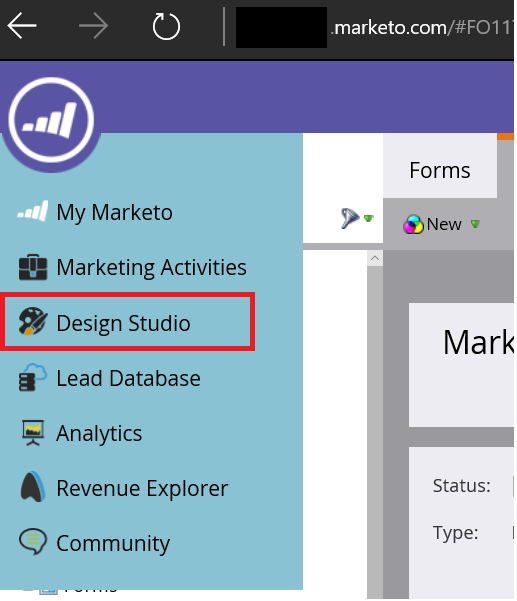
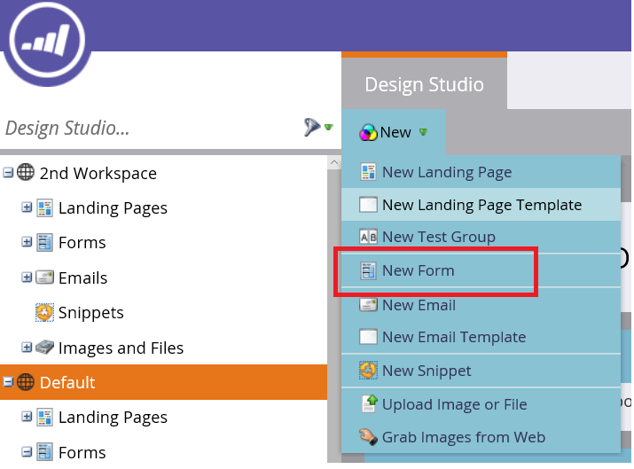
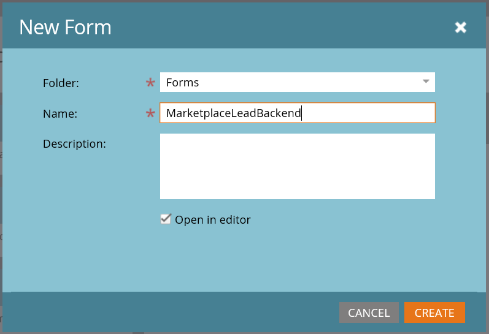
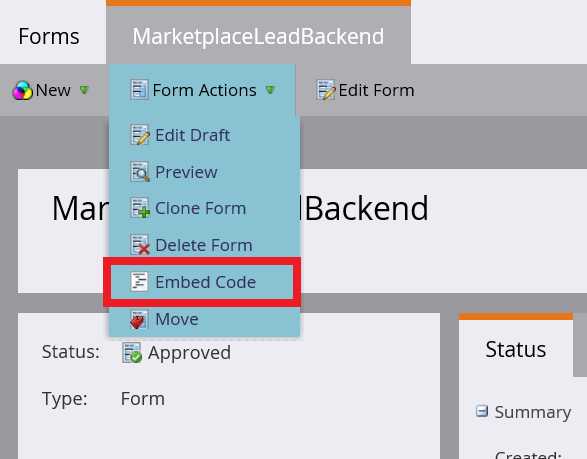

# Configure lead management in Marketo

This article describes how to set up Marketo to handle Microsoft sales leads.

1. Sign in to Marketo.
2. Select **Design Studio**.
    

3.  Select **New Form**.
    

4.  Fill the required fields in the New Form and then select **Create**.
    

4.  On Field Details, select **Finish**.
    

5.  Approve and Close.

6.  On the MarketplaceLeadBacked tab, select **Embed Code**.
    

7.  Marketo Embed Code displays code similar to the following example.

``

    <form id="mktoForm_1179"></form>
    

1. Copy the values shown in Embed Code so you can configure the **Server Id**, **Munchkin Id**, and **Form Id** in the Marketo fields on the Cloud Partner Portal.

Use the next example as a guide for getting the Ids you need from the Marketo Embed Code example.

- Server Id = **ys12**
- Munchkin Id = **123-PQR-789**
- Form Id = **1179**\
