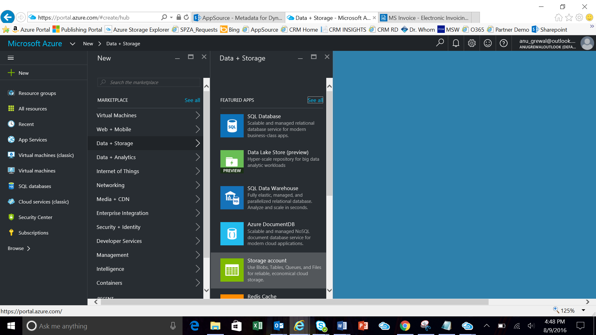
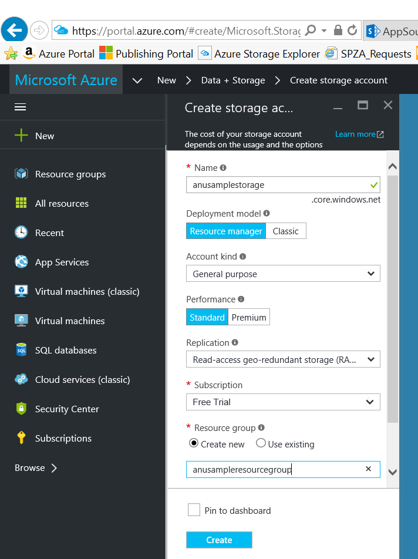
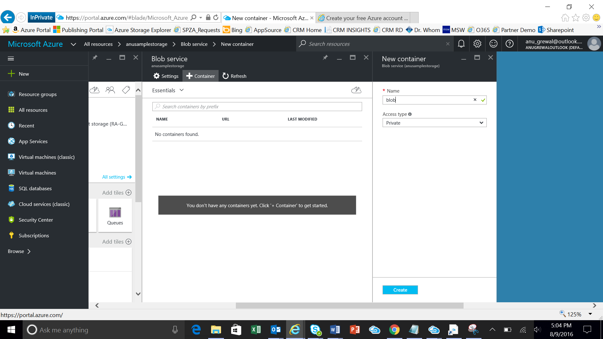
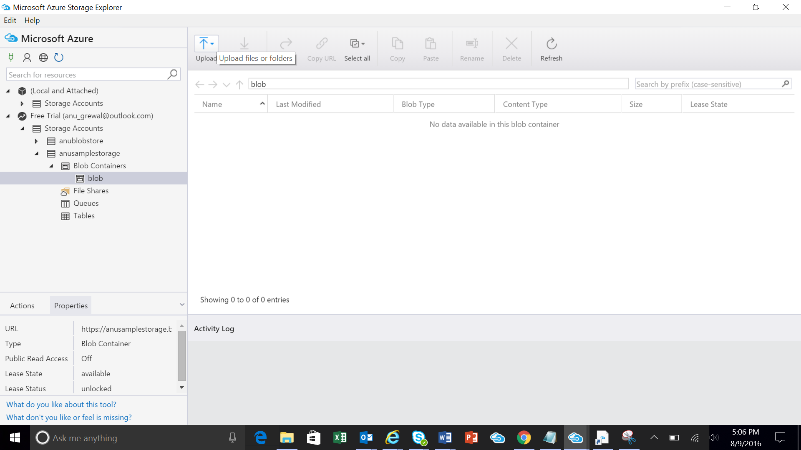
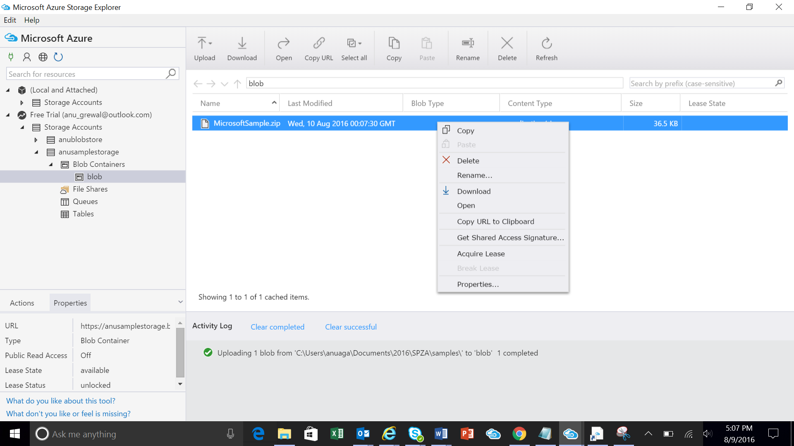
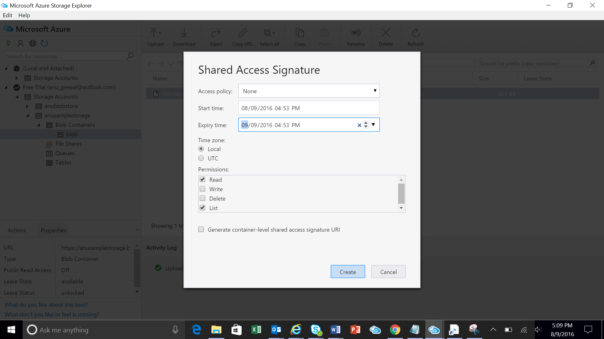
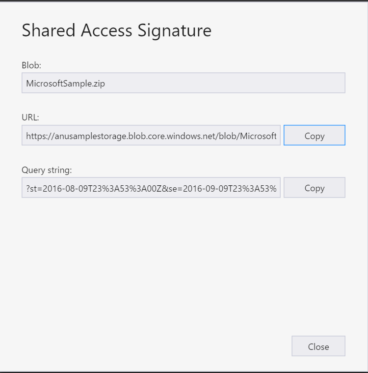

Store your AppSource Package to Azure storage and generate a URL with SAS key
=============================================================================

To maintain security of your files, all partners must store their
AppSource package file in an Azure blob storage account and use a SAS key to
share it. We will retrieve the package file from your Azure storage location for
certification and to use it for AppSource trials.

Use the following steps to upload your package to blob storage:

1. Go to <https://azure.microsoft.com> and create a free trial or billed account.

2. Sign in to the [Azure Portal](https://portal.azure.com/).

3. Create a new Storage Account by clicking **+ New** and going to the **Data +
   Storage** account.

   

4. Enter a **Name** and **Resource Group** name and click **Create** button.

   

5. Navigate to your newly created resource group and create a new blob container.

   

6. If you have not already done so, download and install the Microsoft [Azure Storage Explorer](https://storageexplorer.com/).

7. Open Storage Explorer and use the icon to connect to your Azure storage account.

8. Navigate to the blob container you created and click **Upload** to add your
   package zip file.

   

9. Right click on your file and select **Get Shared Access Signature**.

   

10. Modify the **Expiry time** to make the SAS active for a month, then click **Create**.

    

11. Copy the URL field and save it for later. You will need to enter this URL when you create 
    the associated offer. 

    

