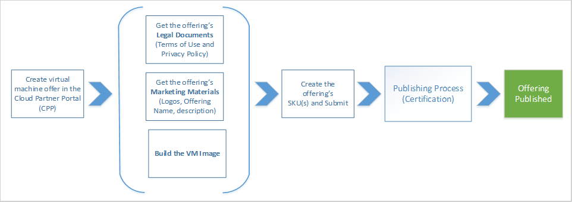

# Virtual machine offer

> [!IMPORTANT]
> Starting April 13, 2020, we'll begin moving the management of your Azure Virtual Machine offers to Partner Center. After the migration, you'll create and manage your offers in Partner Center. Follow the instructions in [Create an Azure Virtual Machine offer](https://docs.microsoft.com/azure/marketplace/partner-center-portal/azure-vm-create-offer) to manage your migrated offers.

|    |    |
|-----------------------------------------------------------------|------------------------------------------|
| This section explains how to publish a new virtual machine offer to the [Azure Marketplace](https://azuremarketplace.microsoft.com). Support is provided for both Windows-based and Linux-based virtual machines, containing an operating system virtual hard disk (VHD) and zero or more data VHDs. |   |

## Publishing overview

The following video, [Optimize Your Azure Marketplace Offer](https://channel9.msdn.com/Events/Build/2017/P4026?ocid=player), presents
a broad overview of the Azure Marketplace, including how to publish on this marketplace (using a virtual machine solution), how to optimize the user
experience with your product page and optional Test Drive experience, how user leads are generated and how you can consume them, and optimize customer
engagement.

> [!VIDEO https://channel9.msdn.com/Events/Build/2017/P4026/player]

## VM Publishing process flow

The following diagram illustrates the high-level steps in publishing a VM offer. 

1. Create the offer - All the details and information about the offer is configured, including the offer description, marketing materials, legal, support information and asset specifications.

2. Create the business and technical assets - Create the business assets (legal documents and marketing materials) and technical assets for the associated solution (here, the VMs and attached disks). 

3. Create the SKU - Create the associated SKU(s) associated with the offering and submit them.  A unique SKU is required for each image you are planning to publish. 
 
4. Certify and publish the offer -  Once the offer and the technical assets are completed, you can submit the offer. This submission will start the publishing process, in which the solution is tested, validated, certified, then "goes live" on the marketplace.  

## Next steps

Before you consider these steps, you must meet the [technical and business requirements](./cpp-prerequisites.md) for publishing a VM to the Microsoft Azure Marketplace. 
