# Configure lead management for Dynamics 365 for Customer Engagement

This article describes how to set up Dynamics 365 for Customer Engagement (previously Dynamics CRM Online), read more about the change [here](https://docs.microsoft.com/dynamics365/customerengagement/on-premises/admin/on-prem-server-based-sharepoint-online) to process sales leads from your marketplace offer. 

>[!Note]
>These instructions are specific for the Microsoft hosted cloud Dynamics 365 for Customer Engagement environment. Connecting directly to a Dynamics on-prem environment is not currently supported, there are other options for you to receive leads such as configuring an [https endpoint](./commercial-marketplace-lead-management-instructions-https.md) or an [Azure table](./commercial-marketplace-lead-management-instructions-azure-table.md) to receive leads.

## Prerequisites

The following user permissions are needed for completing the steps in this article:

* You need to be an admin on your Dynamics 365 for Customer Engagement instance to be able to install a solution and follow these instructions.
* You need to be a tenant admin to create a new service account for the lead service used to send leads from marketplace offers.
* You need to have access to the Office 365 admin portal.
* You need to have access to the Azure portal.

## Install the solution

1.  Download the [Microsoft Marketplace Lead Writer solution](https://mpsapiprodwus.blob.core.windows.net/documentation/MicrosoftMarketplacesLeadIntegrationSolution_1_0_0_0_target_CRM_6.1_managed.zip) and save it locally to your computer.

2.  Open Dynamics 365 for Customer Engagement by navigating to the URL for your Dynamics instance (such as `https://tenant.crm.dynamics.com`).

3.  Access Settings by selecting the gear icon and **Advanced Settings** on the top navigation bar.
 
    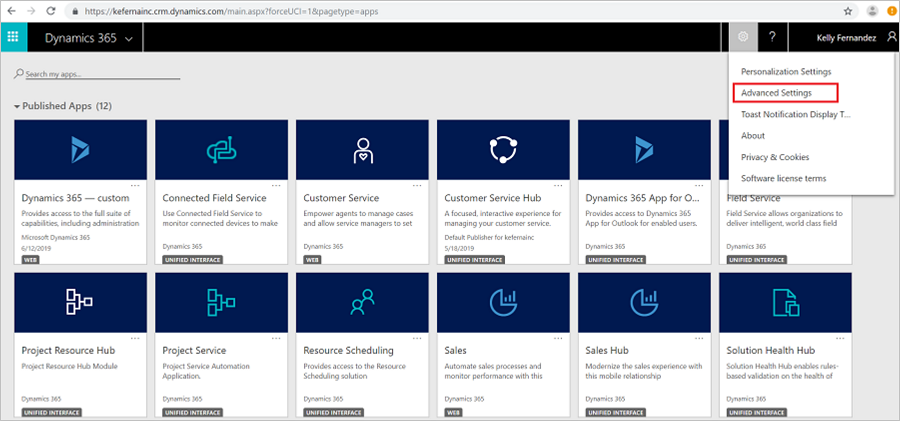

4.  Once on Settings page, access the Setting menu from the top navigation bar and select **Solutions**.

    >[!Note]
    >If you don't see the options in the next screen capture, then you don't have the permissions you need to proceed. Reach out to an admin on your Dynamics 365 for Customer Engagement instance.

    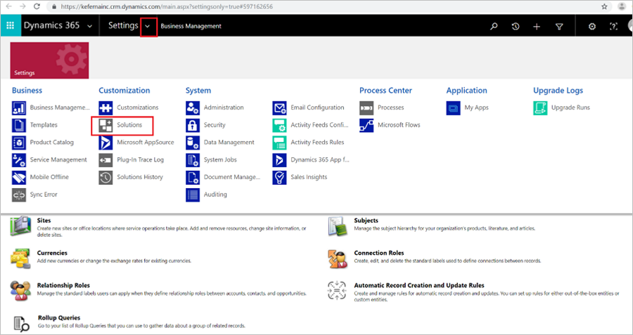

5. Once on the Solutions page, select **Import** and navigate to where you saved the *Microsoft Marketplace Lead Writer* solution that you downloaded in step 1.

    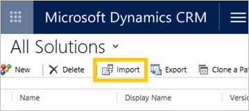

6. Complete importing the solution by following the Import solution wizard.

## Configure user permissions

To write leads into your Dynamics 365 for Customer Engagement instance, you must share a service account with us, and configure permissions for the account.

Use the following steps to create the service account and assign permissions. You can use **Azure Active Directory** or **Office 365**.

>[!Note]
>Based on the authentication option you select, you can skip to the corresponding instructions based on your choice. See [Azure Active Directory](https://docs.microsoft.com/azure/marketplace/partner-center-portal/commercial-marketplace-lead-management-instructions-dynamics#azure-active-directory) or [Office 365](https://docs.microsoft.com/azure/marketplace/partner-center-portal/commercial-marketplace-lead-management-instructions-dynamics#office-365).

### Azure Active Directory

We recommend this option because you get the added benefit of never needing to update your username/password to keep getting leads. To use the Azure Active Directory option, you provide the App ID, Application Key, and Directory ID from your Active Directory application.

Use the following steps to configure Azure Active Directory for Dynamics 365 for Customer Engagement.

1. Sign in to [Azure portal](https://portal.azure.com/), and then select the Azure Active Directory service from the left navigation.

2. Select **Properties** from the Azure Active Directory left navigation, and copy the **Directory ID** value on that page. Save this value, as it is the *Directory ID* value that you need to provide in the publishing portal to receive leads for your marketplace offer.

    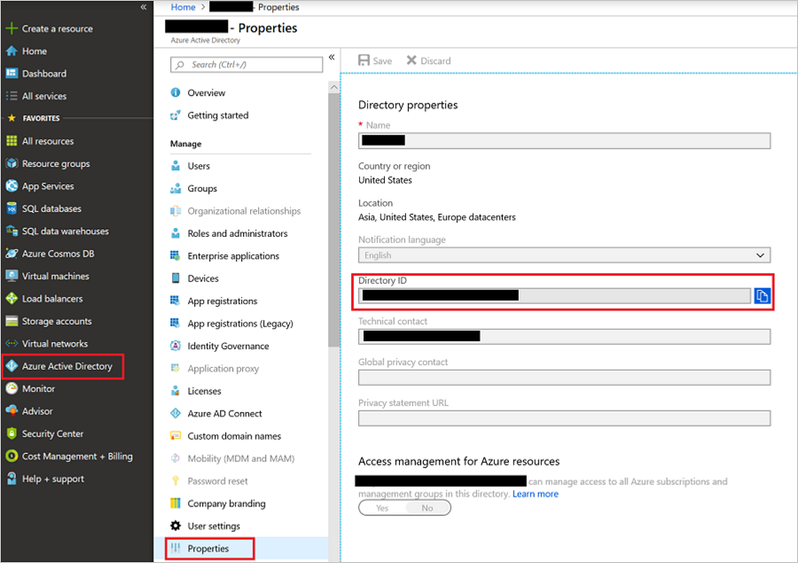

3. Select **App registrations** from the Azure Active Directory left navigation, and then select **New registration** on that page.
4. Enter a name for the application name. Provide a meaningful application name.
5. Under Supported account types, select **Accounts in any organizational directory**.
6. Under Redirect URI, select **Web** and provide a URI (such as `https://contosoapp1/auth`). 
7. Select **Register**.

    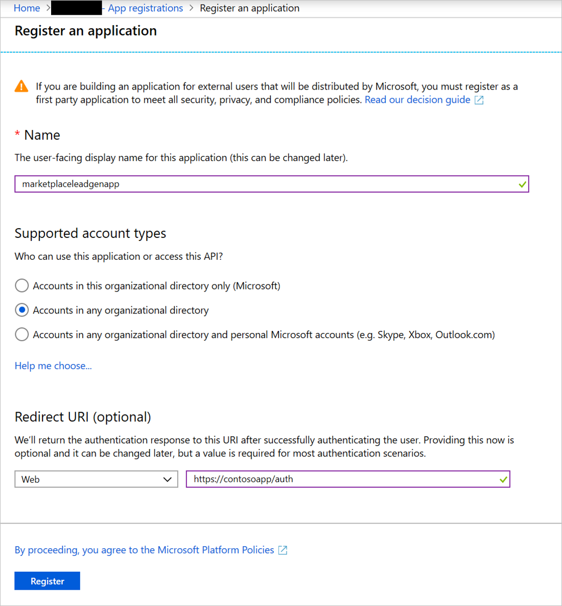

8. Now that your application is registered, access the application's overview page and copy the **Application (client) ID** value on that page. Save this value, as it is the *Application (client) ID* value that you need to provide in the publishing portal and in Dynamics to receive leads for your marketplace offer.

    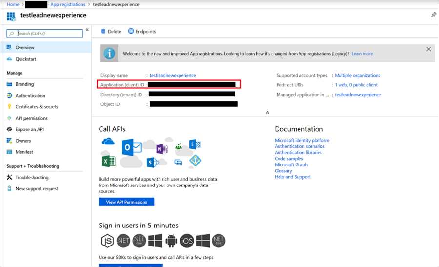

9. Select **Certificates and secrets** from the app's left navigation, and select **New client secret** on that page. Enter a meaningful description for the client secret, and select the **Never** option under Expires. Select **Add** to create the client secret.

    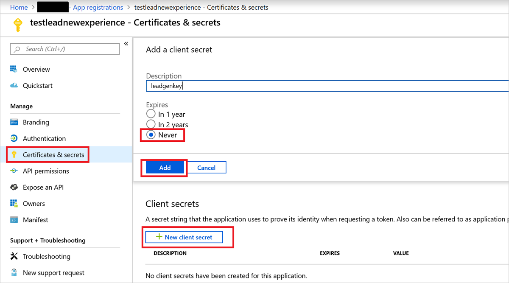

10. As soon as the client secret is successfully created, **Copy the client secret value**. You won't be able to retrieve the value after you navigate away from the page. Save this value, as it is the *Client secret* value you need to provide in the publishing portal to receive leads for your marketplace offer. 
11. Select **API permissions** from the apps' left navigation, and then select **Add a permission**.
12. Select Microsoft APIs, and then select **Dynamics CRM** as the API.
13. Under *What type of permissions does your application require*, make sure **Delegated permissions** is selected. Check the permission for **user_impersonation** *Access Common Data Service as organization users*. Select **Add permissions**.

    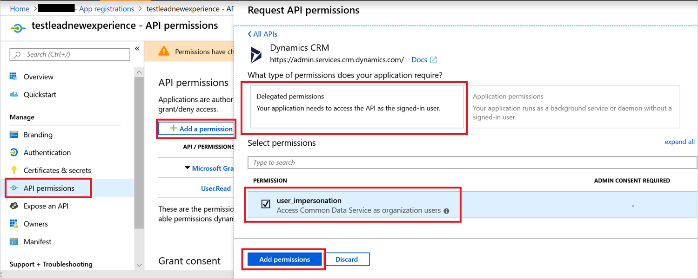

14. After completing steps 1-13 on the Azure portal, navigate to your Dynamics 365 for Customer Engagement instance by navigating to the URL (such as `https://tenant.crm.dynamics.com`).
15. Access Settings by selecting the gear icon, and **Advanced Settings** on the top navigation bar.
16. Once on Settings page, access the Setting menu from the top navigation bar and select **Security**.
17. Once on the Security page, select **Users**.  On the Users page, select the "Enabled Users" dropdown to switch over to **Application Users**.
18. Select **New** to create a new user. 

    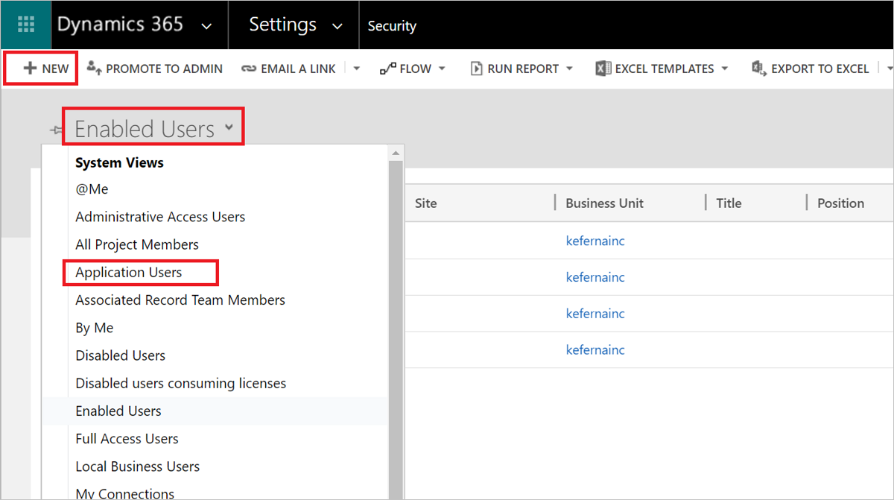

19. In **New User**, make sure the USER: APPLICATION USER is selected. Provide a username, full name, and email address for the user that you want to use with this connection. Also, paste in the **Application ID** for the app you created in the Azure portal from step 8. Select **Save and Close** to complete adding the user.

    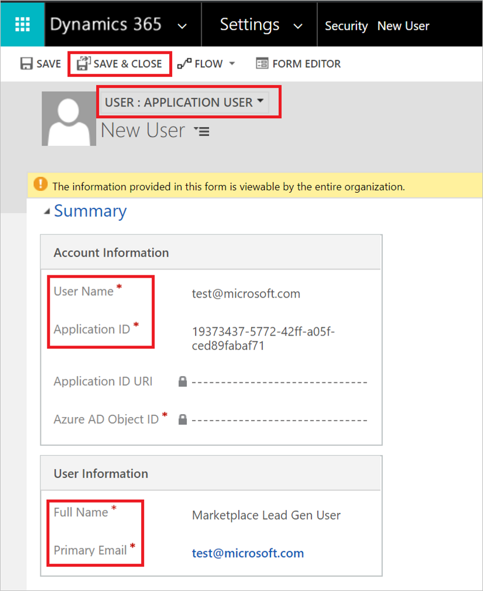

20. Go to "Security settings" in this article to finish configuring the connection for this user.

### Office 365

If you don't want to use Azure Active Directory, you can register a new user on the *Microsoft 365 admin center*. You'll be required to update your username/password every 90 days to continue getting leads.

Use the following steps to configure Office 365 for Dynamics 365 for Customer Engagement.

1. Sign in to the [Microsoft 365 admin center](https://admin.microsoft.com).

2. Select **Add a user**.

    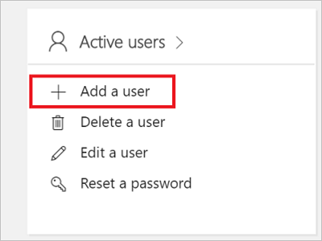

4. Create a new user for the lead writer service. Configure the following settings:

    * Provide a username
    * Provide a password, and deselect the "Make this user change their password when they first sign in" option.
    * Select "User (no administrator access)" as the role for the user.
    * Select "Dynamics 365 Customer Engagement plan" as product license shown in the next screen capture. You'll be charged for the license you choose. 

Save these values as they are the *Username and Password* values you need to provide in the publishing portal to receive leads for your marketplace offer.

## Security settings

The final step is to enable the User you created to write the leads.

1. Open Dynamics 365 for Customer Engagement by navigating to the URL for your Dynamics instance (such as `https://tenant.crm.dynamics.com`).
2. Access Settings by selecting the gear icon and **Advanced Settings** on the top navigation bar.
3. Once on Settings page, access the Setting menu from the top navigation bar and select **Security**.
4. Once on the Security page, select **Users** and select the user that you created in the Configure User permissions section of this document, and then select **Manage Roles**. 

    

5. Search for the role name "Microsoft Marketplace Lead Writer" and select it to assign the user the role.

    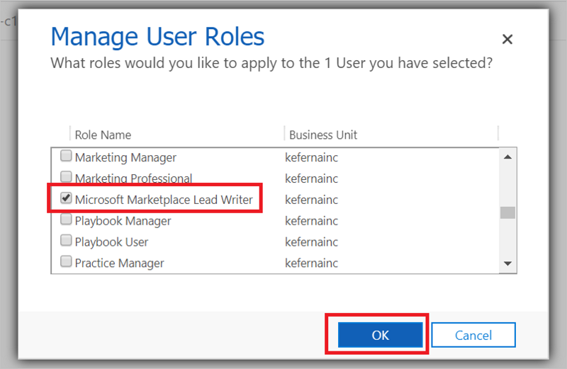

    >[!Note]
    >This role is created by the solution that you imported and only has permissions to write the leads and to track the solution version to ensure compatibility.

6. Navigate back to Security page and select **Security Roles**. Search for the role "Microsoft Marketplace Lead Writer" and select it.

    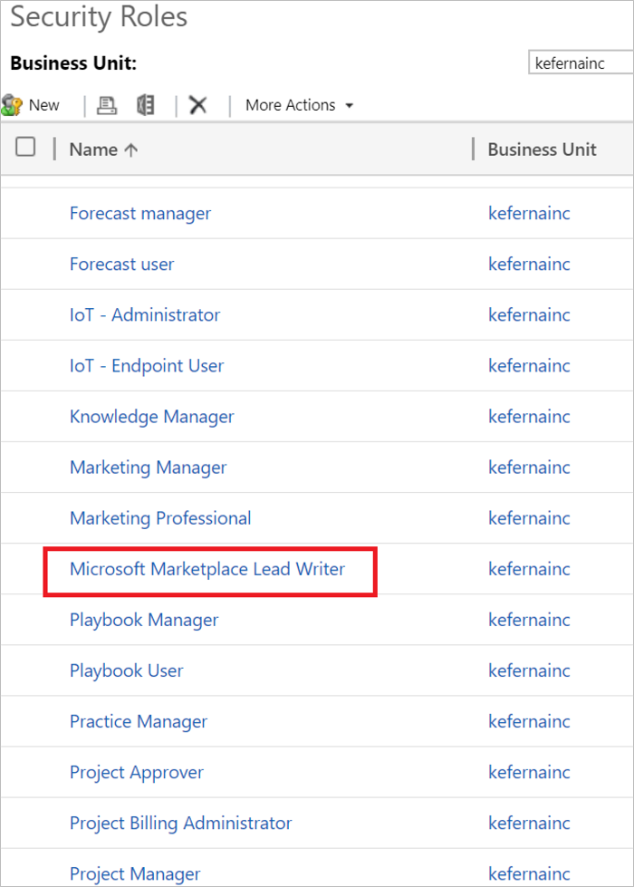

7. Once in the security role, select the **Core Records** tab. Search for the "User Entity UI Settings" entity and enable the Create, Read, and Write permissions to User (1/4 yellow circle) for that entity by clicking once into each of the corresponding circles.

    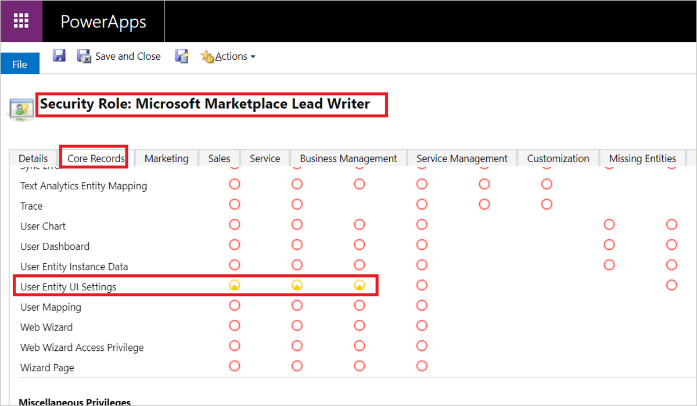

8. Now navigate to the **Customization** tab. Search tor the "System Job" entity and enables the Read, Write, and AppendTo permissions to Organization (solid green) for that entity by clicking four times into each of the corresponding circles.

    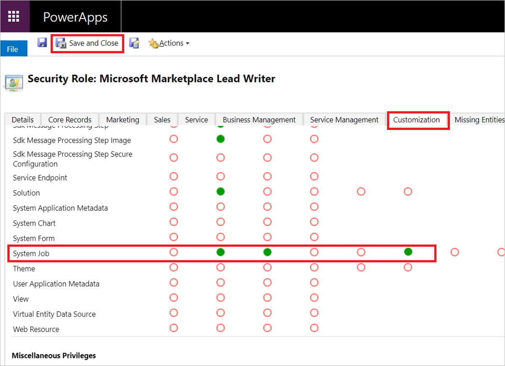

9. **Save and close**.

## Configure your offer to send leads to Dynamics 365 For Customer Engagement

When you are ready to configure the lead management information for your offer in the publishing portal, follow the below steps:

1. Navigate to the **Offer setup** page for your offer.
2. Select **Connect** under the Lead Management section.

    

3. On the Connection details pop-up window, select **Dynamics 365 for Customer Engagement** for the Lead Destination

    

4. Provide the **Dynamics 365 Instance URL** such as `https://contoso.crm4.dynamics.com`.
5. Select the method of **Authentication**, Azure Active Directory, or Office 365. 
6. If you selected Azure Active Directory, provide the **Application (client) ID** (example: `23456052-aaaa-bbbb-8662-1234df56788f`), **Directory ID** (example: `12345678-8af1-4asf-1234-12234d01db47`), and **Client secret** (example: `1234ABCDEDFRZ/G/FdY0aUABCEDcqhbLn/ST122345nBc=`).

    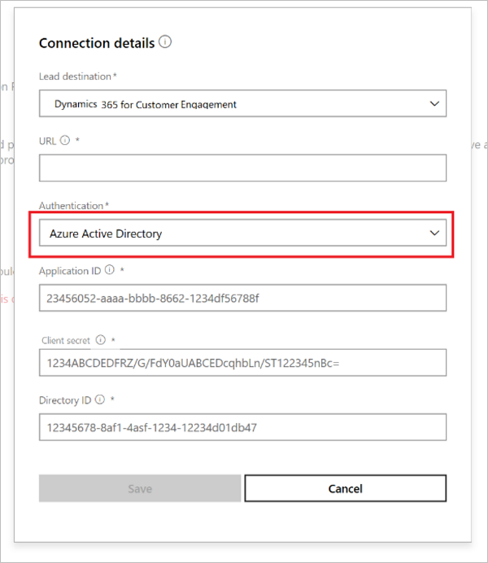

7. If you selected Office 365, provide the **User name** (example: `contoso@contoso.onmicrosoft.com`), and Password (example: `P@ssw0rd`).

    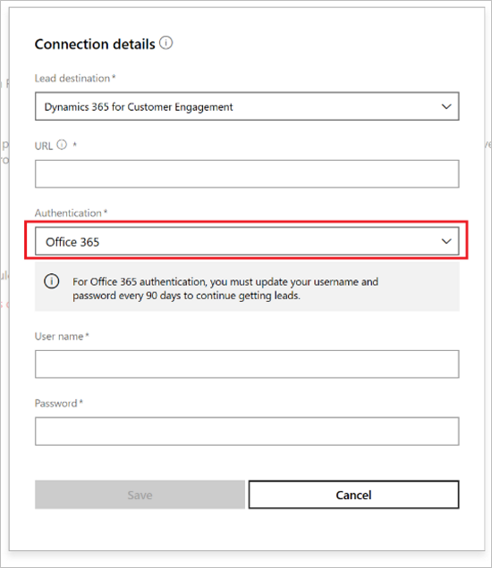

>[!Note]
>You must finish configuring the rest of the offer and publish it before you can receive leads for the offer.
