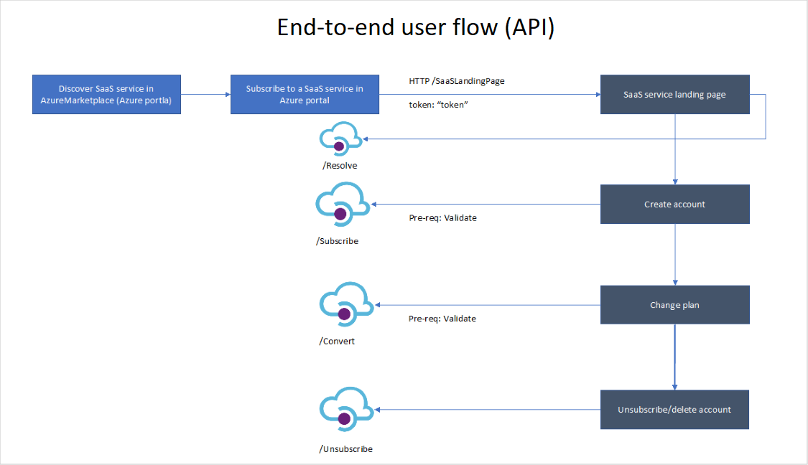
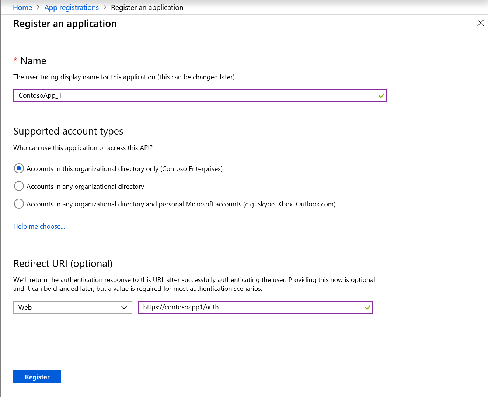
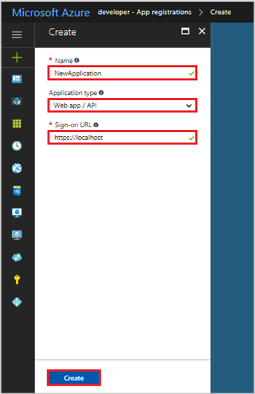

# Register a SaaS application

This article explains how to register a SaaS application using the Microsoft [Azure portal](https://portal.azure.com/).  After a successful registration, you will receive an Azure Active Directory (Azure AD) security token that you can use to access the SaaS Fulfillment APIs.  For more information about Azure AD, see [What is authentication?](https://docs.microsoft.com/azure/active-directory/develop/authentication-scenarios)

## Service-to-service authentication flow

The following diagram shows the subscription flow of a new customer and when these APIs are used:



Azure does not impose any constraints on the authentication that the SaaS service exposes to its end users. However, authentication with the SaaS Fulfillment APIs is performed with an Azure AD security token, typically obtained by registering the SaaS app through the Azure portal. 

## Register an Azure AD-secured app

Any application that wants to use the capabilities of Azure AD must first be registered in an Azure AD tenant. This registration process involves giving Azure AD details about your application, such as the URL where it's located, the URL to send replies after a user is authenticated, the URI that identifies the app, and so on.  To register a new application using the Azure portal, perform the following steps:

1.  Sign in to the [Azure portal](https://portal.azure.com/).
2.  If your account gives you access to more than one, click your account in the top-right corner, and set your portal session to the desired Azure AD tenant.
3.  In the left-hand navigation pane, click the **Azure Active Directory** service, click **App registrations**, and click **New application registration**.

    

4.  On the Create page, enter your application\'s registration information:
    -   **Name**: Enter a meaningful application name
    -   **Application type**: 
        - Select **Native** for [client applications](https://docs.microsoft.com/azure/active-directory/develop/active-directory-dev-glossary#client-application) that are installed locally on a device. This setting is used for OAuth public [native clients](https://docs.microsoft.com/azure/active-directory/develop/active-directory-dev-glossary#native-client).
        - Select **Web app / API** for
        [client applications](https://docs.microsoft.com/azure/active-directory/develop/active-directory-dev-glossary#client-application)
        and [resource/API applications](https://docs.microsoft.com/azure/active-directory/develop/active-directory-dev-glossary#resource-server)
        that are installed on a secure server. This setting is used for
        OAuth confidential [web clients](https://docs.microsoft.com/azure/active-directory/develop/active-directory-dev-glossary#web-client)
        and public [user-agent-based  clients](https://docs.microsoft.com/azure/active-directory/develop/active-directory-dev-glossary#user-agent-based-client).
        The same application can also expose both a client and resource/API.
    -   **Sign-On URL**: For Web app/API applications, provide the base URL of your app. For example, **http://localhost:31544** might be the URL for a web app running on your local machine. Users would then use this URL to sign in to a web client application.
    -   **Redirect URI**: For Native applications, provide the URI used by Azure AD to return token responses. Enter a value specific to your application, for example **http://MyFirstAADApp**.

        

        For specific examples for web applications or native applications, check out the quickstart guided setups that are available in the *Get Started* section of the [Azure AD Developers Guide](https://docs.microsoft.com/azure/active-directory/develop/active-directory-developers-guide).

5.  When finished, click **Create**. Azure AD assigns a unique *Application ID* to your application, and you\'re taken to your application\'s main registration page. Depending on whether your application is a web or native application, different options are provided to add additional capabilities to your application.

>[!Note]
>By default, the newly registered application is configured to allow only users from the same tenant to sign in to your application.

## Using the Azure AD security token

Once you have registered your application, you can programmatically request an Azure AD security token.  The publisher is expected to use this token, and make a request to resolve it.  When using the various Fulfillment APIs, the token query parameter is in the URL when the user is redirected to SaaS website from Azure.  This token is only valid for one hour.  Additionally, you should URL decode the token value from the browser before using it.

For more information about these tokens, see [Azure Active Directory access tokens](https://docs.microsoft.com/azure/active-directory/develop/access-tokens).


### Get a token based on the Azure AD app

HTTP Method

`POST`

*Request URL*

**https://login.microsoftonline.com/*{tenantId}*/oauth2/token**

*URI parameter*

|  **Parameter name**  | **Required**  | **Description**                               |
|  ------------------  | ------------- | --------------------------------------------- |
| tenantId             | True          | Tenant ID of the registered AAD application   |
|  |  |  |


*Request header*

|  **Header name**  | **Required** |  **Description**                                   |
|  --------------   | ------------ |  ------------------------------------------------- |
|  Content-Type     | True         | Content type associated with the request. The default value is `application/x-www-form-urlencoded`.  |
|  |  |  |


*Request body*

| **Property name**   | **Required** |  **Description**                                                          |
| -----------------   | -----------  | ------------------------------------------------------------------------- |
|  Grant_type         | True         | Grant type. The default value is `client_credentials`.                    |
|  Client_id          | True         |  Client/app identifier associated with the Azure AD app.                  |
|  client_secret      | True         |  Password associated with the Azure AD app.                               |
|  Resource           | True         |  Target resource for which the token is requested. The default value is `62d94f6c-d599-489b-a797-3e10e42fbe22`. |
|  |  |  |


*Response*

|  **Name**  | **Type**       |  **Description**    |
| ---------- | -------------  | ------------------- |
| 200 OK    | TokenResponse  | Request succeeded   |
|  |  |  |

*TokenResponse*

Sample response token:

``` json
  {
      "token_type": "Bearer",
      "expires_in": "3600",
      "ext_expires_in": "0",
      "expires_on": "15251…",
      "not_before": "15251…",
      "resource": "62d94f6c-d599-489b-a797-3e10e42fbe22",
      "access_token": "eyJ0eXAiOiJKV1QiLCJhbGciOiJSUzI1NiIsIng1dCI6ImlCakwxUmNxemhpeTRmcHhJeGRacW9oTTJZayIsImtpZCI6ImlCakwxUmNxemhpeTRmcHhJeGRacW9oTTJZayJ9…"
  }               
```

## Next steps

Your Azure AD-secured app can now use the [SaaS Fulfillment API Version 2](./pc-saas-fulfillment-api-v2.md).
