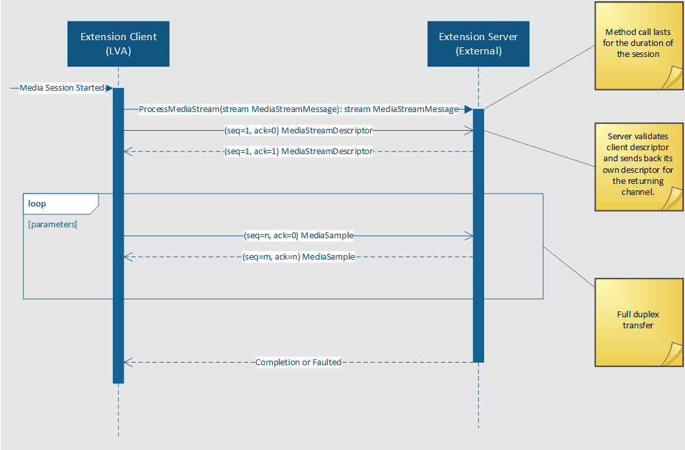
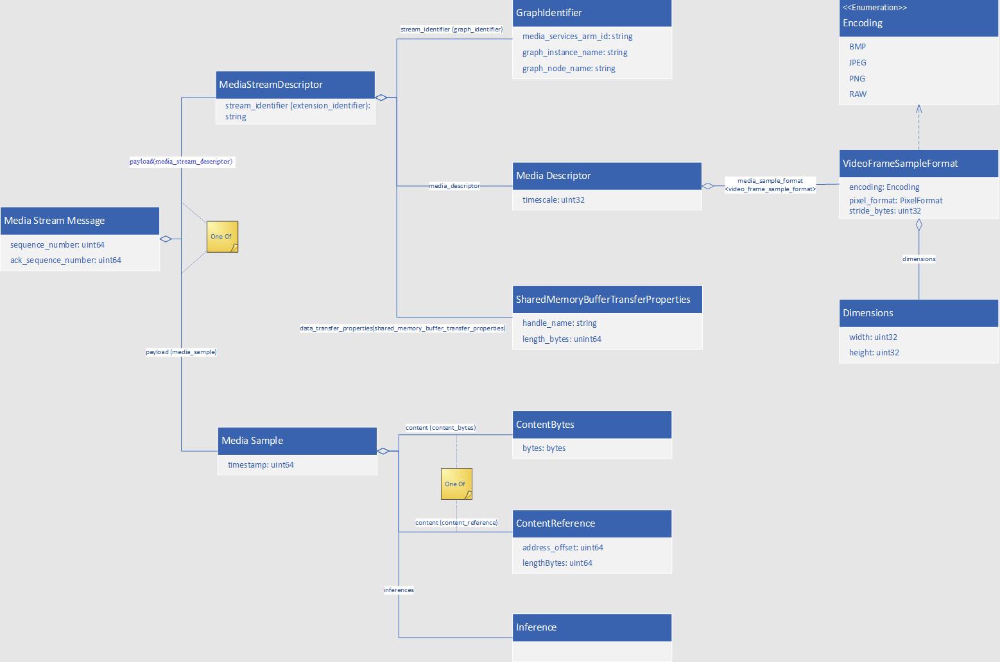

# gRPC extension protocol

Live Video Analytics on IoT Edge allows you to extend the media graph processing capabilities through a [graph extension node](https://review.docs.microsoft.com/en-us/azure/media-services/live-video-analytics-edge/media-graph-extension-concept?branch=release-lva-dec-update). If you use the gRPC extension processor as the extension node, then the communication between Live Video Analytics module and your AI or CV module is over gRPC based, highly performant structured protocol.

In this article, you will learn about using gRPC extension protocol to send messages between Live Video Analytics module and your AI or CV custom extension.

gRPC is a modern, open-source, high-performance RPC framework that runs in any environment and support cross platform and cross language communication. The gRPC transport service uses HTTP/2 bidirectional streaming between:

* the gRPC client (Live Video Analytics on IoT Edge module) and 
* the gRPC server (your custom extension).

A gRPC session is a single connection from the gRPC client to the gRPC server over the TCP/TLS port. 

In a single session: The client sends a media stream descriptor followed by video frames to the server as a [protobuf](https://github.com/Azure/live-video-analytics/tree/master/contracts/grpc) message over the gRPC stream session. The server validates the stream descriptor, analyses the video frame, and returns inference results as a protobuf message. 

It is highly recommended that responses are returned using valid JSON documents following the pre-established schema defined as per the [inference metadata schema object model](https://review.docs.microsoft.com/en-us/azure/media-services/live-video-analytics-edge/inference-metadata-schema?branch=release-lva-dec-update). This will better ensure interoperability with other components and possible future capabilities added to the Live Video Analytics module.



## Implementing gRPC protocol

### Creating a gRPC connection

Custom extension must implement the following gRPC service:

```
service MediaGraphExtension
    {
        rpc ProcessMediaStream(stream MediaStreamMessage) returns (stream MediaStreamMessage);
    }
```

When called, this will open a bi-directional stream for messages to flow between the gRPC extension and Live Video Analytics graph. The first message sent in this stream by each party will contain a MediaStreamDescriptor, which defines what information will be sent in the following MediaSamples.

For example, the graph extension may send the message (expressed here in JSON) to indicate that it will send 416x416 rgb24-encoded frames embedded in the gRPC messages to the custom extension.

```
 {
    "sequence_number": 1,
    "ack_sequence_number": 0,
    "media_stream_descriptor": 
    {
        "graph_identifier": 
        {
            "media_services_arm_id": "/subscriptions/00000000-0000-0000-0000-000000000000/resourceGroups/resourceGroupName/providers/microsoft.media/mediaservices/mediaAccountName",
            "graph_instance_name": "mediaGraphName",
            "graph_node_name": "grpcExtension"
        },
        "media_descriptor": 
        {
            "timescale": 90000,
            "video_frame_sample_format": 
            {
                "encoding": "RAW",
                "pixel_format": "RGB24",
                "dimensions": 
                {
                    "width": 416,
                    "height": 416
                },
                "stride_bytes": 1248
            }
        }
    }
}
```

The custom extension would, in response, send the following message to indicate that it is returning inferences only.

```
{
    "sequence_number": 1,
    "ack_sequence_number": 1,
    "media_stream_descriptor": 
    {
        "extension_identifier": "customExtensionName"    
    }
}
```

Now that both sides have exchanged media descriptors, Live Video Analytics will start transmitting frames to the extension.

> [!NOTE]
> The gRPC server side implementation can be done in the programming language of your choice.
### Sequence numbers

Both the gRPC extension node and the custom extension maintain a separate set of sequence numbers, which are assigned to their messages. These sequence numbers should monotonically increase starting from 1. `ack_sequence_number` can be ignored if no message is being acknowledged, which may occur when the first message sent.

A request must be acknowledged once the corresponding message has been fully processed. In the case of a shared memory transfer, this acknowledgment indicates that sender may free the shared memory and that the receiver will not access it anymore. The sender must hold any shared memory until it has been acknowledged.

### Reading embedded content

Embedded content may be read directly out of the `MediaSample` message through the `content_byte`s field. The data will be encoded according to the `MediaDescriptor`.

### Reading Content from Shared Memory

When transferring content through shared memory, the sender will include `SharedMemoryBufferTransferProperties` in their `MediaStreamDescriptor` when they first establish a session. This may look as follows (expressed in JSON):

```
{
  "handle_name": "inference_client_share_memory_2146989006636459346"
  "length_bytes": 20971520
}
```

The receiver then opens the file `/dev/shm/inference_client_share_memory_2146989006636459346`. The sender will send a `MediaSample` message, which contains a `ContentReference` referring to a specific place in this file.

```
{
    "timestamp": 143598615750000,
    "content_reference": 
    {
        "address_offset": 519168,
        "length_bytes": 173056
    }
}
```

The receiver then reads the data from this location in the file.

For the Live Video Analytics container to communicate over shared memory, the IPC mode of the container must be configured correctly. This can be done in many ways, but here are some recommended configurations.

* When communicating with a gRPC inferencing engine running on the host device, the IPC mode should be set to host.
* When communicating with a gRPC server running in another IoT Edge module, the IPC mode should be set to shareable for the Live Video Analytics module and `container:liveVideoAnalytics` for the custom extension, where `liveVideoAnalytics` is the name of the Live Video Analytics module.

Here's what this might look like in the device twin using the first option from above.

```
"liveVideoAnalytics": 
{
  "version": "1.0",
  "type": "docker",
  "status": "running",
  "restartPolicy": "always",
  "settings": 
  {
    "image": "mcr.microsoft.com/media/live-video-analytics:1",
    "createOptions": 
      "HostConfig": 
      {
        "IpcMode": "host"
      }
  }
}
```

For more information on IPC modes, see https://docs.docker.com/engine/reference/run/#ipc-settings---ipc.

## MediaGraph gRPC extension contract definitions

This section defines the gRPC contract that defines the data flow.

### Protocol messages


 
### Client authentication

Implementers of custom extensions can validate the authenticity of incoming gRPC connections to be sure that they are coming from the gRPC extension node. The node will provide an entry in the request headers to validate against.

Username/password credentials can be used to accomplish this. When creating a gRPC extension node, the credentials are provided like below:

```
{
  "@type": "#Microsoft.Media.MediaGraphGrpcExtension",
  "name": "{moduleIdentifier}",
  "endpoint": 
  {
    "@type": "#Microsoft.Media.MediaGraphUnsecuredEndpoint",
    "url": "tcp://customExtension:8081",
    "credentials": 
    {
      "@type": "#Microsoft.Media.MediaGraphUsernamePasswordCredentials",
      "username": "username",
      "password": "password"
    }
  }
  // Other fields omitted
}
```

When the gRPC request is sent, the following header will be included in the request metadata, mimicking HTTP Basic authentication.

`x-ms-authentication: Basic (Base64 Encoded username:password)`


## Configuring inference server for each MediaGraph over gRPC extension
When configuring your inference server, you do not need to expose expose a node for every AI model that is packaged within the inference server. Instead, for a graph instance, you can use the `extensionConfiguration` property of the `MediaGraphGrpcExtension` node and define how to select the AI model(s). During execution, LVA will pass this string to the inferencing server which can use it to invoke the desired AI model. This `extensionConfiguration` property is an optional property and is server specific. The property can be used like below:
```
{
  "@type": "#Microsoft.Media.MediaGraphGrpcExtension",
  "name": "{moduleIdentifier}",
  "endpoint": 
  {
    "@type": "#Microsoft.Media.MediaGraphUnsecuredEndpoint",
    "url": "${grpcExtensionAddress}",
    "credentials": 
    {
      "@type": "#Microsoft.Media.MediaGraphUsernamePasswordCredentials",
      "username": "${grpcExtensionUserName}",
      "password": "${grpcExtensionPassword}"
    }
  },
    // Optional server configuration string. This is server specific 
  "extensionConfiguration": "{Optional extension specific string}",
  "dataTransfer": 
  {
    "mode": "sharedMemory",
    "SharedMemorySizeMiB": "5"
  }
    //Other fields omitted
}
```

## Using gRPC over TLS

A gRPC connection used for inferencing may be secured over TLS. This is useful in situations where the security of the network between Live Video Analytics and the inferencing engine cannot be guaranteed. TLS will encrypt any content embedded into the gRPC messages, causing additional CPU overhead when transmitting frames at a high rate.

The IgnoreHostname and IgnoreSignature verification options are not supported by gRPC, so the server certificate, which the inferencing engine presents must contain a CN that matches exactly with the IP address/hostname in the gRPC extension node’s endpoint URL.

## Next steps

[Learn about the Inference Metadata Schema](inference-metadata-schema.md)
