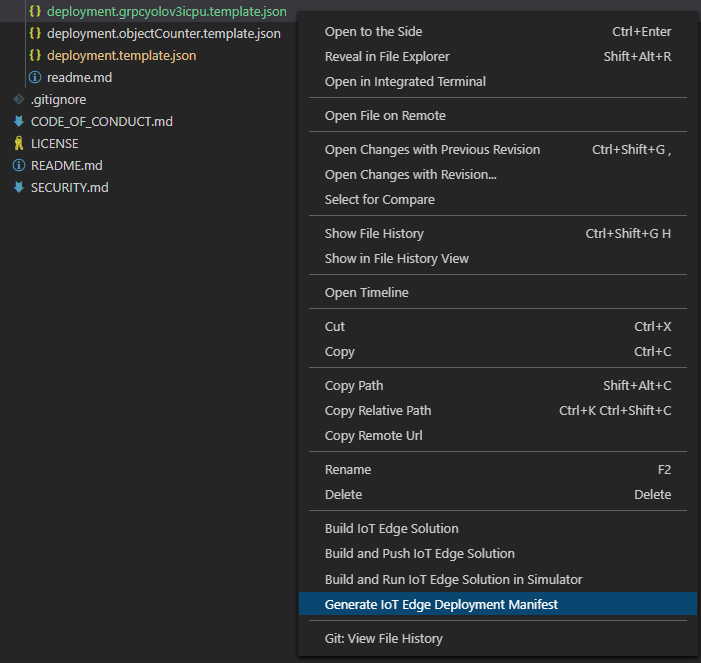
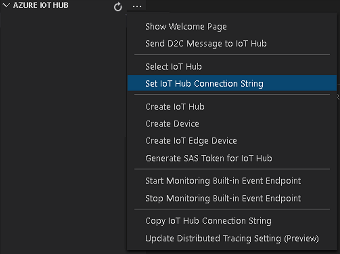
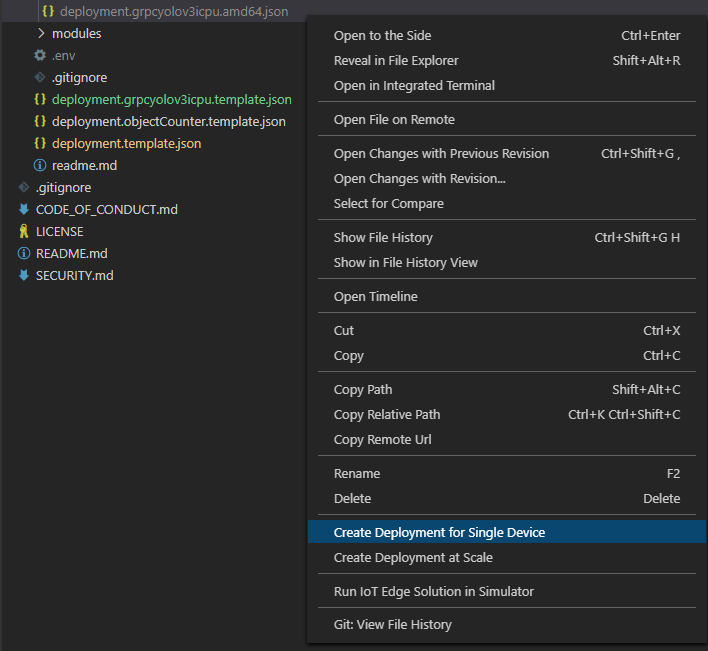
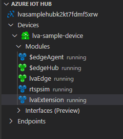
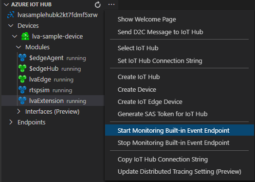

### Examine and edit the sample files

As part of the prerequisites, you downloaded the sample code to a folder. Follow these steps to examine and edit the sample files.

1. In Visual Studio Code, go to *src/edge*. You see your *.env* file and a few deployment template files.

    The deployment.grpcyolov3icpu.template.json refers to the deployment manifest for the edge device. It includes some placeholder values. The .env file includes the values for those variables.
1. Go to the *src/cloud-to-device-console-app* folder. Here you see your *appsettings.json* file and a few other files:
    
    * operations.json - A list of the operations that you want the program to run.
    * main.py - The sample program code. This code:

        * Loads the app settings.
        * Invokes direct methods that the Live Video Analytics on IoT Edge module exposes. You can use the module to analyze live video streams by invoking its direct methods.
        * Pauses so that you can examine the program's output in the **TERMINAL** window and examine the events that were generated by the module in the **OUTPUT** window.
        * Invokes direct methods to clean up resources.
1. Edit the *operations.json* file:
 
    * Change the link to the graph topology:
    * `"topologyUrl"` : `"https://raw.githubusercontent.com/Azure/live-video-analytics/master/MediaGraph/topologies/grpcExtension/topology.json"`
    * Under GraphInstanceSet, edit the name of the graph topology to match the value in the preceding link:
    * `"topologyName"` : `"InferencingWithGrpcExtension"`
    * Under GraphTopologyDelete, edit the name:
    * `"name"` : `"InferencingWithGrpcExtension"`

> [!NOTE]
> <p>
> <details>
> <summary>Expand this and check out how the MediaGraphGrpcExtension node is implemented in the topology</summary>
> <pre><code>
> {
> 	"@type": "#Microsoft.Media.MediaGraphGrpcExtension",
> 	"name": "grpcExtension",
> 	"endpoint": {
> 		"@type": "#Microsoft.Media.MediaGraphUnsecuredEndpoint",
> 		"url": "${grpcExtensionAddress}",
> 		"credentials": {
> 			"@type": "#Microsoft.Media.MediaGraphUsernamePasswordCredentials",
> 			"username": "${grpcExtensionUserName}",
> 			"password": "${grpcExtensionPassword}"
> 		}
> 	},
> 	"dataTransfer": {
> 		"mode": "sharedMemory",
> 		"SharedMemorySizeMiB": "5"
> 	},
> 	"image": {
> 		"scale": {
> 			"mode": "${imageScaleMode}",
> 			"width": "${frameWidth}",
> 			"height": "${frameHeight}"
> 		},
> 		"format": {
> 			"@type": "#Microsoft.Media.MediaGraphImageFormatEncoded",
> 			"encoding": "${imageEncoding}",
> 			"quality": "${imageQuality}"
> 		}
> 	},
> 	"inputs": [
> 		{
> 			"nodeName": "motionDetection"
> 		}
> 	]
> }          
> </code></pre>
> </details>    
> </p>
    
### Generate and deploy the IoT Edge deployment manifest

1. Right-click the *src/edge/* *deployment.grpcyolov3icpu.template.json* file and then select **Generate IoT Edge Deployment Manifest**.

    

    The *deployment.grpcyolov3icpu.amd64.json* manifest file is created in the *src/edge/config* folder.
1. If you completed the [Detect motion and emit events](../../../detect-motion-emit-events-quickstart.md) quickstart, then skip this step.

    Otherwise, near the **AZURE IOT HUB** pane in the lower-left corner, select the **More actions** icon and then select **Set IoT Hub Connection String**. You can copy the string from the *appsettings.json* file. Or, to ensure you've configured the proper IoT hub within Visual Studio Code, use the [Select IoT hub command](https://github.com/Microsoft/vscode-azure-iot-toolkit/wiki/Select-IoT-Hub).

    
1. Right-click *src/edge/config/* *deployment.grpcyolov3icpu.amd64.json* and select **Create Deployment for Single Device**.

    
1. When you're prompted to select an IoT Hub device, select **lva-sample-device**.
1. After about 30 seconds, in the lower-left corner of the window, refresh Azure IoT Hub. The edge device now shows the following deployed modules:

    * The Live Video Analytics module, named **lvaEdge**.
    * The **rtspsim** module, which simulates an RTSP server and acts as the source of a live video feed.

        > [!NOTE]
        > If you are using your own edge device instead of the one provisioned by our setup script, go to your edge device and run the following commands with **admin rights**, to pull and store the sample video file used for this quickstart:  

        ```
        mkdir /home/lvaadmin/samples
        mkdir /home/lvaadmin/samples/input    
        curl https://lvamedia.blob.core.windows.net/public/camera-300s.mkv > /home/lvaadmin/samples/input/camera-300s.mkv  
        chown -R lvaadmin /home/lvaadmin/samples/  
        ```
    * The **lvaExtension** module, which is the YOLOv3 object detection model that uses gRPC as the communication method and applies computer vision to the images and returns multiple classes of object types.
    
    

### Prepare to monitor events

1. In Visual Studio Code, open the **Extensions** tab (or press Ctrl+Shift+X) and search for Azure IoT Hub.
1. Right click and select **Extension Settings**.

    > [!div class="mx-imgBorder"]
    > :::image type="content" source="../../../media/run-program/extensions-tab.png" alt-text="Extension Settings":::
1. Search and enable “Show Verbose Message”.

    > [!div class="mx-imgBorder"]
    > :::image type="content" source="../../../media/run-program/show-verbose-message.png" alt-text="Show Verbose Message":::
1. Right-click the Live Video Analytics device and select **Start Monitoring Built-in Event Endpoint**. You need this step to monitor the IoT Hub events in the **OUTPUT** window of Visual Studio Code.

   

### Run the sample program

1. To start a debugging session, select the F5 key. You see messages printed in the TERMINAL window.
1. The *operations.json* code starts off with calls to the direct methods `GraphTopologyList` and `GraphInstanceList`. If you cleaned up resources after you completed previous quickstarts, then this process will return empty lists and then pause. To continue, select the Enter key.
    
    ```
    -------------------------------Executing operation GraphTopologyList-----------------------  
    Request: GraphTopologyList  --------------------------------------------------
    {
    "@apiVersion": "1.0"
    }
    ---------------  
    Response: GraphTopologyList - Status: 200  ---------------
    {
    "value": []
    }
    --------------------------------------------------------------------------
    Executing operation WaitForInput
    Press Enter to continue
    ```
    
    The **TERMINAL** window shows the next set of direct method calls:
    
    * A call to `GraphTopologySet` that uses the preceding topologyUrl
    * A call to `GraphInstanceSet` that uses the following body:
    
    ```
    {
      "@apiVersion": "1.0",
      "name": "Sample-Graph-1",
      "properties": {
        "topologyName": "InferencingWithGrpcExtension",
        "description": "Sample graph description",
        "parameters": [
          {
            "name": "rtspUrl",
            "value": "rtsp://rtspsim:554/media/camera-300s.mkv"
          },
          {
            "name": "rtspUserName",
            "value": "testuser"
          },
          {
            "name": "rtspPassword",
            "value": "testpassword"
          }
        ]
      }
    }
    ```
    
    * A call to `GraphInstanceActivate` that starts the graph instance and the flow of video.
    * A second call to `GraphInstanceList` that shows that the graph instance is in the running state.
1. The output in the **TERMINAL** window pauses at a Press Enter to continue prompt. Don't select Enter yet. Scroll up to see the JSON response payloads for the direct methods you invoked.
1. Switch to the **OUTPUT** window in Visual Studio Code. You see messages that the Live Video Analytics on IoT Edge module is sending to the IoT hub. The following section of this quickstart discusses these messages.
1. The media graph continues to run and print results. The RTSP simulator keeps looping the source video. To stop the media graph, return to the **TERMINAL** window and select Enter.
1. The next series of calls cleans up resources:
    
    * A call to `GraphInstanceDeactivate` deactivates the graph instance.
    * A call to `GraphInstanceDelete` deletes the instance.
    * A call to `GraphTopologyDelete` deletes the topology.
    * A final call to `GraphTopologyList` shows that the list is empty.

