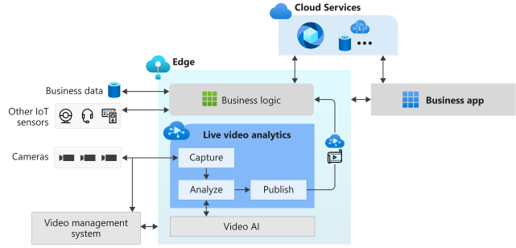

# What is Live Video Analytics on IoT Edge? (preview)

Live Video Analytics on IoT Edge provides a platform to build intelligent video applications that span the edge and the cloud. The platform offers the capability to capture, record, and analyze live video along with publishing the results (video and/or video analytics) to Azure services (in the cloud and/or the edge). The platform can be used to enhance IoT solutions with video analytics. Live Video Analytics on IoT Edge functionality can be combined with other Azure IoT Edge modules such as Stream Analytics on IoT Edge, Cognitive Services on IoT Edge as well as Azure services in the cloud such as Media Services, Event Hub, Cognitive Services, etc. to build powerful hybrid (for example, edge + cloud) applications.

Live Video Analytics on IoT Edge is designed to be an extensible platform, enabling you to connect different video analysis edge modules (such as Cognitive services containers, custom edge modules built by you with open-source machine learning models or custom models trained with your own data) to it and use them to analyze live video without worrying about the complexity of building and running a live video pipeline.

## Accelerate IoT solutions development 

IoT solutions that combine video analytics with signals from other IoT sensors and/or business data can help you automate or semi-automate business decisions, resulting in productivity improvements. Live Video Analytics on IoT Edge enables you to build such solutions quicker. You can focus on building the video analysis modules and logic that is specific to your business, and letting the platform hide the complexities of managing and running a video pipeline.

With Live Video Analytics on IoT Edge, you can continue to use your [CCTV cameras](https://en.wikipedia.org/wiki/Closed-circuit_television_camera) with your existing [video management systems (VMS)](https://en.wikipedia.org/wiki/Video_management_system) and build video analytics apps independently. Live Video Analytics on IoT Edge can be used in conjunction with computer vision SDKs and toolkits to build cutting edge IoT solutions. The diagram below illustrates this.

## Supported environments

Linux x86-64 and ARM64 environments are supported.
> [!NOTE]
> Support for ARM64 devices is available in builds `1.0.4` and newer.
> Support for running Azure IoT Edge runtime on ARM64 devices is in [public preview](https://azure.microsoft.com/support/legal/preview-supplemental-terms/).

## Get started

Read the following concept articles, and then try a quickstart to run motion detection on a live video feed.

### Concepts

* [Media graph](media-graph-concept.md)
* [Video recording](video-recording-concept.md)
* [Video playback](video-playback-concept.md)
* [Continuous video recording](continuous-video-recording-concept.md)
* [Event-based video recording](event-based-video-recording-concept.md)
* [Live Video Analytics without video recording](analyze-live-video-concept.md)

## Next steps

* Follow the [Quickstart: Run Live Video Analytics with your own model](use-your-model-quickstart.md) article to see how you can run motion detection on a live video feed.
* Review [terminology](terminology.md)
* Explore [Live Video Analytics open source material](https://github.com/Azure/live-video-analytics)

