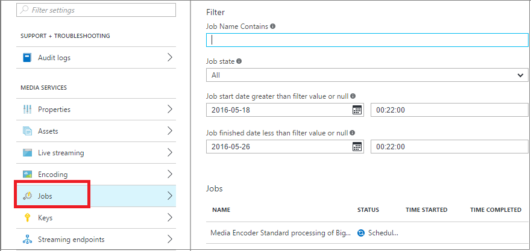

# Monitor encoding job progress with the Azure portal

[!INCLUDE [media services api v2 logo](./includes/v2-hr.md)]

> [!NOTE]
> No new features or functionality are being added to Media Services v2.  Check out the latest version, [Media Services v3](../latest/index.yml). Also, see [migration guidance from v2 to v3](../latest/migrate-from-v2-to-v3.md)

## Overview

When you run jobs, you often require a way to track job progress. 

To monitor the progress of the encoding job, click **Settings** (at the top of the page) and then select **Jobs**.

You can click the job to see more details.

## Next steps
After your encoding job is one, you can publish and play your assets, as described [here](media-services-portal-publish.md).

## Media Services learning paths
[!INCLUDE [media-services-learning-paths-include](../../../includes/media-services-learning-paths-include.md)]

## Provide feedback
[!INCLUDE [media-services-user-voice-include](../../../includes/media-services-user-voice-include.md)]
