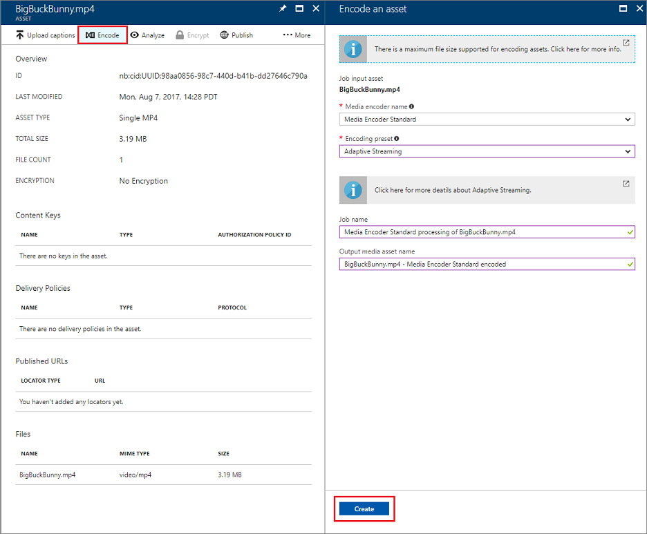

# Encode an asset by using Media Encoder Standard in the Azure portal

> [!NOTE]
> To complete this tutorial, you need an Azure account. For details, see [Azure free trial](https://azure.microsoft.com/pricing/free-trial/). 
> 
> 

One of the most common scenarios in working with Azure Media Services is delivering adaptive bitrate streaming to your clients. Media Services supports the following adaptive bitrate streaming technologies: Apple HTTP Live Streaming (HLS), Microsoft Smooth Streaming, and Dynamic Adaptive Streaming over HTTP (DASH, also called MPEG-DASH). To prepare your videos for adaptive bitrate streaming, first encode your source video as multi-bitrate files. You can use Media Encoder Standard to encode your videos.  

Media Services gives you dynamic packaging. With dynamic packaging, you can deliver your multi-bitrate MP4s in HLS, Smooth Streaming, and MPEG-DASH, without repackaging in these streaming formats. When you use dynamic packaging, you can store and pay for the files in single-storage format. Media Services builds and serves the appropriate response based on a client's request.

To take advantage of dynamic packaging, you must encode your source file into a set of multi-bitrate MP4 files. The encoding steps are demonstrated later in this article.

To learn how to scale media processing, see [Scale media processing by using the Azure portal](media-services-portal-scale-media-processing.md).

## Encode in the Azure portal

To encode your content by using Media Encoder Standard:

1. In the [Azure portal](https://portal.azure.com/), select your Azure Media Services account.
2. Select **Settings** > **Assets**. Select the asset that you want to encode.
3. Select the **Encode** button.
4. In the **Encode an asset** pane, select the **Media Encoder Standard** processor and a preset. For information about presets, see [Auto-generate a bitrate ladder](media-services-autogen-bitrate-ladder-with-mes.md) and [Task presets for Media Encoder Standard](media-services-mes-presets-overview.md). It's important to choose the preset that will work best for your input video. For example, if you know your input video has a resolution of 1920 &#215; 1080 pixels, you might choose the **H264 Multiple Bitrate 1080p** preset. If you have a low-resolution (640 &#215; 360) video, you shouldn't use the **H264 Multiple Bitrate 1080p** preset.
   
   To help you manage your resources, you can edit the name of the output asset and the name of the job.
   
   
5. Select **Create**.

## Media Services learning paths
[!INCLUDE [media-services-learning-paths-include](../../../includes/media-services-learning-paths-include.md)]

## Provide feedback
[!INCLUDE [media-services-user-voice-include](../../../includes/media-services-user-voice-include.md)]

## Next steps
* [Monitor the progress of your encoding job](media-services-portal-check-job-progress.md) in the Azure portal.  

