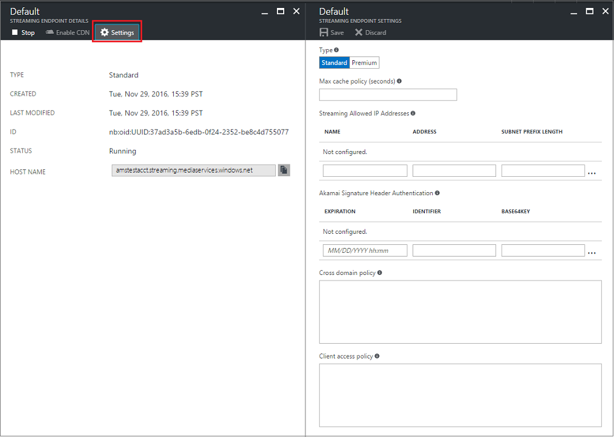
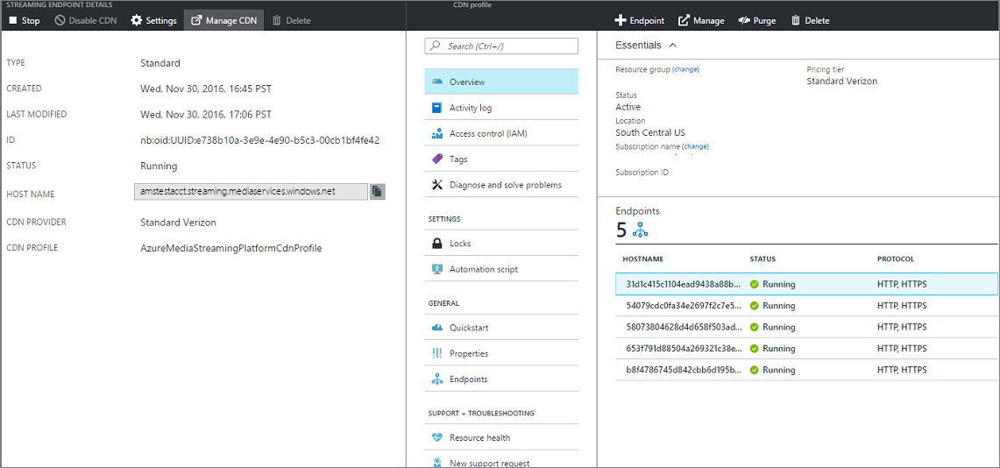

---

title: Manage streaming endpoints with the Azure portal | Microsoft Docs
description: This article demonstrates how to manage streaming endpoints with the Azure portal.
services: media-services
documentationcenter: ''
author: Juliako
writer: juliako
manager: femila
editor: ''

ms.assetid: bb1aca25-d23a-4520-8c45-44ef3ecd5371
ms.service: media-services
ms.workload: media
ms.tgt_pltfrm: na
ms.devlang: na
ms.topic: article
ms.date: 03/19/2019
ms.author: juliako

---

# Manage streaming endpoints with the Azure portal

[!INCLUDE [media services api v2 logo](./includes/v2-hr.md)]

This article shows  how to use the Azure portal to manage streaming endpoints. 

>[!NOTE]
>Make sure to review the [overview](media-services-streaming-endpoints-overview.md) article. 

For information about how to scale the streaming endpoint, see [this](media-services-portal-scale-streaming-endpoints.md) article.

## Start managing streaming endpoints 

To start managing streaming endpoints for your account, do the following.

1. In the [Azure portal](https://portal.azure.com/), select your Azure Media Services account.
2. In the **Settings** blade, select **Streaming endpoints**.
   
    

> [!NOTE]
> You are only billed when your Streaming Endpoint is in running state.

## Add/delete a streaming endpoint

>[!NOTE]
>The default streaming endpoint cannot be deleted.

To add/delete streaming endpoint using the Azure portal, do the following:

1. To add a streaming endpoint, click the **+ Endpoint** at the top of the page. 

	You might want multiple Streaming Endpoints if you plan to have different CDNs or a CDN and direct access.

2. To delete a streaming endpoint, press **Delete** button.      
3. Click the **Start** button to start the streaming endpoint.
   
    

## Configuring the Streaming Endpoint
Streaming Endpoint enables you to configure the following properties:

* Access control
* Cache control
* Cross site access policies

For detailed information about these properties, see [StreamingEndpoint](/rest/api/media/operations/streamingendpoint).

>[!NOTE]
>When CDN is enabled, you cannot access IP access. IP access is only applicable when you don’t have CDN.

You can configure streaming endpoint by doing the following:

1. Select the streaming endpoint you want to configure.
2. Click **Settings**.

A brief description of the fields follows.

1. Maximum cache policy: used to configure cache lifetime for assets served through this streaming endpoint. If no value is set, the default is used. The default values can also be defined directly in Azure storage. If Azure CDN is enabled for the streaming endpoint, you should not set the cache policy value to less than 600 seconds.  
2. Allowed IP addresses: used to specify IP addresses that would be allowed to connect to the published streaming endpoint. If no IP addresses specified, any IP address would be able to connect. IP addresses can be specified as either a single IP address (for example, '10.0.0.1'), an IP range using an IP address and a CIDR subnet mask (for example, '10.0.0.1/22'), or an IP range using IP address and a dotted decimal subnet mask (for example, '10.0.0.1(255.255.255.0)').
3. Configuration for Akamai signature header authentication: used to specify how signature header authentication request from Akamai servers is configured. Expiration is in UTC.

## Scale your Premium streaming endpoint

For more information, see [this](media-services-portal-scale-streaming-endpoints.md) article.

## Enable Azure CDN integration

When you create a new account, default Streaming Endpoint Azure CDN integration is enabled by default.

If you later want to disable/enable the CDN, your streaming endpoint must be in the **stopped** state. It could take up to two hours for the Azure CDN integration to get enabled and for the changes to be active across all the CDN POPs. However, your can start your streaming endpoint and stream without interruptions from the streaming endpoint and once the integration is complete, the stream is delivered from the CDN. During the provisioning period your streaming endpoint will be in **starting** state and you might observe degraded performance.

CDN integration is enabled in all the Azure data centers except China and Federal Government regions.

Once it is enabled, the **Access Control**, **Custom hostname, and **Akamai Signature authentication** configuration gets disabled.
 
> [!IMPORTANT]
> Azure Media Services integration with Azure CDN is implemented on **Azure CDN from Verizon** for standard streaming endpoints. Premium streaming endpoints can be configured using all **Azure CDN pricing tiers and providers**. For more information about Azure CDN features, see the [CDN overview](../../cdn/cdn-overview.md).
 
### Additional considerations

* When CDN is enabled for a streaming endpoint, clients cannot request content directly from the origin. If you need the ability to test your content with or without CDN, you can create another streaming endpoint that isn't CDN enabled.
* Your streaming endpoint hostname remains the same after enabling CDN. You don’t need to make any changes to your media services workflow after CDN is enabled. For example, if your streaming endpoint hostname is strasbourg.streaming.mediaservices.windows.net, after enabling CDN, the exact same hostname is used.
* For new streaming endpoints, you can enable CDN simply by creating a new endpoint; for existing streaming endpoints, you need to first stop the endpoint and then enable/disable the CDN.
* Standard streaming endpoint can only be configured using **Verizon Standard CDN provider** using Azure classic portal. However, you can enable other Azure CDN providers using REST APIs.

## Configure CDN profile

You can configure the CDN profile by selecting the **Manage CDN** button from the top.

## Next steps
Review Media Services learning paths.

[!INCLUDE [media-services-learning-paths-include](../../../includes/media-services-learning-paths-include.md)]

## Provide feedback
[!INCLUDE [media-services-user-voice-include](../../../includes/media-services-user-voice-include.md)]
