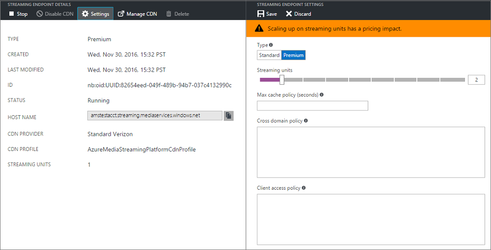

# Scale streaming endpoints with the Azure portal

[!INCLUDE [media services api v2 logo](./includes/v2-hr.md)]

## Overview

> [!NOTE]
> To complete this tutorial, you need an Azure account. For details, see [Azure Free Trial](https://azure.microsoft.com/pricing/free-trial/). 
> 
> 

**Premium** streaming endpoints are suitable for advanced workloads, providing dedicated and scalable bandwidth capacity. Customers that have a **Premium** streaming endpoint, by default get one streaming unit (SU). The streaming endpoint can be scaled by adding SUs. Each SU provides additional bandwidth capacity to the application. For more information about streaming endpoint types and CDN configuration, see the [Streaming Endpoint overview](media-services-streaming-endpoints-overview.md) topic.
 
This topic shows how to scale a streaming endpoint.

For information about pricing details, see [Media Services Pricing Details](https://azure.microsoft.com/pricing/details/media-services/).

## Scale streaming endpoints

To change the number of streaming units, do the following:

1. In the [Azure portal](https://portal.azure.com/), select your Azure Media Services account.
2. In the **Settings** window, select **Streaming endpoints**.
3. Click on the streaming endpoint that you want to scale. 

	> [!NOTE] 
	> You can only scale **Premium** streaming endpoints.

4. Move the slider to specify the number of streaming units.

	

## Next steps
Review Media Services learning paths.

[!INCLUDE [media-services-learning-paths-include](../../../includes/media-services-learning-paths-include.md)]

## Provide feedback
[!INCLUDE [media-services-user-voice-include](../../../includes/media-services-user-voice-include.md)]

