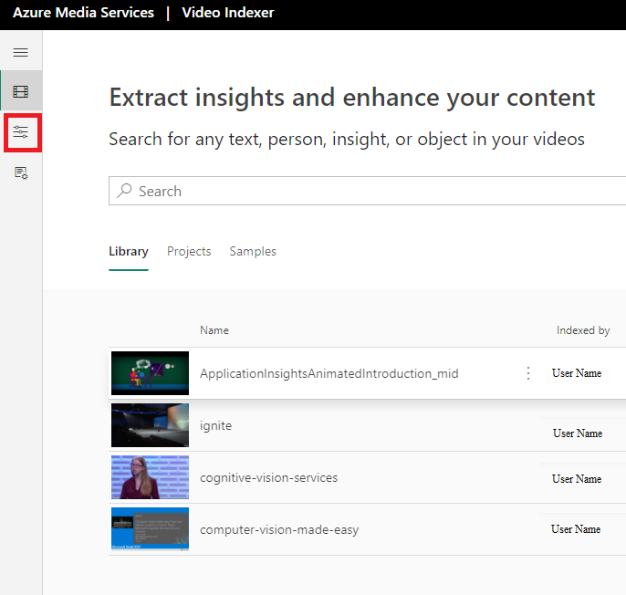
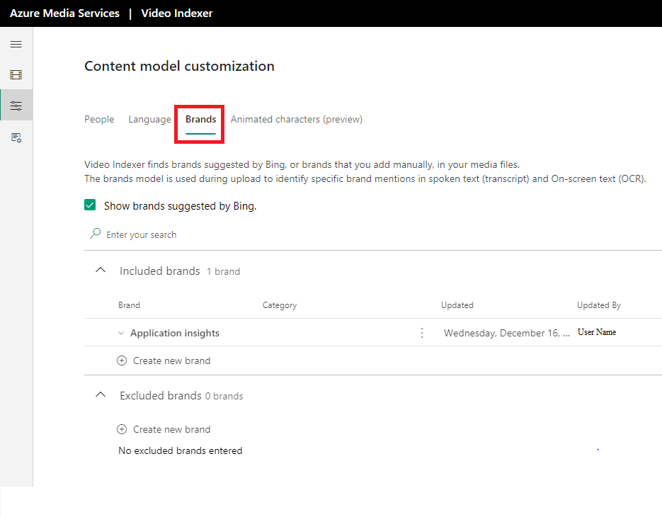

# Customize a Brands model with the Video Indexer website

Video Indexer supports brand detection from speech and visual text during indexing and reindexing of video and audio content. The brand detection feature identifies mentions of products, services, and companies suggested by Bing's brands database. For example, if Microsoft is mentioned in video or audio content or if it shows up in visual text in a video, Video Indexer detects it as a brand in the content.

A custom Brands model allows you to:

- select if you want Video Indexer to detect brands from the Bing brands database.
- select if you want Video Indexer to exclude certain brands from being detected (essentially creating a deny list of brands).
- select if you want Video Indexer to include brands that should be part of your model that might not be in Bing's brands database (essentially creating an accept list of brands).

For a detailed overview, see this [Overview](customize-brands-model-overview.md).

You can use the Video Indexer website to create, use, and edit custom Brands models detected in a video, as described in this topic. You can also use the API, as described in [Customize Brands model using APIs](customize-brands-model-with-api.md).

## Edit Brands model settings

You have the option to set whether or not you want brands from the Bing brands database to be detected. To set this option, you need to edit the settings of your Brands model. Follow these steps:

1. Go to the [Video Indexer](https://www.videoindexer.ai/) website and sign in.
2. To customize a model in your account, select the **Content model customization** button on the top-right corner of the page.

   

3. To edit brands, select the **Brands** tab.

    

4. Check the **Show brands suggested by Bing** option if you want Video Indexer to detect brands suggested by Bing—leave the option unchecked if you don't.

## Include brands in the model

The **Include brands** section represents custom brands that you want Video Indexer to detect, even if they aren't suggested by Bing.  

### Add a brand to include list

1. Select **+ Add brand**.

    

    Provide a name (required), category (optional), description (optional), and reference URL (optional).
    The category field is meant to help you tag your brands. This field shows up as the brand's *tags* when using the Video Indexer APIs. For example, the brand "Azure" can be tagged or categorized as "Cloud".

    The reference URL field can be any reference website for the brand (like a link to its Wikipedia page).

2. Select **Add brand** and you'll see that the brand has been added to the **Include brands** list.

### Edit a brand on the include list

1. Select the pencil icon next to the brand that you want to edit.

    You can update the category, description, or reference URL of a brand. You can't change the name of a brand because names of brands are unique. If you need to change the brand name, delete the entire brand (see next section) and create a new brand with the new name.

2. Select the **Update** button to update the brand with the new information.

### Delete a brand on the include list

1. Select the trash icon next to the brand that you want to delete.
2. Select **Delete** and the brand will no longer appear in your *Include brands* list.

## Exclude brands from the model

The **Exclude brands** section represents the brands that you don't want Video Indexer to detect.

### Add a brand to exclude list

1. Select **+ Add brand.**

    Provide a name (required), category (optional).

2. Select **Add brand** and you'll see that the brand has been added to the *Exclude brands* list.

### Edit a brand on the exclude list

1. Select the pencil icon next to the brand that you want to edit.

    You can only update the category of a brand. You can't change the name of a brand because names of brands are unique. If you need to change the brand name, delete the entire brand (see next section) and create a new brand with the new name.

2. Select the **Update** button to update the brand with the new information.

### Delete a brand on the exclude list

1. Select the trash icon next to the brand that you want to delete.
2. Select **Delete** and the brand will no longer appear in your *Exclude brands* list.

## Next steps

[Customize Brands model using APIs](customize-brands-model-with-api.md)
