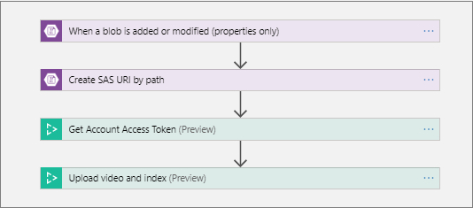
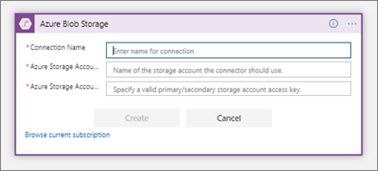
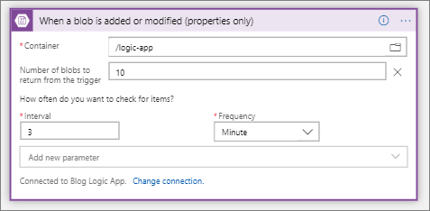
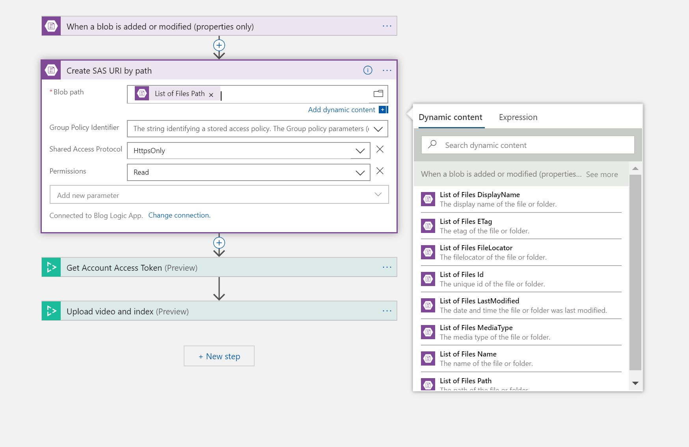
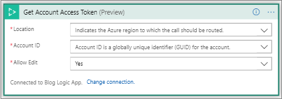
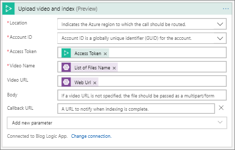
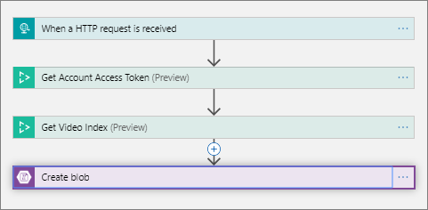
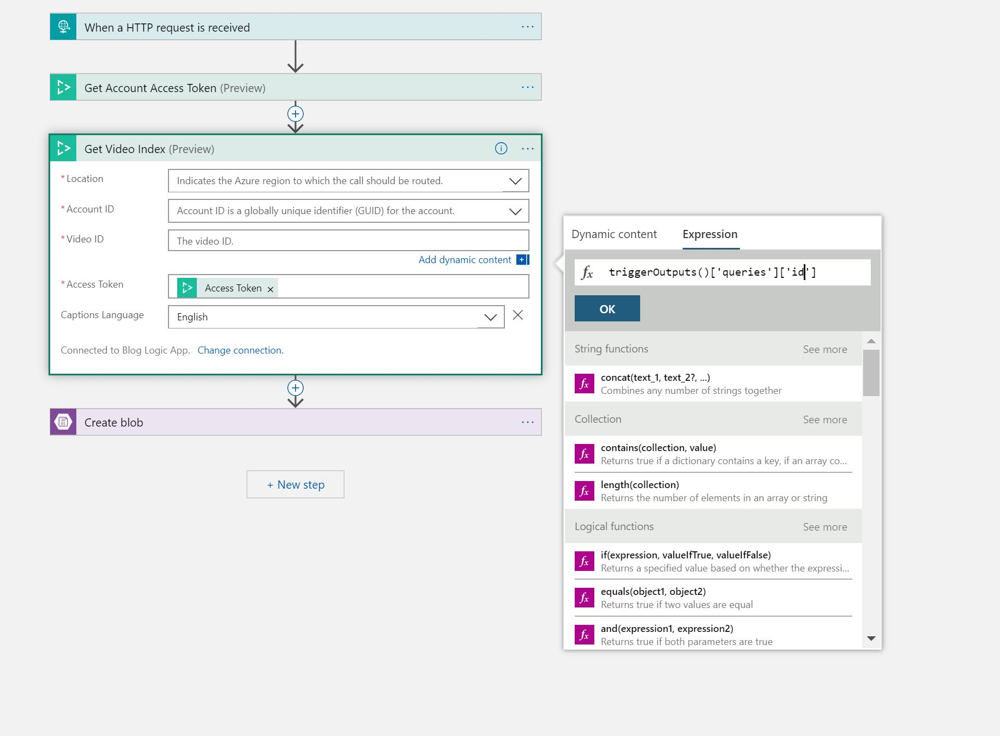

# Tutorial: use Video Indexer with Logic App and Power Automate

Azure Media Services [Video Indexer v2 REST API](https://api-portal.videoindexer.ai/docs/services/Operations/operations/Delete-Video?) supports both server-to-server and client-to-server communication and enables Video Indexer users to integrate video and audio insights easily into their application logic, unlocking new experiences and monetization opportunities.

To make the integration even easier, we support [Logic Apps](https://azure.microsoft.com/services/logic-apps/) and [Power Automate](https://preview.flow.microsoft.com/connectors/shared_videoindexer-v2/video-indexer-v2/) connectors that are compatible with our API. You can use the connectors to set up custom workflows to effectively index and extract insights from a large amount of video and audio files, without writing a single line of code. Furthermore, using the connectors for your integration gives you better visibility on the health of your workflow and an easy way to debug it.  

To help you get started quickly with the Video Indexer connectors, we will do a walkthrough of an example Logic App and Power Automate solution you can set up. This tutorial shows how to set up flows using Logic Apps.

The "upload and index your video automatically" scenario covered in this tutorial is comprised of two different flows that work together. 
* The first flow is triggered when a blob is added or modified in an Azure Storage account. It uploads the new file to Video Indexer with a callback URL to send a notification once the indexing operation completes. 
* The second flow is triggered based on the callback URL and saves the extracted insights back to a JSON file in Azure Storage. This two flow approach is used to support async upload and indexing of larger files effectively. 

This tutorial is using Logic App to show how to:

> [!div class="checklist"]
> * Set up the file upload flow
> * Set up the JSON extraction flow

[!INCLUDE [quickstarts-free-trial-note](../../../includes/quickstarts-free-trial-note.md)]

## Prerequisites

* To begin with, you will need a Video Indexer account along with [access to the APIs via API key](video-indexer-use-apis.md). 
* You will also need an Azure Storage account. Keep note of the access key for your Storage account. Create two containers – one to store videos in and one to store insights generated by Video Indexer in.  
* Next, you will need to open two separate flows on either Logic Apps or Power Automate (depending on which you are using). 

## Set up the first flow - file upload   

The first flow is triggered whenever a blob is added in your Azure Storage container. Once triggered, it will create a SAS URI that you can use to upload and index the video in Video Indexer. In this section you will create the following flow. 

To set up the first flow, you will need to provide your Video Indexer API Key and Azure Storage credentials. 

Once you can connect to your Azure Storage and Video Indexer accounts, find and choose the "When a blob is added or modified" trigger in **Logic Apps Designer**. Select the container that you will place your video files in. 

Next, find and select the "Create SAS URI by path” action. In the dialog for the action, select List of Files Path from the Dynamic content options.  

Also, add a new "Shared Access Protocol" parameter. Choose HttpsOnly for the value of the parameter.

Fill out [your account location](regions.md) and [account ID](./video-indexer-use-apis.md#account-id) to get the Video Indexer account token.

For “Upload video and index”, fill out the required parameters and Video URL. Select “Add new parameter” and select Callback URL. 

You will leave the callback URL empty for now. You’ll add it only after finishing the second flow where the callback URL is created. 

You can use the default value for the other parameters or set them according to your needs. 

Click “Save”, and let’s move on to configure the second flow, to extract the insights once the upload and indexing is completed. 

## Set up the second flow - JSON extraction  

The completion of the uploading and indexing from the first flow will send an HTTP request with the correct callback URL to trigger the second flow. Then, it will retrieve the insights generated by Video Indexer. In this example, it will store the output of your indexing job in your Azure Storage.  However, it is up to you what you can do with the output.  

Create the second flow separate from the first one. 

To set up this flow, you will need to provide your Video Indexer API Key and Azure Storage credentials again. You will need to update the same parameters as you did for the first flow. 

For your trigger, you will see a HTTP POST URL field. The URL won’t be generated until after you save your flow; however, you will need the URL eventually. We will come back to this. 

Fill out [your account location](regions.md) and [account ID](./video-indexer-use-apis.md#account-id) to get the Video Indexer account token.  

Go to the “Get Video Index” action and fill out the required parameters. For Video ID, put in the following expression: triggerOutputs()['queries']['id'] 

This expression tells the connecter to get the Video ID from the output of your trigger. In this case, the output of your trigger will be the output of “Upload video and index” in your first trigger. 

Go to the “Create blob” action and select the path to the folder in which you will save the insights to. Set the name of the blob you are creating. For Blob content, put in the following expression: body(‘Get_Video_Index’) 

This expression takes the output of the “Get Video Index” action from this flow. 

Click **Save flow**. 

Once the flow is saved, an HTTP POST URL is created in the trigger. Copy the URL from the trigger. 

Now, go back to the first flow and paste the URL in the "Upload video and index" action for the Callback URL parameter. 

Make sure both flows are saved, and you’re good to go! 

Try out your newly created Logic App or Power Automate solution by adding a video to your Azure blobs container, and go back a few minutes later to see that the insights appear in the destination folder. 

## Clean up resources

After you are done with this tutorial, feel free to keep this Logic App or Power Automate solution up and running if you need. However, if you do not want to keep this running and do not want to be billed, Turn Off both of your flows if you’re using Power Automate. Disable both of the flows if you’re using Logic Apps. 

## Next steps

This tutorial showed just one Video Indexer connectors example. You can use the Video Indexer connectors for any API call provided by Video Indexer. For example: upload and retrieve insights, translate the results, get embeddable widgets and even customize your models. Additionally, you can choose to trigger those actions based on different sources like updates to file repositories or emails sent. You can then choose to have the results update to our relevant infrastructure or application or generate any number of action items.  

> [!div class="nextstepaction"]
> [Use the Video Indexer API](video-indexer-use-apis.md)
