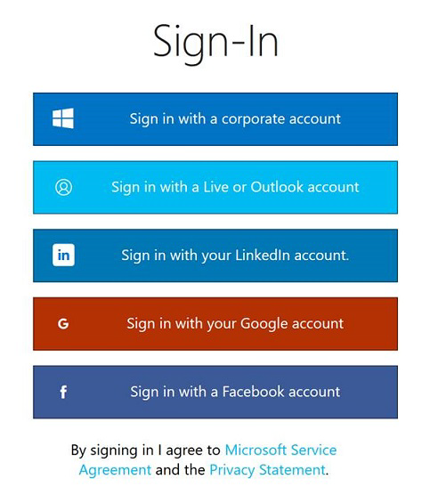
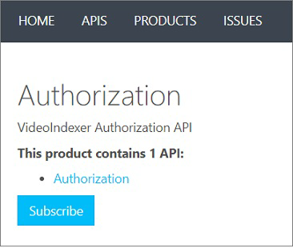
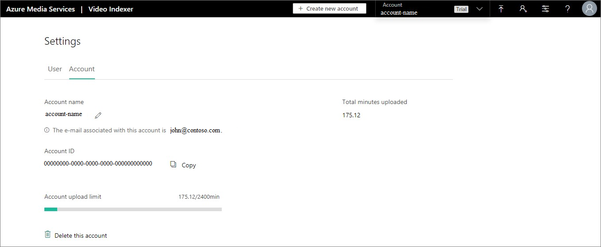

# Tutorial: Use the Video Indexer API

Video Indexer consolidates various audio and video artificial intelligence (AI) technologies offered by Microsoft into one integrated service, making development simpler. The APIs are designed to enable developers to focus on consuming Media AI technologies without worrying about scale, global reach, availability, and reliability of cloud platforms. You can use the API to upload your files, get detailed video insights, get URLs of embeddable insight and player widgets, and more.

When creating a Video Indexer account, you can choose a free trial account (where you get a certain number of free indexing minutes) or a paid option (where you're not limited by the quota). With a free trial, Video Indexer provides up to 600 minutes of free indexing to website users and up to 2400 minutes of free indexing to API users. With a paid option, you create a Video Indexer account that's [connected to your Azure subscription and an Azure Media Services account](connect-to-azure.md). You pay for minutes indexed as well as the Azure Media Services account related charges.

This article shows how the developers can take advantage of the [Video Indexer API](https://api-portal.videoindexer.ai/).

## Subscribe to the API

1. Sign in to [Video Indexer Developer Portal](https://api-portal.videoindexer.ai/).
	
	

   > [!Important]
   > * You must use the same provider you used when you signed up for Video Indexer.
   > * Personal Google and Microsoft (Outlook/Live) accounts can only be used for trial accounts. Accounts connected to Azure require Azure AD.
   > * There can be only one active account per email. If a user tries to sign in with user@gmail.com for LinkedIn and later with user@gmail.com for Google, the latter will display an error page, saying the user already exists.

2. Subscribe.

	Select the [Products](https://api-portal.videoindexer.ai/products) tab. Then, select Authorization and subscribe.
	
	

    > [!NOTE]
    > New users are automatically subscribed to Authorization.
	
	Once you subscribe, you can see your subscription and your primary and secondary keys. The keys should be protected. The keys should only be used by your server code. They shouldn't be available on the client side (.js, .html, and so on).

	

> [!TIP]
> Video Indexer user can use a single subscription key to connect to multiple Video Indexer accounts. You can then link these Video Indexer accounts to different Media Services accounts.

## Obtain access token using the Authorization API

Once you subscribe to the Authorization API, you can obtain access tokens. These access tokens are used to authenticate against the Operations API.

Each call to the Operations API should be associated with an access token, matching the authorization scope of the call.

- User level: User level access tokens let you perform operations on the **user** level. For example, get associated accounts.
- Account level: Account level access tokens let you perform operations on the **account** level or the **video** level. For example, upload video, list all videos, get video insights, and so on.
- Video level: Video level access tokens let you perform operations on a specific **video**. For example, get video insights, download captions, get widgets, and so on.

You can control whether these tokens are read-only or if they allow editing by specifying **allowEdit=true/false**.

For most server-to-server scenarios, you'll probably use the same **account** token since it covers both **account** operations and **video** operations. However, if you're planning to make client side calls to Video Indexer (for example, from JavaScript), you would want to use a **video** access token to prevent clients from getting access to the entire account. That's also the reason that when embedding Video Indexer client code in your client (for example, using **Get Insights Widget** or **Get Player Widget**), you must provide a **video** access token.

To make things easier, you can use the **Authorization** API > **GetAccounts** to get your accounts without obtaining a user token first. You can also ask to get the accounts with valid tokens, enabling you to skip an additional call to get an account token.

Access tokens expire after 1 hour. Make sure your access token is valid before using the Operations API. If it expires, call the Authorization API again to get a new access token.

You're ready to start integrating with the API. Find [the detailed description of each Video Indexer REST API](https://api-portal.videoindexer.ai/).

## Account ID

The Account ID parameter is required in all operational API calls. Account ID is a GUID that can be obtained in one of the following ways:

* Use the **Video Indexer website** to get the Account ID:

    1. Browse to the [Video Indexer](https://www.videoindexer.ai/) website and sign in.
    2. Browse to the **Settings** page.
    3. Copy the account ID.

        

* Use **Video Indexer Developer Portal** to programmatically get the Account ID.

    Use the [Get account](https://api-portal.videoindexer.ai/docs/services/Operations/operations/Get-Account?) API.

    > [!TIP]
    > You can generate access tokens for the accounts by defining `generateAccessTokens=true`.

* Get the account ID from the URL of a player page in your account.

    When you watch a video, the ID appears after the `accounts` section and before the `videos` section.

    ```
    https://www.videoindexer.ai/accounts/00000000-f324-4385-b142-f77dacb0a368/videos/d45bf160b5/
    ```

## Recommendations

This section lists some recommendations when using Video Indexer API.

- If you're planning to upload a video, it's recommended to place the file in some public network location (for example, OneDrive). Get the link to the video and provide the URL as the upload file param.

	The URL provided to Video Indexer must point to a media (audio or video) file. Some of the links generated by OneDrive are for an HTML page that contains the file. An easy verification for the URL is to paste it into a browser—if the file starts downloading, it's likely a good URL. If the browser is rendering some visualization, it's likely not a link to a file but to an HTML page.

- When you call the API that gets video insights for the specified video, you get a detailed JSON output as the response content. [See details about the returned JSON in this topic](video-indexer-output-json-v2.md).

## Code sample

The following C# code snippet demonstrates the usage of all the Video Indexer APIs together.

```csharp
var apiUrl = "https://api.videoindexer.ai";
var accountId = "..."; 
var location = "westus2";
var apiKey = "..."; 

System.Net.ServicePointManager.SecurityProtocol = System.Net.ServicePointManager.SecurityProtocol | System.Net.SecurityProtocolType.Tls12;

// create the http client
var handler = new HttpClientHandler(); 
handler.AllowAutoRedirect = false; 
var client = new HttpClient(handler);
client.DefaultRequestHeaders.Add("Ocp-Apim-Subscription-Key", apiKey); 

// obtain account access token
var accountAccessTokenRequestResult = client.GetAsync($"{apiUrl}/auth/{location}/Accounts/{accountId}/AccessToken?allowEdit=true").Result;
var accountAccessToken = accountAccessTokenRequestResult.Content.ReadAsStringAsync().Result.Replace("\"", "");

client.DefaultRequestHeaders.Remove("Ocp-Apim-Subscription-Key");

// upload a video
var content = new MultipartFormDataContent();
Debug.WriteLine("Uploading...");
// get the video from URL
var videoUrl = "VIDEO_URL"; // replace with the video URL

// as an alternative to specifying video URL, you can upload a file.
// remove the videoUrl parameter from the query string below and add the following lines:
  //FileStream video =File.OpenRead(Globals.VIDEOFILE_PATH);
  //byte[] buffer = new byte[video.Length];
  //video.Read(buffer, 0, buffer.Length);
  //content.Add(new ByteArrayContent(buffer));

var uploadRequestResult = client.PostAsync($"{apiUrl}/{location}/Accounts/{accountId}/Videos?accessToken={accountAccessToken}&name=some_name&description=some_description&privacy=private&partition=some_partition&videoUrl={videoUrl}", content).Result;
var uploadResult = uploadRequestResult.Content.ReadAsStringAsync().Result;

// get the video id from the upload result
var videoId = JsonConvert.DeserializeObject<dynamic>(uploadResult)["id"];
Debug.WriteLine("Uploaded");
Debug.WriteLine("Video ID: " + videoId);           

// obtain video access token
client.DefaultRequestHeaders.Add("Ocp-Apim-Subscription-Key", apiKey);
var videoTokenRequestResult = client.GetAsync($"{apiUrl}/auth/{location}/Accounts/{accountId}/Videos/{videoId}/AccessToken?allowEdit=true").Result;
var videoAccessToken = videoTokenRequestResult.Content.ReadAsStringAsync().Result.Replace("\"", "");

client.DefaultRequestHeaders.Remove("Ocp-Apim-Subscription-Key");

// wait for the video index to finish
while (true)
{
  Thread.Sleep(10000);

  var videoGetIndexRequestResult = client.GetAsync($"{apiUrl}/{location}/Accounts/{accountId}/Videos/{videoId}/Index?accessToken={videoAccessToken}&language=English").Result;
  var videoGetIndexResult = videoGetIndexRequestResult.Content.ReadAsStringAsync().Result;

  var processingState = JsonConvert.DeserializeObject<dynamic>(videoGetIndexResult)["state"];

  Debug.WriteLine("");
  Debug.WriteLine("State:");
  Debug.WriteLine(processingState);

  // job is finished
  if (processingState != "Uploaded" && processingState != "Processing")
  {
      Debug.WriteLine("");
      Debug.WriteLine("Full JSON:");
      Debug.WriteLine(videoGetIndexResult);
      break;
  }
}

// search for the video
var searchRequestResult = client.GetAsync($"{apiUrl}/{location}/Accounts/{accountId}/Videos/Search?accessToken={accountAccessToken}&id={videoId}").Result;
var searchResult = searchRequestResult.Content.ReadAsStringAsync().Result;
Debug.WriteLine("");
Debug.WriteLine("Search:");
Debug.WriteLine(searchResult);

// get insights widget url
var insightsWidgetRequestResult = client.GetAsync($"{apiUrl}/{location}/Accounts/{accountId}/Videos/{videoId}/InsightsWidget?accessToken={videoAccessToken}&widgetType=Keywords&allowEdit=true").Result;
var insightsWidgetLink = insightsWidgetRequestResult.Headers.Location;
Debug.WriteLine("Insights Widget url:");
Debug.WriteLine(insightsWidgetLink);

// get player widget url
var playerWidgetRequestResult = client.GetAsync($"{apiUrl}/{location}/Accounts/{accountId}/Videos/{videoId}/PlayerWidget?accessToken={videoAccessToken}").Result;
var playerWidgetLink = playerWidgetRequestResult.Headers.Location;
Debug.WriteLine("");
Debug.WriteLine("Player Widget url:");
Debug.WriteLine(playerWidgetLink);

```

## See also

- [Video Indexer overview](video-indexer-overview.md)
- [Regions](https://azure.microsoft.com/global-infrastructure/services/?products=cognitive-services)

## Next steps

- [Examine details of the output JSON](video-indexer-output-json-v2.md)
- Check out the [sample code](https://github.com/Azure-Samples/media-services-video-indexer) that demonstrates important aspect of uploading and indexing a video. Following the code wil give you a good idea of how to use our API for basic functionalities. Make sure to read the inline comments and notice our best practices advices.

