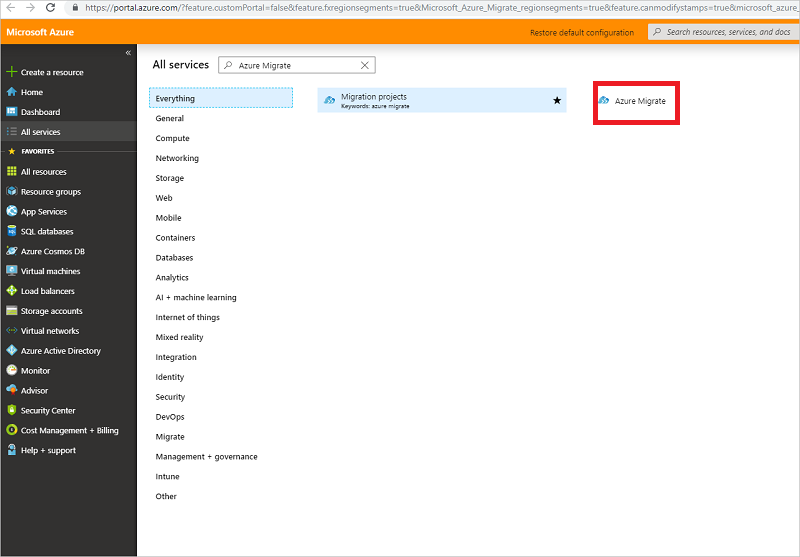

# Add an assessment/migration tool for the first time

This article describes how to add an assessment or migration tool to an [Azure Migrate](migrate-overview.md) project for the first time.  
Azure Migrate provides a central hub to track discovery, assessment and migration of your on-premises apps and workloads, and private/public cloud VMs, to Azure. The hub provides Azure Migrate tools for assessment and migration, as well as other tools and independent software vendor (ISV) [offerings](migrate-services-overview.md#isv-integration) . 

## Create a project and add a tool

Set up a new Azure Migrate project in an Azure subscription, and add a tool.

- An Azure Migrate project is used to store discovery, assessment, and migration metadata collected from the environment you're assessing or migrating. 
- In a project you can track discovered assets, and orchestrate assessment and migration.

1. In the Azure portal > **All services**, search for **Azure Migrate**.
2. Under **Services**, select **Azure Migrate**.

    

3. In **Overview**, click **Assess and migrate servers**.
4. Under **Discover, assess and migrate servers**, click **Assess and migrate servers**.

    

1. In **Discover, assess and migrate servers**, click **Add tools**.
2. In **Migrate project**, select your Azure subscription, and create a resource group if you don't have one.
3. In **Project Details**, specify the project name, and geography in which you want to create the project. 

    

    You can create an Azure Migrate project in any of these geographies.

   **Geography** | **Storage location region**
    --- | ---
    Asia   | Southeast Asia or East Asia
    Europe | North Europe or West Europe
    Japan  | Japan East or Japan West
    United Kingdom | UK South or UK West
    United States | Central US or West US 2
    Canada | Canada Central
    India  | India Central or India South
    Australia | Australia SouthEast

    The geography specified for the project is only used to store the metadata gathered from on-premises VMs. You can select any target region for the actual migration.

    If you want to specify a specific region within a geography for deploying the migrate project and its associated resources (Policy restrictions in your subscription may allow deploying of Azure resources only to a specific Azure region), you can use the below API to create a migrate project. Specify the Subscription ID, Resource group name, Migrate project name along with location(any of the Azure regions mentioned in the table where Azure Migrate is deployed.)

    `PUT /subscriptions/<subid>/resourceGroups/<rg>/providers/Microsoft.Migrate/MigrateProjects/<mymigrateprojectname>?api-version=2018-09-01-preview "{location: 'centralus', properties: {}}"`   

4. Click **Next**, and add an assessment or migration tool.

    > [!NOTE]
    > When you create a project you need to add at least one assessment or migration tool.

5. In **Select assessment tool**, add an assessment tool. If you don't need an assessment tool, select **Skip adding an assessment tool for now** > **Next**. 
2. In **Select migration tool**, add a migration tool as required. If you don't need a migration tool right now, select **Skip adding a migration tool for now** > **Next**.
3. In **Review + add tools**, review the settings and click **Add tools**.

After creating the project you can select additional tools for assessment and migration of servers and workloads, databases, and web apps.

## Create additional projects

In some circumstances, you might need to create additional Azure Migrate projects. For example if you have datacenters in different geographies, or you need to store metadata in a different geography. Create an additional project as follows:

1. In the current Azure Migrate project, click **Servers** or **Databases**.
2. In the top right-hand corner, click **Change** next to the current project name.
3. In **Settings**, select **Click here to create a new project**.
4. Create a new project and add a new tool as described in the previous procedure.

## Next steps

Learn how to add additional [assessment](how-to-assess.md) and [migration](how-to-migrate.md) tools. 
