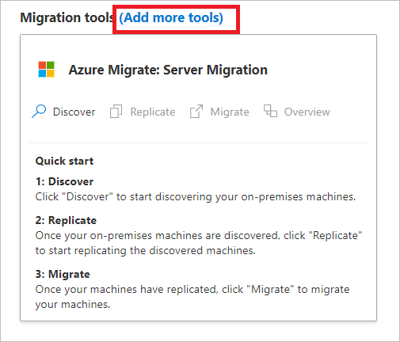
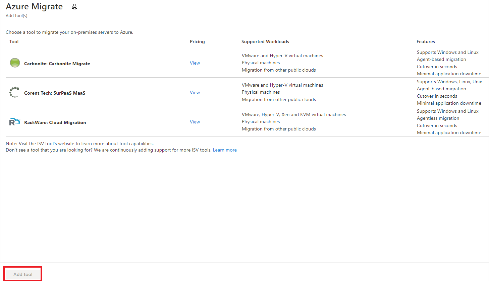
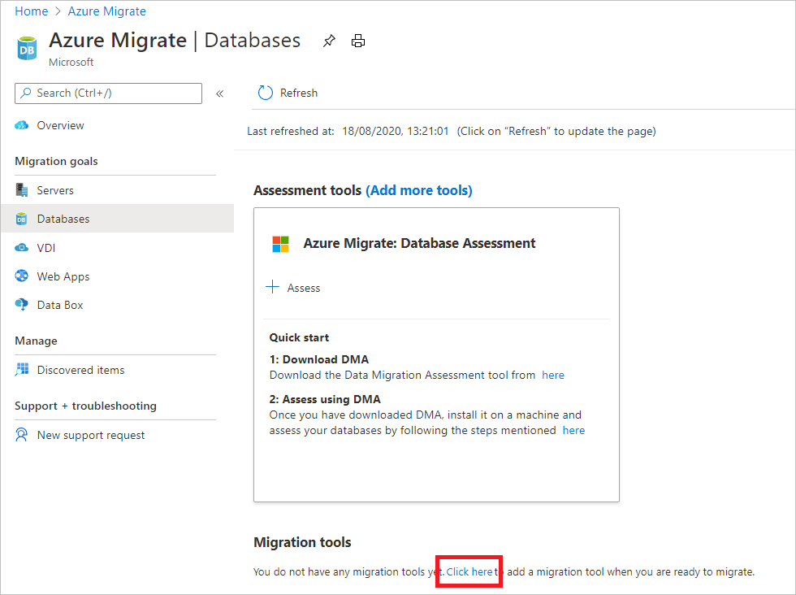
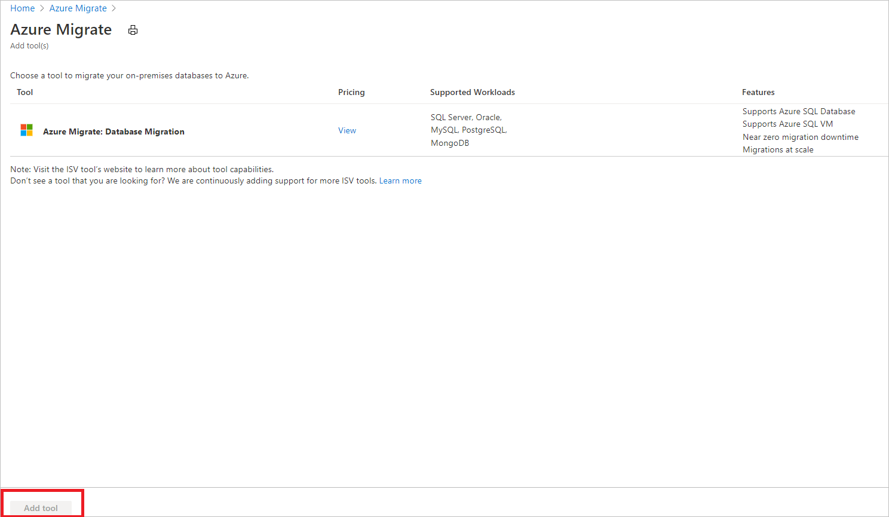
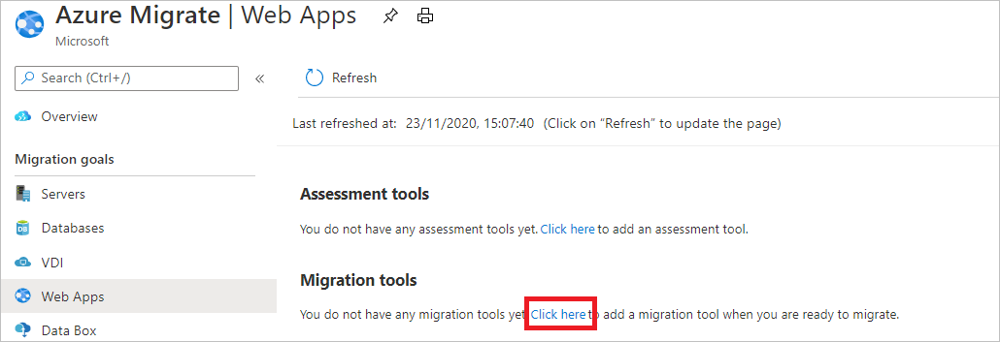
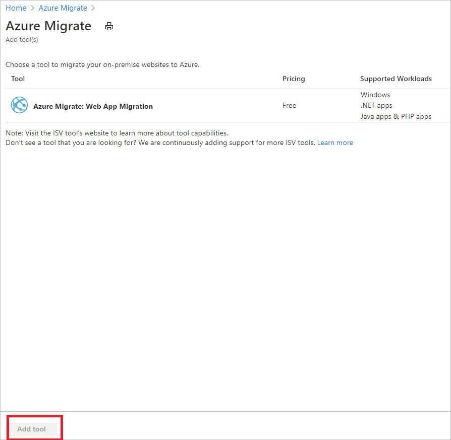

# Add migration tools

This article describes how to add migration tools in [Azure Migrate](./migrate-services-overview.md).

- If you want to add a migration tool and haven't yet set up an Azure Migrate project, follow this [article](create-manage-projects.md).
- If you've added an ISV tool for migration, [follow the steps](prepare-isv-movere.md), to prepare to work with the tool.

## Select a migration scenario

1. In the Azure Migrate project, click **Overview**.
2. Select the migration scenario you want to use:

    - To migrate machines and workloads to Azure, select **Assess and migrate servers**.
    - To migrate on-premises databases, select **Assess and migrate databases**.
    - To migrate on-premises web apps, select **Explore more** > **Web Apps**.
    - To migrate data to Azure using Data box, select **Explore more** > **Data box**.

    

## Select a server migration tool

1. Add a tool:

    - If you created an Azure Migrate project using the **Assess and migrate servers** option in the portal, the Azure Migrate Server Migration tool is automatically added to the project. To add additional migration tools, in **Servers**, next to **Migration tools**, select **Add more tools**.
    
         

    - If you created a project using a different option, and don't yet have any migration tools, in **Servers** > **Migration tools**, select **Click here**.

    

2. In **Azure Migrate** > **Add tools**, select the tools you want to add. Then select **Add tool**.

    

## Select a database migration tool

If you created an Azure Migrate project using the **Assess and migrate database** option in the portal, the Database Migration tool is automatically added to the project. 

1. If the Database Migration tool isn't in the project, in **Databases** > **Assessment tools**, select **Click here**.
    
    

2. In **Azure Migrate** > **Add tools**, select the Database Migration tool. Then select **Add tool**.

    

    

## Select a web app migration tool

If you created an Azure Migrate project using the **Explore more** > **WebApps** option in the portal, the Web app migration tool is automatically added to the project. 

1. If the Web app migration tool isn't in the project, in **Web apps** > **Assessment tools**, select **Click here**.

    
 

2. In **Azure Migrate** > **Add tools**, select the Web App Migration tool. Then select **Add tool**.

    

## Order an Azure Data Box

To migrate large amounts of data to Azure,  you can order an Azure Data Box for offline data transfer.

1. In **Overview**, select **Explore more**.
2. In **Explore more**, select **Data box**.
3. In **Get started with Data Box**, select the subscription and resource group you want to use when ordering a Data Box.
4. The **Transfer type** is an import to Azure. Specify the country in which the data resides, and the Azure region to which you want to transfer the data. 
5. Click **Apply** to save the settings.

## Next steps

Try out a migration using the Azure Migrate Server Migration tool for [Hyper-V](tutorial-migrate-hyper-v.md) or [VMware](tutorial-migrate-vmware.md) VMs.
