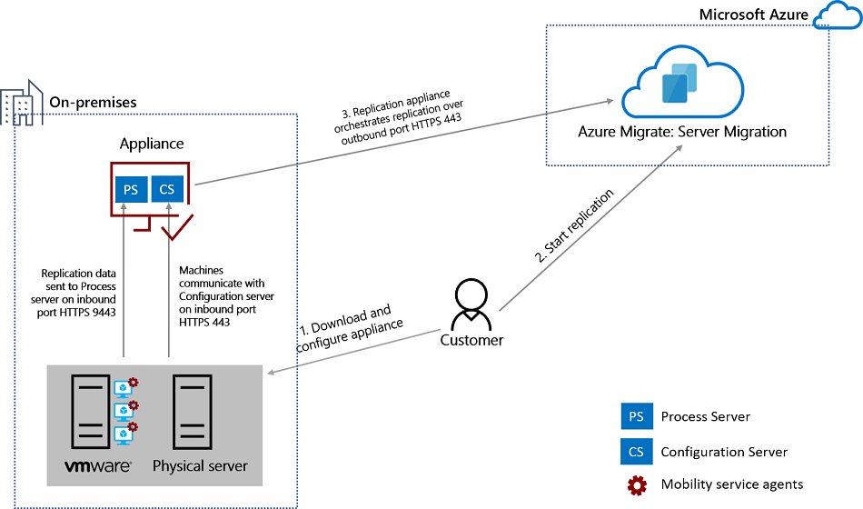

# Replication appliance

This article describes the replication appliance used by Azure Migrate: Server Assessment when migrating VMware VMs, physical machines, and private/public cloud VMs to Azure, using an agent-based migration. 

The tool is available in the [Azure Migrate](migrate-overview.md) hub. The hub provides native tools for assessment and migration, as well as tools from other Azure services, and from third-party independent software vendors (ISVs).

## Appliance overview

The replication appliance is deployed as a single on-premises machine, either as a VMware VM or a physical server. It runs:
- **Replication appliance**: The replication appliance coordinates communications, and manages data replication, for on-premises VMware VMs and physical servers replicating to Azure.
- **Process server**: The process server, which is installed by default on the replication appliance, and does the following:
    - **Replication gateway**: It acts as a replication gateway. It receives replication data from machines enabled for replication. It optimizes replication data with caching, compression, and encryption, and sends it to Azure.
    - **Agent installer**: Performs a push installation of the Mobility Service. This service must be installed and running on each on-premises machine that you want to replicate for migration.

## Appliance deployment

**Deploy as** | **Used for** | **Details**
--- | --- |  ---
VMware VM | Usually used when migrating VMware VMs using the Azure Migrate Migration tool with agent-based migration. | You download OVA template from the Azure Migrate hub, and import to vCenter Server to create the appliance VM.
A physical machine | Used when migrating on-premises physical servers if you don't have a VMware infrastructure, or if you're unable to create a VMware VM using an OVA template. | You download a software installer from the Azure Migrate hub, and run it to set up the appliance machine.

## Appliance deployment requirements

[Review](migrate-support-matrix-vmware.md#agent-based-migration-replication-appliance-requirements) the deployment requirements.

## Appliance license
The appliance comes with a Windows Server 2016 evaluation license, which is valid for 180 days. If the evaluation period is close to expiry, we recommend that you download and deploy a new appliance, or that you activate the operating system license of the appliance VM.

## Replication process

1. When you enable replication for a VM, initial replication to Azure storage begins, using the specified replication policy. 
2. Traffic replicates to Azure storage public endpoints over the internet. Replicating traffic over a site-to-site virtual private network (VPN) from an on-premises site to Azure isn't supported.
3. After initial replication finishes, delta replication begins. Tracked changes for a machine are logged.
4. Communication happens as follows:
    - VMs communicate with the replication appliance on port HTTPS 443 inbound, for replication management.
    - The replication appliance orchestrates replication with Azure over port HTTPS 443 outbound.
    - VMs send replication data to the process server (running on the replication appliance) on port HTTPS 9443 inbound. This port can be modified.
    - The process server receives replication data, optimizes and encrypts it, and sends it to Azure storage over port 443 outbound.
5. The replication data logs first land in a cache storage account in Azure. These logs are processed and the data is stored in an Azure managed disk.

## Appliance upgrades

The appliance is upgraded manually from the Azure Migrate hub. We recommend that you always run the latest version.

1. In Azure Migrate > Servers > Azure Migrate: Server Assessment, Infrastructure servers, click **Configuration servers**.
2. In **Configuration servers**, a link appears in **Agent Version** when a new version of the replication appliance is available. 
3. Download the installer to the replication appliance machine, and install the upgrade. The installer detects the version current running on the appliance.
 
## Next steps

[Learn how](tutorial-assess-vmware.md#set-up-the-appliance-vm) to set up the appliance for VMware.
[Learn how](tutorial-assess-hyper-v.md#set-up-the-appliance-vm) to set up the appliance for Hyper-V.

