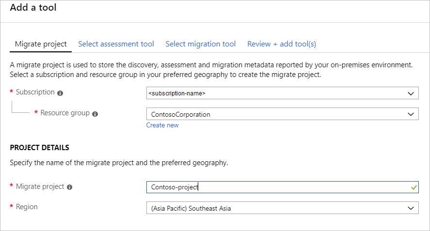
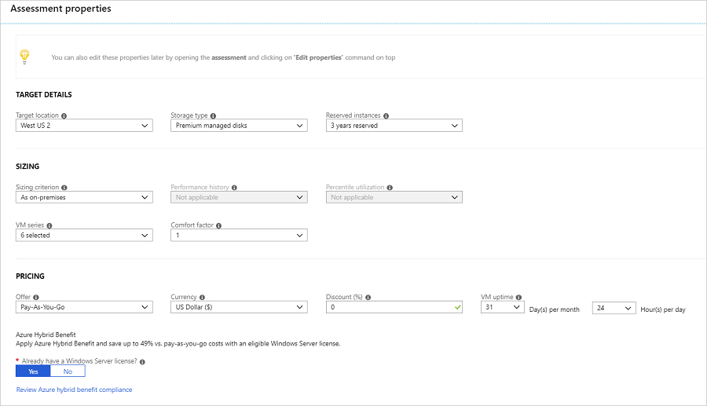
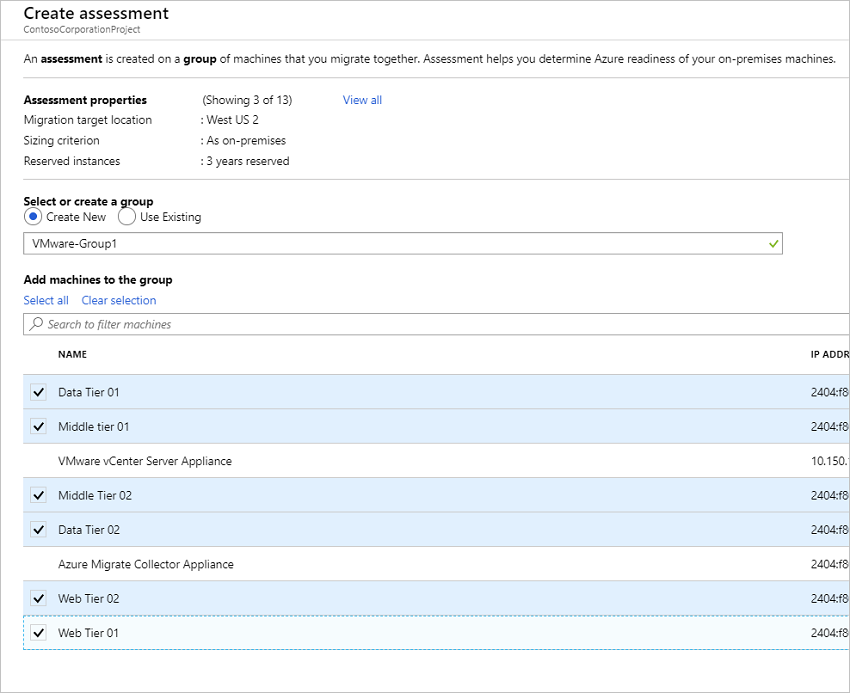
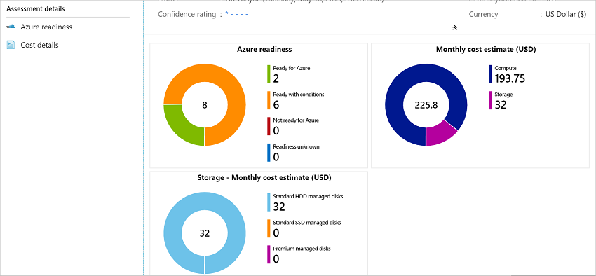

# Assess Hyper-V VMs with Azure Migrate Server Assessment

This article shows you how to assess on-premises Hyper-V VMs, using the [Azure Migrate:Server Assessment](migrate-services-overview.md#azure-migrate-server-assessment-tool) tool.


This tutorial is the second in a series that demonstrates how to assess and migrate Hyper-V VMs to Azure. In this tutorial, you learn how to:

> [!div class="checklist"]
> * Set up an Azure Migrate project.
> * Set up and register an Azure Migrate appliance.
> * Start continuous discovery of on-premises VMs.
> * Group discovered VMs, and assess the group.
> * Review the assessment.

> [!NOTE]
> Tutorials show you the simplest deployment path for a scenario so that you can quickly set up a proof-of-concept. Tutorials use default options where possible, and don't show all possible settings and paths. For detailed instructions, review the How-to articles.

If you don't have an Azure subscription, create a [free account](https://azure.microsoft.com/pricing/free-trial/) before you begin.


## Prerequisites

- [Complete](tutorial-prepare-hyper-v.md) the first tutorial in this series. If you don't, the instructions in this tutorial won't work.
- Here's what you should have done in the first tutorial:
    - [Prepare Azure](tutorial-prepare-hyper-v.md#prepare-azure) to work with Azure Migrate.
    - [Prepare Hyper-V](tutorial-prepare-hyper-v.md#prepare-for-assessment) hosts and VMs assessment.
    - [Verify](tutorial-prepare-hyper-v.md#prepare-for-appliance-deployment) what you need in order to deploy the Azure Migrate appliance for Hyper-V assessment.

## Set up an Azure Migrate project

1. In the Azure portal > **All services**, search for **Azure Migrate**.
2. In the search results, select **Azure Migrate**.
3. In **Overview**, under **Discover, assess and migrate servers**, click **Assess and migrate servers**.

    

4. In **Getting started**, click **Add tools**.
5. In the **Migrate project** tab, select your Azure subscription, and create a resource group if you don't have one.
6. In **Project Details**, specify the project name, and the region in which you want to create the project. Review supported geographies for [public](migrate-support-matrix.md#supported-geographies-public-cloud) and [government clouds](migrate-support-matrix.md#supported-geographies-azure-government).

    - The project region is used only to store the metadata gathered from on-premises VMs.
    - You can select a different Azure target region when you migrate the VMs. All Azure regions are supported for migration target.

    

7. Click **Next**.
8. In **Select assessment tool**, select **Azure Migrate: Server Assessment** > **Next**.

    

9. In **Select migration tool**, select **Skip adding a migration tool for now** > **Next**.
10. In **Review + add tools**, review the settings, and click **Add tools**.
11. Wait a few minutes for the Azure Migrate project to deploy. You'll be taken to the project page. If you don't see the project, you can access it from **Servers** in the Azure Migrate dashboard.

## Set up the Azure Migrate appliance


Azure Migrate:Server Assessment uses a lightweight Azure Migrate appliance. The appliance performs VM discovery and sends VM metadata and performance data to Azure Migrate. The appliance can be set up in a number of ways.

- Set up on a Hyper-V VM using a downloaded Hyper-V VHD. This is the method used in this tutorial.
- Set up on a Hyper-V VM or physical machine with a PowerShell installer script. [This method](deploy-appliance-script.md) should be used if you can't set up a VM using the VHD, or if you're in Azure Government.

After creating the appliance, you check that it can connect to Azure Migrate:Server Assessment, configure it for the first time, and register it with the Azure Migrate project.

### Download the VHD

Download the zipped VHD template for the appliance.

1. In **Migration Goals** > **Servers** > **Azure Migrate: Server Assessment**, click **Discover**.
2. In **Discover machines** > **Are your machines virtualized?**, click **Yes, with Hyper-V**.
3. Click **Download** to download the VHD file.

    


### Verify security

Check that the zipped file is secure, before you deploy it.

1. On the machine to which you downloaded the file, open an administrator command window.

2. Run the following PowerShell command to generate the hash for the ZIP file
    - ```C:\>Get-FileHash -Path <file_location> -Algorithm [Hashing Algorithm]```
    - Example usage: ```C:\>Get-FileHash -Path ./AzureMigrateAppliance_v1.19.06.27.zip -Algorithm SHA256```

3.  Verify the latest appliance versions and hash values:

    - For the Azure public cloud:

        **Scenario** | **Download** | **SHA256**
        --- | --- | ---
        Hyper-V (8.93 GB) | [Latest version](https://aka.ms/migrate/appliance/hyperv) |  572be425ea0aca69a9aa8658c950bc319b2bdbeb93b440577264500091c846a1

    - For Azure Government:

        **Scenario*** | **Download** | **SHA256**
        --- | --- | ---
        Hyper-V (63.1 MB) | [Latest version](https://go.microsoft.com/fwlink/?linkid=2120200&clcid=0x409) |  2c5e73a1e5525d4fae468934408e43ab55ff397b7da200b92121972e683f9aa3


### Create the appliance VM

Import the downloaded file, and create the VM.

1. After downloading the zipped VHD file to the Hyper-V host on which the appliance VM will be placed, extract the zipped file.
    - In the extracted location, the file unzips into a folder called **AzureMigrateAppliance_VersionNumber**.
    - This folder contains a subfolder, also called **AzureMigrateAppliance_VersionNumber**.
    - This subfolder contains three further subfolders - **Snapshots**, **Virtual Hard Disks**, and **Virtual Machines**.

2. Open Hyper-V Manager. In **Actions**, click **Import Virtual Machine**.

    

2. In the Import Virtual Machine Wizard > **Before you begin**, click **Next**.
3. In **Locate Folder**, select the **Virtual Machines** folder. Then click **Next**.
1. In **Select Virtual Machine**, click **Next**.
2. In **Choose Import Type**, click **Copy the virtual machine (create a new unique ID)**. Then click **Next**.
3. In **Choose Destination**, leave the default setting. Click **Next**.
4. In **Storage Folders**, leave the default setting. Click **Next**.
5. In **Choose Network**, specify the virtual switch that the VM will use. The switch needs internet connectivity to send data to Azure. [Learn](/windows-server/virtualization/hyper-v/get-started/create-a-virtual-switch-for-hyper-v-virtual-machines) about creating a virtual switch.
6. In **Summary**, review the settings. Then click **Finish**.
7. In Hyper-V Manager > **Virtual Machines**, start the VM.


## Verify appliance access to Azure

Make sure that the appliance VM can connect to Azure URLs for [public](migrate-appliance.md#public-cloud-urls) and [government](migrate-appliance.md#government-cloud-urls) clouds.

### Configure the appliance

Set up the appliance for the first time.

> [!NOTE]
> If you set up the appliance using a [PowerShell script](deploy-appliance-script.md) instead of the downloaded VHD, the first two steps in this procedure aren't relevant.

1. In Hyper-V Manager > **Virtual Machines**, right-click the VM > **Connect**.
2. Provide the language, time zone, and password for the appliance.
3. Open a browser on any machine that can connect to the VM, and open the URL of the appliance web app: **https://*appliance name or IP address*: 44368**.

   Alternately, you can open the app from the appliance desktop by clicking the app shortcut.
1. In the web app > **Set up prerequisites**, do the following:
    - **License**: Accept the license terms, and read the third-party information.
    - **Connectivity**: The app checks that the VM has internet access. If the VM uses a proxy:
      - Click **Proxy settings**, and specify the proxy address and listening port, in the form http://ProxyIPAddress or http://ProxyFQDN.
      - Specify credentials if the proxy needs authentication.
      - Only HTTP proxy is supported.
    - **Time sync**: Time is verified. The time on the appliance should be in sync with internet time for VM discovery to work properly.
    - **Install updates**: Azure Migrate Server Assessment checks that the appliance has the latest updates installed.

### Register the appliance with Azure Migrate

1. Click **Log In**. If it doesn't appear, make sure you've disabled the pop-up blocker in the browser.
2. On the new tab, sign in using your Azure credentials.
    - Sign in with your username and password.
    - Sign-in with a PIN isn't supported.
3. After successfully signing in, go back to the web app.
4. Select the subscription in which the Azure Migrate project was created. Then select the project.
5. Specify a name for the appliance. The name should be alphanumeric with 14 characters or less.
6. Click **Register**.


### Delegate credentials for SMB VHDs

If you're running VHDs on SMBs, you must enable delegation of credentials from the appliance to the Hyper-V hosts. To do this, you enable each host to act as a delegate for the appliance. If you followed the tutorials in order, you did this in the previous tutorial, when you prepared Hyper-V for assessment and migration. You should have either set up CredSSP for the hosts [manually](tutorial-prepare-hyper-v.md#enable-credssp-to-delegate-credentials), or by [running a script](tutorial-prepare-hyper-v.md#run-the-script) that does this.

Enable on the appliance as follows:

#### Option 1

On the appliance VM, run this command. HyperVHost1/HyperVHost2 are example host names.

```
Enable-WSManCredSSP -Role Client -DelegateComputer HyperVHost1.contoso.com, HyperVHost2.contoso.com, HyperVHost1, HyperVHost2 -Force
```

Example: ` Enable-WSManCredSSP -Role Client -DelegateComputer HyperVHost1.contoso.com HyperVHost2.contoso.com -Force `

#### Option 2

Alternatively, do this in the Local Group Policy Editor on the appliance:

1. In **Local Computer Policy** > **Computer Configuration**, click **Administrative Templates** > **System** > **Credentials Delegation**.
2. Double-click **Allow delegating fresh credentials**, and select **Enabled**.
3. In **Options**, click **Show**, and add each Hyper-V host you want to discover to the list, with **wsman/** as a prefix.
4. Then, in **Credentials Delegation**, double-click **Allow delegating fresh credentials with NTLM-only server authentication**. Again, add each Hyper-V host you want to discover to the list, with **wsman/** as a prefix.

## Start continuous discovery

Connect from the appliance to Hyper-V hosts or clusters, and start VM discovery.

1. In **User name** and **Password**, specify the account credentials that the appliance will use to discover VMs. Specify a friendly name for the credentials, and click **Save details**.
2. Click **Add host**, and specify Hyper-V host/cluster details.
3. Click **Validate**. After validation, the number of VMs that can be discovered on each host/cluster is shown.
    - If validation fails for a host, review the error by hovering over the icon in the **Status** column. Fix issues, and validate again.
    - To remove hosts or clusters, select > **Delete**.
    - You can't remove a specific host from a cluster. You can only remove the entire cluster.
    - You can add a cluster, even if there are issues with specific hosts in the cluster.
4. After validation, click **Save and start discovery** to start the discovery process.

This starts discovery. It takes around 1.5 minutes per host for metadata of discovered servers to appear in the Azure portal.

### Verify VMs in the portal

After discovery finishes, you can verify that the VMs appear in the portal.

1. Open the Azure Migrate dashboard.
2. In **Azure Migrate - Servers** > **Azure Migrate: Server Assessment** page, click the icon that displays the count for **Discovered servers**.

## Set up an assessment

There are two types of assessments you can run using Azure Migrate Server Assessment.

**Assessment** | **Details** | **Data**
--- | --- | ---
**Performance-based** | Assessments based on collected performance data | **Recommended VM size**: Based on CPU and memory utilization data.<br/><br/> **Recommended disk type (standard or premium managed disk)**: Based on the IOPS and throughput of the on-premises disks.
**As on-premises** | Assessments based on on-premises sizing. | **Recommended VM size**: Based on the on-premises VM size<br/><br> **Recommended disk type**: Based on the storage type setting you select for the assessment.


### Run an assessment

Run an assessment as follows:

1. Review the [best practices](best-practices-assessment.md) for creating assessments.
2. In **Servers** > **Azure Migrate: Server Assessment**, click **Assess**.

    

3. In **Assess Servers**, specify a name for the assessment.
4. Click **View all** to review the assessment properties.

    

3. In **Select or create a group**, select **Create New**, and specify a group name. A group gathers one or more VMs together for assessment.
4. In **Add machines to the group**, select VMs to add to the group.
5. Click **Create Assessment** to create the group, and run the assessment.

    

6. After the assessment is created, view it in **Servers** > **Azure Migrate: Server Assessment**.
7. Click **Export assessment**, to download it as an Excel file.


## Review an assessment

An assessment describes:

- **Azure readiness**: Whether VMs are suitable for migration to Azure.
- **Monthly cost estimation**: The estimated monthly compute and storage costs for running the VMs in Azure.
- **Monthly storage cost estimation**: Estimated costs for disk storage after migration.


### View an assessment

1. In **Migration goals** >  **Servers** > **Azure Migrate: Server Assessment**, click **Assessments**.
2. In **Assessments**, click on an assessment to open it.

    


### Review Azure readiness

1. In **Azure readiness**, verify whether VMs are ready for migration to Azure.
2. Review the VM status:
    - **Ready for Azure**: Azure Migrate recommends a VM size and cost estimates for VMs in the assessment.
    - **Ready with conditions**: Shows issues and suggested remediation.
    - **Not ready for Azure**: Shows issues and suggested remediation.
    - **Readiness unknown**: Used when Azure Migrate can't assess readiness, due to data availability issues.

2. Click on an **Azure readiness** status. You can view VM readiness details, and drill down to see VM details, including compute, storage, and network settings.

### Review cost details

This view shows the estimated compute and storage cost of running VMs in Azure.

1. Review the monthly compute and storage costs. Costs are aggregated for all VMs in the assessed group.

    - Cost estimates are based on the size recommendations for a machine, and its disks and properties.
    - Estimated monthly costs for compute and storage are shown.
    - The cost estimation is for running the on-premises VMs as IaaS VMs. Azure Migrate Server Assessment doesn't consider PaaS or SaaS costs.

2. You can review monthly storage cost estimates. This view shows aggregated storage costs for the assessed group, split over different types of storage disks.
3. You can drill down to see details for specific VMs.


### Review confidence rating

When you run performance-based assessments, a confidence rating is assigned to the assessment.


- A rating from 1-star (lowest) to 5-star (highest) is awarded.
- The confidence rating helps you estimate the reliability of the size recommendations provided by the assessment.
- The confidence rating is based on the availability of data points needed to compute the assessment.

Confidence ratings for an assessment are as follows.

**Data point availability** | **Confidence rating**
--- | ---
0%-20% | 1 Star
21%-40% | 2 Star
41%-60% | 3 Star
61%-80% | 4 Star
81%-100% | 5 Star

[Learn more](best-practices-assessment.md#best-practices-for-confidence-ratings) about best practices for confidence ratings.


## Next steps

In this tutorial, you:

> [!div class="checklist"]
> * Set up an Azure Migrate appliance
> * Created and reviewed an assessment

Continue to the third tutorial in the series, to learn how to migrate Hyper-V VMs to Azure with Azure Migrate Server Migration.

> [!div class="nextstepaction"]
> [Migrate Hyper-V VMs](./tutorial-migrate-hyper-v.md)
