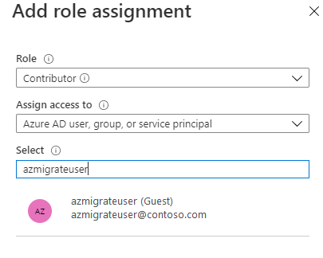
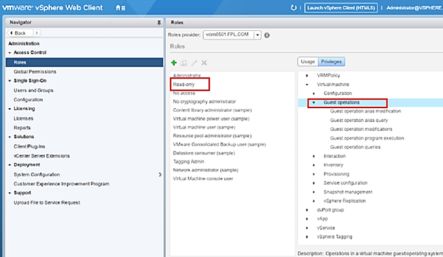
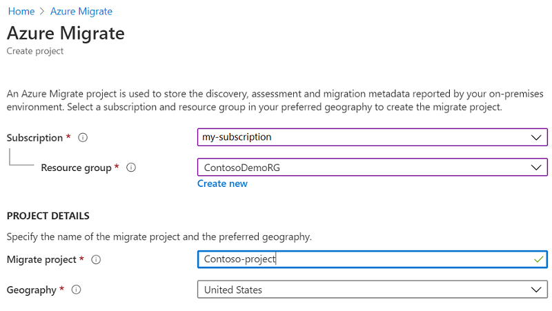

# Tutorial: Discover VMware VMs with Server Assessment

As part of your migration journey to Azure, you discover your on-premises inventory and workloads. 

This tutorial shows you how to discover on-premises VMware virtual machines (VMs) with the Azure Migrate: Server Assessment tool, using a lightweight Azure Migrate appliance. You deploy the appliance as a VMware VM, to continuously discover VM and performance metadata, apps running on VMs, and VM dependencies.

In this tutorial, you learn how to:

> [!div class="checklist"]
> * Set up an Azure account.
> * Prepare the VMware environment for discovery.
> * Create an Azure Migrate project.
> * Set up the Azure Migrate appliance.
> * Start continuous discovery.

> [!NOTE]
> Tutorials show the quickest path for trying out a scenario, and use default options where possible.  

If you don't have an Azure subscription, create a [free account](https://azure.microsoft.com/pricing/free-trial/) before you begin.


## Prerequisites

Before you start this tutorial, check you have these prerequisites in place.


**Requirement** | **Details**
--- | ---
**vCenter Server/ESXi host** | You need a vCenter Server running version 5.5, 6.0, 6.5 or 6.7.<br/><br/> VMs must be hosted on an ESXi host running version 5.5 or later.<br/><br/> On the vCenter Server, allow inbound connections on TCP port 443, so that the appliance can collect assessment data.<br/><br/> The appliance connects to vCenter on port 443 by default. If the vCenter server listens on a different port, you can modify the port when you connect from the appliance to the server to start discovery.<br/><br/> On the EXSi server that hosts the VMs, make sure that inbound access is allowed on TCP port 443, for app discovery.
**Appliance** | vCenter Server needs resources to allocate a VM for the Azure Migrate appliance:<br/><br/> - Windows Server 2016<br/><br/> - 32 GB of RAM, eight vCPUs, and around 80 GB of disk storage.<br/><br/> - An external virtual switch, and internet access on for the VM, directly or via a proxy.
**VMs** | To use this tutorial, Windows VMs must be running Windows Server 2016, 2012 R2, 2012, or 2008 R2.<br/><br/> Linux VMs must be running Red Hat Enterprise Linux 7/6/5, Ubuntu Linux 14.04/16.04, Debian 7/8, Oracle Linux 6/7, or CentOS 5/6/7.<br/><br/> VMs need VMware tools (a version later than 10.2.0) installed and running.<br/><br/> On Windows VMs, Windows PowerShell 2.0 or later should be installed.


## Prepare an Azure user account

To create an Azure Migrate project and register the Azure Migrate appliance, you need an account with:
- Contributor or Owner permissions on an Azure subscription.
- Permissions to register Azure Active Directory apps.

If you just created a free Azure account, you're the owner of your subscription. If you're not the subscription owner, work with the owner to assign the permissions as follows:

1. In the Azure portal, search for "subscriptions", and under **Services**, select **Subscriptions**.

    

2. In the **Subscriptions** page, select the subscription in which you want to create an Azure Migrate project. 
3. In the subscription, select **Access control (IAM)** > **Check access**.
4. In **Check access**, search for the relevant user account.
5. In **Add a role assignment**, click **Add**.

    

6. In **Add role assignment**, select the Contributor or Owner role, and select the account (azmigrateuser in our example). Then click **Save**.

    

7. In the portal, search for users, and under **Services**, select **Users**.
8. In **User settings**, verify that Azure AD users can register applications (set to **Yes** by default).

    

9. Alternately, the tenant/global admin can assign the **Application Developer** role to an account to allow the registration of AAD App(s). [Learn more](../active-directory/fundamentals/active-directory-users-assign-role-azure-portal.md).

## Prepare VMware

On the vCenter Server, create an account that the appliance can use to access the vCenter Server, and check that required ports are open. You also need an account that the appliance can use to access VMs. 

### Create an account to access vCenter

In vSphere Web Client, set up an account as follows:

1. Using an account with admin privileges, in the vSphere Web Client > select **Administration**.
2. **Access**, select **SSO Users and Groups**.
3. In **Users**, add a new user.
4. In **New User**, type in the account details. Then click **OK**.
5. In **Global Permissions**, select the user account, and assign the **Read-only** role to the account. Then click **OK**.
6. In **Roles** > select the **Read-only** role, and in **Privileges**, select **Guest Operations**. These privileges are needed to discover apps running on VMs, and to analyze VM dependencies.
 
    


### Create an account to access VMs

The appliance accesses VMs to discover apps, and analyze VM dependencies. The appliance doesn't install any agents on VMs.

1. Create a Local Admin account that the appliance can use to discover apps and dependencies on Windows VMs.
2. For Linux machines, create a user account with Root privileges, or alternately, a user account with these permissions on /bin/netstat and /bin/ls files: CAP_DAC_READ_SEARCH and CAP_SYS_PTRACE.

> [!NOTE]
> Azure Migrate supports one credential for app-discovery on all Windows servers, and one credential for app-discovery on all Linux machines.


## Set up a project

Set up a new Azure Migrate project.

1. In the Azure portal > **All services**, search for **Azure Migrate**.
2. Under **Services**, select **Azure Migrate**.
3. In **Overview**, select **Create project**.
5. In **Create project**, select your Azure subscription and resource group. Create a resource group if you don't have one.
6. In **Project Details**, specify the project name and the geography in which you want to create the project. Review supported geographies for [public](migrate-support-matrix.md#supported-geographies-public-cloud) and [government clouds](migrate-support-matrix.md#supported-geographies-azure-government).

   

7. Select **Create**.
8. Wait a few minutes for the Azure Migrate project to deploy.

The **Azure Migrate: Server Assessment** tool is added by default to the new project.


## Set up the appliance

To set up the appliance using an OVA template you:
- Provide an appliance name and generate an Azure Migrate project key in the portal
- Download an OVA template file, and import it to vCenter Server.
- Create the appliance, and check that it can connect to Azure Migrate Server Assessment.
- Configure the appliance for the first time, and register it with the Azure Migrate project using the Azure Migrate project key.

> [!NOTE]
> If for some reason you can't set up the appliance using the template, you can set it up using a PowerShell script. [Learn more](deploy-appliance-script.md#set-up-the-appliance-for-vmware).


### Deploy with OVA

To set up the appliance using an OVA template you:
- Provide an appliance name and generate an Azure Migrate project key in the portal
- Download an OVA template file, and import it to vCenter Server.
- Create the appliance, and check that it can connect to Azure Migrate Server Assessment.
- Configure the appliance for the first time, and register it with the Azure Migrate project using the Azure Migrate project key.

### Generate the Azure Migrate project key

1. In **Migration Goals** > **Servers** > **Azure Migrate: Server Assessment**, select **Discover**.
2. In **Discover machines** > **Are your machines virtualized?**, select **Yes, with VMware vSphere hypervisor**.
3. In **1:Generate Azure Migrate project key**, provide a name for the Azure Migrate appliance that you will set up for discovery of VMware VMs.The name should be alphanumeric with 14 characters or fewer.
1. Click on **Generate key** to start the creation of the required Azure resources. Please do not close the Discover machines page during the creation of resources.
1. After the successful creation of the Azure resources, an **Azure Migrate project key** is generated.
1. Copy the key as you will need it to complete the registration of the appliance during its configuration.

### Download the OVA template

In **2: Download Azure Migrate appliance**, select the .OVA file and click on **Download**. 


### Verify security

Check that the OVA file is secure, before you deploy it:

1. On the machine to which you downloaded the file, open an administrator command window.
2. Run the following command to generate the hash for the OVA file:
  
   ```C:\>CertUtil -HashFile <file_location> [Hashing Algorithm]```
   
   Example usage: ```C:\>CertUtil -HashFile C:\Users\Administrator\Desktop\MicrosoftAzureMigration.ova SHA256```

3. Verify the latest appliance versions and hash values:

    - For the Azure public cloud:
    
        **Algorithm** | **Download** | **SHA256**
        --- | --- | ---
        VMware (11.9 GB) | [Latest version](https://go.microsoft.com/fwlink/?linkid=2140333) | e9c9a1fe4f3ebae81008328e8f3a7933d78ff835ecd871d1b17f367621ce3c74

    - For Azure Government:
    
        **Algorithm** | **Download** | **SHA256**
        --- | --- | ---
        VMware (85.8 MB) | [Latest version](https://go.microsoft.com/fwlink/?linkid=2140337) | 2daaa2a59302bf911e8ef195f8add7d7c8352de77a9af0b860e2a627979085ca


### Create the appliance VM

Import the downloaded file, and create a VM.

1. In the vSphere Client console, click **File** > **Deploy OVF Template**.
2. In the Deploy OVF Template Wizard > **Source**, specify the location of the OVA file.
3. In **Name** and **Location**, specify a friendly name for the VM. Select the inventory object in which the VM
will be hosted.
5. In **Host/Cluster**, specify the host or cluster on which the VM will run.
6. In **Storage**, specify the storage destination for the VM.
7. In **Disk Format**, specify the disk type and size.
8. In **Network Mapping**, specify the network to which the  VM will connect. The network needs internet connectivity, to send metadata to Azure Migrate Server Assessment.
9. Review and confirm the settings, then click **Finish**.


### Verify appliance access to Azure

Make sure that the appliance VM can connect to Azure URLs for [public](migrate-appliance.md#public-cloud-urls) and [government](migrate-appliance.md#government-cloud-urls) clouds.


### Configure the appliance

Set up the appliance for the first time.

> [!NOTE]
> If you set up the appliance using a [PowerShell script](deploy-appliance-script.md) instead of the downloaded OVA, the first two steps in this procedure aren't relevant.

1. In the vSphere Client console, right-click the VM, and then select **Open Console**.
2. Provide the language, time zone, and password for the appliance.
3. Open a browser on any machine that can connect to the VM, and open the URL of the appliance web app: **https://*appliance name or IP address*: 44368**.

   Alternately, you can open the app from the appliance desktop by selecting the app shortcut.
1. Accept the **license terms**, and read the third-party information.
1. In the web app > **Set up prerequisites**, do the following:
   - **Connectivity**: The app checks that the VM has internet access. If the VM uses a proxy:
     - Click on **Set up proxy** to specify the proxy address (in the form http://ProxyIPAddress or http://ProxyFQDN) and listening port.
     - Specify credentials if the proxy needs authentication.
     - Only HTTP proxy is supported.
     - If you have added proxy details or disabled the proxy and/or authentication, click on **Save** to trigger connectivity check again.
   - **Time sync**: The time on the appliance should be in sync with internet time for discovery to work properly.
   - **Install updates**: The appliance ensures that the latest updates are installed. After the check completes, you can click on **View appliance services** to see the status and versions of the components running on the appliance.
   - **Install VDDK**: The appliance checks that VMware vSphere Virtual Disk Development Kit (VDDK) is installed. If it isn't installed, download VDDK 6.7 from VMware, and extract the downloaded zip contents to the specified location on the appliance, as provided in the **Installation instructions**.

     Azure Migrate Server Migration uses the VDDK to replicate machines during migration to Azure. 
1. If you want, you can **rerun prerequisites** at any time during appliance configuration to check if the appliance meets all the prerequisites.

### Register the appliance with Azure Migrate

1. Paste the **Azure Migrate project key** copied from the portal. If you do not have the key, go to **Server Assessment> Discover> Manage existing appliances**, select the appliance name you provided at the time of key generation and copy the corresponding key.
1. Click on **Log in**. It will open an Azure login prompt in a new browser tab. If it doesn't appear, make sure you've disabled the pop-up blocker in the browser.
1. On the new tab, sign in by using your Azure username and password.
   
   Sign-in with a PIN isn't supported.
3. After you successfully logged in, go back to the web app. 
4. If the Azure user account used for logging has the right permissions on the Azure resources created during key generation, the appliance registration will be initiated.
1. After appliance is successfully registered, you can see the registration details by clicking on **View details**.


## Start continuous discovery

The appliance needs to connect to vCenter Server to discover the configuration and performance data of the VMs.

1. In **Step 1: Provide vCenter Server credentials**, click on **Add credentials** to  specify a friendly name for credentials, add **Username** and **Password** for the vCenter Server account that the appliance will use to discover VMs on the vCenter Server instance.
    - You should have set up an account with the required permissions in the previous tutorial.
    - If you want to scope discovery to specific VMware objects (vCenter Server datacenters, clusters, a folder of clusters, hosts, a folder of hosts, or individual VMs.), review the instructions in [this article](set-discovery-scope.md) to restrict the account used by Azure Migrate.
1. In **Step 2: Provide vCenter Server details**, click on **Add discovery source** to select the friendly name for credentials from the drop-down, specify the **IP address/FQDN** of the vCenter Server instance. You can leave the **Port** to default (443) or specify a custom port on which vCenter Server listens and click on **Save**.
1. On clicking Save, appliance will try validating the connection to the vCenter Server with the credentials provided and show the **Validation status** in the table against the vCenter Server IP address/FQDN.
1. You can **revalidate** the connectivity to vCenter Server any time before starting the discovery.
1. In **Step 3: Provide VM credentials to discover installed applications and to perform agentless dependency mapping**, click **Add credentials**, and specify the operating system for which the credentials are provided, friendly name for credentials and the **Username** and **Password**. Then click on **Save**.

    - You optionally add credentials here if you've created an account to use for the [application discovery feature](how-to-discover-applications.md), or the [agentless dependency analysis feature](how-to-create-group-machine-dependencies-agentless.md).
    - If you do not want to use these features, you can click on the slider to skip the step. You can reverse the intent any time later.
    - Review the credentials needed for [application discovery](migrate-support-matrix-vmware.md#application-discovery-requirements), or for [agentless dependency analysis](migrate-support-matrix-vmware.md#dependency-analysis-requirements-agentless).

5. Click on **Start discovery**, to kick off VM discovery. After the discovery has been successfully initiated, you can check the discovery status against the vCenter Server IP address/FQDN in the table.

Discovery works as follows:
- It takes around 15 minutes for discovered VM metadata to appear in the portal.
- Discovery of installed applications, roles, and features takes some time. The duration depends on the number of VMs being discovered. For 500 VMs, it takes approximately one hour for the application inventory to appear in the Azure Migrate portal.


## Next steps

- [Assess VMware VMs](./tutorial-assess-vmware-azure-vm.md) for migration to Azure VMs.
- [Review the data](migrate-appliance.md#collected-data---vmware) that the appliance collects during discovery.