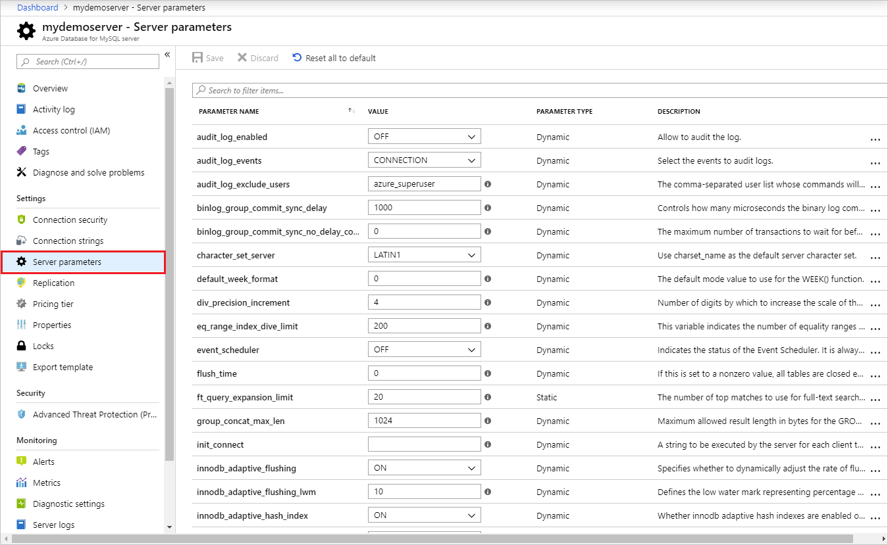
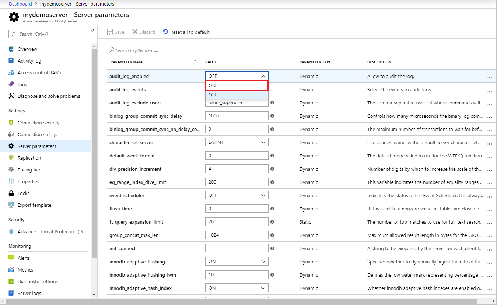
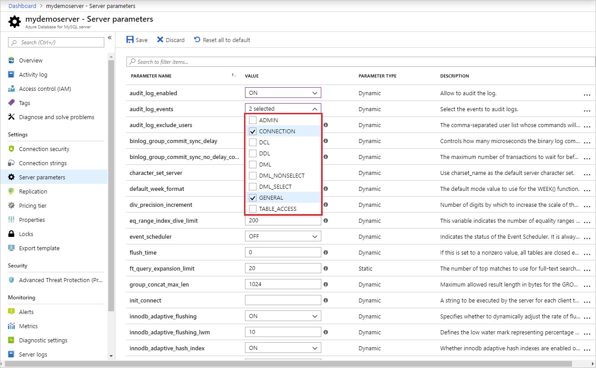
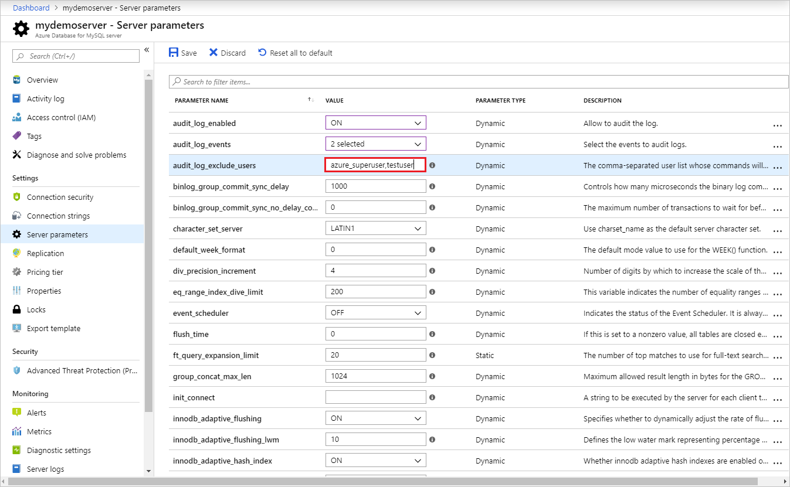
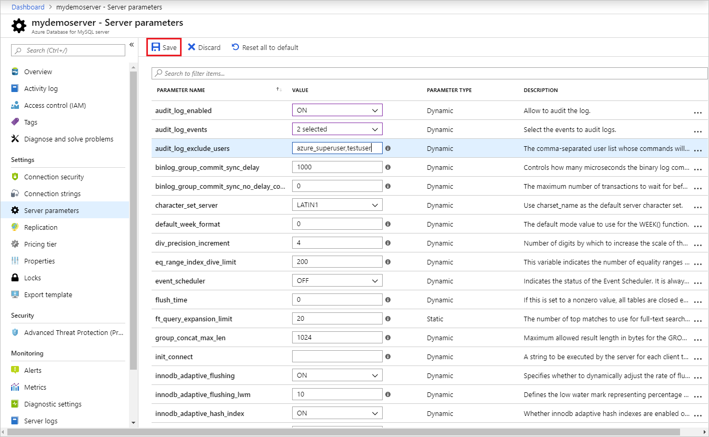
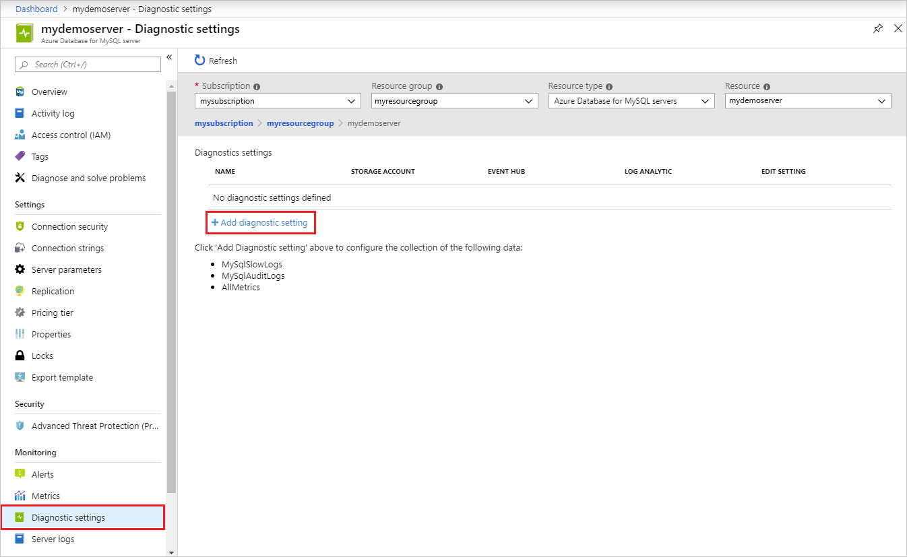
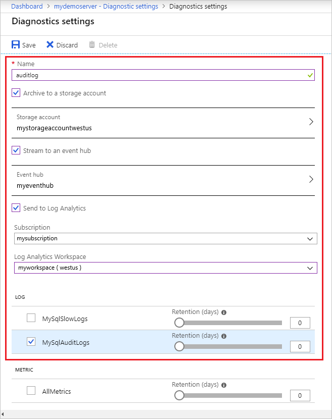
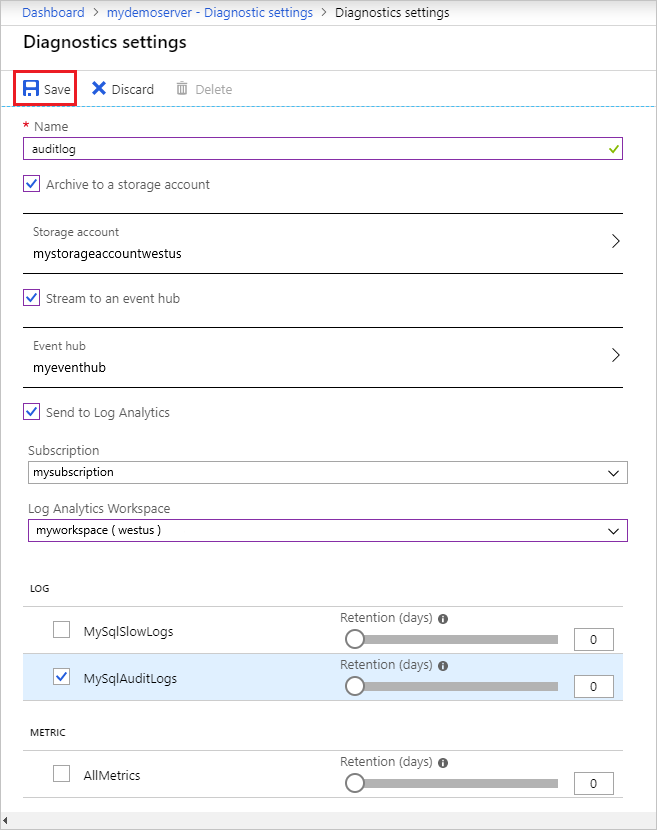

# Configure and access audit logs for Azure Database for MySQL in the Azure portal

You can configure the [Azure Database for MySQL audit logs](concepts-audit-logs.md) and diagnostic settings from the Azure portal.

> [!IMPORTANT]
> Audit log functionality is currently in preview.

## Prerequisites

To step through this how-to guide, you need:

- [Azure Database for MySQL server](quickstart-create-mysql-server-database-using-azure-portal.md)

## Configure audit logging

Enable and configure audit logging.

1. Sign in to the [Azure portal](https://portal.azure.com/).

1. Select your Azure Database for MySQL server.

1. Under the **Settings** section in the sidebar, select **Server parameters**.
    

1. Update the **audit_log_enabled** parameter to ON.
    

1. Select the [event types](concepts-audit-logs.md#configure-audit-logging) to be logged by updating the **audit_log_events** parameter.
    

1. Add any MySQL users to be excluded from logging by updating the **audit_log_exclude_users** parameter. Specify users by providing their MySQL user name.
    

1. Once you have changed the parameters, you can click **Save**. Or you can **Discard** your changes.
    

## Set up diagnostic logs

1. Under the **Monitoring** section in the sidebar, select **Diagnostic settings**.

1. Click on "+ Add diagnostic setting"

1. Provide a diagnostic setting name.

1. Specify which data sinks to send the audit logs (storage account, event hub, and/or Log Analytics workspace).

1. Select "MySqlAuditLogs" as the log type.

1. Once you've configured the data sinks to pipe the audit logs to, you can click **Save**.

1. Access the audit logs by exploring them in the data sinks you configured. It may take up to 10 minutes for the logs to appear.

## Next steps

- Learn more about [audit logs](concepts-audit-logs.md) in Azure Database for MySQL.