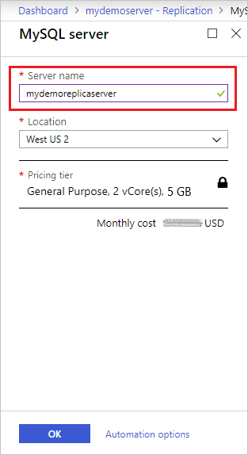
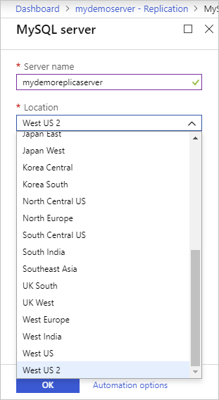
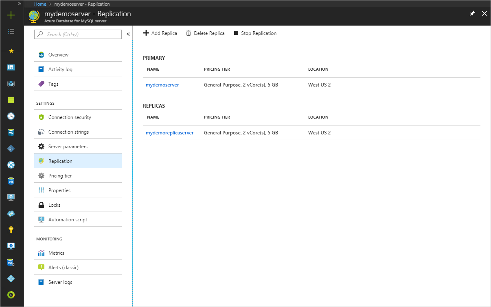
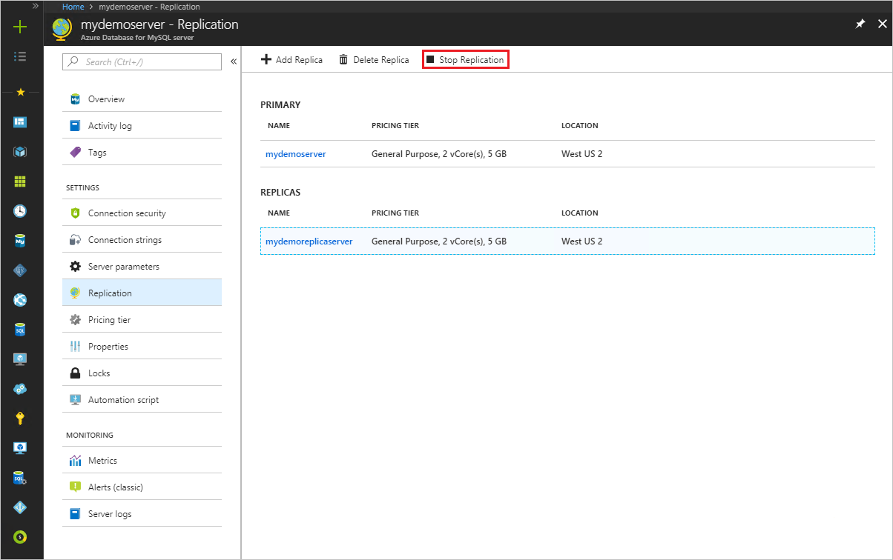
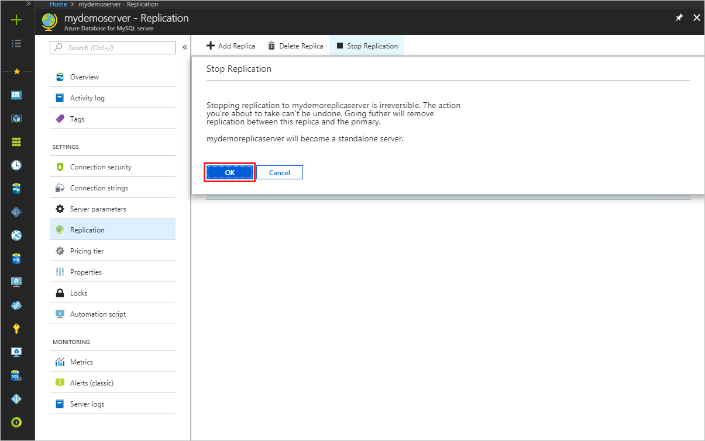
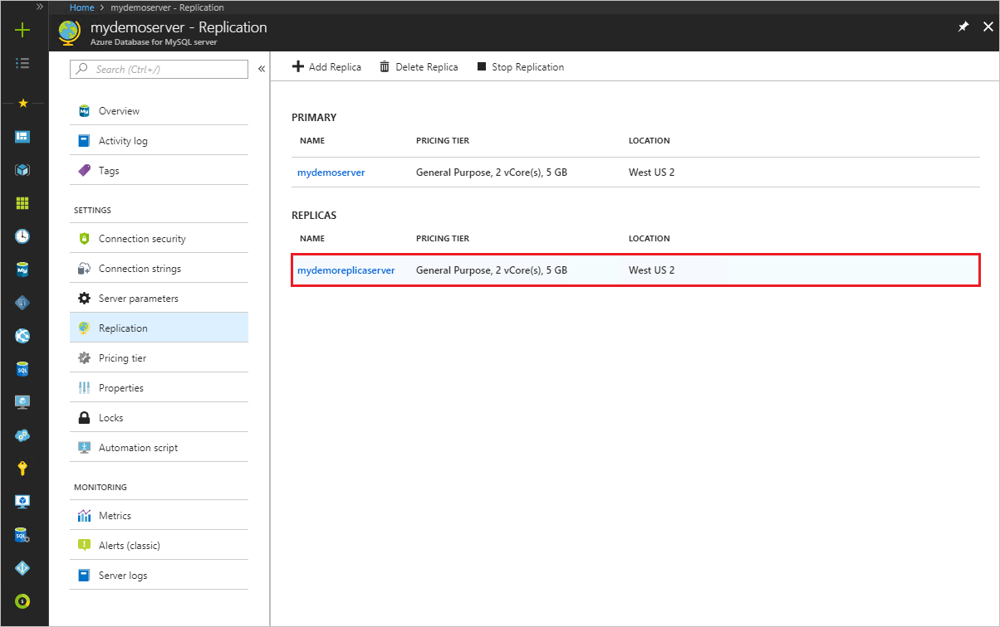
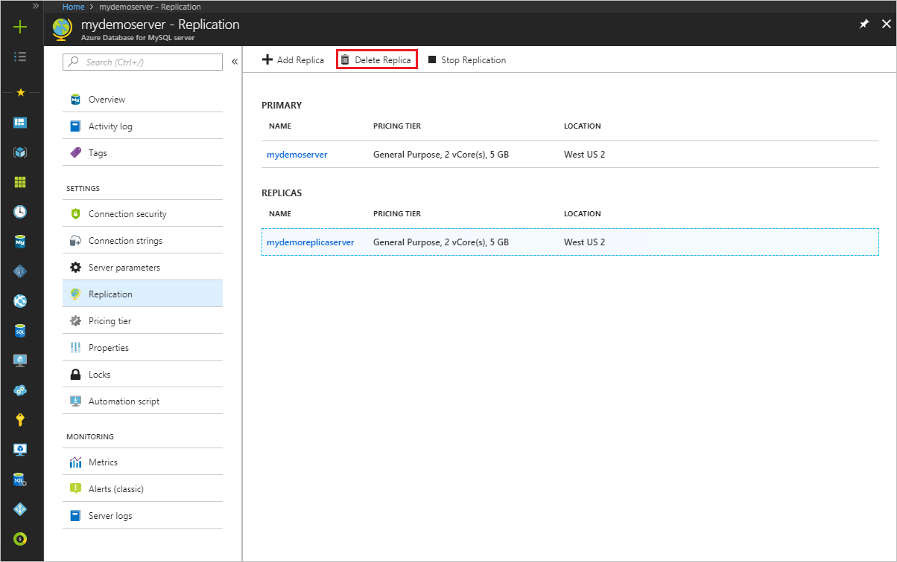
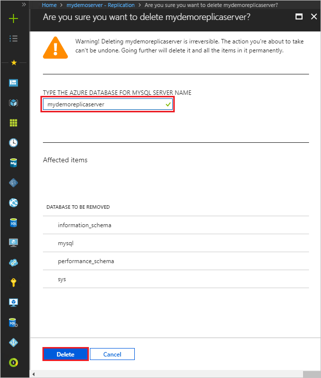
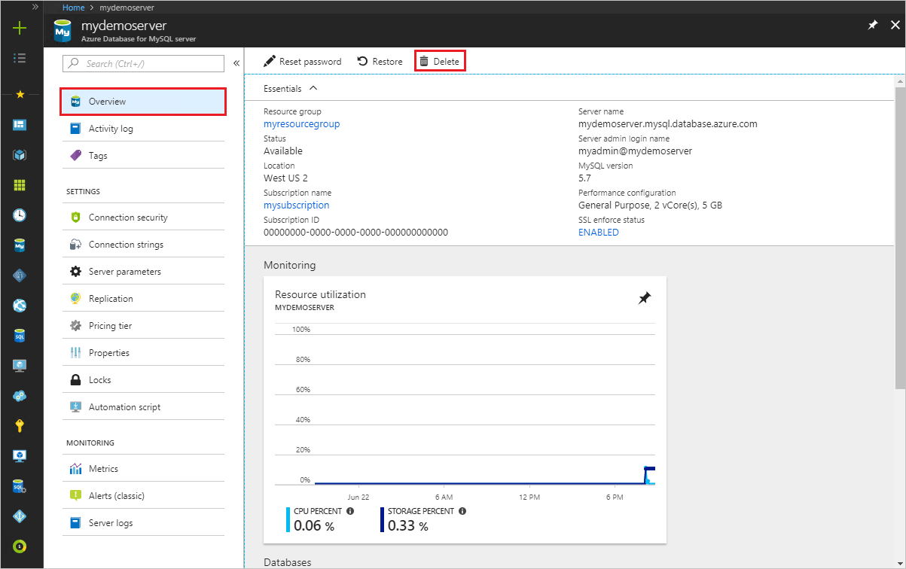
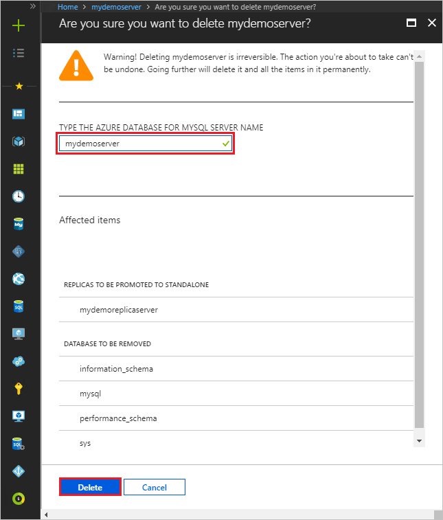

# How to create and manage read replicas in Azure Database for MySQL using the Azure portal

In this article, you will learn how to create and manage read replicas in the Azure Database for MySQL service using the Azure portal.

## Prerequisites

- An [Azure Database for MySQL server](quickstart-create-mysql-server-database-using-azure-portal.md) that will be used as the master server.

> [!IMPORTANT]
> The read replica feature is only available for Azure Database for MySQL servers in the General Purpose or Memory Optimized pricing tiers. Ensure the master server is in one of these pricing tiers.

## Create a read replica

A read replica server can be created using the following steps:

1. Sign into the [Azure portal](https://portal.azure.com/).

2. Select the existing Azure Database for MySQL server that you want to use as a master. This action opens the **Overview** page.

3. Select **Replication** from the menu, under **SETTINGS**.

4. Select **Add Replica**.

   

5. Enter a name for the replica server.

    

6. Select the location for the replica server. The default location is the same as the master server's.

    

   > [!NOTE]
   > To learn more about which regions you can create a replica in, visit the [read replica concepts article](concepts-read-replicas.md). 

7. Select **OK** to confirm creation of the replica.

> [!NOTE]
> Read replicas are created with the same server configuration as the master. The replica server configuration can be changed after it has been created. It is recommended that the replica server's configuration should be kept at equal or greater values than the master to ensure the replica is able to keep up with the master.

Once the replica server has been created, it can be viewed from the **Replication** blade.

   

## Stop replication to a replica server

> [!IMPORTANT]
> Stopping replication to a server is irreversible. Once replication has stopped between a master and replica, it cannot be undone. The replica server then becomes a standalone server and now supports both read and writes. This server cannot be made into a replica again.

To stop replication between a master and a replica server from the Azure portal, use the following steps:

1. In the Azure portal, select your master Azure Database for MySQL server. 

2. Select **Replication** from the menu, under **SETTINGS**.

3. Select the replica server you wish to stop replication for.

   

4. Select **Stop replication**.

   

5. Confirm you want to stop replication by clicking **OK**.

   

## Delete a replica server

To delete a read replica server from the Azure portal, use the following steps:

1. In the Azure portal, select your master Azure Database for MySQL server.

2. Select **Replication** from the menu, under **SETTINGS**.

3. Select the replica server you wish to delete.

   

4. Select **Delete replica**

   

5. Type the name of the replica and click **Delete** to confirm deletion of the replica.  

   

## Delete a master server

> [!IMPORTANT]
> Deleting a master server stops replication to all replica servers and deletes the master server itself. Replica servers become standalone servers that now support both read and writes.

To delete a master server from the Azure portal, use the following steps:

1. In the Azure portal, select your master Azure Database for MySQL server.

2. From the **Overview**, select **Delete**.

   

3. Type the name of the master server and click **Delete** to confirm deletion of the master server.  

   

## Monitor replication

1. In the [Azure portal](https://portal.azure.com/), select the replica Azure Database for MySQL server you want to monitor.

2. Under the **Monitoring** section of the sidebar, select **Metrics**:

3. Select **Replication lag in seconds** from the dropdown list of available metrics.

   

4. Select the time range you wish to view. The image below selects a 30 minute time range.

   

5. View the replication lag for the selected time range. The image below displays the last 30 minutes.

   

## Next steps

- Learn more about [read replicas](concepts-read-replicas.md)