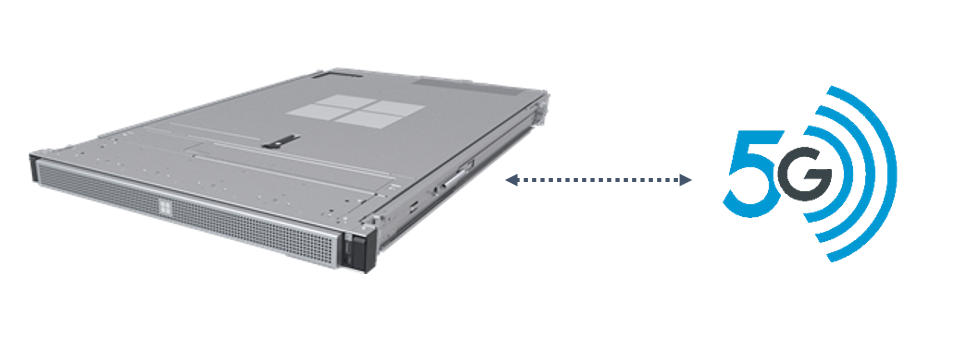
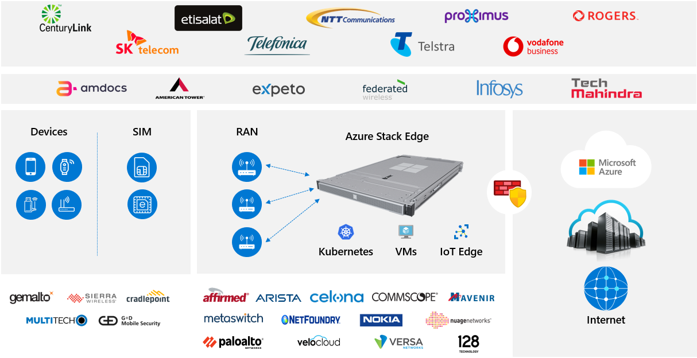
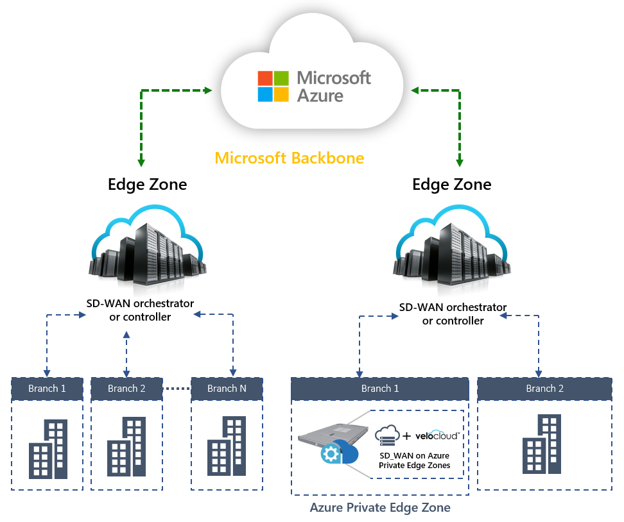

# About Azure Edge Zones - Preview

Azure Edge Zones is a family of offerings from Microsoft Azure that enables data processing close to the user. You can deploy VMs, containers, and other select Azure services into Edge Zones to address the low latency and high throughput requirements of applications.

Typical use case scenarios for Edge Zones include:

- Real-time command and control in robotics
- Real-time analytics and inferencing with Artificial Intelligence and Machine Learning
- Machine Vision
- Remote rendering for mixed reality and VDI scenarios
- Immersive multi-player gaming
- Media streaming and content delivery
- Surveillance and security

Azure Edge Zones come in three discrete offerings:

- Azure Edge Zones
- Azure Edge Zones with Carrier
- Azure Private Edge Zones

## Azure Edge Zones

Azure Edge Zones are small footprint extensions of Azure placed in population centers that are far away from Azure regions. Azure Edge Zones support VMs, containers, and a select set of Azure services that let you run latency sensitive and throughput intensive applications close to end users. Azure Edge Zones are part of the Microsoft global network and offer secure, reliable, and high-bandwidth connectivity between applications running at the Edge Zone close to the user, and the full set of Azure services running within Azure regions. Azure Edge Zones are owned and operated by Microsoft and let you use the same set of Azure tools and portal to manage and deploy services into the Edge Zones.

Typical use cases include:

- Gaming and game streaming
- Media streaming and content delivery
- Real-time analytics and inferencing using artificial intelligence and machine learning
- Rendering for mixed reality

Azure Edge Zones will be available in the following metros:

- New York, NY
- Los Angeles, CA
- Miami, FL

[Reach out to the Edge Zones team](https://aka.ms/EdgeZones) for more information.

## Azure Edge Zones with Carrier

Azure Edge Zones with carrier are small footprint extensions of Azure placed in mobile operators' datacenters in population centers. Azure Edge Zones with carrier infrastructure is placed one hop away from the mobile operator's 5G network, offering sub-10 millisecond latency to applications from mobile devices. Azure Edge Zones with carrier is deployed in mobile operators' datacenters and are connected to the Microsoft global network. They offer secure, reliable, and high-bandwidth connectivity between applications running close to the user and the full set of Azure services running within Azure regions. Developers can use the same set of familiar tools to build and deploy services into the Edge Zones.

Typical use cases include:

- Gaming and game streaming
- Media streaming and content delivery
- Real-time analytics and inferencing using artificial intelligence and machine learning
- Rendering for mixed reality
- Connected automobiles
- Telemedicine

Edge Zones will be offered in partnership with the following operators:

- AT&T (Atlanta, Dallas, and Los Angeles)

## Azure Private Edge Zones

Azure Private Edge Zones are small footprint extensions of Azure placed on-premises. Azure Private Edge Zones is based on the [Azure Stack Edge](https://azure.microsoft.com/products/azure-stack/edge/) platform and enables low latency access to computing and storage services deployed on-premises. Private Edge Zones also lets you deploy virtualized network functions (VNFs) such as mobile packet cores, routers, firewalls, and SD-WAN appliances, and applications from ISVS as [Azure managed applications](https://azure.microsoft.com/services/managed-applications/) side-by-side along with virtual machines and containers on-premises. Azure Private Edge Zones comes with a cloud-native orchestration solution that lets you manage the lifecycle of Virtualized Network Functions (VNF) and applications from the Azure portal.

Azure Private Edge Zones lets you develop and deploy applications on-premises using the same familiar tools used to build and deploy applications in Azure. You can also run private mobile networks (private LTE, private 5G), security functions such as firewalls, and extend your on-premises networks across multiple branches and Azure using SD-WAN appliances on the same Private Edge Zone appliances and manage them from Azure.

Typical use cases include:

- Real-time command and control in robotics
- Real-time analytics and inferencing with Artificial Intelligence and Machine Learning
- Machine Vision
- Remote rendering for mixed reality and VDI scenarios
- Surveillance and security

We have a rich ecosystem of VNF vendors, ISVs, and MSP partners to enable end-to-end solutions using Private Edge Zones. [Reach out to the Private Edge Zones team](https://aka.ms/EdgeZonesPartner) for more information.

## Private Edge Zones - Partners

### Virtualized Network Functions (VNFs)

#### Virtualized Evolved Packet Core (vEPC) for Mobile Networks

- [Affirmed Networks](https://www.affirmednetworks.com/)
- [Druid Software](https://www.druidsoftware.com/)
- [Expeto](https://www.expeto.io/)
- [Mavenir](https://mavenir.com/)
- [Metaswitch](https://www.metaswitch.com/)
- [Nokia Digital Automation Cloud](https://www.dac.nokia.com/)

#### Mobile Radio Partners

- [Commscope Ruckus](https://support.ruckuswireless.com/)

#### SD-WAN Vendors

- [NetFoundry](https://netfoundry.io/)
- [NuageNetworks from Nokia](https://www.nuagenetworks.net/)
- [VMware SD-WAN by Velocloud](https://www.velocloud.com/)

#### Router Vendors

- [Arista](https://www.arista.com/)

[Reach out to the Private Edge Zones team](https://aka.ms/EdgeZonesPartner) for more information on how to become a partner.

#### Firewall Vendors

- Palo Alto Networks

### Managed Solutions Providers - Mobile Operators and Global System Integrators

| Global SIs and Operators | Mobile Operators |
| --- | --- |
| Amdocs                       | Etisalat             |
| American Tower               | NTT Communications   |
| Century Link                 | Proximus             |
| Expeto                       | Rogers               |
| Federated Wireless           | SK Telecom           |
| Infosys                      | Telefonica           |
| Tech Mahindra                | Telstra              |
|        *                     | Vodafone             |

[Reach out to the Private Edge Zones team](https://aka.ms/EdgeZonesPartner) for more information on how to become a partner.

## Private Edge Zones - Solutions

### Private Mobile Network on Private Edge Zones

You can now deploy a private mobile network on private edge zones. Private mobile networks enable ultra-low latency, high capacity, and a reliable and secure wireless network that is required for business critical applications. Private mobile networks can enable scenarios such as command and control of automated guided vehicles (AGV) in a warehouse, real-time communication between robots in a smart factory and augmented realty, and virtual reality edge applications.

The virtualized evolved packet core (vEPC) network function forms the brains of a private mobile network. You can now deploy a vEPC on Private Edge Zones. For a list of vEPC partners that are available on private edge zones, see [vEPC ISVs](#vEPC).

Deploying a private mobile network solution on Private Edge Zones requires other components such as mobile access points, SIM cards, and other VNFs such as routers. Access to licensed or unlicensed spectrum is critical to setting up a private mobile network. Additionally, you may need help with RF planning, physical layout, installation, and support. For a list of partners, see [Mobile radio partners](#mobile-radio).

Microsoft provides a partner ecosystem that can help with all aspects of this process – from planning the network, purchasing the required devices, setting up hardware, to managing the configuration from Azure. With a set of validated partners that are tightly integrated with Microsoft, you can be assured that the solution will be reliable and easy to use. You can focus on your core scenarios, while relying on Microsoft and its partners to help with the rest.

### SD-WAN on Private Edge Zones

 
SD-WAN as a technology lets you create enterprise-grade Wide Area Networks (WAN) with increased bandwidth, high-performance access to cloud, service insertion, reliability, policy management, and extensive network visibility. SD-WAN provides seamless branch office connectivity orchestrated from redundant central controllers, at lower cost of ownership.
SD-WAN on Private Edge Zones lets you move away from capex-centric model, to a Software-as-a-service (SaaS) model to reduce IT budgets. You can use your choice of SD-WAN partners orchestrator or controller to enable new services and propagate them throughout the entire network immediately.

## Next steps

For more information, reach out to the following teams:

* [Edge Zones team](https://aka.ms/EdgeZones)
* [Private Edge Zones team - to become a Partner](https://aka.ms/EdgeZonesPartner)
