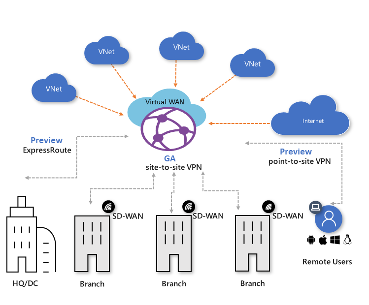
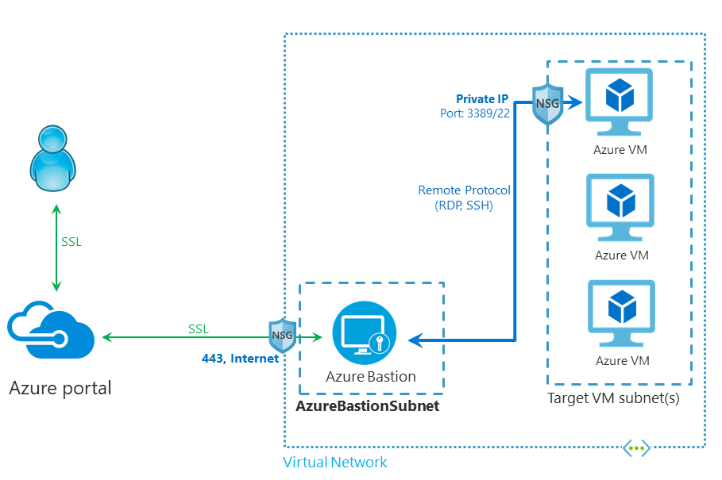
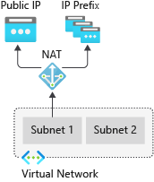
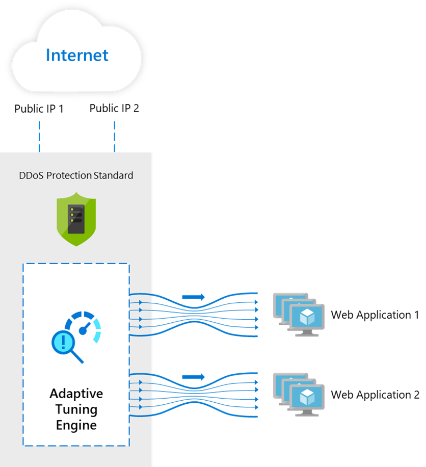
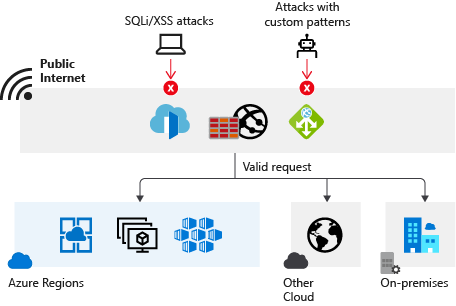
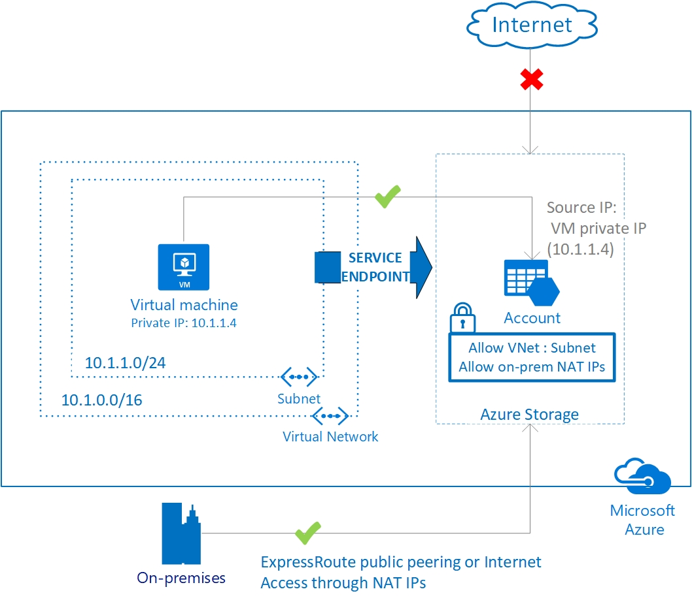
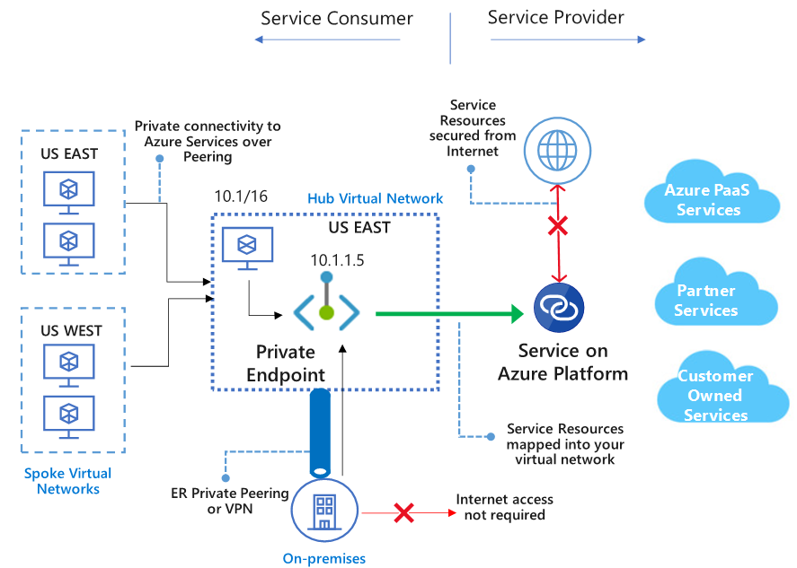
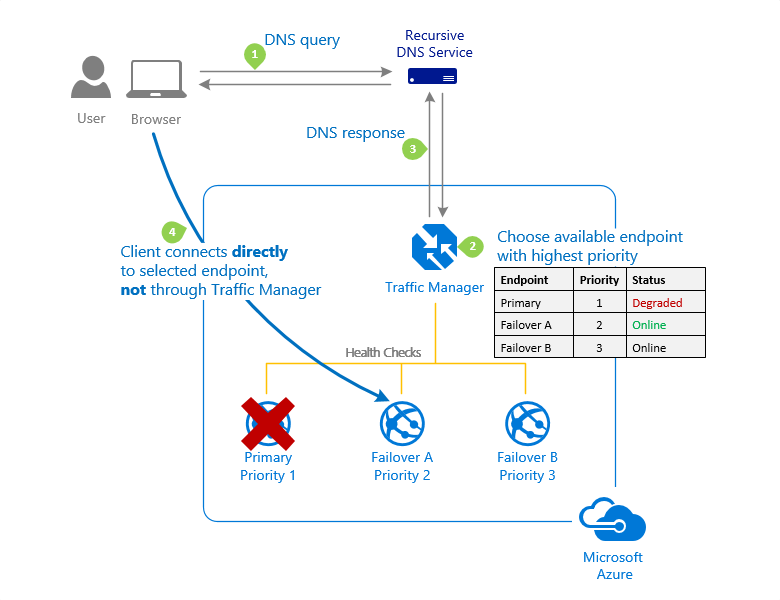
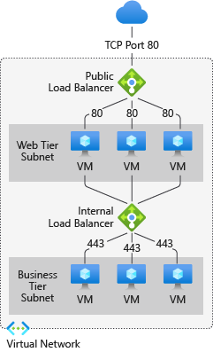

# Azure networking services overview

The networking services in Azure provide a variety of networking capabilities that can be used together or separately. Click any of the following key capabilities to learn more about them:
- [**Connectivity services**](#connect): Connect Azure resources and on-premises resources using any or a combination of these networking services in Azure - Virtual Network (VNet), Virtual WAN, ExpressRoute, VPN Gateway, Virtual network NAT Gateway, Azure DNS, Peering service, and Azure Bastion.
- [**Application protection services**](#protect) Protect your applications  using any or a combination of these networking services in Azure - Private Link, DDoS protection, Firewall, Network Security Groups, Web Application Firewall, and Virtual Network Endpoints.
- [**Application delivery services**](#deliver) Deliver applications in the Azure network using any or a combination of these networking services in Azure - Content Delivery Network (CDN), Azure Front Door Service, Traffic Manager, Application Gateway, Internet Analyzer, and Load Balancer.
- [**Network monitoring**](#monitor) – Monitor your network resources using any or a combination of these networking services in Azure - Network Watcher, ExpressRoute Monitor, Azure Monitor, or VNet Terminal Access Point (TAP).

## Connectivity services
 
This section describes services that provide connectivity between Azure resources, connectivity from an on-premises network to Azure resources, and branch to branch connectivity in Azure - Virtual Network (VNet), Virtual WAN, ExpressRoute, VPN Gateway, Virtual network NAT Gateway, Azure DNS, Azure Peering service, and Azure Bastion.

|Service|Why use?|Scenarios|
|---|---|---|
|[Virtual network](#vnet)|Enables Azure resources to securely communicate with each other, the internet, and on-premises networks.| 
[Filter network traffic](../virtual-network/tutorial-filter-network-traffic.md)
 
[Route network traffic](../virtual-network/tutorial-create-route-table-portal.md)
 
[Restrict network access to resources](../virtual-network/tutorial-restrict-network-access-to-resources.md)
 
[Connect virtual networks](../virtual-network/tutorial-connect-virtual-networks-portal.md)
|
|[ExpressRoute](#expressroute)|Extends your on-premises networks into the Microsoft cloud over a private connection facilitated by a connectivity provider.|
[Create and modify an ExpressRoute circuit](../expressroute/expressroute-howto-circuit-portal-resource-manager.md)
 
[Create and modify peering for an ExpressRoute circuit](../expressroute/expressroute-howto-routing-portal-resource-manager.md)
 
[Link a VNet to an ExpressRoute circuit](../expressroute/expressroute-howto-linkvnet-portal-resource-manager.md)
 
[Configure and manage route filters for ExpressRoute circuits](../expressroute/how-to-routefilter-portal.md)
|
|[VPN Gateway](#vpngateway)|Sends encrypted traffic between an Azure virtual network and an on-premises location over the public Internet.|
[Site-to-site-connections](../vpn-gateway/vpn-gateway-howto-site-to-site-resource-manager-portal.md)
 
[VNet-to-VNet connections](../vpn-gateway/vpn-gateway-howto-vnet-vnet-resource-manager-portal.md)
 
[Point-to-site connections](../vpn-gateway/vpn-gateway-howto-point-to-site-resource-manager-portal.md)
|
|[Virtual WAN](#virtualwan)|Optimizes and automates branch connectivity to, and through, Azure. Azure regions serve as hubs that you can choose to connect your branches to.|
[Site-to-site connections](../virtual-wan/virtual-wan-site-to-site-portal.md), [ExpressRoute connections](../virtual-wan/virtual-wan-expressroute-portal.md)
|
|[Azure DNS](#dns)|Hosts DNS domains that provide name resolution by using Microsoft Azure infrastructure.|
[Host your domain in Azure DNS](../dns/dns-delegate-domain-azure-dns.md)

[Create DNS records for a web app](../dns/dns-web-sites-custom-domain.md)
 
[Create an alias record for Traffic Manager](../dns/tutorial-alias-tm.md)
 
[Create an alias record for public IP Address](../dns/tutorial-alias-pip.md)
 
[Create an alias record for zone resource record](../dns/tutorial-alias-rr.md)
|
|[Azure Bastion](#bastion)|Configure secure and seamless RDP/SSH connectivity to your virtual machines directly in the Azure portal over TLS. When you connect via Azure Bastion, your virtual machines do not need a public IP address|
[Create an Azure Bastion host](../bastion/bastion-create-host-portal.md)

[Connect using SSH to a Linux VM](../bastion/bastion-connect-vm-ssh.md)

[Connect using RDP to a Windows VM](../bastion/bastion-connect-vm-rdp.md)
|
|[Virtual network NAT Gateway](#nat)|Create a NAT gateway to provide outbound connectivity for a virtual machine.|
[Create a NAT Gateway](../virtual-network/quickstart-create-nat-gateway-portal.md)
|
|[Azure Peering Service (Preview)](#azurepeeringservice)|Collaborate with service providers for optimal and reliable routing to the Microsoft cloud over the public network.|
[Register Azure Peering Service](../peering-service/azure-portal.md)
|
||||

### Virtual network

Azure Virtual Network (VNet) is the fundamental building block for your private network in Azure. You can use a VNets to:
- **Communicate between Azure resources**: You can deploy VMs, and several other types of Azure resources to a virtual network, such as Azure App Service Environments, the Azure Kubernetes Service (AKS), and Azure Virtual Machine Scale Sets. To view a complete list of Azure resources that you can deploy into a virtual network, see [Virtual network service integration](../virtual-network/virtual-network-for-azure-services.md).
- **Communicate between each other**: You can connect virtual networks to each other, enabling resources in either virtual network to communicate with each other, using virtual network peering. The virtual networks you connect can be in the same, or different, Azure regions. For more information, see [Virtual network peering](../virtual-network/virtual-network-peering-overview.md).
- **Communicate to the internet**: All resources in a VNet can communicate outbound to the internet, by default. You can communicate inbound to a resource by assigning a public IP address or a public Load Balancer. You can also use [Public IP addresses](../virtual-network/virtual-network-public-ip-address.md) or public [Load Balancer](../load-balancer/load-balancer-overview.md) to manage your outbound connections.
- **Communicate with on-premises networks**: You can connect your on-premises computers and networks to a virtual network using [VPN Gateway](../vpn-gateway/vpn-gateway-about-vpngateways.md) or [ExpressRoute](../expressroute/expressroute-introduction.md).

For more information, see [What is Azure Virtual Network?](../virtual-network/virtual-networks-overview.md).

### ExpressRoute
ExpressRoute enables you to extend your on-premises networks into the Microsoft cloud over a private connection facilitated by a connectivity provider. This connection is private. Traffic does not go over the internet. With ExpressRoute, you can establish connections to Microsoft cloud services, such as Microsoft Azure, Office 365, and Dynamics 365.  For more information, see [What is ExpressRoute?](../expressroute/expressroute-introduction.md).

### VPN Gateway
VPN Gateway helps you create encrypted cross-premises connections to your virtual network from on-premises locations, or create encrypted connections between VNets. There are different configurations available for VPN Gateway connections, such as, site-to-site, point-to-site, or VNet to VNet.
The following diagram illustrates multiple site-to-site VPN connections to the same virtual network.

For more information about different types of VPN connections, see [VPN Gateway](../vpn-gateway/vpn-gateway-about-vpngateways.md).

### Virtual WAN
Azure Virtual WAN is a networking service that provides optimized and automated branch connectivity to, and through, Azure. Azure regions serve as hubs that you can choose to connect your branches to. You can leverage the Azure backbone to also connect branches and enjoy branch-to-VNet connectivity. 
Azure Virtual WAN brings together many Azure cloud connectivity services such as site-to-site VPN, ExpressRoute, point-to-site user VPN into a single operational interface. Connectivity to Azure VNets is established by using virtual network connections. For more information, see [What is Azure virtual WAN?](../virtual-wan/virtual-wan-about.md).

### Azure DNS
Azure DNS is a hosting service for DNS domains that provides name resolution by using Microsoft Azure infrastructure. By hosting your domains in Azure, you can manage your DNS records by using the same credentials, APIs, tools, and billing as your other Azure services. For more information, see [What is Azure DNS?](../dns/dns-overview.md).

### Azure Bastion
The Azure Bastion service is a new fully platform-managed PaaS service that you provision inside your virtual network. It provides secure and seamless RDP/SSH connectivity to your virtual machines directly in the Azure portal over TLS. When you connect via Azure Bastion, your virtual machines do not need a public IP address. For more information, see [What is Azure Bastion?](../bastion/bastion-overview.md).

### Virtual network NAT Gateway
Virtual Network NAT (network address translation) simplifies outbound-only Internet connectivity for virtual networks. When configured on a subnet, all outbound connectivity uses your specified static public IP addresses. Outbound connectivity is possible without load balancer or public IP addresses directly attached to virtual machines. 
For more information, see [What is virtual network NAT gateway?](../virtual-network/nat-overview.md) 

###  Azure Peering Service
Azure Peering service enhances customer connectivity to Microsoft cloud services such as Office 365, Dynamics 365, software as a service (SaaS) services, Azure, or any Microsoft services accessible via the public internet. For more information, see [What is Azure Peering Service?](../peering-service/about.md).

## Application protection services

This section describes networking services in Azure that help protect your network resources - Protect your applications  using any or a combination of these networking services in Azure - Private Link, DDoS protection, Firewall, Network Security Groups, Web Application Firewall, and Virtual Network Endpoints.

|Service|Why use?|Scenario|
|---|---|---|
|[DDoS protection](#ddosprotection) |High availability for your applications with protection from excess IP traffic charges|[Manage Azure DDoS Protection](../virtual-network/manage-ddos-protection.md)|
|[Web Application Firewall](#waf)|
[Azure WAF with Application Gateway](../web-application-firewall/ag/ag-overview.md) provides regional protection to entities in public and private address space

[Azure WAF with Front Door](../web-application-firewall/afds/afds-overview.md) provides protection at the network edge to public endpoints.
|
[Configure bot protection rules](../frontdoor/waf-front-door-policy-configure-bot-protection.md)
 
[Configure custom response code](../frontdoor/waf-front-door-configure-custom-response-code.md)
 
[Configure IP restriction rules](../frontdoor/waf-front-door-configure-ip-restriction.md)
 
[Configure rate limit rule](../frontdoor/waf-front-door-rate-limit-powershell.md)
 |
|[Azure Firewall](#firewall)|Azure Firewall is a managed, cloud-based network security service that protects your Azure Virtual Network resources. It's a fully stateful firewall as a service with built-in high availability and unrestricted cloud scalability.|
[Deploy an Azure Firewall in a Vnet](../firewall/tutorial-firewall-deploy-portal.md)
 
[- Deploy an Azure Firewall in a hybrid network](../firewall/tutorial-hybrid-ps.md)
 
[Filter inbound traffic with Azure Firewall DNAT](../firewall/tutorial-firewall-dnat.md)
|
|[Network security groups](#nsg)|Full granular distributed end node control at VM/subnet for all network traffic flows|[Filter network traffic using network security groups](../virtual-network/tutorial-filter-network-traffic.md)|
|[Virtual network service endpoints](#serviceendpoints)|Enables you to limit network access to some Azure service resources to a virtual network subnet|[Restrict network access to PaaS resources](../virtual-network/tutorial-restrict-network-access-to-resources-powershell.md)|
[Private Link](#privatelink)|Enables you access Azure PaaS Services (for example, Azure Storage and SQL Database) and Azure hosted customer-owned/partner services over a private endpoint in your virtual network.|
[Create a private endpoint](../private-link/create-private-endpoint-portal.md)

[Create a Private Link service](../private-link/create-private-link-service-portal.md)
|
|||
### DDoS Protection 
[Azure DDoS Protection](../virtual-network/manage-ddos-protection.md) provides countermeasures against the most sophisticated DDoS threats. The service provides enhanced DDoS mitigation capabilities for your application and resources deployed in your virtual networks. Additionally, customers using Azure DDoS Protection have access to DDoS Rapid Response support to engage DDoS experts during an active attack.

### Web Application Firewall

[Azure Web Application Firewall](../web-application-firewall/overview.md) (WAF) provides protection to your web applications from common web exploits and vulnerabilities such as SQL injection, and cross site scripting. Azure WAF provides out of box protection from OWASP top 10 vulnerabilities via managed rules. Additionally customers can also configure custom rules, which are customer managed rules to provide additional protection based on source IP range, and request attributes such as headers, cookies, form data fields or query string parameters.

Customers can choose to deploy [Azure WAF with Application Gateway](../application-gateway/waf-overview.md) which provides regional protection to entities in public and private address space. Customers can also choose to deploy [Azure WAF with Front Door](../frontdoor/waf-overview.md) which provides protection at the network edge to public endpoints.

### Azure Firewall
Azure Firewall is a managed, cloud-based network security service that protects your Azure Virtual Network resources. Using Azure Firewall, you can centrally create, enforce, and log application and network connectivity policies across subscriptions and virtual networks. Azure Firewall uses a static public IP address for your virtual network resources allowing outside firewalls to identify traffic originating from your virtual network. 

For more information about Azure Firewall, see the [Azure Firewall documentation](../firewall/overview.md).

### Network security groups
You can filter network traffic to and from Azure resources in an Azure virtual network with a network security group. For more information, see [Security Overview](../virtual-network/security-overview.md).

### Service endpoints
Virtual Network (VNet) service endpoints extend your virtual network private address space and the identity of your VNet to the Azure services, over a direct connection. Endpoints allow you to secure your critical Azure service resources to only your virtual networks. Traffic from your VNet to the Azure service always remains on the Microsoft Azure backbone network. For more information, see [Virtual network service endpoints](../virtual-network/virtual-network-service-endpoints-overview.md).

### Azure Private Link
[Azure Private Link](../private-link/private-link-overview.md) enables you to access Azure PaaS Services (for example, Azure Storage and SQL Database) and Azure hosted customer-owned/partner services over a private endpoint in your virtual network.
Traffic between your virtual network and the service travels the Microsoft backbone network. Exposing your service to the public internet is no longer necessary. You can create your own private link service in your virtual network and deliver it to your customers.

## Application delivery services

This section describes networking services in Azure that help deliver applications - Network Watcher, ExpressRoute Monitor, Azure Monitor, or VNet Terminal Access Point (TAP).

|Service|Why use?|Scenario|
|---|---|---|
|[Content Delivery Network](#cdn)|Delivers high-bandwidth content to users. CDNs store cached content on edge servers in point-of-presence (POP) locations that are close to end users, to minimize latency|
[Add CDN to a web app](../cdn/cdn-add-to-web-app.md)
 
[- Access storage blobs using an Azure CDN custom domain over HTTPS](..//cdn/cdn-storage-custom-domain-https.md)
 
[Add a custom domain to your Azure CDN endpoint](../cdn/cdn-map-content-to-custom-domain.md)
 
[Configure HTTPS on an Azure CDN custom domain](../cdn/cdn-custom-ssl.md?tabs=option-1-default-enable-https-with-a-cdn-managed-certificate)
|
|[Azure Front Door Service](#frontdoor)|Enables you to define, manage, and monitor the global routing for your web traffic by optimizing for best performance and instant global failover for high availability.|
[Add a custom domain to your Azure Front Door Service](../frontdoor/front-door-custom-domain.md)
 
[Configure HTTPS on a Front Door custom domain](../frontdoor/front-door-custom-domain-https.md)

[Set up geo-filtering Web Application Firewall policy](../frontdoor/front-door-tutorial-geo-filtering.md)|
|[Traffic Manager](#trafficmanager)|Distributes traffic based on DNS to services across global Azure regions, while providing high availability and responsiveness|
 [Route traffic for low latency](../traffic-manager/tutorial-traffic-manager-improve-website-response.md)

[Route traffic to a priority endpoint](../traffic-manager/traffic-manager-configure-priority-routing-method.md)

 [Control traffic with weighted endpoints](../traffic-manager/tutorial-traffic-manager-weighted-endpoint-routing.md)

[Route traffic based on geographic location of the endpoint](../traffic-manager/traffic-manager-configure-geographic-routing-method.md)
 
 [Route traffic based on user's subnet](../traffic-manager/tutorial-traffic-manager-subnet-routing.md)
|
|[Load Balancer](#loadbalancer)|Provides regional load-balancing by routing traffic across availability zones and into your VNets. Provides internal load-balancing by routing traffic across and between your resources to build your regional application.|
 [Load balance internet traffic to VMs](../load-balancer/tutorial-load-balancer-standard-manage-portal.md)
 
[Load-balance traffic across VMs inside a virtual network](../load-balancer/tutorial-load-balancer-basic-internal-portal.md)
[Port forward traffic to a specific port on specific VMs](../load-balancer/tutorial-load-balancer-port-forwarding-portal.md)

 [Configure load balancing and outbound rules](../load-balancer/configure-load-balancer-outbound-cli.md)
|
|[Application Gateway](#applicationgateway)|Azure Application Gateway is a web traffic load balancer that enables you to manage traffic to your web applications.|
[Direct web traffic with Azure Application Gateway](../application-gateway/quick-create-portal.md)

[Tutorial: Configure an application gateway with TLS termination using the Azure portal](../application-gateway/create-ssl-portal.md)

[Create an application gateway with URL path-based redirection](../application-gateway/create-url-route-portal.md) 
|
|

### Content Delivery Network
Azure Content Delivery Network (CDN) offers developers a global solution for rapidly delivering high-bandwidth content to users by caching their content at strategically placed physical nodes across the world. For more information about Azure CDN, see [Azure Content Delivery Network](../cdn/cdn-overview.md)

### Azure Front Door service
Azure Front Door Service enables you to define, manage, and monitor the global routing for your web traffic by optimizing for best performance and instant global failover for high availability. With Front Door, you can transform your global (multi-region) consumer and enterprise applications into robust, high-performance personalized modern applications, APIs, and content that reach a global audience with Azure. For more information, see [Azure Front Door](../frontdoor/front-door-overview.md).

### Traffic Manager

Azure Traffic Manager is a DNS-based traffic load balancer that enables you to distribute traffic optimally to services across global Azure regions, while providing high availability and responsiveness. Traffic Manager provides a range of traffic-routing methods to distribute traffic such as priority, weighted, performance, geographic, multi-value, or subnet. For more information about traffic routing methods, see [Traffic Manager routing methods](../traffic-manager/traffic-manager-routing-methods.md).

The following diagram shows endpoint priority-based routing with Traffic Manager:

For more information about Traffic Manager, see [What is Azure Traffic Manager?](../traffic-manager/traffic-manager-overview.md)

### Load Balancer
The Azure Load Balancer provides high-performance, low-latency Layer 4 load-balancing for all UDP and TCP protocols. It manages inbound and outbound connections. You can configure public and internal load-balanced endpoints. You can define rules to map inbound connections to back-end pool destinations by using TCP and HTTP health-probing options to manage service availability. To learn more about Load Balancer, read the [Load Balancer overview](../load-balancer/load-balancer-overview.md) article.

The following picture shows an Internet-facing multi-tier application that utilizes both external and internal load balancers:

### Application Gateway
Azure Application Gateway is a web traffic load balancer that enables you to manage traffic to your web applications. It is an Application Delivery Controller (ADC) as a service, offering various layer 7 load-balancing capabilities for your applications. For more information, see [What is Azure Application Gateway?](../application-gateway/overview.md).

The following diagram shows url path-based routing with Application Gateway.

## Network monitoring services
This section describes networking services in Azure that help monitor your network resources - Network Watcher, ExpressRoute Monitor, Azure Monitor, and Virtual Network TAP.

|Service|Why use?|Scenario|
|---|---|---|
|[Network Watcher](#networkwatcher)|Helps monitor and troubleshoot connectivity issues, helps diagnose VPN, NSG, and routing issues, capture packets on your VM, automates triggering diagnostics tools using Azure Functions and Logic Apps|
[Diagnose VM traffic filter problem](../network-watcher/diagnose-vm-network-traffic-filtering-problem.md)

[Diagnose VM routing problem](../network-watcher/diagnose-vm-network-routing-problem.md)

[Monitor communications between VMs](../network-watcher/connection-monitor.md)

[Diagnose communication problems between networks](../network-watcher/diagnose-communication-problem-between-networks.md)

[Log network traffic to and from a VM](../network-watcher/network-watcher-nsg-flow-logging-portal.md)
|
|[ExpressRoute Monitor](#expressroutemonitor)|Provides real-time monitoring of network performance, availability, and utilization, helps with auto-discovery of network topology, provides faster fault isolation, detects transient network issues, helps analyze historical network performance characteristics, supports multi-subscription|
[Configure Network Performance Monitor for ExpressRoute](../expressroute/how-to-npm.md)

[ExpressRoute monitoring, metrics, and alerts](../expressroute/expressroute-monitoring-metrics-alerts.md)
|
|[Azure Monitor](#azuremonitor)|Helps you understand how your applications are performing and proactively identifies issues affecting them and the resources they depend on.|
[Traffic Manager metrics and alerts](../traffic-manager/traffic-manager-metrics-alerts.md)

[Azure monitor diagnostics for Standard Load Balancer](../load-balancer/load-balancer-standard-diagnostics.md)

[Monitor Azure Firewall logs and metrics](../firewall/tutorial-diagnostics.md)

[Azure web application firewall monitoring and logging](../frontdoor/waf-front-door-monitor.md)
|
|[Virtual Network TAP](#vnettap)|Provides continuous streaming of virtual machine network traffic to packet collector, enables network and application performance management solutions and security analytics tools​|[Create a VNet TAP resource](../virtual-network/tutorial-tap-virtual-network-cli.md)|
|

### Network Watcher
Azure Network Watcher provides tools to monitor, diagnose, view metrics, and enable or disable logs for resources in an Azure virtual network. For more information, see [What is Network Watcher?](../network-watcher/network-watcher-monitoring-overview.md?toc=%2fazure%2fnetworking%2ftoc.json).
### ExpressRoute Monitor
To learn about how view ExpressRoute circuit metrics, diagnostic logs and alerts, see [ExpressRoute monitoring, metrics, and alerts](../expressroute/expressroute-monitoring-metrics-alerts.md?toc=%2fazure%2fnetworking%2ftoc.json).
### Azure Monitor
Azure Monitor maximizes the availability and performance of your applications by delivering a comprehensive solution for collecting, analyzing, and acting on telemetry from your cloud and on-premises environments. It helps you understand how your applications are performing and proactively identifies issues affecting them and the resources they depend on. For more information, see [Azure Monitor Overview](../azure-monitor/overview.md?toc=%2fazure%2fnetworking%2ftoc.json).
### Virtual Network TAP
Azure virtual network TAP (Terminal Access Point) allows you to continuously stream your virtual machine network traffic to a network packet collector or analytics tool. The collector or analytics tool is provided by a [network virtual appliance](https://azure.microsoft.com/solutions/network-appliances/) partner. 

The following picture shows how virtual network TAP works. 

For more information, see [What is Virtual Network TAP](../virtual-network/virtual-network-tap-overview.md).

## Next steps

- Create your first VNet, and connect a few VMs to it, by completing the steps in the [Create your first virtual network](../virtual-network/quick-create-portal.md?toc=%2fazure%2fnetworking%2ftoc.json) article.
- Connect your computer to a VNet by completing the steps in the [Configure a point-to-site connection article](../vpn-gateway/vpn-gateway-howto-point-to-site-resource-manager-portal.md?toc=%2fazure%2fnetworking%2ftoc.json).
- Load balance Internet traffic to public servers by completing the steps in the [Create an Internet-facing load balancer](../load-balancer/load-balancer-get-started-internet-portal.md?toc=%2fazure%2fnetworking%2ftoc.json) article.
 
 
   
