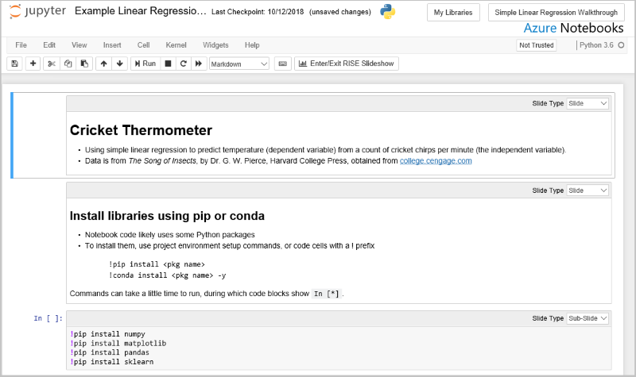
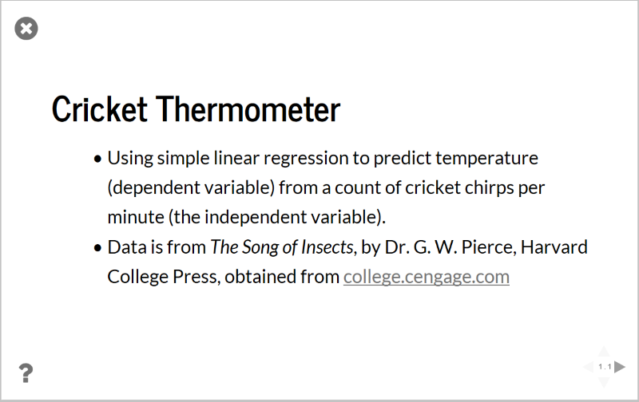
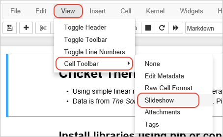
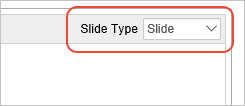
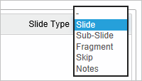
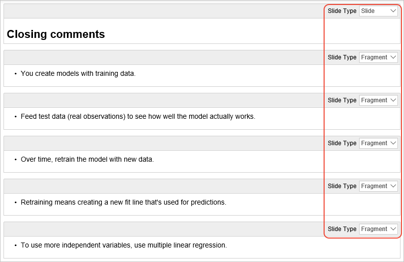
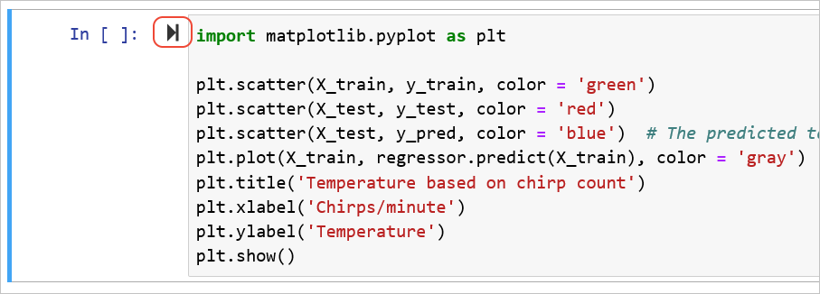
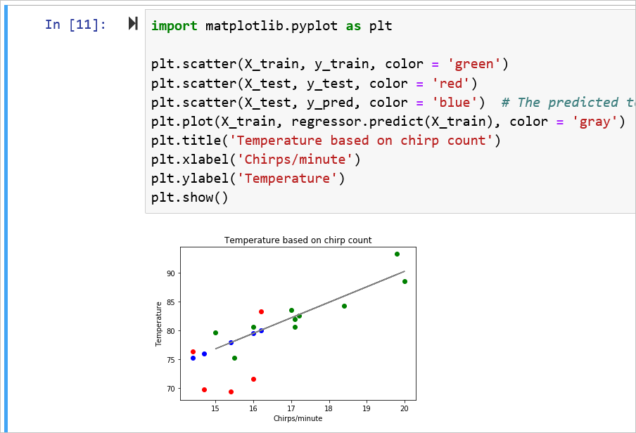

# Run a notebook slideshow

Azure Notebooks is pre-configured with the Jupyter/IPython Slideshow Extension (RISE) that lets you present a notebook directly as a slideshow. In a slideshow, cells are typically displayed one at a time using a font size that's appropriate for presenting on large screens, and you can still run the code rather than switching to a separate demo computer.

The following image shows the standard notebook view, in which you can see Markdown and code cells all together:

When you start a slideshow, the first cell is enlarged to fill the browser, where the **X** in the upper left exits the slideshow, **?** in the lower left displays keyboard shortcuts, and the arrows on the lower right navigate between slides:

Preparing a notebook for a slideshow involves two primary activities:

1. Because Markdown cells are rendered with large fonts, some content may not be visible in the slideshow. You thus typically limit the amount of text in any given cell; a header with four to six lines usually works best. If you have more text, split that information into multiple cells.

2. Configure the behavior of each cell in the slideshow by using the slideshow cell toolbar. Cell types determine the behavior of the navigation buttons.

## The anatomy of a slideshow

If you take a random notebook and use it for a slideshow, you typically find that all the cells are jumbled together, and much of the content is hidden off the bottom of the browser window. To make an effective presentation, then, you need to assign a slideshow type to each cell using the Slideshow cell toolbar:

1. On the **View** menu, select **Cell Toolbar** > **Slideshow**:

    

1. A **Slide Type** drop-down appears on the upper right of each cell in the Notebook:

    

1. For each cell, select one of five types:

    

    | Slide type | Behavior |
    | --- | --- |
    | - (not set) | Cell is displayed with the previous cell, which is often not a desired effect in a slideshow. |
    | Slide | Cell is a primary slide, navigated using the left and right arrows of the navigation control. |
    | Sub-slide | Cell is "below" a primary slide, navigated to using the down arrow of the navigation control. The up arrow returns to the primary slide. Sub-slides are used for secondary material that you could skip in the main path of a presentation, but is readily available if needed. |
    | Fragment | Cell content appears in the context of the previous slide or sub-slide when using the down navigation arrow (a fragment is removed when using the up arrow). You can use a fragment with a code cell to make that code appear within a slide, or you can use multiple fragments to make text bullets appear one by one (see example in the next section). Because fragments build on the current slide, excess fragments won't be visible off the bottom of the browser window. |
    | Skip | Cell is not shown in the slideshow. |
    | Notes | Cell contains as speaker notes, which aren't shown in the slideshow. |

1. Initially, it's helpful to choose **Slide** for every cell. You can then run the slideshow and make appropriate adjustments.

### Example: fragment cells for bullet items

To make bullets on a slide appear one by one, place the slide header in a Markdown cell with the **Slide** type, then place each bullet in a separate Markdown cell with the **Fragment** type:

Because the slideshow renders fragments with more vertical spacing than when all the bullets are in the same cell, you may not be able to use as many bullet items.

## Run the slideshow

1. If you've edited any Markdown cells, make sure to run them to render their HTML, otherwise they appear *as* Markdown in the slideshow.

1. Once you've configured the **Slide Type** for each cell, select the cell with which to start the slideshow, then select the **Enter/Exit RISE Slideshow** button on the main toolbar:

    

1. To navigate between slides as well as fragments, use the left and right arrows in the navigation control. The text in the control shows a number representing *slide.sub-slide*.

    

1. To navigate between slides and sub-slides, as well as fragments, use the up and down arrows, if enabled:

    

1. On a code cell, use the play button to run the code; output appears on the slide:

    

    

    > [!Tip]
    > Cell output is considered part of the cell in a slideshow. If you run a cell in either notebook or slide show view, the output appears in the other view as well. To clear the output, use the **Cell** > **Current Outputs** > **Clear** command (for the current cell) or **Cell** > **All Outputs** > **Clear** (for all cells).

1. When you're done with the slideshow, use the **X** to return to notebook view.

## Next steps

- [How to: Configure and manage projects](configure-manage-azure-notebooks-projects.md)
- [How to: Install packages from within a notebook](install-packages-jupyter-notebook.md)
- [How to: Work with data files](work-with-project-data-files.md)
- [How to: Access data resources](access-data-resources-jupyter-notebooks.md)
