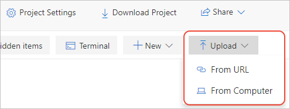

# Quickstart: Migrate a local Jupyter notebook

Jupyter notebooks that you create locally on your own computer are accessible only to you. You can share your files through a variety of means, but then recipients have their own local copy of the notebook and it's difficult for you to incorporate any changes they might make. You can also store notebooks in a shared online repository such as GitHub, but doing so still requires that each collaborator has their own local Jupyter installation with the same configuration as yours.

By migrating your local or repository-based notebooks to Azure Notebooks, you store them in the cloud from which you can instantly share them with your collaborators. Those collaborators need only a browser to view and run your notebook, and if they [sign in](quickstart-sign-in-azure-notebooks.md) to Azure Notebooks they can also make changes.

This Quickstart demonstrates the process of migrating a notebook from your local computer or another accessible file URL. To migrate notebooks from a GitHub repository, see [Quickstart: Clone a notebook](quickstart-clone-jupyter-notebook.md).

## Create a project on Azure Notebooks

1. Go to [Azure Notebooks](https://notebooks.azure.com) and sign in. (For details, see [Quickstart - Sign in to Azure Notebooks](quickstart-sign-in-azure-notebooks.md)).

1. From your public profile page, select **My Projects** at the top of the page:

    

1. On the **My Projects** page, select **+ New Project** (keyboard shortcut: n); the button may appear only as **+** if the browser window is narrow:

    

1. In the **Create New Project** popup that appears, enter appropriate values for the notebook you're migrating in the **Project name** and **Project ID** fields, clear the options for **Public project** and **Create a README.md**, then select **Create**.

## Upload the local notebook

1. On the project page, select **Upload** (which may appear as an up arrow only if your browser window is small), then select 1. In the popup that appears, select **From computer** if your notebook is located on your local file system, or **From URL** if your notebook is located online:

    

   (Again, if your notebook is in a GitHub repository, follow the steps on [Quickstart: Clone a notebook](quickstart-clone-jupyter-notebook.md) instead.)

   - If using **From Computer**, drag and drop your *.ipynb* files into the popup, or select **Choose Files**, then browse to and select the files you want to import. Then select **Upload**. The uploaded files are given the same name as the local files. (You don't need to upload the contents of any *.ipynb_checkpoints* folders.)

     

   - If using **From URL**, enter the source address in the **File URL** field and the filename to assign to the notebook in your project in the **File Name** field. Then select **Upload**. If you have multiple files with separate URLs, use the **+ Add File** command to check the first URL you entered, after which the popup provides new fields for another file.

     

1. Open and run your newly uploaded notebook to verify its contents and operation. When you're done, select **File** > **Halt and close** to close the notebook.

1. To share a link to your uploaded notebook, right-click the file in the project and select **Copy Link** (keyboard shortcut: y), then paste that link into the appropriate message. Alternately, you can share the project as a whole using the **Share** control on the project page.

1. To edit files other than notebooks, right-click the file in the project and select **Edit file** (keyboard shortcut: i). The default action, **Run** (keyboard shortcut: r), only shows the file contents and doesn't allow editing.

## Next steps

> [!div class="nextstepaction"]
> [Tutorial: create an run a Jupyter notebook to do linear regression](tutorial-create-run-jupyter-notebook.md)
